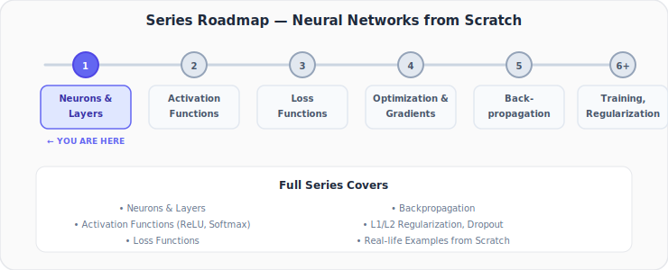
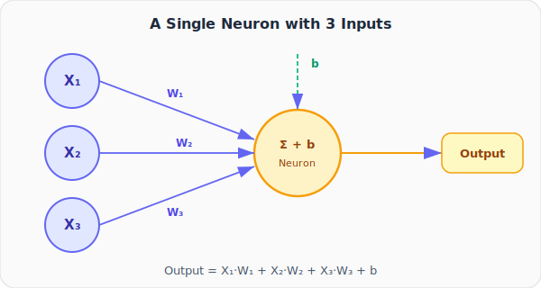
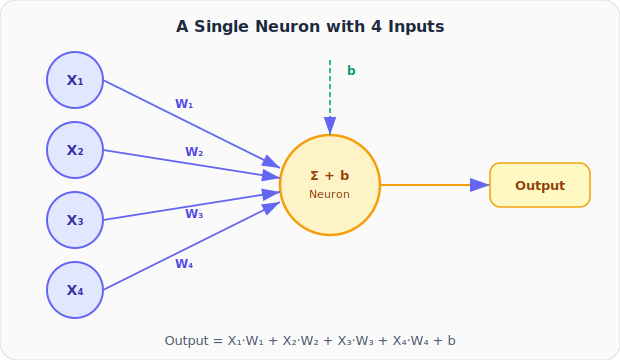
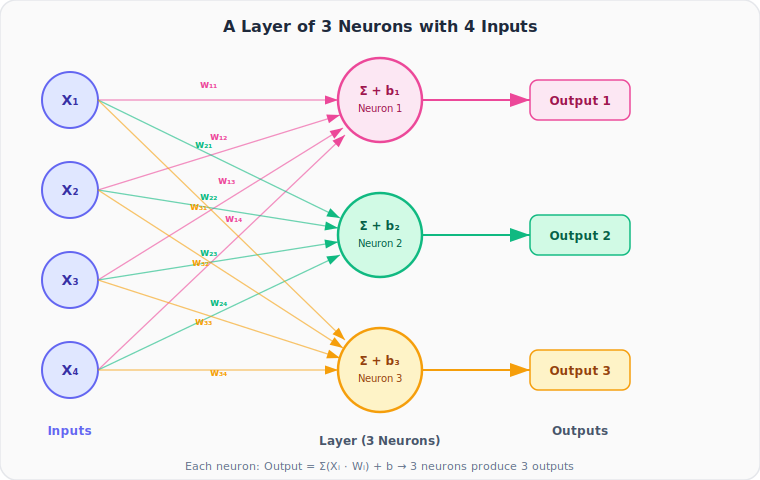
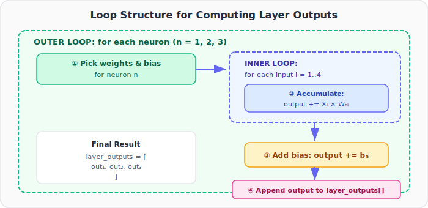
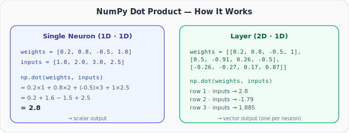
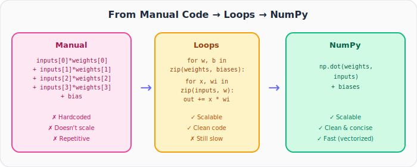

# Neural Networks from Scratch, Part 1: Coding Neurons and Layers

*Welcome to the first post in a series where we build a neural network entirely from scratch. You don't need any prior machine learning experience. We start from zero and work our way up.*

---

## Why Build from Scratch?

If you've used TensorFlow or PyTorch, you've probably written something like this:

```python
model = tf.keras.Sequential([
    tf.keras.layers.Dense(128, activation='relu'),
    tf.keras.layers.Dense(10, activation='softmax')
])
model.compile(optimizer='adam', loss='categorical_crossentropy')
model.fit(X_train, y_train)
```

It works. You get results. But can you answer:

- **Why** the Adam optimizer? Why not SGD?
- **What** does cross-entropy loss actually compute?
- **How** does backpropagation update the weights?
- **Why** is your architecture working, or *not* working?
- If you get a shape mismatch error, **where** does it come from?

If these questions feel fuzzy, that's exactly why we're building everything from scratch. A neural network isn't rocket science. It's a piece of **beautiful mathematics** that becomes comfortable once you understand it.

### What This Series Covers



We'll build every piece ourselves: **neurons → layers → activation functions → loss functions → optimization → backpropagation → regularization → real-life examples**. No library will do the thinking for us.

---

## Part 1 Agenda

Today's goals are simple and concrete:

1. **Code a single neuron** from scratch
2. **Code a layer of neurons** from scratch
3. **Refactor with loops** for scalability
4. **Use NumPy** to simplify everything

Let's begin.

---

## 1. What Is a Neuron?

A neuron is the fundamental unit of a neural network. It takes a set of **inputs**, multiplies each by a corresponding **weight**, sums the results, and adds a **bias**.



Mathematically:

$$\text{output} = X_1 \cdot W_1 + X_2 \cdot W_2 + X_3 \cdot W_3 + b$$

That's it. There's an activation function that comes later, but for now we care only about this **weighted sum + bias**.

### Understanding the Components

| Component | What it is | Analogy |
|-----------|-----------|---------|
| **Inputs** ($X_i$) | The data fed into the neuron | Raw signal |
| **Weights** ($W_i$) | Importance of each input | Volume knob per input |
| **Bias** ($b$) | A constant offset | The neuron's baseline tendency |
| **Output** | Weighted sum + bias | The neuron's "decision" |

> **Key Insight:** Weights control *how much* each input matters. A large weight means that input is very important to the neuron's output.

---

## 2. Coding a Neuron with 3 Inputs

We represent inputs and weights as Python **lists**, which are simple collections of numbers.

```python
inputs = [1, 2, 3]
weights = [0.2, 0.8, -0.5]
bias = 2

output = (inputs[0]*weights[0] + 
          inputs[1]*weights[1] + 
          inputs[2]*weights[2] + bias)

print(output)
```

**Output:**
```
2.3
```

Let's trace through it step by step:

| Step | Calculation | Value |
|------|------------|-------|
| $X_1 \cdot W_1$ | $1 \times 0.2$ | $0.2$ |
| $X_2 \cdot W_2$ | $2 \times 0.8$ | $1.6$ |
| $X_3 \cdot W_3$ | $3 \times (-0.5)$ | $-1.5$ |
| Sum | $0.2 + 1.6 + (-1.5)$ | $0.3$ |
| + bias | $0.3 + 2$ | **$2.3$** |

> Remember: Python indexing starts at 0. `inputs[0]` is the first element (`1`), `inputs[1]` is the second (`2`), and so on.

**Congratulations, you've just coded your first neuron.**

---

## 3. Coding a Neuron with 4 Inputs

Scaling up is straightforward. More inputs means more weights, but still only **one** bias.



```python
inputs = [1.0, 2.0, 3.0, 2.5]
weights = [0.2, 0.8, -0.5, 1.0]
bias = 2.0

output = (inputs[0]*weights[0] +
          inputs[1]*weights[1] +
          inputs[2]*weights[2] +
          inputs[3]*weights[3] + bias)

print(output)
```

**Output:**
```
4.8
```

**Step-by-step trace:**

| Step | Calculation | Value |
|------|------------|-------|
| $X_1 \cdot W_1$ | $1.0 \times 0.2$ | $0.2$ |
| $X_2 \cdot W_2$ | $2.0 \times 0.8$ | $1.6$ |
| $X_3 \cdot W_3$ | $3.0 \times (-0.5)$ | $-1.5$ |
| $X_4 \cdot W_4$ | $2.5 \times 1.0$ | $2.5$ |
| Sum | $0.2 + 1.6 - 1.5 + 2.5$ | $2.8$ |
| + bias | $2.8 + 2.0$ | **$4.8$** |

The pattern is clear: **one weight per input, one bias per neuron**.

---

## 4. From Neurons to Layers

This is where neural networks get their power. A **layer** is a group of neurons that all receive the **same inputs** but each have their **own** weights and bias.



### The Key Rules

- Each of the **3 neurons** receives all **4 inputs**
- Each neuron has its **own 4 weights** → that's $3 \times 4 = 12$ weights total
- Each neuron has its **own bias** → 3 biases total
- The layer produces **3 outputs** (one per neuron)

### What each neuron computes

$$\text{Neuron 1: } y_1 = w_{11}X_1 + w_{12}X_2 + w_{13}X_3 + w_{14}X_4 + b_1$$

$$\text{Neuron 2: } y_2 = w_{21}X_1 + w_{22}X_2 + w_{23}X_3 + w_{24}X_4 + b_2$$

$$\text{Neuron 3: } y_3 = w_{31}X_1 + w_{32}X_2 + w_{33}X_3 + w_{34}X_4 + b_3$$

---

## 5. Coding a Layer (Manual Approach)

Since we now have **three sets** of weights (one per neuron), we store them as a **list of lists**:

```python
inputs = [1, 2, 3, 2.5]

# Each sub-list contains the 4 weights for one neuron
weights = [[0.2, 0.8, -0.5, 1],       # Neuron 1's weights
           [0.5, -0.91, 0.26, -0.5],   # Neuron 2's weights
           [-0.26, -0.27, 0.17, 0.87]] # Neuron 3's weights

# Extract each neuron's weights
weights1 = weights[0]  # [0.2, 0.8, -0.5, 1]      → W11, W12, W13, W14
weights2 = weights[1]  # [0.5, -0.91, 0.26, -0.5]  → W21, W22, W23, W24
weights3 = weights[2]  # [-0.26, -0.27, 0.17, 0.87] → W31, W32, W33, W34

bias1 = 2
bias2 = 3
bias3 = 0.5

outputs = [
    # Neuron 1
    inputs[0]*weights1[0] + inputs[1]*weights1[1] +
    inputs[2]*weights1[2] + inputs[3]*weights1[3] + bias1,

    # Neuron 2
    inputs[0]*weights2[0] + inputs[1]*weights2[1] +
    inputs[2]*weights2[2] + inputs[3]*weights2[3] + bias2,

    # Neuron 3
    inputs[0]*weights3[0] + inputs[1]*weights3[1] +
    inputs[2]*weights3[2] + inputs[3]*weights3[3] + bias3
]

print(outputs)
```

**Output:**
```
[4.8, 1.21, 2.385]
```

| Neuron | Weighted Sum | + Bias | Output |
|--------|-------------|--------|--------|
| Neuron 1 | $1(0.2) + 2(0.8) + 3(-0.5) + 2.5(1) = 2.8$ | $+ 2$ | **4.8** |
| Neuron 2 | $1(0.5) + 2(-0.91) + 3(0.26) + 2.5(-0.5) = -1.79$ | $+ 3$ | **1.21** |
| Neuron 3 | $1(-0.26) + 2(-0.27) + 3(0.17) + 2.5(0.87) = 1.885$ | $+ 0.5$ | **2.385** |

**You've now coded your first layer of neurons.** It's just the same summation operation repeated for each neuron, each with its own weights and bias.

---

## 6. The Problem with Manual Code

What we wrote works, but it doesn't **scale**. If we had 50 neurons, we'd need to write that summation 50 times. That's where loops come in.

---

## 7. Coding a Layer with Loops



The idea:
- **Outer loop**: iterate over each neuron (pick its weights and bias)
- **Inner loop**: iterate over each input-weight pair and accumulate the sum
- After the inner loop finishes, add the bias and store the result

```python
inputs = [1, 2, 3, 2.5]

weights = [[0.2, 0.8, -0.5, 1],
           [0.5, -0.91, 0.26, -0.5],
           [-0.26, -0.27, 0.17, 0.87]]

biases = [2, 3, 0.5]

layer_outputs = []

# Outer loop: iterate over each neuron
for neuron_weights, neuron_bias in zip(weights, biases):
    neuron_output = 0

    # Inner loop: weighted sum for this neuron
    for n_input, weight in zip(inputs, neuron_weights):
        neuron_output += n_input * weight

    # Add bias
    neuron_output += neuron_bias

    # Store this neuron's output
    layer_outputs.append(neuron_output)

print(layer_outputs)
```

**Output:**
```
[4.8, 1.21, 2.385]
```

Same result, but now the code works for **any** number of neurons and **any** number of inputs. Change the `weights` and `biases` lists, and the same loop handles everything.

### Walking Through the Loop

Let's trace through each iteration:

**Iteration 1 (Neuron 1):**
- `neuron_weights = [0.2, 0.8, -0.5, 1]`, `neuron_bias = 2`
- Inner loop: $1 \times 0.2 + 2 \times 0.8 + 3 \times (-0.5) + 2.5 \times 1 = 2.8$
- Add bias: $2.8 + 2 = 4.8$
- `layer_outputs = [4.8]`

**Iteration 2 (Neuron 2):**
- `neuron_weights = [0.5, -0.91, 0.26, -0.5]`, `neuron_bias = 3`
- Inner loop: $1 \times 0.5 + 2 \times (-0.91) + 3 \times 0.26 + 2.5 \times (-0.5) = -1.79$
- Add bias: $-1.79 + 3 = 1.21$
- `layer_outputs = [4.8, 1.21]`

**Iteration 3 (Neuron 3):**
- `neuron_weights = [-0.26, -0.27, 0.17, 0.87]`, `neuron_bias = 0.5`
- Inner loop: $1 \times (-0.26) + 2 \times (-0.27) + 3 \times 0.17 + 2.5 \times 0.87 = 1.885$
- Add bias: $1.885 + 0.5 = 2.385$
- `layer_outputs = [4.8, 1.21, 2.385]`

---

## 8. Enter NumPy: Making It Fast and Clean

Loops work but they're **slow** in Python. NumPy performs the same math using optimized C operations, often 100× faster. The key operation is the **dot product**.

### What Is a Dot Product?

The dot product of two vectors is exactly the weighted sum we've been computing:

$$\vec{w} \cdot \vec{x} = w_1 x_1 + w_2 x_2 + w_3 x_3 + w_4 x_4$$

This is literally what a neuron computes (minus the bias). NumPy gives us `np.dot()` to do this in one call.



### Single Neuron with NumPy

```python
import numpy as np

inputs = [1.0, 2.0, 3.0, 2.5]
weights = [0.2, 0.8, -0.5, 1.0]
bias = 2.0

output = np.dot(weights, inputs) + bias
print(output)
```

**Output:**
```
4.8
```

One line replaces the entire manual summation. `np.dot(weights, inputs)` computes $0.2(1) + 0.8(2) + (-0.5)(3) + 1.0(2.5) = 2.8$, then we add the bias.

### Layer of Neurons with NumPy

When `weights` is a **matrix** (list of lists / 2D array), `np.dot()` treats each row as a separate vector and computes a dot product with `inputs` for each one, which is exactly what our loop was doing.

```python
import numpy as np

inputs = [1.0, 2.0, 3.0, 2.5]
weights = [[0.2, 0.8, -0.5, 1],
           [0.5, -0.91, 0.26, -0.5],
           [-0.26, -0.27, 0.17, 0.87]]
biases = [2.0, 3.0, 0.5]

layer_outputs = np.dot(weights, inputs) + biases
print(layer_outputs)
```

**Output:**
```
[4.8  1.21 2.385]
```

Two lines. Same result. Much faster.

---

## 9. Handling Batches of Data

In practice, we don't feed one input at a time. We feed **batches** of inputs. This is common in training where we process multiple samples simultaneously.

```python
inputs = [[1.0, 2.0, 3.0, 2.5],    # Sample 1
          [2.0, 5.0, -1.0, 2.0],    # Sample 2
          [-1.5, 2.7, 3.3, -0.8]]   # Sample 3
```

Now `inputs` is a **matrix** (3 samples × 4 features), and `weights` is also a matrix (3 neurons × 4 weights). To multiply them correctly, we need to **transpose** the weight matrix:

$$\text{outputs} = \text{inputs} \cdot W^T + \text{biases}$$

> **Why transpose?** When inputs is (3×4) and weights is (3×4), the inner dimensions don't match for matrix multiplication. Transposing weights to (4×3) makes it (3×4) · (4×3) = (3×3) ✓

```python
import numpy as np

inputs = [[1.0, 2.0, 3.0, 2.5],
          [2.0, 5.0, -1.0, 2.0],
          [-1.5, 2.7, 3.3, -0.8]]

weights = [[0.2, 0.8, -0.5, 1],
           [0.5, -0.91, 0.26, -0.5],
           [-0.26, -0.27, 0.17, 0.87]]

biases = [2.0, 3.0, 0.5]

outputs = np.dot(inputs, np.array(weights).T) + biases
print(outputs)
```

**Output:**
```
[[ 4.8    1.21   2.385]
 [ 8.9   -1.81   0.2  ]
 [ 1.41   1.051  0.026]]
```

Each row is the layer output for one input sample. Each column corresponds to one neuron.

---

## 10. The Full Progression



| Approach | Lines of Code | Scalable? | Speed |
|----------|:---:|:---:|:---:|
| Manual | Many | ✗ | Baseline |
| Loops | Few | ✓ | Slow (Python) |
| NumPy | 1–2 | ✓ | Fast (vectorized C) |

---

## Summary

Here's what we built today, from absolute zero:

| Concept | What We Learned |
|---------|----------------|
| **Neuron** | Takes inputs, multiplies by weights, adds bias → produces a number |
| **Layer** | Multiple neurons sharing the same inputs, each with own weights and bias |
| **List of Lists** | How to represent a weight matrix in plain Python |
| **Loops** | Scalable code that works for any number of neurons/inputs |
| **NumPy dot product** | Replace loops with `np.dot()` for clean, fast, vectorized math |
| **Batches** | Feed multiple samples at once using matrix multiplication + transpose |

### The Core Formula

Every neuron in every neural network computes the same thing:

$$\text{output} = \sum_{i=1}^{n} X_i \cdot W_i + b$$

Everything else we'll build in this series (activation functions, loss functions, backpropagation, optimization) builds on top of this foundation.

---

## What's Next

In **Part 2**, we'll deep-dive into `np.dot()`:
- The three forms of the dot product: **vector · vector**, **matrix · vector**, and **matrix · matrix**
- Why the **order of arguments matters** and how each form maps to a neuron, a layer, or a batch
- How transposing the weight matrix enables processing a whole batch in one call

---

> **Try It Yourself:** Hands-on exercises for this lecture are in [Exercises](../../exercises.md) and [Quizzes](../../quizzes.md).
