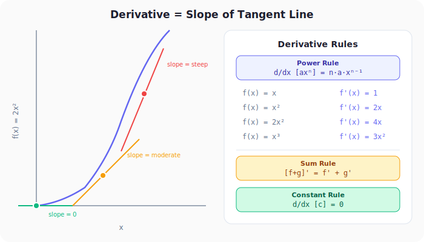
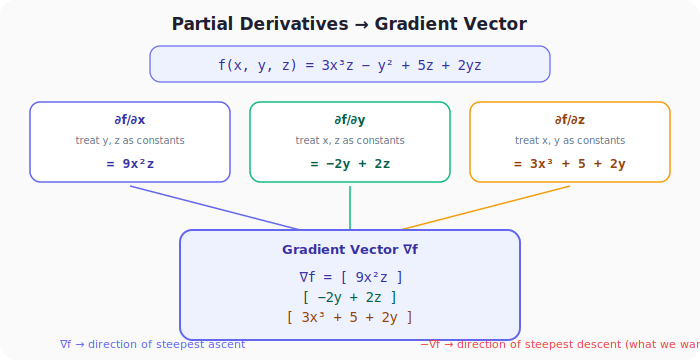

# Neural Networks from Scratch, Part 10: Calculus, Derivatives, Partial Derivatives, and Gradients

*The calculus building blocks you need: derivatives, partial derivatives, and gradients.*

---

## 1. Why Calculus?

In Part 9 we saw that random adjustments can't reliably reduce the loss. What we need is to know **how each weight and bias affects the loss**, so we can change them *in the right direction*.

That "right direction" is the **negative gradient** of the loss function. Computing gradients requires three calculus building blocks:

1. **Derivatives**: how a function changes with respect to one variable
2. **Partial derivatives**: how a multi-variable function changes with respect to *one* of its variables
3. **Gradient**: the vector of all partial derivatives

---

## 2. Derivatives: Slope of the Tangent Line

For a function $f(x)$, the **derivative** $f'(x)$ at a point tells you the slope of the tangent line at that point, i.e. the impact of a small change in $x$ on the output.

$$f'(x) = \frac{df}{dx} = \lim_{\Delta x \to 0} \frac{f(x + \Delta x) - f(x)}{\Delta x}$$

### The Power Rule

For any polynomial term $ax^n$:

$$\frac{d}{dx}\left[ax^n\right] = n \cdot a \cdot x^{n-1}$$

| $f(x)$ | $f'(x)$ | Note |
|:---:|:---:|:---|
| $c$ (constant) | $0$ | Flat line, no change |
| $x$ | $1$ | Constant slope |
| $x^2$ | $2x$ | Slope grows with $x$ |
| $2x^2$ | $4x$ | Steeper parabola |
| $x^3$ | $3x^2$ | Cubic, slope grows faster |

### The Sum Rule

The derivative of a sum is the sum of derivatives:

$$\frac{d}{dx}\left[f(x) + g(x)\right] = f'(x) + g'(x)$$

**Example:** $f(x) = x^3 + 2x^2 + 6$

$$f'(x) = 3x^2 + 4x + 0 = 3x^2 + 4x$$

### Intuition

- **Steep slope** → small change in $x$ causes a *large* change in $f$ → high derivative magnitude
- **Flat slope** → small change in $x$ causes *little* change in $f$ → derivative near zero
- **Negative slope** → increasing $x$ *decreases* $f$ → negative derivative

---

## 3. Partial Derivatives: One Variable at a Time

Real neural networks have many parameters. The loss is a function of *all* weights and biases simultaneously:

$$L = f(w_1, w_2, \ldots, w_{21})$$

A **partial derivative** measures the impact of changing *one* variable while holding all others constant.

**Notation:** $\frac{\partial f}{\partial x}$ means "derivative of $f$ with respect to $x$, treating all other variables as constants."

### The Trick

To compute $\frac{\partial}{\partial x}[f(x, y, z)]$: pretend $y$ and $z$ are just numbers (constants), then differentiate normally with respect to $x$.

### Example 1

$$f(x, y) = 2x + 3y^2$$

$$\frac{\partial f}{\partial x} = 2 \quad \text{(treat } y^2 \text{ as constant → goes to 0)}$$

$$\frac{\partial f}{\partial y} = 6y \quad \text{(treat } 2x \text{ as constant → goes to 0)}$$

### Example 2

$$f(x, y, z) = 3x^3z - y^2 + 5z + 2yz$$

$$\frac{\partial f}{\partial x} = 9x^2z \quad \text{(only the } 3x^3z \text{ term involves } x \text{)}$$

$$\frac{\partial f}{\partial y} = -2y + 2z \quad \text{(the } -y^2 \text{ and } 2yz \text{ terms involve } y \text{)}$$

$$\frac{\partial f}{\partial z} = 3x^3 + 5 + 2y \quad \text{(three terms involve } z \text{)}$$

### Example 3: ReLU

$$f(x) = \max(x, 0)$$

$$\frac{\partial f}{\partial x} = \begin{cases} 1 & \text{if } x > 0 \\ 0 & \text{if } x \leq 0 \end{cases}$$

This is exactly the derivative of the **ReLU activation function**, a fact we'll need during backpropagation.

---

## 4. The Gradient: Vector of All Partial Derivatives

The **gradient** $\nabla f$ packs all partial derivatives into a single vector:

$$\nabla f = \begin{bmatrix} \frac{\partial f}{\partial x} \\ \frac{\partial f}{\partial y} \\ \frac{\partial f}{\partial z} \end{bmatrix}$$

### Key Properties

| Property | Meaning |
|:---|:---|
| $\nabla f$ points in the direction of **steepest ascent** | Moving along $\nabla f$ increases $f$ fastest |
| $-\nabla f$ points in the direction of **steepest descent** | Moving along $-\nabla f$ decreases $f$ fastest |
| $\|\nabla f\|$ (magnitude) tells you **how steep** | Larger magnitude → steeper slope |

For neural networks: $f$ is the loss function, and we want to **decrease** it. So we move the parameters in the direction of $-\nabla L$:

$$\theta_{\text{new}} = \theta_{\text{old}} - \eta \cdot \nabla L$$

where $\theta$ represents all weights and biases, and $\eta$ is the learning rate.

---

## 5. Connecting to Neural Networks

In our network with 21 parameters:

$$\nabla L = \begin{bmatrix} \frac{\partial L}{\partial w_1^{(1)}} \\ \frac{\partial L}{\partial w_2^{(1)}} \\ \vdots \\ \frac{\partial L}{\partial b_3^{(2)}} \end{bmatrix} \leftarrow \text{21 numbers}$$

Each partial derivative tells us: "if I increase this particular weight by a tiny amount, how much does the loss change?"

- **Large positive** $\frac{\partial L}{\partial w}$ → increasing $w$ increases the loss → we should *decrease* $w$
- **Large negative** $\frac{\partial L}{\partial w}$ → increasing $w$ decreases the loss → we should *increase* $w$
- **Near zero** $\frac{\partial L}{\partial w}$ → this weight barely affects the loss right now

The challenge is that the loss depends on weights through multiple layers of computation (dense → ReLU → dense → softmax → cross-entropy). Computing gradients through this chain is exactly what the **chain rule** enables.

---

## Summary

| Concept | What We Learned |
|:---|:---|
| Derivatives | Measure how a function's output changes when its input changes, geometrically the slope of the tangent line |
| Partial derivatives | Extend derivatives to multi-variable functions by differentiating with respect to one variable while treating others as constants |
| Gradient | The vector of all partial derivatives. Points in the direction of steepest ascent; the negative gradient points toward steepest descent |
| ReLU derivative | Particularly simple: 1 when input > 0, and 0 otherwise |
| Chain rule | Needed to compute gradients through multiple layers, covered in the next lecture |

---

## What's Next

In **Part 11** we cover the **chain rule**, the mathematical tool that lets us compute how the loss changes with respect to weights buried deep inside the network.

---

> **Try It Yourself:** Hands-on exercises for this lecture are in [Exercises](../../exercises.md) and [Quizzes](../../quizzes.md).
