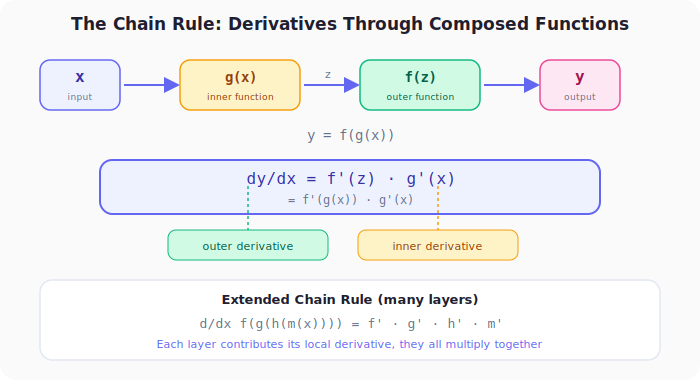
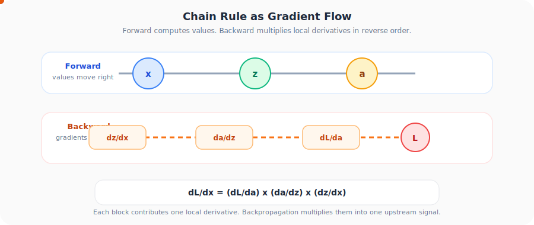

# Neural Networks from Scratch, Part 11: The Chain Rule

*How derivatives flow through composed functions, and why it's the backbone of backpropagation.*

---

## 1. Why the Chain Rule Matters

A neural network is a **chain of functions**: the input passes through dense layers, activation functions, more layers, softmax, and finally the loss function. Each step is a function whose input is the output of the previous step.

To optimise weights, we need the derivative of the loss with respect to weights buried inside this chain. The **chain rule** tells us exactly how to compute that.

---

## 2. The Rule

If $y = f(g(x))$, i.e. $y$ depends on $z$, and $z$ depends on $x$, then:

$$\frac{dy}{dx} = \frac{dy}{dz} \cdot \frac{dz}{dx} = f'(z) \cdot g'(x)$$

**In words:** multiply the derivative of the outer function by the derivative of the inner function.

The loop above is the operational view you want for backpropagation: values move forward through the graph, and gradients move backward through the same chain one local derivative at a time.

---

## 3. Intuitive Example: Fuel Consumption

You drive from New York to California.

| Quantity | Symbol | Relation |
|:---|:---:|:---|
| Time (hours) | $x$ | independent variable |
| Distance (km) | $z = 60x$ | car speed is 60 km/h |
| Fuel (litres) | $y = z/30$ | car uses 1 litre per 30 km |

You want $\frac{dy}{dx}$, how fuel consumption changes with time. But $y$ doesn't depend on $x$ directly; it depends on $z$ (distance), which depends on $x$ (time).

**Apply the chain rule:**

$$\frac{dy}{dx} = \frac{dy}{dz} \cdot \frac{dz}{dx} = \frac{1}{30} \cdot 60 = 2$$

Meaning: **2 litres consumed per hour.** The chain rule connected $y$ to $x$ through the intermediate variable $z$.

---

## 4. Worked Example: Polynomial Chain

Find $\frac{d}{dx}\left[3(2x^2)^5\right]$.

**Step 1: Identify inner and outer functions:**

| | Function | Variable |
|:---|:---:|:---:|
| Inner | $g(x) = 2x^2$ | takes $x$ |
| Outer | $f(z) = 3z^5$ | takes $z = g(x)$ |

**Step 2: Compute individual derivatives:**

$$g'(x) = 4x$$
$$f'(z) = 15z^4$$

**Step 3: Apply chain rule:**

$$\frac{dh}{dx} = f'(g(x)) \cdot g'(x) = 15(2x^2)^4 \cdot 4x$$

$$= 15 \cdot 16x^8 \cdot 4x = 960x^9$$

---

## 5. Extended Chain Rule (Multiple Layers)

If there are more than two chained functions, the chain rule extends naturally:

$$\frac{d}{dx}f(g(h(m(x)))) = f' \cdot g' \cdot h' \cdot m'$$

Each function contributes its **local derivative**, and they all multiply together. This is exactly how backpropagation works. Each layer computes its own local gradient and passes the product backward.

### Neural Network Analogy

A 2-layer network computing the loss looks like:

$$L = \text{CrossEntropy}\Big(\text{Softmax}\big(\mathbf{W}_2 \cdot \text{ReLU}(\mathbf{W}_1 \cdot \mathbf{x} + \mathbf{b}_1) + \mathbf{b}_2\big),\ \mathbf{y}\Big)$$

This is $f(g(h(m(x))))$ with:

| Function | Role |
|:---|:---|
| $m(x)$ | $\mathbf{W}_1 \mathbf{x} + \mathbf{b}_1$, first dense layer |
| $h(z)$ | $\text{ReLU}(z)$, activation |
| $g(z)$ | $\mathbf{W}_2 z + \mathbf{b}_2$, second dense layer |
| $f(z)$ | $\text{Softmax}$ + Cross-Entropy loss |

To find $\frac{\partial L}{\partial \mathbf{W}_1}$, we chain through every layer:

$$\frac{\partial L}{\partial \mathbf{W}_1} = \frac{\partial L}{\partial f} \cdot \frac{\partial f}{\partial g} \cdot \frac{\partial g}{\partial h} \cdot \frac{\partial h}{\partial m} \cdot \frac{\partial m}{\partial \mathbf{W}_1}$$

---

## 6. The Pattern

| Step | Action |
|:---:|:---|
| 1 | Identify the chain of composed functions |
| 2 | Compute each function's **local derivative** |
| 3 | Multiply all local derivatives together (outer → inner) |

That's it. The chain rule is simple in concept. The complexity in neural networks comes from handling matrices, batches, and many parameters. But the underlying principle is always the same: **local derivatives multiplied together**.

---

## Summary

| Concept | What We Learned |
|:---|:---|
| Chain rule | Decomposes the derivative of composed functions: dy/dx = dy/dz · dz/dx |
| Extended chain rule | Extends to any depth: each function contributes its local derivative, and they multiply together |
| Backpropagation | Just the chain rule applied systematically from the loss back to the weights |
| Local derivatives | You only need to know how to differentiate each individual function. The chain rule handles the composition |

---

## What's Next

With derivatives, partial derivatives, gradients, and the chain rule in hand, we're ready for the main event. In **Part 12** we start **backpropagation**, computing the gradient of the loss with respect to the weights of a single neuron.

---

> **Try It Yourself:** Hands-on exercises for this lecture are in [Exercises](../../exercises.md) and [Quizzes](../../quizzes.md).
