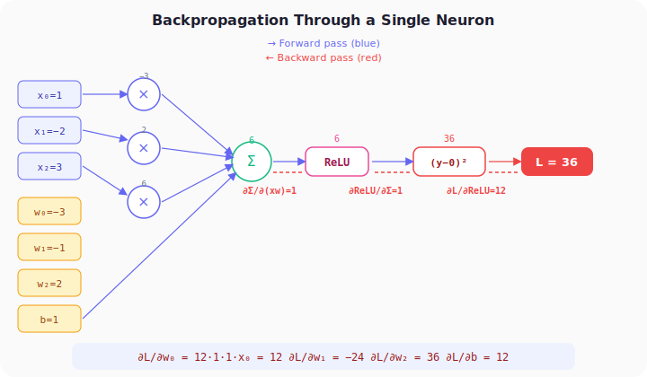
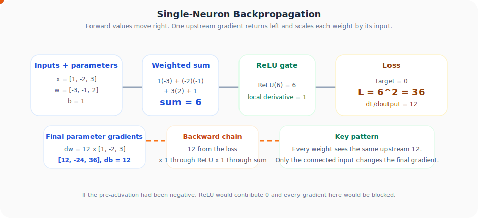

# Neural Networks from Scratch, Part 12: Backpropagation Through a Single Neuron

*Applying the chain rule step by step to compute gradients for a single neuron.*

---

## 1. The Setup

We have a single neuron with 3 inputs, 3 weights, and 1 bias:

| Parameter | Value |
|:---:|:---:|
| $x_0, x_1, x_2$ | 1, −2, 3 |
| $w_0, w_1, w_2$ | −3, −1, 2 |
| $b$ | 1 |
| Target output | 0 |

The neuron computes:

$$\text{output} = \text{ReLU}(x_0 w_0 + x_1 w_1 + x_2 w_2 + b)$$

The loss function (squared error):

$$L = (\text{output} - 0)^2 = \text{output}^2$$

**Goal:** Find $\frac{\partial L}{\partial w_0}$, $\frac{\partial L}{\partial w_1}$, $\frac{\partial L}{\partial w_2}$, and $\frac{\partial L}{\partial b}$ so we can update them to reduce the loss.

---

## 2. Forward Pass

Let's compute step by step:

```
sum = x₀w₀ + x₁w₁ + x₂w₂ + b
    = (1)(−3) + (−2)(−1) + (3)(2) + 1
    = −3 + 2 + 6 + 1 = 6

output = ReLU(6) = 6

loss = 6² = 36
```

The loss is 36, far from 0.

---

## 3. Backward Pass (Chain Rule)

The computation chain is:

$$L = \Big(\text{ReLU}\big(\underbrace{x_0 w_0 + x_1 w_1 + x_2 w_2 + b}_{\text{sum}}\big)\Big)^2$$

To find $\frac{\partial L}{\partial w_0}$, we apply the chain rule through 4 stages:

$$\frac{\partial L}{\partial w_0} = \underbrace{\frac{\partial L}{\partial \text{ReLU}}}_{①} \cdot \underbrace{\frac{\partial \text{ReLU}}{\partial \text{sum}}}_{②} \cdot \underbrace{\frac{\partial \text{sum}}{\partial (x_0 w_0)}}_{③} \cdot \underbrace{\frac{\partial (x_0 w_0)}{\partial w_0}}_{④}$$



The same chain is easier to read in motion: values move right during the forward pass, then the single upstream gradient moves left and turns into one gradient per parameter.



### Computing Each Term

**① Derivative of loss w.r.t. ReLU output:**

$L = \text{output}^2$, so $\frac{\partial L}{\partial \text{output}} = 2 \cdot \text{output} = 2 \times 6 = \mathbf{12}$

**② Derivative of ReLU w.r.t. its input (sum):**

$$\frac{\partial \text{ReLU}(x)}{\partial x} = \begin{cases} 1 & \text{if } x > 0 \\ 0 & \text{if } x \leq 0 \end{cases}$$

Since sum = 6 > 0: $\frac{\partial \text{ReLU}}{\partial \text{sum}} = \mathbf{1}$

**③ Derivative of sum w.r.t. any one of its terms:**

If $f = a + b + c + d$, then $\frac{\partial f}{\partial a} = 1$. So $\frac{\partial \text{sum}}{\partial (x_0 w_0)} = \mathbf{1}$

**④ Derivative of the product $x_0 w_0$ w.r.t. $w_0$:**

Since $x_0$ is treated as a constant: $\frac{\partial(x_0 w_0)}{\partial w_0} = x_0 = \mathbf{1}$

### Result for $w_0$

$$\frac{\partial L}{\partial w_0} = 12 \times 1 \times 1 \times 1 = 12$$

---

## 4. All Four Gradients

The first three terms (①②③) are the **same** for every weight. Only term ④ differs:

| Parameter | ①×②×③ | ④ | Gradient |
|:---:|:---:|:---:|:---:|
| $w_0$ | 12 | $x_0 = 1$ | **12** |
| $w_1$ | 12 | $x_1 = -2$ | **−24** |
| $w_2$ | 12 | $x_2 = 3$ | **36** |
| $b$ | 12 | 1 (bias has no input) | **12** |

**Key insight:** The gradient of the loss w.r.t. a weight is the "upstream gradient" multiplied by the **input** connected to that weight.

---

## 5. Gradient Descent Update

With a learning rate $\eta = 0.01$:

$$w_{\text{new}} = w_{\text{old}} - \eta \cdot \frac{\partial L}{\partial w}$$

| Param | Old | Gradient | New |
|:---:|:---:|:---:|:---:|
| $w_0$ | −3 | 12 | −3.12 |
| $w_1$ | −1 | −24 | −0.76 |
| $w_2$ | 2 | 36 | 1.64 |
| $b$ | 1 | 12 | 0.88 |

New loss: $\text{ReLU}(-3.12 + 1.52 + 4.92 + 0.88)^2 ≈ 33.87$, down from 36!

After 200 iterations, the loss drops to **~0.195**. The weights converge to values that make the output close to 0.

---

## 6. Python Implementation

```python
import numpy as np

# Initialise
weights = np.array([-3.0, -1.0, 2.0])
bias = 1.0
inputs = np.array([1.0, -2.0, 3.0])
target = 0.0
lr = 0.01

def relu(x):
    return max(0, x)

def relu_derivative(x):
    return 1.0 if x > 0 else 0.0

for i in range(200):
    # Forward pass
    z = np.dot(inputs, weights) + bias
    output = relu(z)
    loss = (output - target) ** 2

    # Backward pass
    d_loss = 2 * (output - target)        # ①
    d_relu = relu_derivative(z)            # ②
    d_weights = d_loss * d_relu * inputs   # ①×②×③×④
    d_bias = d_loss * d_relu * 1.0         # ①×②×③

    # Update
    weights -= lr * d_weights
    bias -= lr * d_bias

    if i % 50 == 0:
        print(f"Iter {i}: loss={loss:.4f}")
```

```
Iter 0:   loss=36.0000
Iter 50:  loss=1.2543
Iter 100: loss=0.4568
Iter 150: loss=0.2762
Iter 200: loss=0.1954
```

---

## 7. Why It's Called "Back" Propagation

We compute gradients from **right to left**, from the loss, backward through each operation, all the way to the weights:

```
Loss → ReLU → Sum → Multiply → Weights
 ←12    ←1     ←1    ←x_i
```

Each node passes its **local gradient** backward. The product of all local gradients along the path gives the final gradient for each weight.

---

## Summary

| Concept | What We Learned |
|:---|:---|
| Backprop = chain rule | Each operation computes its local derivative and passes it backward |
| Gradient w.r.t. a weight | Upstream gradient multiplied by the input connected to that weight |
| Gradient w.r.t. bias | Upstream gradient multiplied by 1 (bias is just added) |
| ReLU's derivative | 1 for positive inputs, 0 for negative. It acts as a gate |
| Gradient descent | After computing all gradients, update each parameter and reduce the loss. Repeat until converged |

---

## What's Next

In **Part 13** we extend backpropagation from a single neuron to an **entire layer** of neurons.

---

> **Try It Yourself:** Hands-on exercises for this lecture are in [Exercises](../../exercises.md) and [Quizzes](../../quizzes.md).
