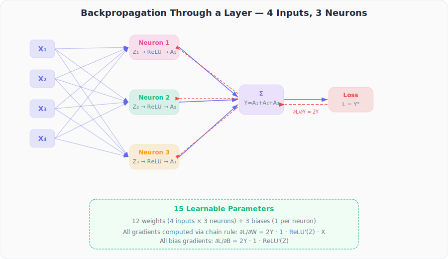
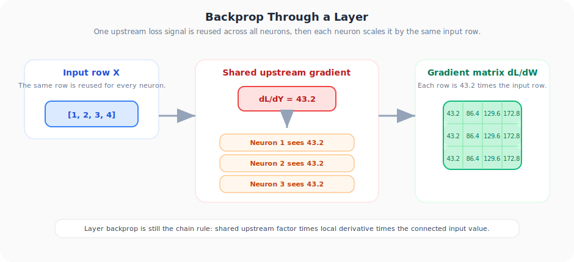
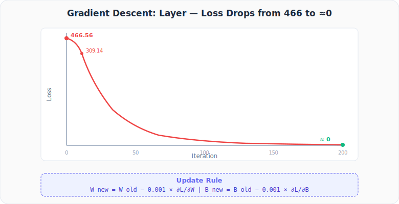

# Neural Networks from Scratch, Part 13: Backpropagation Through a Layer of Neurons

*Same chain-rule logic scaled up: 4 inputs, 3 neurons, 15 learnable parameters.*

---

In the previous lecture we back-propagated through a **single** neuron. That was educational, but the real power of neural networks comes from **stacking neurons into layers**. Today we scale up: 4 inputs, 3 neurons, 15 learnable parameters — and we show that the exact same chain-rule logic still works, just applied more times.

---

## 1. The Architecture



| Component | Details |
|-----------|---------|
| **Inputs** | $X_1=1,\; X_2=2,\; X_3=3,\; X_4=4$ |
| **Neurons** | 3 neurons, each with 4 weights + 1 bias |
| **Activations** | ReLU on each neuron output |
| **Output** | $Y = A_1 + A_2 + A_3$ |
| **Loss** | $L = Y^2 = (A_1+A_2+A_3)^2$ (target = 0) |
| **Parameters** | 12 weights + 3 biases = **15** |

### Notation

$$Z_k = \sum_{j} W_{kj} X_j + B_k, \quad A_k = \text{ReLU}(Z_k), \quad Y = \sum_k A_k, \quad L = Y^2$$

---

## 2. Chain Rule for One Weight

To find $\frac{\partial L}{\partial W_{11}}$ we trace backwards through four nodes:

$$\frac{\partial L}{\partial W_{11}} = \underbrace{\frac{\partial L}{\partial Y}}_{2Y} \cdot \underbrace{\frac{\partial Y}{\partial A_1}}_{1} \cdot \underbrace{\frac{\partial A_1}{\partial Z_1}}_{\text{ReLU}'(Z_1)} \cdot \underbrace{\frac{\partial Z_1}{\partial W_{11}}}_{X_1}$$

For the other weights in the same neuron, only the last factor changes:

$$\frac{\partial L}{\partial W_{1j}} = 2Y \cdot 1 \cdot \mathbb{1}[Z_1>0] \cdot X_j \qquad j = 1,2,3,4$$

The same pattern repeats for neurons 2 and 3 — replace $Z_1$ with $Z_k$ and $W_{1j}$ with $W_{kj}$.

The motion view below emphasizes the main pattern to notice: one upstream loss gradient is reused across all three neurons, and each neuron then scales that signal by the same input row.



---

## 3. Forward Pass (Numerical Example)

Starting weights and biases:

```python
import numpy as np

inputs  = np.array([1, 2, 3, 4])

weights = np.array([[0.1, 0.2, 0.3, 0.4],   # Neuron 1
                     [0.5, 0.6, 0.7, 0.8],   # Neuron 2
                     [0.9, 1.0, 1.1, 1.2]])   # Neuron 3

biases  = np.array([0.1, 0.2, 0.3])
```

Forward pass:

```python
Z = weights @ inputs + biases          # [3.0, 7.2, 11.4]
A = np.maximum(0, Z)                    # [3.0, 7.2, 11.4]  (all > 0)
Y = np.sum(A)                           # 21.6
L = Y ** 2                              # 466.56
```

| Quantity | Value |
|----------|-------|
| $Z_1, Z_2, Z_3$ | 3.0, 7.2, 11.4 |
| $A_1, A_2, A_3$ | 3.0, 7.2, 11.4 |
| $Y$ | 21.6 |
| $L$ | **466.56** |

---

## 4. Backward Pass

Since all $Z_k > 0$, the ReLU derivative is 1 everywhere. The gradient simplifies to:

$$\frac{\partial L}{\partial W_{kj}} = 2Y \cdot X_j = 43.2 \cdot X_j$$

| Weight | Gradient | Weight | Gradient | Weight | Gradient |
|--------|----------|--------|----------|--------|----------|
| $W_{11}$ | 43.2 | $W_{21}$ | 43.2 | $W_{31}$ | 43.2 |
| $W_{12}$ | 86.4 | $W_{22}$ | 86.4 | $W_{32}$ | 86.4 |
| $W_{13}$ | 129.6 | $W_{23}$ | 129.6 | $W_{33}$ | 129.6 |
| $W_{14}$ | 172.8 | $W_{24}$ | 172.8 | $W_{34}$ | 172.8 |

For biases, the input term is 1 so:

$$\frac{\partial L}{\partial B_k} = 2Y = 43.2 \qquad \text{for all } k$$

---

## 5. Gradient Descent Update

$$W_{\text{new}} = W_{\text{old}} - \eta \cdot \frac{\partial L}{\partial W}, \quad \eta = 0.001$$

After one update:

| Metric | Value |
|--------|-------|
| New $Y$ | 17.58 |
| New $L$ | **309.14** |

Loss dropped from 466.56 to 309.14 in a single step!

---

## 6. Full Python Implementation (200 Iterations)

```python
import numpy as np

inputs  = np.array([1, 2, 3, 4])
weights = np.array([[0.1, 0.2, 0.3, 0.4],
                     [0.5, 0.6, 0.7, 0.8],
                     [0.9, 1.0, 1.1, 1.2]])
biases  = np.array([0.1, 0.2, 0.3])
lr      = 0.001

def relu(x):
    return np.maximum(0, x)

def relu_deriv(x):
    return np.where(x > 0, 1.0, 0.0)

for i in range(200):
    # --- Forward pass ---
    Z = weights @ inputs + biases
    A = relu(Z)
    Y = np.sum(A)
    L = Y ** 2

    # --- Backward pass ---
    dL_dY    = 2 * Y                           # scalar
    dY_dA    = np.ones_like(A)                  # [1, 1, 1]
    dA_dZ    = relu_deriv(Z)                    # [1, 1, 1] when Z > 0
    dL_dZ    = dL_dY * dY_dA * dA_dZ           # [43.2, 43.2, 43.2] (iter 0)

    # Gradient w.r.t. weights: outer product of dL_dZ and inputs
    dL_dW    = dL_dZ.reshape(-1, 1) * inputs    # (3, 4)
    dL_dB    = dL_dZ                             # (3,)

    # --- Update ---
    weights -= lr * dL_dW
    biases  -= lr * dL_dB

    if i % 20 == 0 or i == 199:
        print(f"Iter {i:3d} | Loss = {L:.6f}")
```

**Output (selected iterations):**

```
Iter   0 | Loss = 466.560000
Iter  20 | Loss = 9.843126
Iter  40 | Loss = 0.207618
Iter  60 | Loss = 0.004380
Iter  80 | Loss = 0.000092
Iter 100 | Loss = 0.000002
...
Iter 180 | Loss = 0.000000
Iter 199 | Loss = 0.000000
```

The loss converges to ≈ 0, meaning the network learned weights and biases that make $A_1 + A_2 + A_3 \approx 0$.



---

## Summary

| Concept | What We Learned |
|:---|:---|
| Same chain rule, more neurons | Extending backprop from one neuron to a full layer requires no new math, just more applications of the chain rule |
| Gradient pattern | The gradient of each weight decomposes into a backprop factor times the corresponding input |
| Bias gradients | Simpler because the input factor is 1 |
| Notation matters | Clear naming (Z, A, Y, L) makes the chain rule applications mechanical and error-free |

---

## What's Next

In **Part 14** we'll see how to express all of these per-weight gradients as a single **matrix multiplication**, making backprop compact and GPU-friendly.

---

> **Try It Yourself:** Hands-on exercises for this lecture are in [Exercises](../../exercises.md) and [Quizzes](../../quizzes.md).
