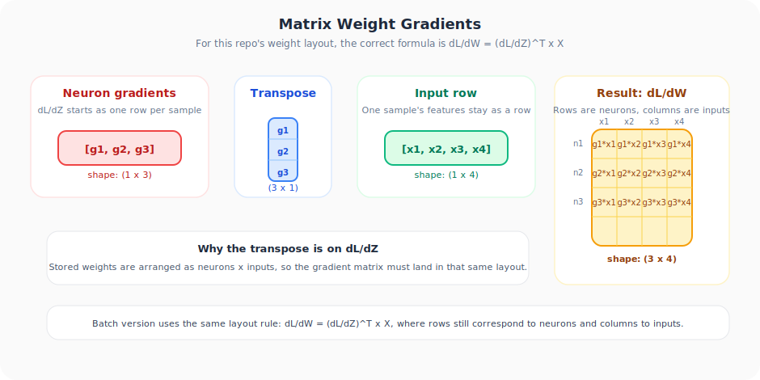

# Neural Networks from Scratch, Part 14: Matrices in Backpropagation

*One matrix multiplication replaces all those individual gradient calculations.*

---

In the last lecture we computed gradients for **every single weight individually**, writing 12 weight derivatives and 3 bias derivatives one by one. That works, but imagine a network with 10,000 neurons. The key insight of this lecture: **one matrix multiplication replaces all those individual calculations**.

---

## 1. The Problem with Manual Gradients

From Part 13 we know the gradient of each weight is:

$$\frac{\partial L}{\partial W_{kj}} = \frac{\partial L}{\partial Z_k} \cdot X_j$$

There are 12 such equations (4 inputs × 3 neurons). Writing them all out is tedious and error-prone. *Can we express them as one matrix product?*

---

## 2. The Weight Gradient Formula



Because this series stores dense-layer weights as **(neurons x inputs)**, the matrix product must preserve that same orientation.

### The key formula:

$$\frac{\partial L}{\partial \mathbf{W}} = \left(\frac{\partial L}{\partial \mathbf{Z}}\right)^T \cdot \mathbf{X}$$

| Matrix | Shape | Description |
|--------|-------|-------------|
| $\left(\frac{\partial L}{\partial \mathbf{Z}}\right)^T$ | $(3 \times 1)$ | One gradient entry per neuron |
| $\mathbf{X}$ | $(1 \times 4)$ | Input row for the current sample |
| $\frac{\partial L}{\partial \mathbf{W}}$ | $(3 \times 4)$ | All 12 weight gradients in the same layout as `weights` |

Each **row** of the result corresponds to one neuron's weights. Each **column** corresponds to one input feature.

The animation below shows why this is an outer product: a neuron-gradient column meets an input row, and every intersection becomes one weight gradient.



---

## 3. Where Does ∂L/∂Z Come From?

From the chain rule in Part 13:

$$\frac{\partial L}{\partial Z_k} = \underbrace{\frac{\partial L}{\partial Y}}_{2Y} \cdot \underbrace{\frac{\partial Y}{\partial A_k}}_{1} \cdot \underbrace{\frac{\partial A_k}{\partial Z_k}}_{\text{ReLU}'(Z_k)}$$

This is computed once and reused for every weight in that neuron.

---

## 4. Numerical Verification (Single Input)

From Part 13: $X = [1, 2, 3, 4]$, $Y = 21.6$, all $Z_k > 0$.

$$\frac{\partial L}{\partial \mathbf{Z}} = [43.2, \; 43.2, \; 43.2]$$

```python
import numpy as np

X     = np.array([[1, 2, 3, 4]])           # (1, 4)
dL_dZ = np.array([[43.2, 43.2, 43.2]])     # (1, 3)

dL_dW = dL_dZ.T @ X
print(dL_dW)
```

```
[[ 43.2  86.4 129.6 172.8]
 [ 43.2  86.4 129.6 172.8]
 [ 43.2  86.4 129.6 172.8]]
```

**Exactly the same 12 values** we computed manually in Part 13, now arranged in the same `(neurons x inputs)` shape as the stored weight matrix.

---

## 5. Bias Gradients

For biases, $\frac{\partial Z_k}{\partial B_k} = 1$, so:

$$\frac{\partial L}{\partial \mathbf{B}} = \frac{\partial L}{\partial \mathbf{Z}}$$

No extra computation needed. The bias gradient **is** the $\frac{\partial L}{\partial Z}$ vector.

---

## 6. Extending to Batches

In practice, multiple samples arrive at once. With $n$ samples:

| Matrix | Shape |
|--------|-------|
| $\mathbf{X}$ | $(n \times 4)$ |
| $\frac{\partial L}{\partial \mathbf{Z}}$ | $(n \times 3)$ |
| $\frac{\partial L}{\partial \mathbf{W}} = \left(\frac{\partial L}{\partial \mathbf{Z}}\right)^T \cdot \mathbf{X}$ | $(3 \times 4)$ |
| $\frac{\partial L}{\partial \mathbf{B}} = \sum_{\text{rows}} \frac{\partial L}{\partial \mathbf{Z}}$ | $(1 \times 3)$ |

The transpose-times-matrix product **automatically sums contributions across all samples** while preserving the same row-by-row layout as the stored weights.

### Batch Example

```python
X = np.array([[ 1.0,  2.0,  3.0,  2.5],
              [ 2.0,  5.0, -1.0,  2.0],
              [-1.5,  2.7,  3.3, -0.8]])

dL_dZ = np.array([[1, 1, 1],
                   [2, 2, 2],
                   [3, 3, 3]])

dL_dW = dL_dZ.T @ X
dL_dB = np.sum(dL_dZ, axis=0)

print("Weight gradients:\n", dL_dW)
print("Bias gradients:", dL_dB)
```

```
Weight gradients:
 [[ 0.5 20.1 10.9  4.1]
  [ 0.5 20.1 10.9  4.1]
  [ 0.5 20.1 10.9  4.1]]
Bias gradients: [6 6 6]
```

These match the manual per-sample calculations from the lecture!

---

## 7. The Two Formulas You Need

| What | Formula | NumPy |
|------|---------|-------|
| Weight gradients | $\frac{\partial L}{\partial \mathbf{W}} = \left(\frac{\partial L}{\partial \mathbf{Z}}\right)^T \cdot \mathbf{X}$ | `dL_dZ.T @ X` |
| Bias gradients | $\frac{\partial L}{\partial \mathbf{B}} = \sum_{\text{rows}} \frac{\partial L}{\partial \mathbf{Z}}$ | `np.sum(dL_dZ, axis=0)` |

These two lines replace **all** individual weight/bias gradient computations, no matter how large the layer.

---

## Summary

| Concept | What We Learned |
|:---|:---|
| Matrix form | Not an approximation. It produces exactly the same numbers as manual per-weight differentiation |
| Weight gradient formula | dL/dW = dL/dZ transposed times X, correct for this repo's (neurons x inputs) weight layout |
| Bias gradients | Simply the row-sum of dL/dZ |
| Batches | Work automatically. The matrix product sums each sample's contribution while keeping the stored weight orientation intact |

---

## What's Next

In **Part 15** we tackle the other half: gradients with respect to **inputs**. This is essential when stacking layers, because one layer's inputs are the previous layer's outputs.

---

> **Try It Yourself:** Hands-on exercises for this lecture are in [Exercises](../../exercises.md) and [Quizzes](../../quizzes.md).
