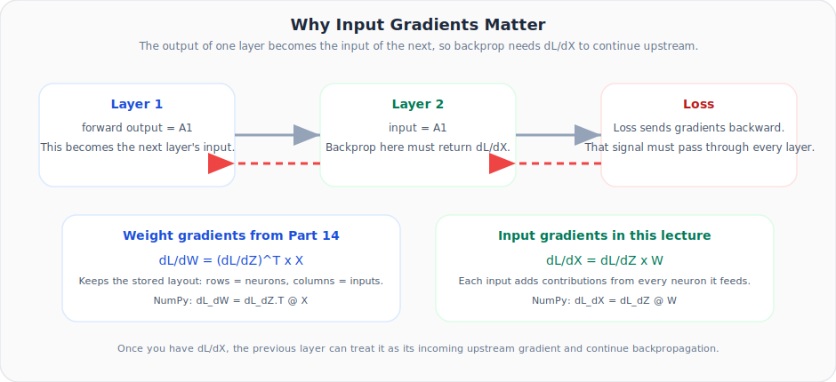

# Neural Networks from Scratch, Part 15: Gradients with Respect to Inputs

*The missing piece for stacking layers: how gradients flow backward through inputs.*

---

In Part 14 we derived the matrix formula for weight gradients: $\left(\frac{\partial L}{\partial \mathbf{Z}}\right)^T \cdot \mathbf{X}$. But to **stack layers**, we need one more formula, the gradient of the loss with respect to the **inputs**. This lecture completes the picture.

---

## 1. Why Do We Need ∂L/∂X?



In a multi-layer network the **output of one layer is the input to the next**. During backpropagation:

1. We compute $\frac{\partial L}{\partial \mathbf{Z}}$ for the current layer and use it to update weights/biases.
2. We then need the gradient with respect to the current layer's **inputs** so the preceding layer can continue its own backprop.

Without $\frac{\partial L}{\partial \mathbf{X}}$ the gradient signal **cannot flow** past the first layer.

The motion diagram shows the key reason: one input fans out to multiple neurons on the forward pass, so its backward gradient must collect contributions from all of them.



---

## 2. The Key Difference: Weights vs Inputs

When computing $\frac{\partial L}{\partial W_{11}}$, only the path through **neuron 1** contributed, because $W_{11}$ only connects $X_1$ to neuron 1.

But $X_1$ connects to **all three neurons** (via $W_{11}$, $W_{21}$, $W_{31}$). So:

$$\frac{\partial L}{\partial X_1} = \frac{\partial L}{\partial Z_1} \cdot W_{11} + \frac{\partial L}{\partial Z_2} \cdot W_{21} + \frac{\partial L}{\partial Z_3} \cdot W_{31}$$

We must **sum contributions across all neurons** the input feeds into.

---

## 3. Deriving the General Formula

For any input $X_j$:

$$\frac{\partial L}{\partial X_j} = \sum_{k=1}^{3} \frac{\partial L}{\partial Z_k} \cdot W_{kj}$$

Written for all four inputs at once, this is a matrix product:

$$\frac{\partial L}{\partial \mathbf{X}} = \frac{\partial L}{\partial \mathbf{Z}} \cdot \mathbf{W}$$

| Matrix | Shape |
|--------|-------|
| $\frac{\partial L}{\partial \mathbf{Z}}$ | $(1 \times 3)$ |
| $\mathbf{W}$ | $(3 \times 4)$ |
| $\frac{\partial L}{\partial \mathbf{X}}$ | $(1 \times 4)$, one gradient per input |

---

## 4. Numerical Verification

Using the same example: $X = [1,2,3,4]$, $Y = 21.6$, all $Z_k > 0$, so $\frac{\partial L}{\partial \mathbf{Z}} = [43.2, 43.2, 43.2]$.

```python
import numpy as np

weights = np.array([[0.1, 0.2, 0.3, 0.4],
                     [0.5, 0.6, 0.7, 0.8],
                     [0.9, 1.0, 1.1, 1.2]])

dL_dZ = np.array([[43.2, 43.2, 43.2]])     # (1, 3)

dL_dX = dL_dZ @ weights
print(dL_dX)
```

Let's verify manually:

$$\frac{\partial L}{\partial X_1} = 43.2 \times (0.1 + 0.5 + 0.9) = 43.2 \times 1.5 = 64.8$$

$$\frac{\partial L}{\partial X_2} = 43.2 \times (0.2 + 0.6 + 1.0) = 43.2 \times 1.8 = 77.76$$

$$\frac{\partial L}{\partial X_3} = 43.2 \times (0.3 + 0.7 + 1.1) = 43.2 \times 2.1 = 90.72$$

$$\frac{\partial L}{\partial X_4} = 43.2 \times (0.4 + 0.8 + 1.2) = 43.2 \times 2.4 = 103.68$$

> **Note on convention:** Because our weight matrix is stored as `(neurons × inputs) = (3 × 4)`, the formula is $\frac{\partial L}{\partial \mathbf{Z}} \cdot \mathbf{W}$ in this repo. In frameworks that store weights as `(inputs × neurons)`, the transpose placement flips.

---

## 5. Batch Extension

With $n$ samples, everything stays the same:

$$\frac{\partial L}{\partial \mathbf{X}} = \frac{\partial L}{\partial \mathbf{Z}} \cdot \mathbf{W}$$

| Matrix | Shape |
|--------|-------|
| $\frac{\partial L}{\partial \mathbf{Z}}$ | $(n \times 3)$ |
| $\mathbf{W}$ | $(3 \times 4)$ |
| $\frac{\partial L}{\partial \mathbf{X}}$ | $(n \times 4)$, one row per sample |

Each row of the result gives the input gradient for that particular sample. Rows don't interact. Each sample's gradient computation is independent.

---

## 6. The Complete Backprop Toolkit for a Dense Layer

We now have **three formulas** that handle everything:

| What | Formula | NumPy |
|------|---------|-------|
| Weight gradients | $\frac{\partial L}{\partial \mathbf{W}} = \left(\frac{\partial L}{\partial \mathbf{Z}}\right)^T \cdot \mathbf{X}$ | `dL_dZ.T @ X` |
| Bias gradients | $\frac{\partial L}{\partial \mathbf{B}} = \sum_{\text{rows}} \frac{\partial L}{\partial \mathbf{Z}}$ | `np.sum(dL_dZ, axis=0)` |
| Input gradients | $\frac{\partial L}{\partial \mathbf{X}} = \frac{\partial L}{\partial \mathbf{Z}} \cdot \mathbf{W}$ | `dL_dZ @ W` |

These three lines are the **entire backward pass** for a dense (fully connected) layer.

---

## Summary

| Concept | What We Learned |
|:---|:---|
| Input gradients | Exist because inputs feed all neurons, so we sum gradient contributions from every neuron in the layer |
| The formula | dL/dZ times W for this repo's weight layout. One matrix multiply gives all input gradients at once |
| Multi-layer networks | Input grads carry the gradient signal backward to earlier layers |
| Complete toolkit | With weight grads, bias grads, and input grads, we have everything needed for arbitrarily deep networks |

---

## What's Next

In **Part 16** we bring it all together and **code the full backward pass in Python**, building a `Dense_Layer` class with both `forward()` and `backward()` methods.

---

> **Try It Yourself:**

> **Try It Yourself:** Hands-on exercises for this lecture are in [Exercises](../../exercises.md) and [Quizzes](../../quizzes.md).
