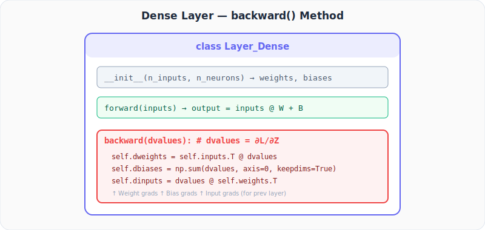

# Neural Networks from Scratch, Part 16: Coding Backpropagation in Python

*Turning three lectures of theory into running code with forward and backward methods.*

---

Three lectures of theory are behind us. Now we turn all of it into **running code**: a `Layer_Dense` class with both `forward()` and `backward()` methods, plus the same for ReLU.

---

## 1. What the Backward Method Needs

When backpropagating through layer $k$, we receive **dvalues**, the gradient of the loss accumulated from every layer after $k$. Concretely, dvalues is $\frac{\partial L}{\partial \mathbf{Z}}$ for that layer.

From dvalues we compute three things:

| Gradient | Formula | Purpose |
|----------|---------|---------|
| $\frac{\partial L}{\partial \mathbf{W}}$ | $\mathbf{X}^T \cdot \text{dvalues}$ | Update weights |
| $\frac{\partial L}{\partial \mathbf{B}}$ | $\sum_{\text{rows}} \text{dvalues}$ | Update biases |
| $\frac{\partial L}{\partial \mathbf{X}}$ | $\text{dvalues} \cdot \mathbf{W}^T$ | Pass to previous layer |

---

## 2. The Dense Layer Class



```python
import numpy as np

class Layer_Dense:
    def __init__(self, n_inputs, n_neurons):
        self.weights = 0.01 * np.random.randn(n_inputs, n_neurons)
        self.biases  = np.zeros((1, n_neurons))

    def forward(self, inputs):
        self.inputs = inputs                         # cache for backward
        self.output = inputs @ self.weights + self.biases

    def backward(self, dvalues):
        # Gradient w.r.t. weights
        self.dweights = self.inputs.T @ dvalues
        # Gradient w.r.t. biases
        self.dbiases  = np.sum(dvalues, axis=0, keepdims=True)
        # Gradient w.r.t. inputs (for previous layer)
        self.dinputs  = dvalues @ self.weights.T
```

**Key details:**
- `self.inputs` is cached during `forward()` because we need it for the weight gradient.
- `keepdims=True` ensures bias gradients stay 2-D, matching `self.biases`.
- `self.dinputs` is what the preceding layer receives as *its* `dvalues`.

---

## 3. Quick Numerical Check

```python
X = np.array([[ 1.0,  2.0,  3.0,  2.5],
              [ 2.0,  5.0, -1.0,  2.0],
              [-1.5,  2.7,  3.3, -0.8]])

dvalues = np.array([[1, 1, 1],
                     [2, 2, 2],
                     [3, 3, 3]])

# Weight gradients
dweights = X.T @ dvalues
print("dweights:\n", dweights)

# Bias gradients
dbiases = np.sum(dvalues, axis=0, keepdims=True)
print("dbiases:", dbiases)

# Input gradients
weights = np.array([[0.1, 0.2, 0.3, 0.4],
                     [0.5, 0.6, 0.7, 0.8],
                     [0.9, 1.0, 1.1, 1.2]]).T  # (4,3)

dinputs = dvalues @ weights.T
print("dinputs:\n", dinputs)
```

```
dweights:
 [[ 0.5  0.5  0.5]
  [20.1 20.1 20.1]
  [10.9 10.9 10.9]
  [ 4.1  4.1  4.1]]
dbiases: [[6 6 6]]
dinputs:
 [[ 1.5  1.8  2.1  2.4]
  [ 3.0  3.6  4.2  4.8]
  [ 4.5  5.4  6.3  7.2]]
```

All values match the manual calculations from Parts 13-15.

---

## 4. ReLU Backward

The ReLU activation also needs a `backward()` method. During backprop through ReLU:

$$\frac{\partial L}{\partial Z_k} = \frac{\partial L}{\partial A_k} \cdot \text{ReLU}'(Z_k) = \begin{cases} \frac{\partial L}{\partial A_k} & \text{if } Z_k > 0 \\ 0 & \text{if } Z_k \le 0 \end{cases}$$

In code:

```python
class Activation_ReLU:
    def forward(self, inputs):
        self.inputs = inputs
        self.output = np.maximum(0, inputs)

    def backward(self, dvalues):
        self.dinputs = dvalues.copy()
        self.dinputs[self.inputs <= 0] = 0
```

**Protocol:** copy dvalues, then zero out positions where the input was ≤ 0.

### Example

```python
inputs  = np.array([1, -2, 3])
dvalues = np.array([5,  6, 7])

dinputs = dvalues.copy()
dinputs[inputs <= 0] = 0
print(dinputs)   # [5, 0, 7]
```

The gradient at $Z_2 = -2$ is killed because ReLU's derivative is 0 there.

---

## 5. Building Blocks Summary

We now have backward methods for:

| Component | `backward()` computes |
|-----------|----------------------|
| **Layer_Dense** | `dweights`, `dbiases`, `dinputs` |
| **Activation_ReLU** | `dinputs` (masked copy of dvalues) |

Still remaining: backward for **categorical cross-entropy loss** and **softmax activation** (next two lectures).

---

## Summary

| Concept | What We Learned |
|:---|:---|
| Dense backward pass | Three lines: one matrix multiply for weights, one sum for biases, one matrix multiply for inputs |
| ReLU backward | A masked copy: wherever the input was ≤ 0, gradient is zeroed |
| Caching inputs | Essential during forward() so backward() can compute weight gradients |
| keepdims=True | Prevents shape mismatches when subtracting bias gradients |

---

## What's Next

In **Part 17** we focus on back-propagating through activation functions, specifically the ReLU backward in more detail, and introduce the challenge of backprop through **softmax**.

---


> **Try It Yourself:** Hands-on exercises for this lecture are in [Exercises](../../exercises.md) and [Quizzes](../../quizzes.md).
