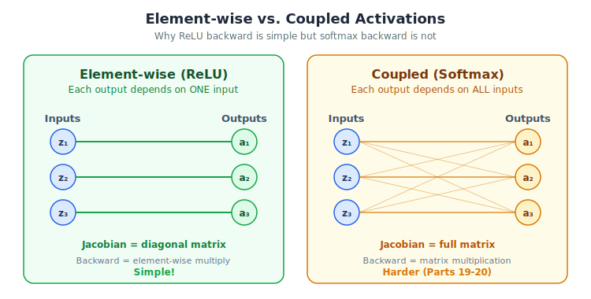

# Neural Networks from Scratch, Part 17: Backpropagation Through Activation Functions

*Why ReLU's backward is so simple, and why softmax is harder.*

---

In Part 16 we coded the backward pass for **dense layers** and **ReLU**. This lecture zooms into the theory behind activation-function backpropagation, shows why ReLU's backward is so simple, and previews the harder case: **softmax** (covered in Parts 19-20).

---

## 1. Where Activations Sit in the Chain

A typical forward path through one block:

$$\mathbf{Z} = \mathbf{X}\mathbf{W} + \mathbf{B} \;\xrightarrow{\text{ReLU}}\; \mathbf{A} = \text{ReLU}(\mathbf{Z})$$

During backprop we receive $\frac{\partial L}{\partial \mathbf{A}}$ (dvalues) and must produce $\frac{\partial L}{\partial \mathbf{Z}}$ to pass back to the dense layer's `backward()`.

By the chain rule:

$$\frac{\partial L}{\partial Z_k} = \frac{\partial L}{\partial A_k} \cdot \frac{\partial A_k}{\partial Z_k}$$

---


## 2. ReLU Backward: Detailed Derivation

$$\text{ReLU}(z) = \max(0, z)$$

$$\frac{\partial \,\text{ReLU}}{\partial z} = \begin{cases} 1 & z > 0 \\ 0 & z \le 0 \end{cases}$$

So:

$$\frac{\partial L}{\partial Z_k} = \begin{cases} \frac{\partial L}{\partial A_k} & \text{if } Z_k > 0 \\ 0 & \text{if } Z_k \le 0 \end{cases}$$

### Worked Example

| Neuron | $Z_k$ (input) | $\frac{\partial L}{\partial A_k}$ (dvalue) | $\frac{\partial L}{\partial Z_k}$ (output) |
|--------|-----------|-------------|------------|
| 1 | 1.0 (>0) | 5 | **5** |
| 2 | −2.0 (≤0) | 6 | **0** |
| 3 | 3.0 (>0) | 7 | **7** |

Neuron 2's gradient is zeroed because ReLU was in its flat region.

---

## 3. The Code (Recap)

```python
class Activation_ReLU:
    def forward(self, inputs):
        self.inputs = inputs
        self.output = np.maximum(0, inputs)

    def backward(self, dvalues):
        self.dinputs = dvalues.copy()       # start with dvalues
        self.dinputs[self.inputs <= 0] = 0  # zero where ReLU was off
```

**Why `.copy()`?** Without it, we'd modify the original `dvalues` array in-place, corrupting data that other layers might still need.

---

## 4. Protocol Summary

1. Set `dinputs = dvalues.copy()`
2. Check which inputs were ≤ 0 during the forward pass
3. Set those positions in `dinputs` to 0
4. Done: `dinputs` is now $\frac{\partial L}{\partial \mathbf{Z}}$

---



## 5. Preview: Why Softmax Is Harder

ReLU operates **element-wise**: each output depends on exactly one input. So the Jacobian is diagonal and the backward pass is a simple mask.

**Softmax** is different: each output depends on **all** inputs (because of the normalization denominator). This means the Jacobian is a **full matrix**, and backprop requires actual matrix operations. We'll tackle that in Parts 19-20.

---

## 6. Building Blocks Status

| Component | forward | backward |
|-----------|---------|----------|
| Layer_Dense | ✅ | ✅ |
| Activation_ReLU | ✅ | ✅ |
| Activation_Softmax | ✅ | ⬜ (Part 19) |
| Loss_CategoricalCrossentropy | ✅ | ⬜ (Part 18) |

---

## 7. Other Element-wise Activations: Sigmoid and Tanh

We use ReLU in this series, but two other common activations, **sigmoid** and **tanh**, follow the exact same backward pattern because they are also element-wise:

| Activation | Forward: $f(z)$ | Derivative: $f'(z)$ | Backward rule |
|-----------|-----------|-----------|-------------|
| **ReLU** | $\max(0, z)$ | $1$ if $z > 0$, else $0$ | Mask: zero where $z \le 0$ |
| **Sigmoid** | $\sigma(z) = \frac{1}{1 + e^{-z}}$ | $\sigma(z)(1 - \sigma(z))$ | Element-wise multiply |
| **Tanh** | $\tanh(z) = \frac{e^z - e^{-z}}{e^z + e^{-z}}$ | $1 - \tanh^2(z)$ | Element-wise multiply |

All three produce a **diagonal Jacobian**: each output depends on exactly one input. The backward pass is always:

$$\text{dinputs}_k = \text{dvalues}_k \times f'(Z_k)$$

The only difference is what $f'$ looks like. ReLU's derivative is binary (0 or 1), making it the simplest and fastest. Sigmoid and tanh produce continuous derivatives, but the code structure is identical: element-wise multiplication, no matrix operations needed.

> **Practical note:** Sigmoid and tanh can suffer from **vanishing gradients**: their derivatives approach zero for very large or very small inputs. This is one reason ReLU is preferred in hidden layers: its gradient is either 0 or 1, with no shrinking in between.

---

## Summary

| Concept | What We Learned |
|:---|:---|
| ReLU backward | A gate: gradient flows through where input was positive, blocked where zero or negative |
| Copy dvalues | Always copy before modifying. In-place edits break the computation graph |
| Element-wise vs coupled | Element-wise activations (ReLU, sigmoid, tanh) have diagonal Jacobians and simple backwards; coupled activations (softmax) do not |
| Sigmoid and tanh | Follow the same element-wise backward pattern as ReLU. Only the derivative formula changes |

---

## What's Next

In **Part 18** we implement the backward pass for the **categorical cross-entropy loss**, the very last layer in our classification network.

---

> **Try It Yourself:** Hands-on exercises for this lecture are in [Exercises](../../exercises.md) and [Quizzes](../../quizzes.md).
