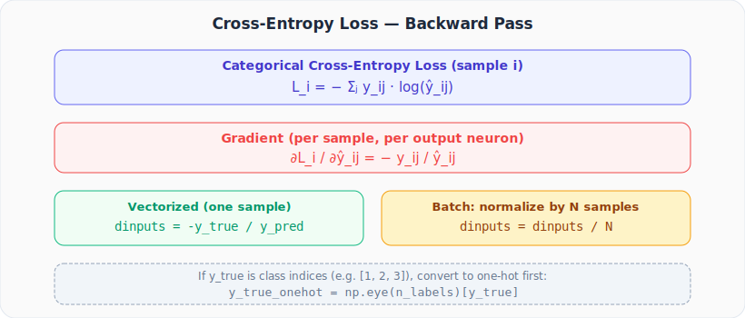

# Neural Networks from Scratch, Part 18: Backpropagation Through the Loss Function

*Backprop starts at the loss. We derive the cross-entropy gradient and implement it in Python.*

Backprop starts at the **loss function**: it's the very first gradient we compute. For classification with categorical cross-entropy, this lecture derives that gradient and implements it in Python.

---

## 1. Setup: Classification Network

```
Inputs → [Dense layers + ReLU]... → Softmax → ŷ → Cross-Entropy Loss → L
```

We need: $\frac{\partial L}{\partial \hat{y}_{ij}}$, the gradient of the loss with respect to each softmax output. This is the starting signal for the entire backprop chain.

---

## 2. Deriving the Gradient



For sample $i$, the categorical cross-entropy loss is:

$$L_i = -\sum_j y_{ij} \cdot \ln(\hat{y}_{ij})$$

where $y_{ij}$ is the one-hot true label and $\hat{y}_{ij}$ is the predicted probability.

Taking the partial derivative with respect to one output neuron $\hat{y}_{ij}$:

$$\frac{\partial L_i}{\partial \hat{y}_{ij}} = -\frac{y_{ij}}{\hat{y}_{ij}}$$

Only the term where $y_{ij} = 1$ contributes a non-zero gradient. All others are zero.

### Example (single sample)

True label: $[1, 0, 0]$, Prediction: $[0.7, 0.2, 0.1]$

$$\frac{\partial L}{\partial \hat{\mathbf{y}}} = -\frac{[1, 0, 0]}{[0.7, 0.2, 0.1]} = [-1.43, \; 0, \; 0]$$

---

## 3. Batch of Samples

With $n$ samples, the loss is the mean (or sum) over samples. Each sample produces its own gradient row:

$$\text{dinputs}_{ij} = -\frac{y_{ij}}{\hat{y}_{ij} \cdot n}$$

The $\frac{1}{n}$ normalization prevents gradients from growing proportionally to batch size.

### Batch Example

```python
# True labels (one-hot)
y_true = np.array([[1, 0, 0],
                    [0, 1, 0],
                    [0, 0, 1]])

# Predictions (softmax outputs)
y_pred = np.array([[0.7, 0.2, 0.1],
                    [0.1, 0.6, 0.3],
                    [0.0, 0.0, 1.0]])

n_samples = 3
dinputs = (-y_true / y_pred) / n_samples
```

```
[[-0.476  0.     0.   ]
 [ 0.    -0.556  0.   ]
 [ 0.     0.    -0.333]]
```

---

## 4. Handling Integer Labels

Often labels are stored as class indices (e.g., `[0, 1, 2]`) rather than one-hot vectors. We convert:

```python
y_true_indices = np.array([0, 1, 2])

# Convert to one-hot using np.eye
n_labels = y_pred.shape[1]     # number of output neurons
y_true_onehot = np.eye(n_labels)[y_true_indices]
```

`np.eye(n)[k]` gives a vector of length $n$ with 1 at position $k$.

---

## 5. Complete Backward Method

### Why Clip Predictions?

The `np.clip(y_pred, 1e-7, 1 - 1e-7)` call prevents two catastrophic edge cases:

| Prediction | Problem | Clip fixes it |
|-----------|---------|---------------|
| $\hat{y} = 0$ | $\log(0) = -\infty$ → loss becomes `inf` | Clamped to $10^{-7}$ so $\log(10^{-7}) \approx 16.1$ |
| $\hat{y} = 1$ | Safe for loss, but subtracting from 1 can produce 0 for other classes | Clamped to $1 - 10^{-7}$ |

The clip range $[10^{-7}, \; 1-10^{-7}]$ is small enough that it doesn't measurably change the probabilities, but large enough to keep every `log()` call numerically safe.

```python
class Loss_CategoricalCrossentropy:
    def forward(self, y_pred, y_true):
        samples = len(y_pred)
        # Clip to prevent log(0) — see explanation above
        y_pred_clipped = np.clip(y_pred, 1e-7, 1 - 1e-7)

        # Handle both index and one-hot labels
        if len(y_true.shape) == 1:
            correct_confidences = y_pred_clipped[range(samples), y_true]
        else:
            correct_confidences = np.sum(y_pred_clipped * y_true, axis=1)

        return -np.log(correct_confidences)

    def backward(self, dvalues, y_true):
        samples = len(dvalues)
        labels  = len(dvalues[0])

        # Convert sparse labels to one-hot if needed
        if len(y_true.shape) == 1:
            y_true = np.eye(labels)[y_true]

        # Gradient: -y_true / y_pred, normalized by batch size
        self.dinputs = (-y_true / dvalues) / samples
```

---

## 6. Why Normalize by Sample Count?

Without normalization, the total gradient scales with batch size. If we sum gradients across 1,000 samples without dividing, the learning rate would need to be 1000× smaller. Dividing by $n$ keeps the gradient magnitude independent of batch size.

---

## Summary

| Concept | What We Learned |
|---|---|
| Cross-entropy backward | Element-wise division: $-\frac{\mathbf{y}_{\text{true}}}{\hat{\mathbf{y}}}$ |
| Correct-class only | Only the correct-class position gets a non-zero gradient (one-hot label) |
| Normalize by $n$ | Keeps gradient scale independent of batch size |
| Both label formats | Handle integer indices and one-hot via `np.eye` |

---

## What's Next

The gradient from the loss now needs to flow through **softmax**. In **Part 19** we derive the softmax Jacobian, the most mathematically involved step in our backprop pipeline.

---

> **Try It Yourself:** Hands-on exercises for this lecture are in [Exercises](../../exercises.md) and [Quizzes](../../quizzes.md).
