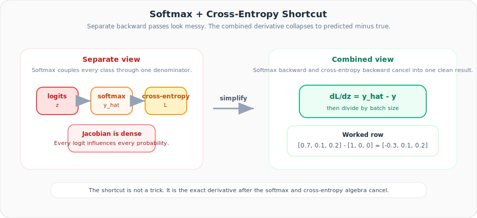

# Neural Networks from Scratch, Part 19: Softmax Derivatives and the Combined Backward Pass

*The softmax function couples all outputs through a shared denominator. This lecture shows why that's tricky, then reveals a beautiful shortcut.*

The softmax function is the last mathematical hurdle before we can chain everything together. Unlike ReLU (element-wise), softmax couples **all outputs through a shared denominator**. This lecture shows why that's tricky, and then reveals a beautiful shortcut.

---

## 1. Why Softmax Is Different

Recall the softmax output for class $k$:

$$A_k = \frac{e^{Z_k}}{\sum_j e^{Z_j}}$$

$A_1$ depends on $Z_1$, $Z_2$, **and** $Z_3$ (through the denominator). So we'd need a full **Jacobian matrix**, not just a diagonal, to describe $\frac{\partial \mathbf{A}}{\partial \mathbf{Z}}$.

For 3 output neurons, that's a 3×3 Jacobian **per sample**. For a batch of $n$ samples, it's $n$ such matrices. This is Option 1: compute $\frac{\partial L}{\partial \mathbf{A}}$ and $\frac{\partial \mathbf{A}}{\partial \mathbf{Z}}$ separately, then multiply.

---

## 2. Option 2: The Combined Formula (Recommended)

Instead of separating the softmax Jacobian and the cross-entropy gradient, we multiply them symbolically and simplify. The result is remarkably clean:

$$\frac{\partial L}{\partial Z_k} = \hat{y}_k - y_k$$

That's it: **predicted minus true**. All the exponentials, logs, and quotient-rule terms cancel.

> This is why frameworks combine softmax + cross-entropy into a single layer for the backward pass.

If you want the full cancellation step by step, see the [Softmax Backward Appendix](../../appendix_softmax_combined_backward.md).

### Why the shortcut is not magic

If the true class is $t$, cross-entropy for one sample becomes:

$$L = -\log(\hat{y}_t)$$

Substitute the softmax expression for $\hat{y}_t$ and simplify:

$$L = -z_t + \log\left(\sum_j e^{z_j}\right)$$

Differentiate that expression with respect to each logit $z_k$:

- the first term contributes `-1` only at the true class,
- the second term contributes the softmax probability $\hat{y}_k$ for every class.

Put those together and you get:

$$\frac{\partial L}{\partial z_k} = \hat{y}_k - y_k$$

The appendix shows the full algebra. This section is the bridge so the final formula feels earned rather than magical.

The animation below contrasts the messy separate path with the clean combined result:



---

## 3. Worked Example

Three batches, three output classes:

| Batch | Softmax output $\hat{y}$ | True class | One-hot $y$ |
|-------|--------------------------|------------|-------------|
| 1 | [0.7, 0.1, 0.2] | 0 | [1, 0, 0] |
| 2 | [0.1, 0.5, 0.4] | 1 | [0, 1, 0] |
| 3 | [0.02, 0.9, 0.08] | 1 | [0, 1, 0] |

Apply $\hat{y} - y$ then normalize by $n = 3$:

$$\frac{\partial L}{\partial \mathbf{Z}} = \frac{1}{3}\begin{bmatrix} -0.3 & 0.1 & 0.2 \\ 0.1 & -0.5 & 0.4 \\ 0.02 & -0.1 & 0.08 \end{bmatrix}$$

```python
import numpy as np

softmax_output = np.array([[0.7, 0.1, 0.2],
                            [0.1, 0.5, 0.4],
                            [0.02, 0.9, 0.08]])

y_true = np.array([0, 1, 1])   # class indices

# Combined backward
dinputs = softmax_output.copy()
dinputs[range(len(y_true)), y_true] -= 1   # subtract 1 at true class
dinputs /= len(y_true)                      # normalize

print(dinputs)
```

```
[[-0.1     0.0333  0.0667]
 [ 0.0333 -0.1667  0.1333]
 [ 0.0067 -0.0333  0.0267]]
```

---

## 4. The Combined Class

```python
class Activation_Softmax_Loss_CategoricalCrossentropy:

    def __init__(self):
        self.activation = Activation_Softmax()
        self.loss       = Loss_CategoricalCrossentropy()

    def forward(self, inputs, y_true):
        self.activation.forward(inputs)
        self.output = self.activation.output
        return self.loss.calculate(self.output, y_true)

    def backward(self, dvalues, y_true):
        samples = len(dvalues)

        # Convert one-hot to indices if needed
        if len(y_true.shape) == 2:
            y_true = np.argmax(y_true, axis=1)

        # Start with softmax output (predicted)
        self.dinputs = dvalues.copy()
        # Subtract 1 at the true-class position
        self.dinputs[range(samples), y_true] -= 1
        # Normalize by batch size
        self.dinputs /= samples
```

**Three lines** for the backward pass: compare that with the full Jacobian approach!

---

## 5. Why Normalize by Sample Count?

Same reason as in Part 18: if we sum gradients across all samples during optimization, dividing by $n$ keeps the total gradient magnitude independent of batch size.

---

## 6. Handling Label Formats

| Input format | Example | Action |
|-------------|---------|--------|
| Class indices (1-D) | `[0, 1, 1]` | Use directly |
| One-hot (2-D) | `[[1,0,0],[0,1,0],[0,1,0]]` | Convert via `np.argmax(y_true, axis=1)` |

The code checks `len(y_true.shape)`: if 2, it converts to indices first.

---

## Summary

| Concept | What We Learned |
|---|---|
| Softmax + cross-entropy backward | Simplifies to $\hat{\mathbf{y}} - \mathbf{y}$, normalized by sample count |
| No Jacobian needed | When combining the two, the math cancels beautifully |
| Implementation | Just 3 lines: copy predictions, subtract 1 at true class, divide by $n$ |
| Framework practice | This combined class is what PyTorch and TensorFlow use internally |

---

## What's Next

In **Part 20** we assemble all the building blocks (layers, ReLU, softmax+loss) into a **complete forward and backward pass** on real data.

---

> **Try It Yourself:** Hands-on exercises for this lecture are in [Exercises](../../exercises.md) and [Quizzes](../../quizzes.md).
