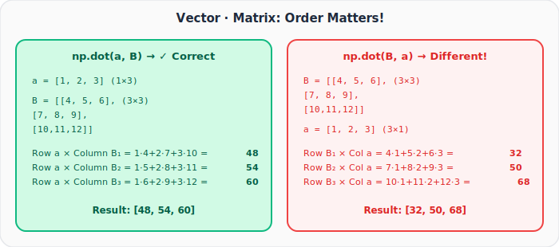
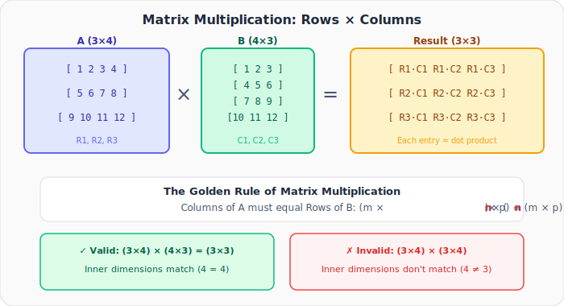
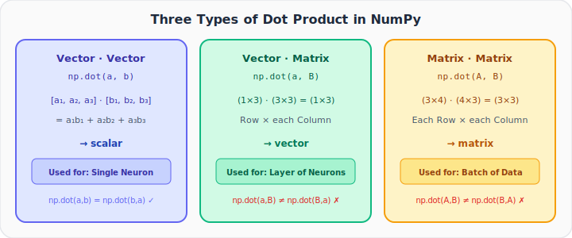
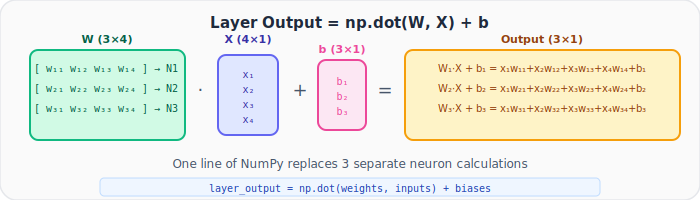
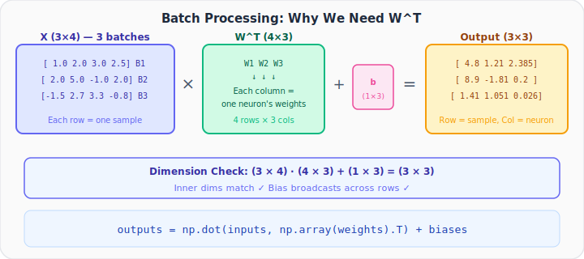

# Neural Networks from Scratch, Part 2: NumPy and the Dot Product

*Mastering `np.dot()`, the single most important operation in neural network math.*

---

## Why This Lecture Matters

In Part 1 we coded neurons and layers using plain Python loops. It worked, but it was **slow** and **verbose**. NumPy's `np.dot()` replaces all of that with a single call, but only if you truly understand what it's doing.

Here's the core confusion: **`np.dot()` behaves differently depending on what you feed it.** Two vectors, a vector and a matrix, or two matrices. Students who don't understand this distinction end up with mysterious shape errors they can't debug.

This post will make you comfortable with all three cases and show exactly how they map to neurons, layers, and batches.

---

## 1. The Dot Product Between Two Vectors

The simplest case. Given two vectors of the same length:

$$\vec{a} \cdot \vec{b} = a_1 b_1 + a_2 b_2 + a_3 b_3$$

This is exactly the **weighted sum** a neuron computes (minus the bias).

```python
import numpy as np

a = [1, 2, 3]
b = [4, 5, 6]

result = np.dot(a, b)
print(result)  # 1*4 + 2*5 + 3*6 = 32
```

**Output:**
```
32
```

### Key property: order doesn't matter for vectors

```python
print(np.dot(a, b))  # 32
print(np.dot(b, a))  # 32  ← same!
```

$$\vec{a} \cdot \vec{b} = \vec{b} \cdot \vec{a}$$

> This is **only** true for vector-vector dot products. It breaks for everything else.

---

## 2. The Dot Product Between a Vector and a Matrix

This is where students get confused. When you write `np.dot(a, B)` where `B` is a matrix, NumPy treats it as **matrix multiplication**.

### Think of it as: rows of the first × columns of the second



```python
a = np.array([1, 2, 3])           # shape (3,) → treated as (1×3)
B = np.array([[4, 5, 6],
              [7, 8, 9],
              [10, 11, 12]])       # shape (3×3)

print(np.dot(a, B))  # [48, 54, 60]
print(np.dot(B, a))  # [32, 50, 68]  ← DIFFERENT!
```

### `np.dot(a, B)` (vector first)

Python treats `a` as a **(1×3)** row matrix. The rule: **rows of first × columns of second**.

| Computation | Result |
|------------|--------|
| Row `a` · Column B₁ | $1 \times 4 + 2 \times 7 + 3 \times 10 = 48$ |
| Row `a` · Column B₂ | $1 \times 5 + 2 \times 8 + 3 \times 11 = 54$ |
| Row `a` · Column B₃ | $1 \times 6 + 2 \times 9 + 3 \times 12 = 60$ |

Result: `[48, 54, 60]`

### `np.dot(B, a)` (matrix first)

Python treats `a` as a **(3×1)** column matrix. Now **rows of B × column `a`**:

| Computation | Result |
|------------|--------|
| Row B₁ · Column `a` | $4 \times 1 + 5 \times 2 + 6 \times 3 = 32$ |
| Row B₂ · Column `a` | $7 \times 1 + 8 \times 2 + 9 \times 3 = 50$ |
| Row B₃ · Column `a` | $10 \times 1 + 11 \times 2 + 12 \times 3 = 68$ |

Result: `[32, 50, 68]`

> **Critical takeaway:** `np.dot(a, B) ≠ np.dot(B, a)` when a matrix is involved. The order decides which elements get multiplied together.

---

## 3. The Dot Product Between Two Matrices



When both inputs are matrices, `np.dot(A, B)` is standard matrix multiplication.

### The Golden Rule

$$(m \times \mathbf{n}) \cdot (\mathbf{n} \times p) = (m \times p)$$

The **inner dimensions** must match. The **outer dimensions** give the result shape.

```python
A = np.array([[1, 2, 3, 4],
              [5, 6, 7, 8],
              [9, 10, 11, 12]])   # (3×4)

B = np.array([[1, 2, 3],
              [4, 5, 6],
              [7, 8, 9],
              [10, 11, 12]])      # (4×3)

result = np.dot(A, B)            # (3×4)·(4×3) = (3×3)
print(result)
```

**Output:**
```
[[ 70  80  90]
 [158 184 210]
 [246 288 330]]
```

Each entry `result[i][j]` is the dot product of Row `i` of A with Column `j` of B.

---

## 4. Three Types, One Command



| Operation | Input Shapes | Result Shape | Use Case |
|-----------|:---:|:---:|-----------|
| Vector · Vector | (n,) · (n,) | scalar | Single neuron |
| Matrix · Vector | (m×n) · (n,) | (m,) | Layer of neurons |
| Matrix · Matrix | (m×n) · (n×p) | (m×p) | Batch of data through a layer |

---

## 5. Coding a Single Neuron with NumPy

A neuron with 4 inputs computes: $\text{output} = \vec{w} \cdot \vec{x} + b$

This is a **vector · vector** dot product:

```python
import numpy as np

inputs = [1.0, 2.0, 3.0, 2.5]
weights = [0.2, 0.8, -0.5, 1.0]
bias = 2.0

output = np.dot(weights, inputs) + bias
print(output)
```

**Output:**
```
4.8
```

Since both are vectors, `np.dot(weights, inputs)` = `np.dot(inputs, weights)`. Either order works here.

---

## 6. Coding a Layer with NumPy

A layer of 3 neurons, each with 4 inputs. The weight matrix W has **one row per neuron**:



```python
inputs = [1.0, 2.0, 3.0, 2.5]

weights = [[0.2, 0.8, -0.5, 1],       # Neuron 1
           [0.5, -0.91, 0.26, -0.5],   # Neuron 2
           [-0.26, -0.27, 0.17, 0.87]] # Neuron 3

biases = [2.0, 3.0, 0.5]

layer_output = np.dot(weights, inputs) + biases
print(layer_output)
```

**Output:**
```
[4.8  1.21 2.385]
```

### What just happened?

`np.dot(weights, inputs)` is a **(3×4) · (4,)** operation, meaning matrix times vector. NumPy computes:

- Row 1 (Neuron 1 weights) · inputs → 2.8
- Row 2 (Neuron 2 weights) · inputs → -1.79
- Row 3 (Neuron 3 weights) · inputs → 1.885

Then biases are added element-wise: `[2.8+2, -1.79+3, 1.885+0.5]` = `[4.8, 1.21, 2.385]`

### Why not `np.dot(inputs, weights)`?

That would attempt **(4,) · (3×4)** where the inner dimensions are 4 and 3, which **don't match**. You'd get an error. This is why the order matters.

---

## 7. Coding a Batch of Data

In practice, we process **multiple samples at once**. Three input samples with 4 features each:



```python
inputs = [[1.0, 2.0, 3.0, 2.5],     # Sample 1
          [2.0, 5.0, -1.0, 2.0],     # Sample 2
          [-1.5, 2.7, 3.3, -0.8]]    # Sample 3

weights = [[0.2, 0.8, -0.5, 1],
           [0.5, -0.91, 0.26, -0.5],
           [-0.26, -0.27, 0.17, 0.87]]

biases = [2.0, 3.0, 0.5]

outputs = np.dot(inputs, np.array(weights).T) + biases
print(outputs)
```

**Output:**
```
[[ 4.8    1.21   2.385]
 [ 8.9   -1.81   0.2  ]
 [ 1.41   1.051  0.026]]
```

### Why do we need the transpose?

- `inputs` is **(3×4)**: 3 samples, 4 features each
- `weights` is **(3×4)**: 3 neurons, 4 weights each
- **(3×4) · (3×4)** → inner dimensions are 4 and 3, which **doesn't match!**

Taking `weights.T` gives us **(4×3)**, so:

$$(3 \times 4) \cdot (4 \times 3) = (3 \times 3) \quad \checkmark$$

Each **row** of the result = one sample's output across all neurons.
Each **column** of the result = one neuron's output across all samples.

> **Note:** We use `np.array(weights).T` because Python lists don't have a `.T` property. We must first convert to a NumPy array.

### See the transpose happen



The animation loops through the exact beginner mistake here: first the batch matrix and the weight matrix have incompatible inner dimensions, then the transpose flips the weights into the shape that makes the multiplication valid.

### The two equivalent forms

$$\text{np.dot}(W, X) + b \quad = \quad \text{np.dot}(X, W^T) + b$$

- First form: used for **single sample** (W is matrix, X is vector)
- Second form: used for **batch of samples** (both are matrices)

---

## 8. Common Mistakes and How to Avoid Them

| Mistake | What happens | Fix |
|---------|-------------|-----|
| `np.dot(inputs, weights)` for a layer | Shape mismatch error | Use `np.dot(weights, inputs)` or `np.dot(inputs, weights.T)` |
| Forgetting `.T` on weights for batches | Shape mismatch error | Always transpose weights when inputs come first |
| Forgetting `np.array()` before `.T` | `AttributeError` on list | Convert to array: `np.array(weights).T` |
| Confusing row-per-neuron vs column-per-neuron | Wrong outputs | Convention: each **row** of W = one neuron's weights |

---

## Summary

| Concept | What We Learned |
|---------|----------------|
| **Vector · Vector** | Multiply element-wise and sum → scalar. Order doesn't matter. |
| **Matrix · Vector** | Each row of matrix dotted with vector → vector. Order matters! |
| **Matrix · Matrix** | Each row × each column → matrix. Inner dimensions must match. |
| **Single neuron** | `np.dot(weights, inputs) + bias` |
| **Layer** | `np.dot(weights, inputs) + biases` where W is (neurons × inputs) |
| **Batch** | `np.dot(inputs, weights.T) + biases` since we need the transpose |

### The One Rule to Remember

> **Rows of the first matrix are multiplied with columns of the second matrix.** Everything in NumPy follows from this.

---

## What's Next

In **Part 3**, we'll:
- Build the `Layer_Dense` **class** in Python using OOP
- Generate non-linear **spiral data** for training
- Stack multiple layers together to form a real network

---

> **Try It Yourself:** Hands-on exercises for this lecture are in [Exercises](../../exercises.md) and [Quizzes](../../quizzes.md).
