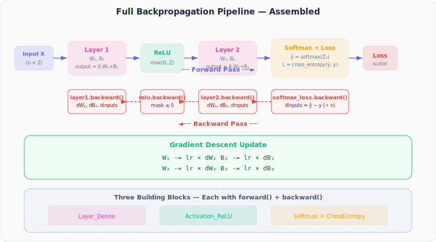

# Neural Networks from Scratch, Part 20: Assembling Full Backpropagation

*Every piece clicks into place: dense layers, ReLU, and softmax+loss form a complete forward-and-backward pipeline.*

We have spent seven lectures deriving gradients for individual building blocks: dense layers, ReLU, softmax combined with cross-entropy loss. Now it is time to **assemble them into one pipeline** and see how a complete forward-and-backward pass works end to end.

This is the "Avengers Assemble" moment: every piece clicks into place.

---

## 1. The Network We Are Building

We will use the network we have been building throughout this series:

| Property | Value |
|---|---|
| **Inputs** | 2 features (spiral dataset) |
| **Hidden layer** | 3 neurons, ReLU activation |
| **Output layer** | 3 neurons, Softmax activation |
| **Loss** | Categorical Cross-Entropy |
| **Classes** | 3 (spiral arms) |

The complete chain looks like this:



---

## 2. The Three Building Blocks

Every component in our network is represented by one of exactly **three classes**, each with a `forward()` method and a `backward()` method.

### 2.1. `Layer_Dense`

```python
class Layer_Dense:
    def __init__(self, n_inputs, n_neurons):
        self.weights = 0.01 * np.random.randn(n_inputs, n_neurons)
        self.biases  = np.zeros((1, n_neurons))

    def forward(self, inputs):
        self.inputs = inputs                          # save for backward
        self.output = np.dot(inputs, self.weights) + self.biases

    def backward(self, dvalues):
        self.dweights = np.dot(self.inputs.T, dvalues)   # X^T · dL/dZ
        self.dbiases  = np.sum(dvalues, axis=0, keepdims=True)
        self.dinputs  = np.dot(dvalues, self.weights.T)   # dL/dZ · W^T
```

**Forward** computes the weighted sum. **Backward** computes three things:

| Gradient | Formula | Purpose |
|---|---|---|
| `dweights` | $X^\top \cdot \frac{\partial L}{\partial Z}$ | Update weights |
| `dbiases` | $\sum \frac{\partial L}{\partial Z}$ (over batch) | Update biases |
| `dinputs` | $\frac{\partial L}{\partial Z} \cdot W^\top$ | Pass to previous layer |

### 2.2. `Activation_ReLU`

```python
class Activation_ReLU:
    def forward(self, inputs):
        self.inputs = inputs
        self.output = np.maximum(0, inputs)

    def backward(self, dvalues):
        self.dinputs = dvalues.copy()
        self.dinputs[self.inputs <= 0] = 0    # zero where input was ≤ 0
```

ReLU's backward is beautifully simple: copy the incoming gradient, then **set to zero** everywhere the original input was non-positive. The gradient either flows through unchanged or is blocked entirely.

### 2.3. `Activation_Softmax_Loss_CategoricalCrossentropy`

```python
class Activation_Softmax_Loss_CategoricalCrossentropy:
    def __init__(self):
        self.activation = Activation_Softmax()
        self.loss       = Loss_CategoricalCrossentropy()

    def forward(self, inputs, y_true):
        self.activation.forward(inputs)
        self.output = self.activation.output
        return self.loss.calculate(self.output, y_true)

    def backward(self, dvalues, y_true):
        samples = len(dvalues)

        # Convert one-hot to indices if needed
        if len(y_true.shape) == 2:
            y_true = np.argmax(y_true, axis=1)

        self.dinputs = dvalues.copy()
        self.dinputs[range(samples), y_true] -= 1   # ŷ − y
        self.dinputs /= samples                      # normalize
```

The combined backward implements the elegant shortcut we derived in Part 19:

$$\frac{\partial L}{\partial Z} = \hat{y} - y$$

Just subtract 1 from the predicted probability at the true class index, then divide by the number of samples.

---

## 3. The Forward Pass (Top to Bottom)

With our objects instantiated, the forward pass chains each output into the next input:

```python
# Instantiate
layer1      = Layer_Dense(2, 3)        # 2 inputs → 3 neurons
activation1 = Activation_ReLU()
layer2      = Layer_Dense(3, 3)        # 3 inputs → 3 neurons
loss_activation = Activation_Softmax_Loss_CategoricalCrossentropy()

# Forward pass
layer1.forward(X)                      # X → Z₁
activation1.forward(layer1.output)     # Z₁ → A₁ (ReLU)
layer2.forward(activation1.output)     # A₁ → Z₂
loss = loss_activation.forward(layer2.output, y)  # Z₂ → ŷ → Loss
```

Each `.forward()` saves its inputs internally. This is critical because the backward pass will need them.

---

## 4. The Backward Pass (Bottom to Top)

The backward pass walks the chain **in reverse**, passing each component's `dinputs` as the `dvalues` for the previous component:

```python
# Backward pass
loss_activation.backward(loss_activation.output, y)    # ŷ → dL/dZ₂
layer2.backward(loss_activation.dinputs)                # dL/dZ₂ → dW₂, dB₂, dL/dA₁
activation1.backward(layer2.dinputs)                    # dL/dA₁ → dL/dZ₁ (zero mask)
layer1.backward(activation1.dinputs)                    # dL/dZ₁ → dW₁, dB₁, dL/dX
```

### The Four Backward Jumps

| Step | Component | Input | Produces |
|---|---|---|---|
| 1 | `loss_activation.backward()` | predicted ŷ, true y | `dinputs` = $\hat{y} - y$ (normalized) |
| 2 | `layer2.backward()` | `loss_activation.dinputs` | `dweights`, `dbiases`, `dinputs` |
| 3 | `activation1.backward()` | `layer2.dinputs` | `dinputs` (zeroed where input ≤ 0) |
| 4 | `layer1.backward()` | `activation1.dinputs` | `dweights`, `dbiases`, `dinputs` |

After this, every trainable parameter in the network has its gradient computed:
- `layer1.dweights`, `layer1.dbiases`
- `layer2.dweights`, `layer2.dbiases`

---

## 5. Gradient Descent Update

With all gradients in hand, we nudge each parameter in the direction that reduces the loss:

```python
learning_rate = 0.01

layer1.weights -= learning_rate * layer1.dweights
layer1.biases  -= learning_rate * layer1.dbiases
layer2.weights -= learning_rate * layer2.dweights
layer2.biases  -= learning_rate * layer2.dbiases
```

Repeat (forward → backward → update) for many iterations, and the network learns.

---

## 6. Why `dinputs` Is the Glue

The key insight that makes this pipeline work is the `dinputs` attribute. Every component computes it during its backward pass, and it becomes the `dvalues` input for the previous component:

```
loss_activation.dinputs  →  layer2.backward(dvalues)
layer2.dinputs           →  activation1.backward(dvalues)
activation1.dinputs      →  layer1.backward(dvalues)
```

This is the **chain rule in action**: each component only needs to know its local gradient and the gradient flowing in from the right. It does not need to know anything about the rest of the network.

---

## 7. Summary: The Complete Protocol

Every neural network, no matter how deep, follows this exact protocol:

1. **Forward pass**: walk left to right, each component computes `output` from `inputs`
2. **Backward pass**: walk right to left, each component computes `dinputs` from `dvalues`
3. **Update**: adjust weights and biases using gradients and a learning rate
4. **Repeat**

The building blocks are modular: you can stack as many layers and activations as you want. As long as each block has `forward()` and `backward()`, it plugs in seamlessly.

| Building Block | forward() | backward() | Trainable? |
|---|---|---|---|
| `Layer_Dense` | $Z = X \cdot W + B$ | dW, dB, dX | ✅ |
| `Activation_ReLU` | $\max(0, Z)$ | copy + zero mask | ❌ |
| `Softmax + CE Loss` | $\hat{y}$, then $L$ | $\hat{y} - y$ | ❌ |

---

## Summary

| Concept | What We Learned |
|---|---|
| Three classes | Dense layer, ReLU, and combined softmax+loss are all you need for classification |
| Symmetric interface | Each class has matching forward/backward methods |
| Chain rule in action | The backward pass chains `dinputs` → `dvalues` in reverse order |
| Gradient readiness | After backward, every `dweights` and `dbiases` is ready for gradient descent |
| Modular design | Scales to arbitrarily deep networks |

---

## What's Next

In **Part 21**, we will take this assembled pipeline and turn it into a **complete, runnable training loop** on the spiral dataset, watching the loss drop and accuracy climb in real time.

---

> **Try It Yourself:** Hands-on exercises for this lecture are in [Exercises](../../exercises.md) and [Quizzes](../../quizzes.md).
