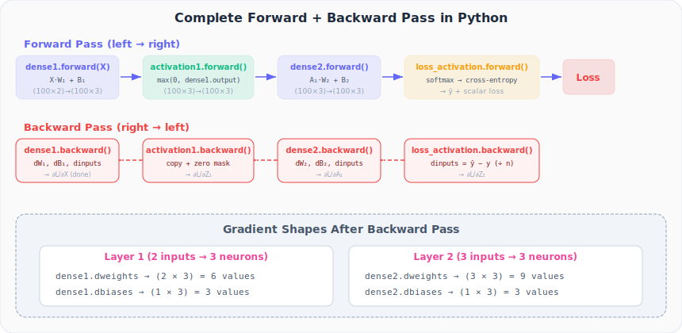

# Neural Networks from Scratch, Part 21: Coding Full Backpropagation

*We run one full forward pass and one full backward pass on the spiral dataset, inspecting every gradient that comes out.*

In Part 20 we assembled the three building blocks on the whiteboard. Now we put them into **actual Python code**, run one full forward pass and one full backward pass on the spiral dataset, and inspect the gradients that come out the other side.

---

## 1. The Dataset

We use the **spiral dataset**: 100 data points, 2 features (X1, X2), 3 classes (red, green, blue). Each class forms one arm of a spiral, a dataset that is *not* linearly separable, which is why we need a hidden layer.

```python
import numpy as np
from nnfs.datasets import spiral_data

X, y = spiral_data(samples=100, classes=3)  # X: (300, 2), y: (300,)
```

---

## 2. The Three Classes (Recap)

These are the classes we built across Parts 16–19. Here they are in one place:

### Layer_Dense

```python
class Layer_Dense:
    def __init__(self, n_inputs, n_neurons):
        self.weights = 0.01 * np.random.randn(n_inputs, n_neurons)
        self.biases  = np.zeros((1, n_neurons))

    def forward(self, inputs):
        self.inputs = inputs
        self.output = np.dot(inputs, self.weights) + self.biases

    def backward(self, dvalues):
        self.dweights = np.dot(self.inputs.T, dvalues)
        self.dbiases  = np.sum(dvalues, axis=0, keepdims=True)
        self.dinputs  = np.dot(dvalues, self.weights.T)
```

### Activation_ReLU

```python
class Activation_ReLU:
    def forward(self, inputs):
        self.inputs = inputs
        self.output = np.maximum(0, inputs)

    def backward(self, dvalues):
        self.dinputs = dvalues.copy()
        self.dinputs[self.inputs <= 0] = 0
```

### Activation_Softmax_Loss_CategoricalCrossentropy

```python
class Activation_Softmax_Loss_CategoricalCrossentropy:
    def __init__(self):
        self.activation = Activation_Softmax()
        self.loss       = Loss_CategoricalCrossentropy()

    def forward(self, inputs, y_true):
        self.activation.forward(inputs)
        self.output = self.activation.output
        return self.loss.calculate(self.output, y_true)

    def backward(self, dvalues, y_true):
        samples = len(dvalues)
        if len(y_true.shape) == 2:
            y_true = np.argmax(y_true, axis=1)
        self.dinputs = dvalues.copy()
        self.dinputs[range(samples), y_true] -= 1
        self.dinputs /= samples
```

---

## 3. Instantiate the Network

Keep this architecture in mind:

> **Input (2)** → Layer 1 (3 neurons) → ReLU → Layer 2 (3 neurons) → Softmax + Loss

```python
dense1          = Layer_Dense(2, 3)
activation1     = Activation_ReLU()
dense2          = Layer_Dense(3, 3)
loss_activation = Activation_Softmax_Loss_CategoricalCrossentropy()
```

When `Layer_Dense(2, 3)` is instantiated, it creates a **(2 × 3) weight matrix** and a **(1 × 3) bias vector**, initialized from a Gaussian distribution and zeros respectively.

---

## 4. The Forward Pass

Chain each component's output into the next component's input:

```python
# Forward pass
dense1.forward(X)                              # (300,2) → (300,3)
activation1.forward(dense1.output)             # ReLU
dense2.forward(activation1.output)             # (300,3) → (300,3)
loss = loss_activation.forward(dense2.output, y)  # → predictions + loss
```

We can inspect the first 5 predictions and the loss:

```python
print(loss_activation.output[:5])   # softmax probabilities
print('Loss:', loss)                # scalar cross-entropy loss
```

**Output:**
```
[[0.33333 0.33333 0.33334]
 [0.33332 0.33333 0.33335]
 [0.33332 0.33334 0.33334]
 [0.33333 0.33333 0.33334]
 [0.33334 0.33332 0.33334]]
Loss: 1.0986
```

With random weights, the loss is ≈ 1.099, which is exactly $-\ln(1/3)$, the theoretical baseline for 3-class random guessing. Accuracy will be around 33%. This makes sense: the network hasn't learned anything yet, so softmax produces roughly equal probabilities for all classes.

> **Sanity check:** If your untrained loss is significantly different from $\approx 1.099$ for a 3-class problem, something may be wrong with your loss implementation.

---

## 5. The Backward Pass

Walk the chain in **reverse order**, passing each component's `dinputs` as the `dvalues` for the previous component:

```python
# Backward pass
loss_activation.backward(loss_activation.output, y)
dense2.backward(loss_activation.dinputs)
activation1.backward(dense2.dinputs)
dense1.backward(activation1.dinputs)
```



Each line computes:

| Line | Computes | Stores |
|---|---|---|
| `loss_activation.backward(...)` | $\hat{y} - y$ (normalized) | `.dinputs` = ∂L/∂Z₂ |
| `dense2.backward(...)` | Weight, bias, input grads | `.dweights`, `.dbiases`, `.dinputs` |
| `activation1.backward(...)` | ReLU mask | `.dinputs` = ∂L/∂Z₁ |
| `dense1.backward(...)` | Weight, bias, input grads | `.dweights`, `.dbiases`, `.dinputs` |

---

## 6. Inspecting the Gradients

After the backward pass, every layer has its gradients stored:

```python
print(dense1.dweights)   # shape: (2, 3) — 6 weight gradients
print(dense1.dbiases)    # shape: (1, 3) — 3 bias gradients
print(dense2.dweights)   # shape: (3, 3) — 9 weight gradients
print(dense2.dbiases)    # shape: (1, 3) — 3 bias gradients
```

**Output (example; exact values depend on random seed):**
```
dense1.dweights:
[[ 0.00093  -0.00031  -0.00062]
 [-0.00184   0.00098   0.00086]]

dense1.dbiases:
[[ 0.00017  -0.00042   0.00025]]

dense2.dweights:
[[-0.00109   0.00030   0.00079]
 [-0.00022  -0.00017   0.00039]
 [-0.00041   0.00028   0.00013]]

dense2.dbiases:
[[-0.00019   0.00010   0.00009]]
```

Notice the gradients are small (order of $10^{-3}$ to $10^{-4}$). This is expected with our `0.01 * randn` weight initialization. Also notice that each gradient array has the **same shape as its corresponding parameter**, a critical sanity check you should always verify.

| Layer | Weights | Biases | Total Parameters |
|---|---|---|---|
| Layer 1 (2 → 3) | 2 × 3 = 6 | 3 | 9 |
| Layer 2 (3 → 3) | 3 × 3 = 9 | 3 | 12 |
| **Total** | | | **21** |

Gradient shapes always match parameter shapes. This is a useful sanity check.

---

## 7. The Complete Script

Putting it all together in **~15 lines** of operational code:

```python
# Network
dense1          = Layer_Dense(2, 3)
activation1     = Activation_ReLU()
dense2          = Layer_Dense(3, 3)
loss_activation = Activation_Softmax_Loss_CategoricalCrossentropy()

# Forward pass
dense1.forward(X)
activation1.forward(dense1.output)
dense2.forward(activation1.output)
loss = loss_activation.forward(dense2.output, y)

# Backward pass
loss_activation.backward(loss_activation.output, y)
dense2.backward(loss_activation.dinputs)
activation1.backward(dense2.dinputs)
dense1.backward(activation1.dinputs)

# Gradients are now in: dense1.dweights, dense1.dbiases,
#                        dense2.dweights, dense2.dbiases
```

That's it: the entire forward and backward pass. The modularity of classes means this code stays short no matter how deep the network grows. Add more layers? Just add more `.forward()` and `.backward()` calls.

---

## Summary

| Concept | What We Learned |
|---|---|
| Spiral dataset | 3 classes, 2 features: simple to visualize, hard to classify |
| Minimal code | Three class definitions + ~15 lines = one full forward + backward pass |
| Gradient shapes | Always match parameter shapes; use this as a debugging check |
| Reverse chaining | The backward pass is the forward pass in reverse, chaining `dinputs` → `dvalues` |
| Missing piece | An update rule to actually change the weights (gradient descent) |

---

## What's Next

In **Part 22**, we implement the **gradient descent optimizer**: the update rule that takes these gradients and uses them to nudge weights toward lower loss. We will also explore how the learning rate affects convergence and see why basic gradient descent sometimes gets stuck.

---

> **Try It Yourself:** Hands-on exercises for this lecture are in [Exercises](../../exercises.md) and [Quizzes](../../quizzes.md).
