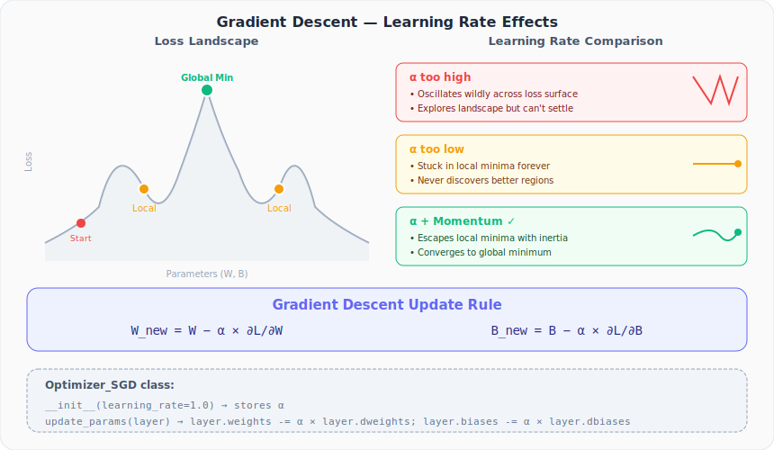
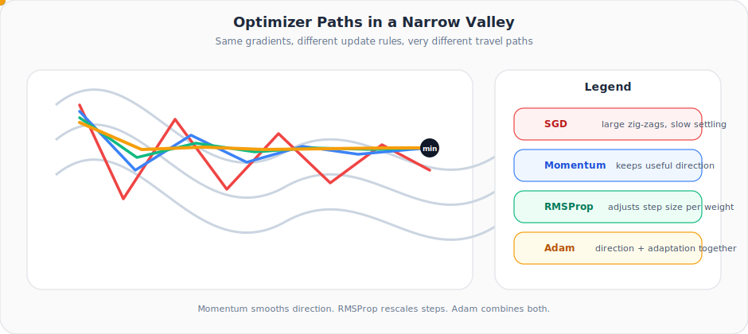

# Neural Networks from Scratch, Part 22: Gradient Descent Optimizer

*We build the simplest optimizer: subtract learning rate times gradient, and watch it work (and struggle) on the spiral dataset.*

We can compute gradients for every weight and bias in the network. Now what? We need an **update rule**, a method that uses those gradients to adjust parameters so the loss goes down. The simplest such rule is **gradient descent**.

---

## 1. The Core Idea

The gradient of the loss with respect to a parameter tells us the direction of steepest **ascent**. To minimize the loss, we move in the **opposite** direction:

$$W_{\text{new}} = W - \alpha \cdot \frac{\partial L}{\partial W}$$

$$B_{\text{new}} = B - \alpha \cdot \frac{\partial L}{\partial B}$$

where $\alpha$ is the **learning rate** — the only hyperparameter in basic gradient descent.

This update is applied to **every** weight and bias in **every** layer, after each forward + backward pass.

### One update in plain words

Backpropagation computes and stores the gradients for us in `dweights` and `dbiases`. The optimizer does not discover those gradients; it simply **reads them** and applies the subtraction rule above.

That is why the split between layers and optimizers is so clean:

- layers know how to compute gradients,
- optimizers know how to turn gradients into parameter updates.



---

## 2. The Optimizer Class

We wrap this logic in a dedicated class:

```python
class Optimizer_SGD:
    def __init__(self, learning_rate=1.0):
        self.learning_rate = learning_rate

    def update_params(self, layer):
        layer.weights -= self.learning_rate * layer.dweights
        layer.biases  -= self.learning_rate * layer.dbiases
```

The `update_params` method accesses `layer.dweights` and `layer.dbiases`, the gradients that the `backward()` method stored during backpropagation. No extra computation needed.

---

## 3. The Training Loop

We now have everything for a full training loop: forward pass → backward pass → update. Repeat for many iterations (epochs):

```python
# Create network
dense1          = Layer_Dense(2, 64)
activation1     = Activation_ReLU()
dense2          = Layer_Dense(64, 3)
loss_activation = Activation_Softmax_Loss_CategoricalCrossentropy()

# Create optimizer
optimizer = Optimizer_SGD(learning_rate=1.0)

# Training loop
for epoch in range(10001):
    # Forward pass
    dense1.forward(X)
    activation1.forward(dense1.output)
    dense2.forward(activation1.output)
    loss = loss_activation.forward(dense2.output, y)

    # Accuracy
    predictions = np.argmax(loss_activation.output, axis=1)
    accuracy = np.mean(predictions == y)

    # Backward pass
    loss_activation.backward(loss_activation.output, y)
    dense2.backward(loss_activation.dinputs)
    activation1.backward(dense2.dinputs)
    dense1.backward(activation1.dinputs)

    # Update weights and biases
    optimizer.update_params(dense1)
    optimizer.update_params(dense2)

    if epoch % 100 == 0:
        print(f'Epoch {epoch}, Loss: {loss:.4f}, Accuracy: {accuracy:.4f}')
```

### Epoch vs iteration

In this lecture we are using the **full dataset in one shot**, so one epoch also means one parameter update. In mini-batch training those two ideas split apart:

- **iteration** = one forward/backward/update on one batch,
- **epoch** = one full pass through the whole training set.

> **Note:** We use 64 neurons in the hidden layer here (instead of 3 in the whiteboard examples) for better capacity on the spiral dataset.

---

## 4. What Happens When We Run It

With `learning_rate = 1.0` and 10,000 epochs:

| Epoch | Loss | Accuracy |
|---|---|---|
| 0 | ~1.10 | 0.33 (random guessing) |
| 100 | ~0.95 | ~0.45 |
| 1000 | ~0.72 | ~0.60 |
| 5000 | ~0.68 | ~0.67 |
| 10000 | ~0.68 | ~0.67 |

The loss **decreases** initially: gradient descent is working. But it **stagnates** around 0.68, and accuracy plateaus at ~67%. We are likely stuck in a **local minimum**.

---

## 5. The Learning Rate Problem

### Too high (alpha is too large)

The optimizer **oscillates** wildly, bouncing across the loss landscape. It explores many regions but cannot settle into a minimum.

### Too low (alpha is too small)

The optimizer moves cautiously, so the loss may decrease, but progress becomes painfully slow and the model can stall in a mediocre region long before it finds a better one.

### The dilemma

| Learning Rate | Explores? | Converges? | Risk |
|---|---|---|---|
| High | ✅ Yes | ❌ No — oscillations | Never settles |
| Low | ❌ No | ✅ Yes — but to local min | Never escapes |

> **Practical advice:** If the loss jumps up and down or gets worse, your learning rate is probably too high. If the loss barely changes for long stretches, it may be too low. Part 23 gives us a better answer than manual guessing: learning-rate decay.



---

## 6. Local Minima vs Global Minima

Neural network loss landscapes are **high-dimensional** and highly non-convex. They contain many local minima — points that are the lowest in a small neighborhood but not globally optimal.

- **Local minimum**: lowest in a nearby region; gradient descent stops here
- **Global minimum**: lowest across the entire loss surface; the ideal goal

Basic gradient descent has no strong mechanism for pushing through shallow traps, flat plateaus, or sharp zig-zags once updates become small. In practice it often stalls in a poor region even when the true best region lies somewhere else.

---

## 7. Preview: Momentum

The next idea is to give gradient descent **inertia**. If we are rolling downhill and hit a small valley, momentum can help us roll *through* it instead of immediately settling.

With basic gradient descent alone, the spiral dataset classification looks poor — many points are misclassified and the decision boundaries are crude. With **momentum** (covered in Part 24), the path is usually smoother and reaches a much better minimum on this dataset.

Momentum does **not** guarantee the global minimum. What it does is reduce oscillation and preserve useful directional movement long enough to improve the search.

This is why we will spend the next several lectures on optimizer improvements:

| Lecture | Technique | Key Idea |
|---|---|---|
| **22** (this) | Gradient Descent | Move opposite to gradient |
| **23** | Learning Rate Decay | Reduce α over time |
| **24** | Momentum | Inertia to escape local minima |
| **25** | AdaGrad | Per-parameter adaptive rates |
| **26** | RMSProp | Decaying average of squared grads |
| **27** | Adam | Momentum + RMSProp combined |

---

## Summary

| Concept | What We Learned |
|---|---|
| Gradient descent | $W \leftarrow W - \alpha \cdot \nabla_W L$: subtract learning rate times gradient |
| Optimizer class | Just two methods: `__init__` (store α) and `update_params` (apply rule) |
| Learning rate | Too high causes oscillation, too low causes entrapment |
| Local minima | Basic gradient descent gets stuck on the spiral dataset |
| Momentum preview | Adding inertia helps move through shallow traps and damp oscillations |

---

## What's Next

In **Part 23**, we introduce **learning rate decay**, a technique that starts with a high learning rate for exploration and gradually reduces it for convergence.

---

> **Try It Yourself:** Hands-on exercises for this lecture are in [Exercises](../../exercises.md) and [Quizzes](../../quizzes.md).
