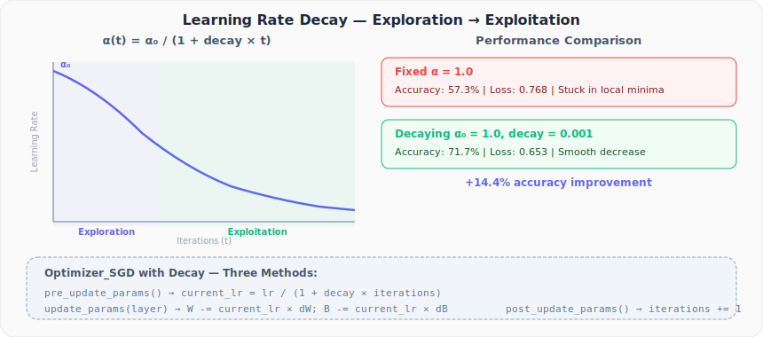

# Neural Networks from Scratch, Part 23: Learning Rate Decay

*Start high for exploration, shrink over time for convergence. A simple schedule that boosts accuracy by 14%.*

In Part 22 we hit a wall: basic gradient descent with a fixed learning rate stagnated at ~57% accuracy on the spiral dataset. The learning rate was either too high (oscillations) or too low (trapped in a local minimum). The solution is simple: **start high and decay over time**.

---

## 1. The Exploration–Exploitation Dilemma

A fixed learning rate forces you to choose:

| Fixed α | Explores? | Converges? |
|---|---|---|
| Large | ✅ sees the whole landscape | ❌ bounces forever |
| Small | ❌ stuck in first valley | ✅ converges — to a bad spot |

What we actually want is **both**: explore early, exploit later. Start with a high step size to discover where the good minima are, then shrink the step size to settle into one.

---

## 2. The Decay Formula

$$\alpha(t) = \frac{\alpha_0}{1 + \text{decay} \times t}$$

- $\alpha_0$: initial learning rate (e.g. 1.0)
- $\text{decay}$: controls how fast α shrinks (typically ~0.001)
- $t$: current iteration number



### Example: α₀ = 1.0, decay = 0.1

| Iteration | α(t) |
|---|---|
| 0 | 1.000 |
| 1 | 0.909 |
| 2 | 0.833 |
| 5 | 0.667 |
| 10 | 0.500 |

With `decay = 0.1`, the learning rate halves in just 10 iterations, too aggressive for most problems. A decay of **0.001** is more practical: it takes 1,000 iterations to halve the rate.

---

## 3. Updated Optimizer Class

We add three methods to our optimizer: one to update the learning rate before each step, one to apply the update, and one to increment the iteration counter after:

```python
class Optimizer_SGD:
    def __init__(self, learning_rate=1.0, decay=0.0):
        self.learning_rate = learning_rate
        self.current_learning_rate = learning_rate
        self.decay = decay
        self.iterations = 0

    def pre_update_params(self):
        if self.decay:
            self.current_learning_rate = self.learning_rate / \
                (1.0 + self.decay * self.iterations)

    def update_params(self, layer):
        layer.weights -= self.current_learning_rate * layer.dweights
        layer.biases  -= self.current_learning_rate * layer.dbiases

    def post_update_params(self):
        self.iterations += 1
```

---

## 4. The Training Loop with Decay

```python
optimizer = Optimizer_SGD(learning_rate=1.0, decay=1e-3)

for epoch in range(10001):
    # Forward pass
    dense1.forward(X)
    activation1.forward(dense1.output)
    dense2.forward(activation1.output)
    loss = loss_activation.forward(dense2.output, y)

    # Accuracy
    predictions = np.argmax(loss_activation.output, axis=1)
    accuracy = np.mean(predictions == y)

    # Backward pass
    loss_activation.backward(loss_activation.output, y)
    dense2.backward(loss_activation.dinputs)
    activation1.backward(dense2.dinputs)
    dense1.backward(activation1.dinputs)

    # Update with decay
    optimizer.pre_update_params()
    optimizer.update_params(dense1)
    optimizer.update_params(dense2)
    optimizer.post_update_params()

    if epoch % 100 == 0:
        print(f'Epoch {epoch}, Loss: {loss:.4f}, '
              f'Acc: {accuracy:.4f}, LR: {optimizer.current_learning_rate:.4f}')
```

---

## 5. Results

| Method | Accuracy | Loss | Learning Rate at End |
|---|---|---|---|
| Fixed α = 1.0 | 57.3% | 0.768 | 1.0 |
| **Decay**, α₀ = 1.0, decay = 0.001 | **71.7%** | **0.653** | ~0.1 |

Key observations:

- The loss **decreases smoothly** instead of stagnating: no oscillations, no sudden plateau
- The learning rate starts at 1.0 and decays to ~0.1 by epoch 10,000
- The accuracy improves by **+14.4%** just from adding decay
- The decision boundaries for the spiral dataset become noticeably better; some spiral structure starts to emerge

---

## 6. Why It Works (But Isn't Perfect)

Decay solves the **oscillation** problem: as we get close to a minimum, the learning rate is small enough to settle in. It also partly solves the **local minima** problem: the high initial rate lets us explore before we commit.

But decay alone cannot **escape** a local minimum once the learning rate has shrunk. For that, we need a fundamentally different mechanism, **momentum**, which gives the optimizer inertia to roll through shallow valleys.

---

## Summary

| Concept | What We Learned |
|---|---|
| Learning rate decay | Implements an exploration → exploitation schedule |
| Formula | $\alpha(t) = \alpha_0 / (1 + \text{decay} \times t)$ |
| Practical starting point | A decay of ~0.001 |
| Three optimizer methods | `pre_update_params`, `update_params`, `post_update_params` |
| Result | Spiral accuracy improved from 57% → 72%, but more is needed |

---

## What's Next

In **Part 24**, we add **momentum** to gradient descent, a technique that uses past update directions to reduce oscillations and escape local minima. This is where accuracy jumps past 95%.

---

> **Try It Yourself:** Hands-on exercises for this lecture are in [Exercises](../../exercises.md) and [Quizzes](../../quizzes.md).
