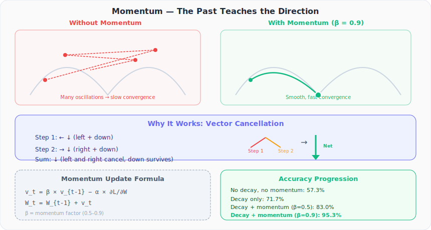

# Neural Networks from Scratch, Part 24: Momentum

*Give gradient descent a memory. Oscillations cancel, consistent directions reinforce, and accuracy jumps from 57% to 95%.*

Learning rate decay got us from 57% to 72%. Good, but not enough. The problem is that gradient descent only looks at the **current** gradient: it has no memory. Give it memory, and everything changes.

---

## 1. The Problem: Oscillations

Imagine a narrow valley in the loss landscape. The gradient points across the valley (left–right), not along it (downward). Basic gradient descent bounces side to side, inching downward painfully slowly.

What we ideally want: a **smooth, direct path** toward the minimum. To get that, we need to account for the **history** of past updates.

---

## 2. The Key Insight: Vector Cancellation

Consider two consecutive gradient steps in a narrow valley:

- **Step 1**: moves **left** and **down**
- **Step 2**: moves **right** and **down**

If we **add** these vectors:
- Left + right = **cancel out**
- Down + down = **reinforced**

The oscillating components (left/right) cancel, and the consistent component (downward) survives. This is exactly what momentum does.



---

## 3. The Momentum Formula

Instead of updating weights directly from the gradient, we maintain a **velocity** (the running sum of past updates):

$$v_t = \beta \cdot v_{t-1} - \alpha \cdot \frac{\partial L}{\partial W}$$

$$W_t = W_{t-1} + v_t$$

where:

- $v_t$ = current velocity (weight update)
- $\beta$ = **momentum factor** (typically 0.5–0.9)
- $v_{t-1}$ = previous velocity
- $\alpha$ = current learning rate (with decay)

When $\beta = 0$, this reduces to normal gradient descent. When $\beta = 0.9$, 90% of the update comes from the past direction.

---

## 4. The Optimizer Class with Momentum

```python
class Optimizer_SGD:
    def __init__(self, learning_rate=1.0, decay=0.0, momentum=0.0):
        self.learning_rate = learning_rate
        self.current_learning_rate = learning_rate
        self.decay = decay
        self.momentum = momentum
        self.iterations = 0

    def pre_update_params(self):
        if self.decay:
            self.current_learning_rate = self.learning_rate / \
                (1.0 + self.decay * self.iterations)

    def update_params(self, layer):
        if self.momentum:
            # Initialize momentums on first call
            if not hasattr(layer, 'weight_momentums'):
                layer.weight_momentums = np.zeros_like(layer.weights)
                layer.bias_momentums   = np.zeros_like(layer.biases)

            # Velocity = momentum × previous_velocity − lr × gradient
            weight_updates = self.momentum * layer.weight_momentums \
                           - self.current_learning_rate * layer.dweights
            layer.weight_momentums = weight_updates

            bias_updates = self.momentum * layer.bias_momentums \
                         - self.current_learning_rate * layer.dbiases
            layer.bias_momentums = bias_updates
        else:
            # Vanilla gradient descent
            weight_updates = -self.current_learning_rate * layer.dweights
            bias_updates   = -self.current_learning_rate * layer.dbiases

        # Apply updates
        layer.weights += weight_updates
        layer.biases  += bias_updates

    def post_update_params(self):
        self.iterations += 1
```

Key details:
- `layer.weight_momentums` and `layer.bias_momentums` store the **previous velocity** for each layer
- On the first call, these are initialized to zero (no history yet)
- The velocity accumulates: each step carries $\beta$ fraction of all past updates

---

## 5. Training with Momentum

```python
optimizer = Optimizer_SGD(learning_rate=1.0, decay=1e-3, momentum=0.9)

for epoch in range(10001):
    # Forward pass
    dense1.forward(X)
    activation1.forward(dense1.output)
    dense2.forward(activation1.output)
    loss = loss_activation.forward(dense2.output, y)

    predictions = np.argmax(loss_activation.output, axis=1)
    accuracy = np.mean(predictions == y)

    # Backward pass
    loss_activation.backward(loss_activation.output, y)
    dense2.backward(loss_activation.dinputs)
    activation1.backward(dense2.dinputs)
    dense1.backward(activation1.dinputs)

    # Update with momentum
    optimizer.pre_update_params()
    optimizer.update_params(dense1)
    optimizer.update_params(dense2)
    optimizer.post_update_params()
```

---

## 6. Results

| Method | Accuracy | Loss |
|---|---|---|
| Fixed α, no momentum | 57.3% | 0.768 |
| Decay, no momentum | 71.7% | 0.653 |
| Decay + momentum (β=0.5) | 83.0% | ~0.465 |
| **Decay + momentum (β=0.9)** | **95.3%** | **0.128** |

With `momentum = 0.9`:
- The accuracy jumps to **95.3%**: nearly perfect on the spiral dataset
- The loss drops to **0.128**: dramatically lower than any previous attempt
- The decision boundaries form **clear spirals** that match the true data structure
- The loss decreases **smoothly** without stagnation: no local minima traps

---

## 7. Why β = 0.9?

The momentum factor controls how much the past matters:

| β | Past influence | Behavior |
|---|---|---|
| 0.0 | None | Normal gradient descent |
| 0.5 | Moderate | Some smoothing, decent improvement |
| 0.9 | Strong | Oscillations almost eliminated, fast convergence |
| 0.99 | Very strong | Risk of overshooting — too much inertia |

In practice, **β = 0.9** is the default for most neural network frameworks. It gives the optimizer enough memory to cancel oscillations and enough responsiveness to react to the current gradient.

---

## Summary

| Concept | What We Learned |
|---|---|
| Momentum | Uses past gradients to guide the current update |
| Vector cancellation | Oscillating components cancel; consistent components reinforce |
| Formula | $v_t = \beta v_{t-1} - \alpha \nabla L$, then $W \mathrel{+}= v_t$ |
| Storage | Optimizer maintains `weight_momentums` and `bias_momentums` per layer |
| β = 0.9 | Standard default; gives 95.3% accuracy vs 57.3% without momentum |
| Foundation | Momentum is the basis of all modern optimizers (Adam, etc.) |

---

## What's Next

In **Part 25**, we explore **AdaGrad**, an optimizer that adapts the learning rate separately for each parameter, rather than using one global rate for all.

---

> **Try It Yourself:** Hands-on exercises for this lecture are in [Exercises](../../exercises.md) and [Quizzes](../../quizzes.md).
