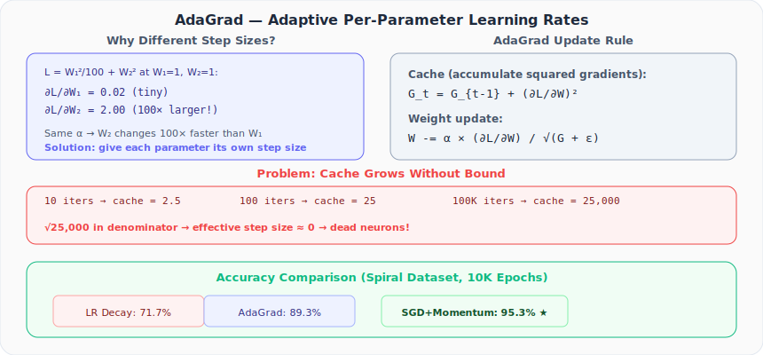

# Neural Networks from Scratch, Part 25: AdaGrad

*Give each parameter its own learning rate based on gradient history. A powerful idea with one fatal flaw.*

Momentum solved the oscillation problem by remembering past directions. But there is a different problem it does not address: **all parameters share the same learning rate**. AdaGrad gives each parameter its own adaptive step size.

---

## 1. Why Do Parameters Need Different Step Sizes?

Consider a simple loss function with two parameters:

$$L = \frac{W_1^2}{100} + W_2^2$$

At $W_1 = 1, W_2 = 1$:

| Parameter | Gradient | Magnitude |
|---|---|---|
| $\frac{\partial L}{\partial W_1}$ | $\frac{2 \times 1}{100} = 0.02$ | Tiny |
| $\frac{\partial L}{\partial W_2}$ | $2 \times 1 = 2.0$ | 100× larger |

With the **same** learning rate, $W_2$ changes 100× faster than $W_1$. This means $W_1$ barely updates while $W_2$ overshoots. The solution: parameters with large gradients should have **smaller** step sizes, and those with small gradients should have **larger** step sizes.



---

## 2. The AdaGrad Mechanism

AdaGrad maintains a **cache** for each parameter — a running sum of squared gradients:

$$G_t = G_{t-1} + \left(\frac{\partial L}{\partial W}\right)^2$$

The weight update divides by the square root of this cache:

$$W = W - \frac{\alpha \cdot \frac{\partial L}{\partial W}}{\sqrt{G_t + \epsilon}}$$

- **Large historical gradients** → large cache → large denominator → **small effective step size**
- **Small historical gradients** → small cache → small denominator → **large effective step size**

This is exactly the normalization we wanted. The $\epsilon$ (typically $10^{-7}$) prevents division by zero, and we square the gradients so the cache is always positive (valid for square root).

---

## 3. Practical Example

Consider parameter $W_1$ with gradient 0.5 at every iteration:

| Iteration | Gradient | Cache ($G_t$) | Effective divisor |
|---|---|---|---|
| 0 | (init) | 0 | (init) |
| 1 | 0.5 | 0.25 | √0.25 = 0.5 |
| 2 | 0.5 | 0.50 | √0.50 = 0.71 |
| 10 | 0.5 | 2.50 | √2.50 = 1.58 |
| 100 | 0.5 | 25.0 | √25 = 5.0 |
| 100,000 | 0.5 | 25,000 | √25000 = 158 |

The cache **never stops growing**. After 100,000 iterations, dividing by 158 makes the effective step size negligible. This is AdaGrad's fatal flaw: it eventually **kills learning**.

### What Are "Dead Parameters"?

When the cache grows large enough, the effective step size becomes so tiny that parameters essentially stop changing. Let's trace what happens:

1. **Early training:** Cache is small, updates are meaningful, the network learns.
2. **Mid training:** Cache grows, updates shrink, learning slows. This is actually *helpful* (like learning rate decay).
3. **Late training:** Cache is enormous, updates are negligible ($< 10^{-8}$), parameters are frozen.

Once a parameter's cache is large, there is **no recovery mechanism**: the cache can only grow, never shrink. The parameter is effectively "dead" for the rest of training, regardless of what the current gradients say.

This is conceptually similar to **dead ReLU neurons** (where a neuron's input is always ≤ 0, so its gradient is always zero and it never updates). The difference: dead ReLU neurons are caused by activation values, while dead AdaGrad parameters are caused by the optimizer's own bookkeeping.

| Problem | Cause | Recovery? |
|---------|-------|-----------|
| Dead ReLU neuron | Input always ≤ 0 → gradient always 0 | Possible if other neurons shift the input range |
| Dead AdaGrad parameter | Cache grows → effective LR → 0 | **No** — cache only increases |

> **This is exactly what RMSProp (Part 26) fixes**: by using an exponential moving average instead of a cumulative sum, the cache can both grow *and* shrink, keeping the effective step size healthy throughout training.

---

## 4. The Optimizer Class

```python
class Optimizer_Adagrad:
    def __init__(self, learning_rate=1.0, decay=0.0, epsilon=1e-7):
        self.learning_rate = learning_rate
        self.current_learning_rate = learning_rate
        self.decay = decay
        self.epsilon = epsilon
        self.iterations = 0

    def pre_update_params(self):
        if self.decay:
            self.current_learning_rate = self.learning_rate / \
                (1.0 + self.decay * self.iterations)

    def update_params(self, layer):
        # Initialize cache on first call
        if not hasattr(layer, 'weight_cache'):
            layer.weight_cache = np.zeros_like(layer.weights)
            layer.bias_cache   = np.zeros_like(layer.biases)

        # Accumulate squared gradients
        layer.weight_cache += layer.dweights ** 2
        layer.bias_cache   += layer.dbiases ** 2

        # Update with per-parameter step sizes
        layer.weights -= self.current_learning_rate * layer.dweights / \
                         (np.sqrt(layer.weight_cache) + self.epsilon)
        layer.biases  -= self.current_learning_rate * layer.dbiases / \
                         (np.sqrt(layer.bias_cache) + self.epsilon)

    def post_update_params(self):
        self.iterations += 1
```

Key: each layer gets its own `weight_cache` and `bias_cache`, shaped identically to the weights/biases.

---

## 5. Results on Spiral Dataset

```python
optimizer = Optimizer_Adagrad(learning_rate=1.0, decay=1e-4)
# 10,000 epochs → accuracy: 89.3%, loss: ~0.35
```

| Method | Accuracy |
|---|---|
| LR Decay only | 71.7% |
| **AdaGrad** | **89.3%** |
| SGD + Momentum (β=0.9) | 95.3% |

AdaGrad improves significantly over plain decay (+17.6%), but SGD with momentum still wins. This is partly because AdaGrad's cache growth starts limiting updates before 10,000 epochs are complete.

---

## 6. The Core Disadvantage

The cache grows monotonically — it can only increase. After enough iterations:

1. Cache becomes very large
2. Denominator becomes very large
3. Effective step size approaches zero
4. Weights stop updating entirely
5. Learning **stagnates**

This is why AdaGrad is rarely used in modern practice for large-scale training. But its core insight — **per-parameter adaptive learning rates** — is the foundation for RMSProp and Adam.

---

## Summary

| Concept | What We Learned |
|---|---|
| Per-parameter rates | AdaGrad assigns each parameter its own effective step size based on gradient history |
| Mechanism | Cache = running sum of squared gradients; update divides by √cache |
| Adaptive scaling | Large gradients → smaller steps; small gradients → larger steps |
| Fatal flaw | Cache grows forever, so learning eventually stops |
| Result | 89.3% accuracy: better than decay alone, worse than momentum |
| Legacy | The adaptive rate idea lives on in RMSProp and Adam |

---

## What's Next

In **Part 26**, we fix AdaGrad's cache problem with **RMSProp**, which uses an exponential moving average instead of a running sum, preventing the cache from growing without bound.

---

> **Try It Yourself:** Hands-on exercises for this lecture are in [Exercises](../../exercises.md) and [Quizzes](../../quizzes.md).
