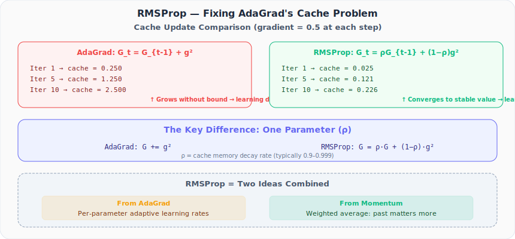

# Neural Networks from Scratch, Part 26: RMSProp

*Fix AdaGrad's fatal flaw with one elegant change: replace the running sum with an exponential moving average.*

AdaGrad gave each parameter its own learning rate (a great idea) but the cache grows forever and eventually kills learning. RMSProp fixes this with one elegant change: replace the running sum with an **exponential moving average**.

---

## 1. The Fix: Exponential Moving Average

AdaGrad's cache just keeps adding:

$$G_t = G_{t-1} + g_t^2$$

RMSProp introduces a decay factor $\rho$ (the **cache memory decay rate**):

$$G_t = \rho \cdot G_{t-1} + (1 - \rho) \cdot g_t^2$$

With $\rho = 0.9$:
- 90% of the cache comes from the **past**
- 10% comes from the **current gradient**

The cache no longer grows without bound; it converges to a stable value. Learning continues indefinitely.



---

## 2. Cache Growth Comparison

With gradient = 0.5 at every iteration and $\rho = 0.9$:

| Iteration | AdaGrad Cache | RMSProp Cache |
|---|---|---|
| 1 | 0.250 | 0.025 |
| 2 | 0.500 | 0.048 |
| 10 | 2.500 | 0.226 |
| 100 | 25.0 | ~0.25 |
| 100,000 | 25,000 | ~0.25 |

AdaGrad's cache grows linearly (2,500× larger at 100K iterations). RMSProp's cache **converges**: the exponential decay prevents unbounded growth.

---

## 3. The Update Rule

The weight update is identical to AdaGrad:

$$W = W - \frac{\alpha \cdot \frac{\partial L}{\partial W}}{\sqrt{G_t + \epsilon}}$$

The only difference is **how $G_t$ is computed**. Because RMSProp's cache stays bounded:
- The denominator never becomes enormous
- The effective step size never vanishes
- Neurons never go "dead"

---

## 4. RMSProp = Two Ideas Combined

| Concept | Source | What it does |
|---|---|---|
| Per-parameter learning rates | AdaGrad | Large gradients → small steps |
| Weighted average of past | Momentum | Prevents cache from exploding |

RMSProp borrows AdaGrad's per-parameter cache and momentum's idea of giving more weight to the past than the present.

---

## 5. The Optimizer Class

```python
class Optimizer_RMSprop:
    def __init__(self, learning_rate=0.02, decay=0.0, epsilon=1e-7, rho=0.9):
        self.learning_rate = learning_rate
        self.current_learning_rate = learning_rate
        self.decay = decay
        self.epsilon = epsilon
        self.rho = rho
        self.iterations = 0

    def pre_update_params(self):
        if self.decay:
            self.current_learning_rate = self.learning_rate / \
                (1.0 + self.decay * self.iterations)

    def update_params(self, layer):
        if not hasattr(layer, 'weight_cache'):
            layer.weight_cache = np.zeros_like(layer.weights)
            layer.bias_cache   = np.zeros_like(layer.biases)

        # Exponential moving average of squared gradients
        layer.weight_cache = self.rho * layer.weight_cache + \
                             (1 - self.rho) * layer.dweights ** 2
        layer.bias_cache   = self.rho * layer.bias_cache + \
                             (1 - self.rho) * layer.dbiases ** 2

        # Update with per-parameter rates
        layer.weights -= self.current_learning_rate * layer.dweights / \
                         (np.sqrt(layer.weight_cache) + self.epsilon)
        layer.biases  -= self.current_learning_rate * layer.dbiases / \
                         (np.sqrt(layer.bias_cache) + self.epsilon)

    def post_update_params(self):
        self.iterations += 1
```

Note the **lower default learning rate** (0.02 vs 1.0 for SGD/AdaGrad): adaptive methods often need smaller base rates.

---

## 6. Training with RMSProp

```python
optimizer = Optimizer_RMSprop(learning_rate=0.02, decay=1e-5, rho=0.999)

for epoch in range(10001):
    # Forward pass (same as before)
    dense1.forward(X)
    activation1.forward(dense1.output)
    dense2.forward(activation1.output)
    loss = loss_activation.forward(dense2.output, y)

    # Backward pass
    loss_activation.backward(loss_activation.output, y)
    dense2.backward(loss_activation.dinputs)
    activation1.backward(dense2.dinputs)
    dense1.backward(activation1.dinputs)

    # RMSProp update
    optimizer.pre_update_params()
    optimizer.update_params(dense1)
    optimizer.update_params(dense2)
    optimizer.post_update_params()
```

---

## 7. Results

| Method | Accuracy | Dead neuron problem? |
|---|---|---|
| LR Decay only | 71.7% | N/A |
| AdaGrad | 89.3% | ⚠️ Yes, over long training |
| **RMSProp** | **~88%** | ✅ No |
| SGD + Momentum | 95.3% | ✅ No |

For 10,000 epochs, RMSProp and AdaGrad perform similarly. The real advantage appears at **higher iteration counts** where AdaGrad stalls but RMSProp keeps learning.

SGD with momentum (95.3%) still leads on this dataset. But the per-parameter adaptive rate idea is powerful, and when combined with momentum, it creates the **Adam optimizer**.

---

## 8. Parameters

| Parameter | Typical Value | Role |
|---|---|---|
| $\alpha_0$ | 0.001–0.02 | Initial learning rate |
| decay | 0 or 1e-5 | Learning rate decay |
| $\rho$ | 0.9 or 0.999 | Cache memory decay rate |
| $\epsilon$ | 1e-7 | Prevents division by zero |

---

## Summary

| Concept | What We Learned |
|---|---|
| RMSProp cache | Replaces AdaGrad's running sum with an exponential moving average |
| Cache formula | $G_t = \rho G_{t-1} + (1-\rho)g_t^2$ |
| Convergence | Cache converges instead of growing, so no dead neurons |
| Dual heritage | Combines AdaGrad's per-parameter rates with momentum's respect for the past |
| Long training | Similar accuracy to AdaGrad for short training; better for long training |
| Foundation | Adam = RMSProp + momentum |

---

## What's Next

In **Part 27**, we combine the best of both worlds: **momentum** (past update directions) + **RMSProp** (per-parameter adaptive rates) = the **Adam optimizer**, the default choice in modern deep learning.

---

> **Try It Yourself:** Hands-on exercises for this lecture are in [Exercises](../../exercises.md) and [Quizzes](../../quizzes.md).
