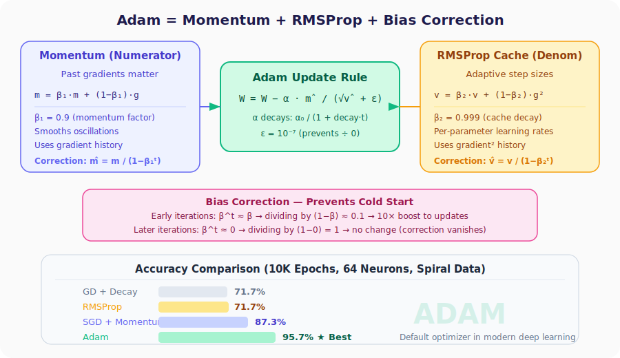
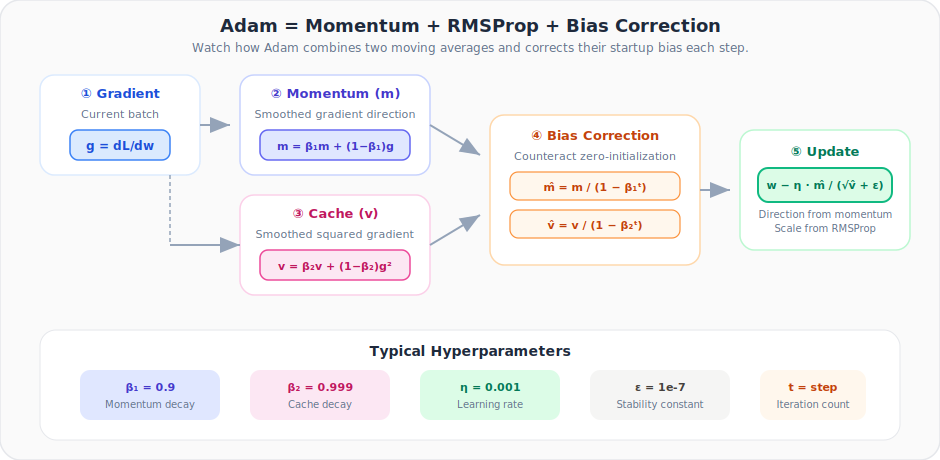

# Neural Networks from Scratch, Part 27: The Adam Optimizer

*Momentum + RMSProp + bias correction = the default optimizer in modern deep learning.*

Everything we have built over the last five lectures (gradient descent, learning-rate decay, momentum, AdaGrad, RMSProp) was leading here. The **Adam** optimizer (Adaptive Moment Estimation) combines the best ideas from momentum and RMSProp into a single update rule, plus adds **bias correction** so the very first iterations are not wasted. It is the **default optimizer** used across industry and research today.



---

## 1. Recap: Two Separate Advances

| Advance | What it fixes | Core idea |
|---------|--------------|-----------|
| **Momentum** | Only using current gradient | Smooth past gradients → reduce oscillations |
| **RMSProp** | Fixed step size for all params | Adaptive per-parameter step size via gradient² cache |

Both are improvements over plain gradient descent, but each addresses a **different** limitation:

- Momentum improves the **numerator** (gradient signal).
- RMSProp improves the **denominator** (effective step size).

Adam's insight: **use both at the same time**.

---

## 2. The Adam Update Rule



### 2.1. First Moment (Momentum)

$$m_t = \beta_1 \cdot m_{t-1} + (1 - \beta_1) \cdot g_t$$

This is the exponential moving average of the gradients, the same momentum idea. $\beta_1 = 0.9$ means we give 90 % weight to the running average and 10 % to the current gradient.

### 2.2. Second Moment (RMSProp Cache)

$$v_t = \beta_2 \cdot v_{t-1} + (1 - \beta_2) \cdot g_t^2$$

This is the exponential moving average of the **squared** gradients, the RMSProp adaptive cache. $\beta_2 = 0.999$ means gradients squared are averaged over a very long history.

### 2.3. Bias Correction

At the start of training both $m$ and $v$ are initialized to zero. Because $\beta$ values are close to 1, the running averages stay near zero for many iterations. This is the **cold-start problem**. We fix this with correction factors:

$$\hat{m}_t = \frac{m_t}{1 - \beta_1^{\,t}} \qquad \hat{v}_t = \frac{v_t}{1 - \beta_2^{\,t}}$$

| Iteration $t$ | $\beta_1^t$ (0.9) | $1 - \beta_1^t$ | Correction multiplier |
|:-:|:-:|:-:|:-:|
| 1 | 0.9 | 0.1 | **10×** |
| 5 | 0.59 | 0.41 | 2.4× |
| 50 | ≈ 0 | ≈ 1 | 1× (no effect) |

Early on the correction amplifies updates so the network explores the loss landscape quickly. Later the correction vanishes and has no effect.

### 2.4. Final Update

$$W \leftarrow W - \alpha \cdot \frac{\hat{m}_t}{\sqrt{\hat{v}_t} + \epsilon}$$

where $\alpha$ itself decays: $\alpha = \frac{\alpha_0}{1 + \text{decay} \cdot t}$.

---

## 3. Default Hyper-parameters

| Parameter | Symbol | Default | Role |
|-----------|--------|---------|------|
| Initial learning rate | $\alpha_0$ | 0.02 | Starting step size |
| Learning-rate decay | decay | $10^{-5}$ | Shrinks $\alpha$ over time |
| Momentum factor | $\beta_1$ | 0.9 | Weight for past gradients |
| Cache decay rate | $\beta_2$ | 0.999 | Weight for past gradient² |
| Epsilon | $\epsilon$ | $10^{-7}$ | Prevents division by zero |

---

## 4. Coding the Adam Optimizer

```python
class Optimizer_Adam:

    def __init__(self, learning_rate=0.001, decay=0., epsilon=1e-7,
                 beta_1=0.9, beta_2=0.999):
        self.learning_rate = learning_rate
        self.current_learning_rate = learning_rate
        self.decay = decay
        self.iterations = 0
        self.epsilon = epsilon
        self.beta_1 = beta_1
        self.beta_2 = beta_2

    # ── called BEFORE parameter updates ──
    def pre_update_params(self):
        if self.decay:
            self.current_learning_rate = (
                self.learning_rate / (1. + self.decay * self.iterations)
            )

    # ── called ONCE per layer ──
    def update_params(self, layer):
        # Lazily create momentum & cache arrays (same shape as params)
        if not hasattr(layer, 'weight_momentums'):
            layer.weight_momentums = np.zeros_like(layer.weights)
            layer.weight_cache    = np.zeros_like(layer.weights)
            layer.bias_momentums  = np.zeros_like(layer.biases)
            layer.bias_cache      = np.zeros_like(layer.biases)

        # ── First moment (momentum) ──
        layer.weight_momentums = (self.beta_1 * layer.weight_momentums +
                                  (1 - self.beta_1) * layer.dweights)
        layer.bias_momentums   = (self.beta_1 * layer.bias_momentums +
                                  (1 - self.beta_1) * layer.dbiases)

        # Bias-corrected first moment
        weight_momentums_corrected = (
            layer.weight_momentums /
            (1 - self.beta_1 ** (self.iterations + 1))
        )
        bias_momentums_corrected = (
            layer.bias_momentums /
            (1 - self.beta_1 ** (self.iterations + 1))
        )

        # ── Second moment (cache / RMSProp) ──
        layer.weight_cache = (self.beta_2 * layer.weight_cache +
                              (1 - self.beta_2) * layer.dweights ** 2)
        layer.bias_cache   = (self.beta_2 * layer.bias_cache +
                              (1 - self.beta_2) * layer.dbiases ** 2)

        # Bias-corrected second moment
        weight_cache_corrected = (
            layer.weight_cache /
            (1 - self.beta_2 ** (self.iterations + 1))
        )
        bias_cache_corrected = (
            layer.bias_cache /
            (1 - self.beta_2 ** (self.iterations + 1))
        )

        # ── Adam update ──
        layer.weights -= (self.current_learning_rate *
                          weight_momentums_corrected /
                          (np.sqrt(weight_cache_corrected) + self.epsilon))
        layer.biases  -= (self.current_learning_rate *
                          bias_momentums_corrected /
                          (np.sqrt(bias_cache_corrected) + self.epsilon))

    # ── called AFTER all layers are updated ──
    def post_update_params(self):
        self.iterations += 1
```

The class mirrors the three-method pattern we used for every optimizer: `pre_update_params` (decay α), `update_params` (apply the rule per layer), `post_update_params` (increment iteration counter).

---

## 5. Training with Adam

```python
# Data
X, y = spiral_data(samples=100, classes=3)

# Architecture: 2 → 64 → ReLU → 3 → Softmax+Loss
dense1 = Layer_Dense(2, 64)
activation1 = Activation_ReLU()
dense2 = Layer_Dense(64, 3)
loss_activation = Activation_Softmax_Loss_CategoricalCrossentropy()

# Adam optimizer
optimizer = Optimizer_Adam(learning_rate=0.02, decay=1e-5)

for epoch in range(10001):
    # Forward
    dense1.forward(X)
    activation1.forward(dense1.output)
    dense2.forward(activation1.output)
    loss = loss_activation.forward(dense2.output, y)

    # Accuracy
    predictions = np.argmax(loss_activation.output, axis=1)
    accuracy = np.mean(predictions == y)

    if not epoch % 100:
        print(f'epoch: {epoch}, acc: {accuracy:.3f}, '
              f'loss: {loss:.3f}, lr: {optimizer.current_learning_rate:.5f}')

    # Backward
    loss_activation.backward(loss_activation.output, y)
    dense2.backward(loss_activation.dinputs)
    activation1.backward(dense2.dinputs)
    dense1.backward(activation1.dinputs)

    # Optimize
    optimizer.pre_update_params()
    optimizer.update_params(dense1)
    optimizer.update_params(dense2)
    optimizer.post_update_params()
```

**Final result: 95.7 % accuracy, loss ≈ 0.099.** The best we have achieved.

---

## 6. Head-to-Head Comparison

| Optimizer | Key idea | Accuracy |
|-----------|----------|:--------:|
| GD + Decay | Shrinking fixed step | 71.7 % |
| RMSProp | Adaptive step (cache) | 71.7 % |
| SGD + Momentum | Past gradients smooth path | 87.3 % |
| **Adam** | **Momentum + Cache + Correction** | **95.7 %** |

Why Adam wins:

1. **Momentum** cancels oscillations → gradient signal is cleaner.
2. **Adaptive cache** gives each weight its own effective learning rate → no dead neurons.
3. **Bias correction** ensures the first few updates are large → fast early exploration.

---

## Summary

| Concept | What We Learned |
|---|---|
| Adam | Momentum in the numerator + RMSProp cache in the denominator + bias correction |
| Defaults | $\beta_1 = 0.9$, $\beta_2 = 0.999$, $\epsilon = 10^{-7}$ work well in most settings |
| Bias correction | Disappears after a handful of iterations; only matters early |
| Result | **95.7 %** on spiral data, beating every optimizer we tested |
| Industry standard | When in doubt, start with Adam |

---

## What's Next

We have an excellent training accuracy, but **does the model actually work on data it has never seen?** In **Part 28** we introduce **generalization, testing, and overfitting**, the critical second half of building a real neural network.

---

 > **Try It Yourself:** Hands-on exercises for this lecture are in [Exercises](../../exercises.md) and [Quizzes](../../quizzes.md).
