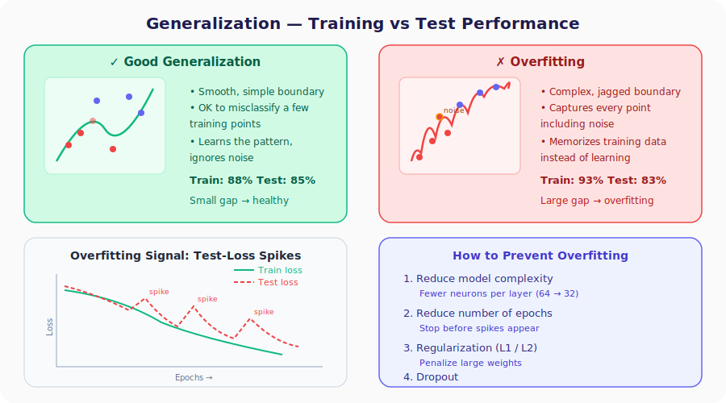

# Neural Networks from Scratch, Part 28: Generalization and Testing

*95.7% training accuracy means nothing if the model fails on data it has never seen.*

We just achieved **95.7 % training accuracy** with the Adam optimizer, but that number alone does not tell us whether our network is actually useful. In this lecture we turn to the question that separates toy experiments from real-world models: **how well does the network perform on data it has never seen?**



---

## 1. Why Generalization Matters

Training a neural network is like studying for an exam. A student who memorizes every single practice question word-for-word may score 100 % on the homework but fail on the actual exam because the questions are different.

> **Generalization** = the ability of the model to perform well on **new, unseen data**.

Getting the neural network to train well is only **50 % of the job**. The other 50 % is making sure the test performance is also good — and sometimes that means going back and changing the architecture itself.

---

## 2. Running the Test

We generate a fresh batch of 100 samples with the same `spiral_data` function (same distribution, different random points) and run the forward pass **only** — no backward pass needed:

```python
# Generate fresh test data
X_test, y_test = spiral_data(samples=100, classes=3)

# Forward pass only
dense1.forward(X_test)
activation1.forward(dense1.output)
dense2.forward(activation1.output)
loss = loss_activation.forward(dense2.output, y_test)

predictions = np.argmax(loss_activation.output, axis=1)
accuracy = np.mean(predictions == y_test)

print(f'Validation accuracy: {accuracy:.3f}, loss: {loss:.3f}')
```

**Result: Validation accuracy 83 %, loss 0.81**

The training accuracy was 93 %, but the test accuracy dropped to 83 %, a **10 percentage-point gap**. This is a textbook sign of **overfitting**.

---

## 3. Good Generalization vs. Overfitting

### 3.1. Visual Diagnosis

| Characteristic | Good Generalization | Overfitting |
|----------------|:------------------:|:-----------:|
| Decision boundary | Smooth, simple curves | Jagged, complex contours |
| Misses some training points? | Yes — and that is OK | No — captures every point, even noise |
| Model complexity | Low | High |
| Train accuracy | Moderate (e.g. 88 %) | Very high (e.g. 93 %) |
| Test accuracy | Close to train (e.g. 85 %) | Much lower (e.g. 83 %) |



### 3.2. Why Overfitting Hurts

When the model goes out of its way to capture **every** training point (including points that are just noise) it creates overly specialized boundaries. A test point that falls inside one of these incorrectly carved-out regions gets misclassified.

> **Simpler models generalize better.** This is a recurring theme in ML: if two models achieve similar training performance, prefer the simpler one.

### 3.3. Loss-Curve Clue

When you plot the **test loss** across epochs, overfitting shows up as **spikes**:

1. The loss decreases normally at first.
2. Then sudden upward spikes appear — the model encounters test samples on which it performs badly.
3. The spikes grow more frequent as training continues.

If you see these spikes, your model is overfitting.

---

## 4. How to Prevent Overfitting

The lecture previews four strategies (each explored in depth in upcoming parts):

| Strategy | How it helps | Lectures |
|----------|-------------|:--------:|
| **Reduce model complexity** | Fewer neurons → simpler decision boundary | |
| **Reduce number of epochs** | Stop before the model memorizes noise | |
| **Regularization (L1 / L2)** | Penalize large weights → keep them small | Part 30 |
| **Dropout** | Randomly disable neurons during training | Part 31 |

All of the following are **hyper-parameters** we can tune to fight overfitting:

- Number of layers
- Number of neurons per layer
- Learning rate ($\alpha_0$)
- Learning-rate decay
- Number of training epochs

---

## Summary

| Concept | What We Learned |
|---|---|
| Generalization | Training accuracy ≠ model quality; only unseen-data performance matters |
| Overfitting signal | 93% train vs 83% test accuracy: a 10-point gap |
| Visual clues | Smooth boundaries generalize; jagged contours overfit |
| Loss spikes | Spikes on test data indicate over-specialization |
| Fix strategies | Simpler model, fewer epochs, regularization, or dropout |

---

## What's Next

In **Part 29** we formalize the difference between **test data and validation data**, introduce the concept of a **validation set**, and begin **hyperparameter tuning**, systematically searching for the architecture and settings that maximize generalization.

---

> **Try It Yourself:** Hands-on exercises for this lecture are in [Exercises](../../exercises.md) and [Quizzes](../../quizzes.md).
