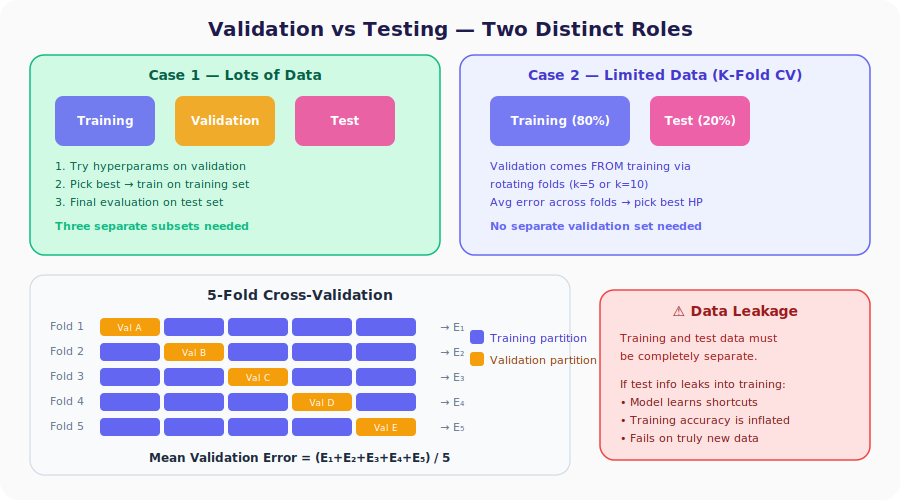

# Neural Networks from Scratch, Part 29: Validation, Hyperparameter Tuning, and K-Fold Cross-Validation

*Before we can fix overfitting, we need a systematic way to choose the right hyperparameters. Enter the validation set.*

In the previous lecture we saw that our model was **overfitting**: 93 % training accuracy but only 83 % on test data. Before we can fix anything, we need a systematic way to **choose the right hyperparameters**. That is the job of a **validation set**. This lecture draws the line between testing, validation, and training data, and introduces **k-fold cross-validation** for when data is scarce.



---

## 1. Hyperparameters: What We Must Choose Before Training

Hyperparameters are the knobs we set **before** training begins; the optimizer will **not** learn them for us.

| Category | Examples |
|----------|---------|
| Architecture | Number of layers, neurons per layer |
| Activations | ReLU, tanh, sigmoid, softmax |
| Optimizer | $\beta_1$, $\beta_2$, $\alpha_0$, decay |
| Training | Number of epochs |

With so many choices, we need a principled way to compare them. We cannot use the test set for comparison; that would "leak" information about the test set into our design decisions.

---

## 2. Testing vs. Validation Data

| Data subset | Purpose | When used |
|-------------|---------|-----------|
| **Training** | Optimize weights and biases | During training (forward + backward pass) |
| **Validation** | Choose the best hyper-parameters | Before finalizing training |
| **Test** | Final, one-time evaluation on unseen data | After everything else is done |

> **Key rule:** the test set is touched **once**, at the very end. All experimentation goes through the validation set.

---

## 3. Splitting the Data

### Case 1: Plenty of Data

Split into three disjoint subsets:

```
[=== Training (e.g. 60 %) ===][== Validation (20 %) ==][== Test (20 %) ==]
```

1. Try many hyperparameter combinations, evaluate each on the validation set.
2. Pick the combination with the lowest validation error.
3. Train the final model and evaluate once on the test set.

### Case 2: Limited Data (K-Fold Cross-Validation)

When data is scarce, reserving a separate validation set wastes too much. Instead:

1. Split data into **training (80 %)** and **test (20 %)**.
2. Use **k-fold cross-validation** on the training set itself to serve as the validation strategy.

---

## 4. K-Fold Cross-Validation (K = 5)

Divide the training set into $k$ equal parts (A, B, C, D, E).

| Fold | Validation Part | Training Parts | Error |
|:----:|:---------------:|:--------------:|:-----:|
| 1 | A | B, C, D, E | $E_1$ |
| 2 | B | A, C, D, E | $E_2$ |
| 3 | C | A, B, D, E | $E_3$ |
| 4 | D | A, B, C, E | $E_4$ |
| 5 | E | A, B, C, D | $E_5$ |

$$\text{Mean validation error} = \frac{1}{k}\sum_{i=1}^{k} E_i$$

### How to use it for hyperparameter search

```
For each candidate set of hyperparameters:
    Run k-fold CV → get mean validation error
Choose the candidate with the lowest mean error
```

For example, to compare 2, 3, and 5 hidden layers:

1. Run 5-fold CV with 2 layers → mean error $\bar{E}_A$.
2. Run 5-fold CV with 3 layers → mean error $\bar{E}_B$.
3. Run 5-fold CV with 5 layers → mean error $\bar{E}_C$.
4. Pick the layer count with the smallest $\bar{E}$.

In practice, **5-fold** and **10-fold** cross-validation are the most common choices.

### K-Fold in Code

Here's a minimal NumPy implementation — no external libraries needed:

```python
import numpy as np

def k_fold_split(X, y, k=5, shuffle=True):
    """Split data into k folds. Returns list of (train_X, train_y, val_X, val_y) tuples."""
    indices = np.arange(len(X))
    if shuffle:
        np.random.shuffle(indices)

    fold_size = len(X) // k
    folds = []

    for i in range(k):
        # Validation indices for this fold
        val_start = i * fold_size
        val_end   = val_start + fold_size
        val_idx   = indices[val_start:val_end]

        # Training indices = everything else
        train_idx = np.concatenate([indices[:val_start], indices[val_end:]])

        folds.append((X[train_idx], y[train_idx], X[val_idx], y[val_idx]))

    return folds
```

**Using it for hyperparameter search:**

```python
# Compare different learning rates
candidates = [0.01, 0.05, 0.1, 0.5, 1.0]
k = 5

for lr in candidates:
    fold_accuracies = []

    for train_X, train_y, val_X, val_y in k_fold_split(X, y, k=k):
        # Build a fresh network for each fold
        dense1 = Layer_Dense(2, 64)
        activation1 = Activation_ReLU()
        dense2 = Layer_Dense(64, 3)
        loss_activation = Activation_Softmax_Loss_CategoricalCrossentropy()
        optimizer = Optimizer_Adam(learning_rate=lr)

        # Train for some epochs
        for epoch in range(1000):
            dense1.forward(train_X)
            activation1.forward(dense1.output)
            dense2.forward(activation1.output)
            loss = loss_activation.forward(dense2.output, train_y)

            loss_activation.backward(loss_activation.output, train_y)
            dense2.backward(loss_activation.dinputs)
            activation1.backward(dense2.dinputs)
            dense1.backward(activation1.dinputs)

            optimizer.pre_update_params()
            optimizer.update_params(dense1)
            optimizer.update_params(dense2)
            optimizer.post_update_params()

        # Evaluate on this fold's validation set
        dense1.forward(val_X)
        activation1.forward(dense1.output)
        dense2.forward(activation1.output)
        predictions = np.argmax(loss_activation.activation.forward_only(dense2.output), axis=1)
        accuracy = np.mean(predictions == val_y)
        fold_accuracies.append(accuracy)

    mean_acc = np.mean(fold_accuracies)
    print(f'LR={lr:<6} → Mean val accuracy: {mean_acc:.3f}  '
          f'(per fold: {[f"{a:.3f}" for a in fold_accuracies]})')
```

**Example output:**
```
LR=0.01   → Mean val accuracy: 0.783  (per fold: ['0.800', '0.767', '0.783', '0.800', '0.767'])
LR=0.05   → Mean val accuracy: 0.893  (per fold: ['0.883', '0.900', '0.917', '0.867', '0.900'])
LR=0.1    → Mean val accuracy: 0.877  (per fold: ['0.867', '0.900', '0.883', '0.850', '0.883'])
LR=0.5    → Mean val accuracy: 0.657  (per fold: ['0.683', '0.633', '0.650', '0.667', '0.650'])
LR=1.0    → Mean val accuracy: 0.337  (per fold: ['0.333', '0.333', '0.350', '0.333', '0.333'])
```

The result shows $\alpha = 0.05$ is the best choice, and notice the per-fold scores are consistent, giving us confidence the result isn't a fluke. LR = 1.0 diverges to random guessing (~33%), confirming K-fold's ability to expose bad hyperparameters reliably.

---

## 5. Data Leakage: A Critical Pitfall

> **Data leakage** = any situation where information from the test set is accidentally available during training.

The training and test sets must be **completely disjoint**: no overlap.

**Example:** You are predicting whether a customer will purchase a product. Your features include name, age, and browsing time. If you accidentally include a feature like *"did the customer call to cancel?"*, the model learns a shortcut: "cancel call = no purchase." On truly new customers (who haven't called yet) this feature is meaningless, and the model fails.

### How to avoid leakage

- Shuffle and split *before* any preprocessing that uses global statistics.
- Never let test samples appear in the training fold.
- Be suspicious of any feature that seems "too good"; it may encode the label.

---

## Summary

| Concept | What We Learned |
|---|---|
| Validation data | For choosing hyperparameters; test data is for the final one-time evaluation |
| K-fold CV | When data is limited, use the training set as both training and validation |
| Robust estimation | The mean validation error across folds gives a reliable generalization estimate |
| Data leakage | Test info leaking into training inflates accuracy and ruins generalization |

---

## What's Next

Now that we know *how* to evaluate hyperparameter choices, we need tools that actually **reduce overfitting**. In **Part 30** we add **L1 and L2 regularization** directly to the loss function, penalizing large weights so the model stays simple.

---

> **Try It Yourself:** Hands-on exercises for this lecture are in [Exercises](../../exercises.md) and [Quizzes](../../quizzes.md).
