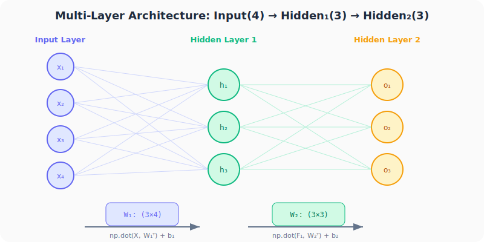
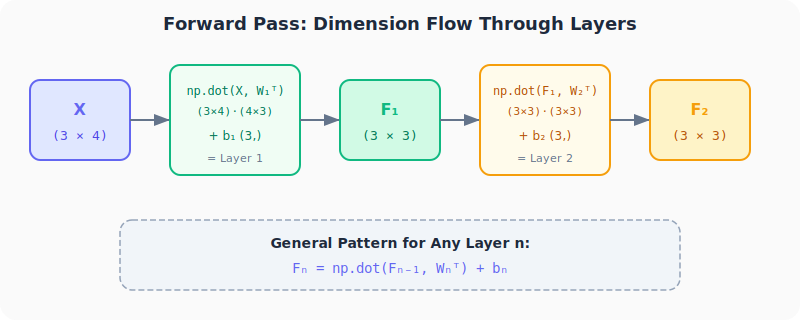
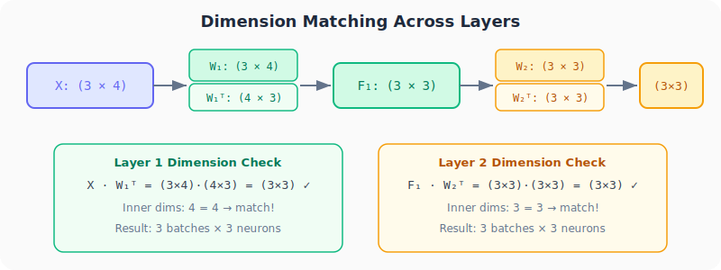

# Neural Networks from Scratch, Part 3: Stacking Layers & the Forward Pass

*One formula, applied repeatedly. That's all it takes to run a deep neural network.*

---

## Why This Lecture Matters

In Parts 1 and 2, we coded a **single layer** of neurons. But the real power of neural networks comes from **stacking layers** together: 5, 50, even 100 layers deep. The surprising revelation is that no fundamentally new math is needed. We just repeat the same dot product formula, feeding each layer's output as the next layer's input.

This chaining process is called the **forward pass**, and understanding it will prepare you for everything that comes later (when we reverse it during backpropagation).

---

## Recap: What We Know So Far

From Parts 1 and 2, we have the core formula for a single layer:

$$\text{output} = \text{np.dot}(X, W^T) + b$$

Where:
- **X** = input data (can be a single sample or a batch)
- **W** = weight matrix (one row per neuron)
- **b** = bias vector (one value per neuron)
- **Wᵀ** = transpose of W (needed so inner dimensions match)

This formula works for:
| Scenario | X shape | W shape | Output shape |
|----------|---------|---------|-------------|
| Single sample, 1 layer | (4,) | (3×4) | (3,) |
| Batch of data, 1 layer | (3×4) | (3×4) | (3×3) |

Now we extend it to **multiple layers**.

---

## The Architecture



We're building a network with:
- **Input layer:** 4 inputs (features per sample)
- **Hidden layer 1:** 3 neurons → weight matrix W₁ is **(3×4)**
- **Hidden layer 2:** 3 neurons → weight matrix W₂ is **(3×3)**

Notice how the **number of weights per neuron** in each layer equals the number of **inputs that layer receives**:
- Layer 1 neurons each have 4 weights (because 4 inputs come in)
- Layer 2 neurons each have 3 weights (because Layer 1 has 3 outputs)

---

## The Forward Pass Chain

The key insight: **each layer's output becomes the next layer's input**.



**Step 1 — Layer 1 output:**
$$F_1 = \text{np.dot}(X, W_1^T) + b_1$$

**Step 2 — Layer 2 output:**
$$F_2 = \text{np.dot}(F_1, W_2^T) + b_2$$

**Step n — Any layer:**
$$F_n = \text{np.dot}(F_{n-1}, W_n^T) + b_n$$

That's it. The same formula, applied once per layer. If you had 50 layers, you'd apply it 50 times.

---

## Dimension Check



Let's trace the shapes step by step with our 3-sample batch:

### Layer 1
```
X:    (3 × 4)   — 3 samples, 4 features each
W₁:   (3 × 4)   — 3 neurons, 4 weights each
W₁ᵀ:  (4 × 3)   — transposed for dot product

X · W₁ᵀ = (3×4) · (4×3) = (3×3)  ✓  inner dims match (4=4)
```

Result F₁ is **(3×3)** → 3 samples, 3 outputs (one per neuron).

### Layer 2
```
F₁:   (3 × 3)   — 3 samples, 3 values from Layer 1
W₂:   (3 × 3)   — 3 neurons, 3 weights each
W₂ᵀ:  (3 × 3)   — transposed

F₁ · W₂ᵀ = (3×3) · (3×3) = (3×3)  ✓  inner dims match (3=3)
```

Result F₂ is **(3×3)** → 3 samples, 3 outputs.

> **The rule:** A layer with `n` neurons receiving input from a layer with `m` neurons has a weight matrix of shape **(n × m)**.

---

## Coding Two Layers

```python
import numpy as np

# Input batch: 3 samples, 4 features each
inputs = np.array([[1.0, 2.0, 3.0, 2.5],
                   [2.0, 5.0, -1.0, 2.0],
                   [-1.5, 2.7, 3.3, -0.8]])

# Layer 1: 3 neurons, each with 4 weights
weights1 = np.array([[0.2, 0.8, -0.5, 1.0],
                     [0.5, -0.91, 0.26, -0.5],
                     [-0.26, -0.27, 0.17, 0.87]])
biases1 = np.array([2.0, 3.0, 0.5])

# Layer 2: 3 neurons, each with 3 weights
weights2 = np.array([[0.1, -0.14, 0.5],
                     [-0.5, 0.12, -0.33],
                     [-0.44, 0.73, -0.13]])
biases2 = np.array([-1.0, 2.0, -0.5])

# Forward pass
layer1_outputs = np.dot(inputs, weights1.T) + biases1
layer2_outputs = np.dot(layer1_outputs, weights2.T) + biases2

print("Layer 1 outputs:")
print(layer1_outputs)
print("\nLayer 2 outputs:")
print(layer2_outputs)
```

**Output:**
```
Layer 1 outputs:
[[ 4.8    1.21   2.385]
 [ 8.9   -1.81   0.2  ]
 [ 1.41   1.051  0.026]]

Layer 2 outputs:
[[ 0.5031  -0.04959 -0.13366]
 [ 0.2434  -6.4711  -2.7696 ]
 [-0.9931   1.0108   0.24831]]
```

### Extending to More Layers

The pattern is trivially extensible:

```python
# If you had 5 layers:
f1 = np.dot(inputs, w1.T) + b1
f2 = np.dot(f1, w2.T) + b2
f3 = np.dot(f2, w3.T) + b3
f4 = np.dot(f3, w4.T) + b4
f5 = np.dot(f4, w5.T) + b5  # final output
```

Every line is identical in structure. Only the variable names change.

---

## What the Forward Pass Really Means

The term **"forward pass"** refers to passing data **forward** through the network, from input to output:

1. Feed input X into Layer 1
2. Layer 1 computes its output F₁
3. Feed F₁ into Layer 2
4. Layer 2 computes its output F₂
5. … continue until the final layer

Later in this series, we'll learn the **backward pass** (backpropagation), where we go in reverse to figure out how to adjust the weights. But that's for the future. For now, just know that forward = computing outputs.

---

## Key Weight Matrix Shape Rule

There is one rule that prevents shape errors:

> **The number of columns in Wₙ must equal the number of neurons in layer n-1** (or the number of input features for the first layer).

| Layer | Receives from | Neurons | Weight shape |
|-------|:---:|:---:|:---:|
| 1 | 4 inputs | 3 | (3 × 4) |
| 2 | 3 neurons (Layer 1) | 3 | (3 × 3) |
| 3 | 3 neurons (Layer 2) | 5 | (5 × 3) |
| n | k (from layer n-1) | m | (m × k) |

---

## Summary

| Concept | What We Learned |
|---------|----------------|
| **Forward pass** | Computing outputs layer by layer from input to output |
| **Chaining formula** | $F_n = \text{np.dot}(F_{n-1}, W_n^T) + b_n$ |
| **Output ↔ Input** | Every layer's output becomes the next layer's input |
| **Dimension rule** | $W_n$ has shape (neurons_in_layer_n × neurons_in_layer_{n-1}) |
| **Any depth** | Same formula applied N times for N layers |

---

## What's Next

In **Part 4**, we'll:
- Build a proper **`Layer_Dense` class** using Python OOP
- Generate **spiral data** — non-linear training data that simple models can't handle
- Set up the foundation for training a real neural network
---

> **Try It Yourself:** Hands-on exercises for this lecture are in [Exercises](../../exercises.md) and [Quizzes](../../quizzes.md).
