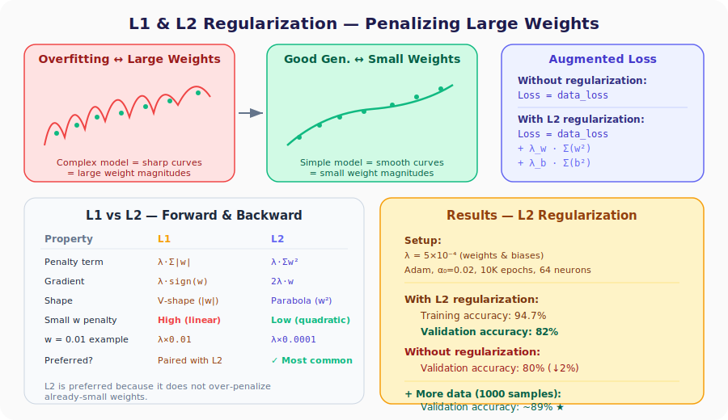

# Neural Networks from Scratch, Part 30: L1 and L2 Regularization

*Penalize large weights so the network learns smooth, simple decision boundaries instead of memorizing noise.*

We know our model overfits: the training accuracy is great but the test accuracy lags behind. The root cause: **the weights grow too large**, allowing the network to memorize training noise through sharp, complex decision boundaries. Regularization adds a **penalty** to the loss function that discourages large weights, pushing the network toward a simpler, better-generalizing solution.



---

## 1. The Core Insight

| Model type | Weights | Decision boundary | Generalization |
|-----------|---------|-------------------|---------------|
| Overfitting | Large magnitudes | Sharp, jagged | Poor |
| Good generalization | Small magnitudes | Smooth, simple | Good |

If large weights cause overfitting, we can fix it by making the loss function **punish** large weights:

$$\mathcal{L}_{\text{total}} = \underbrace{\mathcal{L}_{\text{data}}}_{\text{prediction error}} + \underbrace{\mathcal{L}_{\text{reg}}}_{\text{weight penalty}}$$

---

## 2. L1 vs. L2 Regularization

### L1: Absolute Value Penalty

$$\mathcal{L}_{\text{reg}} = \lambda \sum_m |w_m|$$

### L2: Squared Penalty

$$\mathcal{L}_{\text{reg}} = \lambda \sum_m w_m^2$$

### Why L2 Is Preferred

Consider a small weight $w = 0.01$:

| Regularizer | Penalty contribution | Effect |
|:-----------:|:-------------------:|--------|
| L1 | $\lambda \times 0.01$ | Relatively large: pushes weight to exactly zero |
| L2 | $\lambda \times 0.0001$ | Very small: allows weight to stay small but non-zero |

L1 applies a **linear** penalty, so even tiny weights are penalized heavily. L2 applies a **quadratic** penalty, so small weights escape with almost no penalty, while truly large weights get penalized hard. In practice:

- **L2 alone** is the most common choice.
- **L1 + L2** is sometimes used together.
- Pure L1 alone is rare in neural networks.

---

## 3. Forward Pass: Adding the Penalty

Everything up to the loss calculation stays unchanged. Then we add the regularization term for **every layer**:

```python
# Inside the Loss class
def regularization_loss(self, layer):
    reg_loss = 0

    # L1 on weights
    if layer.weight_regularizer_l1 > 0:
        reg_loss += layer.weight_regularizer_l1 * np.sum(np.abs(layer.weights))

    # L2 on weights
    if layer.weight_regularizer_l2 > 0:
        reg_loss += layer.weight_regularizer_l2 * np.sum(layer.weights ** 2)

    # L1 on biases
    if layer.bias_regularizer_l1 > 0:
        reg_loss += layer.bias_regularizer_l1 * np.sum(np.abs(layer.biases))

    # L2 on biases
    if layer.bias_regularizer_l2 > 0:
        reg_loss += layer.bias_regularizer_l2 * np.sum(layer.biases ** 2)

    return reg_loss
```

In the training loop:

```python
data_loss = loss_activation.forward(dense2.output, y)
reg_loss  = (loss_function.regularization_loss(dense1) +
             loss_function.regularization_loss(dense2))
loss = data_loss + reg_loss
```

---

## 4. Backward Pass: Gradient Adjustments

### L2 Gradient

$$\frac{\partial \mathcal{L}_{\text{reg}}}{\partial w_m} = 2 \lambda \, w_m$$

We simply **add** $2\lambda w$ to the already-computed $\frac{\partial \mathcal{L}_{\text{data}}}{\partial w}$.

### L1 Gradient

The absolute value is not differentiable at zero, so we use the sign function:

$$\frac{\partial \mathcal{L}_{\text{reg}}}{\partial w_m} = \lambda \cdot \text{sign}(w_m) = \begin{cases} +\lambda & w_m \geq 0 \\ -\lambda & w_m < 0 \end{cases}$$

**Worked example:** weights = [2, 8, −5]

| Weight | sign(w) | L1 gradient term |
|:------:|:-------:|:----------------:|
| 2 | +1 | +λ |
| 8 | +1 | +λ |
| −5 | −1 | −λ |

### Updated `backward` method

```python
def backward(self, dvalues):
    # Normal gradient calculations
    self.dweights = np.dot(self.inputs.T, dvalues)
    self.dbiases  = np.sum(dvalues, axis=0, keepdims=True)
    
    # L1 on weights
    if self.weight_regularizer_l1 > 0:
        dL1 = np.ones_like(self.weights)
        dL1[self.weights < 0] = -1
        self.dweights += self.weight_regularizer_l1 * dL1

    # L2 on weights
    if self.weight_regularizer_l2 > 0:
        self.dweights += 2 * self.weight_regularizer_l2 * self.weights

    # L1 on biases
    if self.bias_regularizer_l1 > 0:
        dL1 = np.ones_like(self.biases)
        dL1[self.biases < 0] = -1
        self.dbiases += self.bias_regularizer_l1 * dL1

    # L2 on biases
    if self.bias_regularizer_l2 > 0:
        self.dbiases += 2 * self.bias_regularizer_l2 * self.biases

    self.dinputs = np.dot(dvalues, self.weights.T)
```

---

## 5. Updated Layer Class

The `Layer_Dense.__init__` now accepts four regularization lambdas:

```python
class Layer_Dense:
    def __init__(self, n_inputs, n_neurons,
                 weight_regularizer_l1=0, weight_regularizer_l2=0,
                 bias_regularizer_l1=0, bias_regularizer_l2=0):
        self.weights = 0.01 * np.random.randn(n_inputs, n_neurons)
        self.biases  = np.zeros((1, n_neurons))
        # Store lambda values
        self.weight_regularizer_l1 = weight_regularizer_l1
        self.weight_regularizer_l2 = weight_regularizer_l2
        self.bias_regularizer_l1   = bias_regularizer_l1
        self.bias_regularizer_l2   = bias_regularizer_l2
```

Creating a layer **with** L2 regularization:

```python
dense1 = Layer_Dense(2, 64, weight_regularizer_l2=5e-4,
                              bias_regularizer_l2=5e-4)
```

---

## 6. Results

| Configuration | Train Acc | Val Acc |
|--------------|:---------:|:-------:|
| No regularization, 100 samples | ~93 % | **80 %** |
| **L2 (λ = 5e-4)**, 100 samples | 94.7 % | **82 %** |
| L2 + 1000 training samples | ~94 % | **~89 %** |

Regularization alone improved the validation accuracy by 2 percentage points. Combined with **more training data**, the gap between training and validation shrinks to about 5 %, a much healthier model.

> **Important:** regularization loss is only added during training. At test time we compute only the data loss.

---

## Summary

| Concept | What We Learned |
|---|---|
| Root cause | Overfitting models have large weights; good models have small weights |
| L2 regularization | $\lambda \sum w^2$: penalizes large weights without crushing small ones |
| L1 regularization | $\lambda \sum |w|$: pushes weights toward exactly zero; usually paired with L2 |
| Forward pass | Add $\mathcal{L}_{\text{reg}}$ to the data loss |
| Backward pass | Add $2\lambda w$ (L2) or $\lambda \cdot \text{sign}(w)$ (L1) to stored gradients |
| Best combo | Regularization + more data is the strongest anti-overfitting strategy |

---

## What's Next

Regularization penalizes *weights*. In **Part 31** we introduce **dropout**, a technique that randomly *disables neurons* during training, forcing the network to distribute knowledge across all neurons rather than relying on a few.

---

> **Try It Yourself:** Hands-on exercises for this lecture are in [Exercises](../../exercises.md) and [Quizzes](../../quizzes.md).
