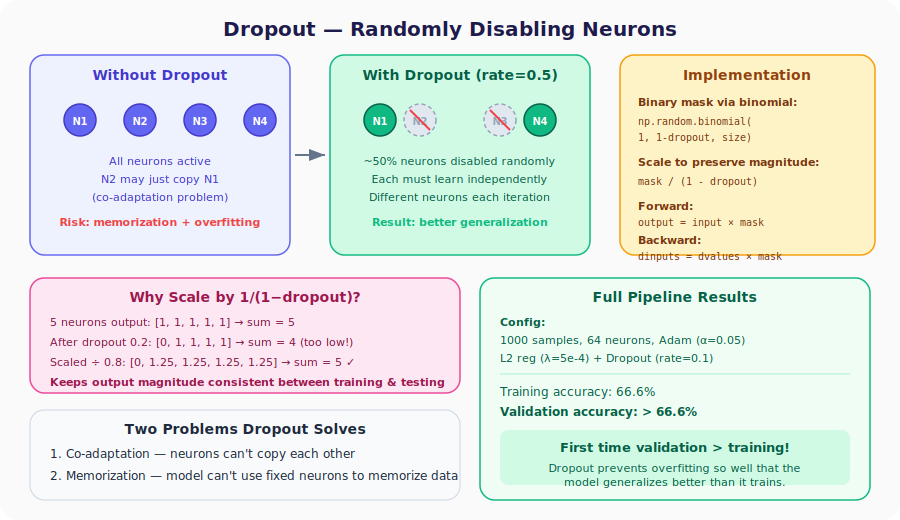
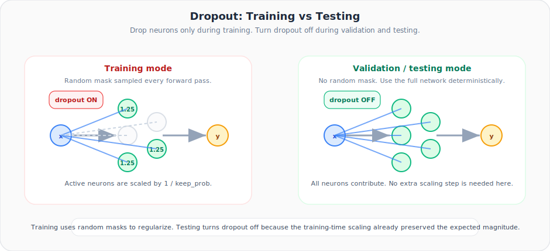

# Neural Networks from Scratch, Part 31: Dropout

*Randomly disable neurons during training. For the first time, validation accuracy exceeds training accuracy.*

Regularization penalizes **weights**. Dropout tackles overfitting from a different angle: it randomly **disables neurons** during training, forcing every neuron to be independently useful. The result: for the first time in our entire series, the validation accuracy exceeds the training accuracy.



---

## 1. Why Dropout Works

### Problem 1: Co-Adaptation

In a fully-connected network, some neurons become lazy. Neuron 2 discovers it can just copy Neuron 1's output and still keep the loss low. This **co-adaptation** means half the neurons are not learning anything original. On new data they parrot the same patterns and fail.

### Problem 2: Memorization

A model can dedicate specific neurons to memorize specific training samples. That is the definition of overfitting.

### The Fix

During each forward pass, **randomly set a fraction of neuron outputs to zero**. In the next iteration, different neurons are disabled. This forces:

1. Every neuron to learn **its own** useful features (can't rely on neighbors).
2. The network to distribute knowledge **across all neurons** (can't use one neuron to memorize).

> Dropout does **not** speed up computation: the neurons are still there; only their outputs are zeroed.

---

## 2. The Dropout Rate

The **dropout rate** (e.g. 0.2) specifies what fraction of neurons to disable.

| Dropout rate | Neurons active (on average) | Typical use |
|:---:|:---:|---|
| 0.0 | 100 % | No dropout |
| 0.1 | 90 % | Light regularization |
| 0.2 | 80 % | Common default |
| 0.5 | 50 % | Aggressive regularization |
| 0.8+ | 20 % | Almost all inactive — usually too much |

The dropout rate is a **hyperparameter**: it can differ per layer.

### Practical starting points

- `0.1` to `0.2` is a strong first choice for hidden layers in this series.
- `0.5` is much more aggressive and can underfit if the network is already small.
- Input layers usually use lower dropout than deep hidden layers.
- The final output layer is usually **not** where you apply dropout.

---

## 3. Implementation via the Binomial Distribution

We need random arrays of 0s and 1s where the probability of 1 is $(1 - \text{dropout\_rate})$:

```python
np.random.binomial(1, 1 - dropout_rate, size=number_of_neurons)
# Example with dropout_rate = 0.2, 5 neurons:
# → array([1, 0, 1, 1, 1])   (≈ one zero on average)
```

### Scaling to Preserve Magnitude

If we zero out 20 % of outputs, the sum flowing to the next layer drops by 20 %. To compensate, we **divide by** $(1 - \text{dropout\_rate})$ during training:

```
Original outputs:  [1,   1,    1,    1,    1]     sum = 5
After dropout:     [0,   1,    1,    1,    1]     sum = 4  (too low)
Scaled ÷ 0.8:     [0, 1.25, 1.25, 1.25, 1.25]   sum = 5  ✓
```

This way, during **testing** (when we use all neurons) the magnitudes are already correct; no special adjustments needed.

---

## 4. Coding the Dropout Layer

```python
class Layer_Dropout:

    def __init__(self, rate):
        # Store 1 - dropout_rate (the "keep" probability)
        self.rate = 1 - rate

    def forward(self, inputs):
        self.inputs = inputs
        # Binary mask scaled by 1/(1-dropout)
        self.binary_mask = (
            np.random.binomial(1, self.rate, size=inputs.shape)
            / self.rate
        )
        self.output = inputs * self.binary_mask

    def backward(self, dvalues):
        # Same mask applied to gradients
        self.dinputs = dvalues * self.binary_mask
```

The backward pass is trivial: if a neuron was zeroed in the forward pass, its gradient is also zero (the mask already encodes this). Active neurons pass through the scaled gradient.

---

## 5. Plugging Dropout into the Network

Dropout layers are inserted **after** activation functions:

```
Input → Dense(2, 64) → ReLU → [Dropout(0.1)] → Dense(64, 3) → Softmax+Loss
```

### Full Training Loop

```python
X, y = spiral_data(samples=1000, classes=3)

dense1      = Layer_Dense(2, 64, weight_regularizer_l2=5e-4,
                                  bias_regularizer_l2=5e-4)
activation1 = Activation_ReLU()
dropout1    = Layer_Dropout(0.1)                     # ← NEW
dense2      = Layer_Dense(64, 3)
loss_activation = Activation_Softmax_Loss_CategoricalCrossentropy()

optimizer = Optimizer_Adam(learning_rate=0.05, decay=1e-5)

for epoch in range(10001):
    # ── Forward ──
    dense1.forward(X)
    activation1.forward(dense1.output)
    dropout1.forward(activation1.output)             # ← dropout applied
    dense2.forward(dropout1.output)                  # ← uses dropout output
    data_loss = loss_activation.forward(dense2.output, y)

    reg_loss = (loss_activation.loss.regularization_loss(dense1) +
                loss_activation.loss.regularization_loss(dense2))
    loss = data_loss + reg_loss

    # ── Backward ──
    loss_activation.backward(loss_activation.output, y)
    dense2.backward(loss_activation.dinputs)
    dropout1.backward(dense2.dinputs)                # ← dropout backward
    activation1.backward(dropout1.dinputs)
    dense1.backward(activation1.dinputs)

    # ── Optimize ──
    optimizer.pre_update_params()
    optimizer.update_params(dense1)
    optimizer.update_params(dense2)
    optimizer.post_update_params()
```


## 5.5. Training Mode vs Testing Mode

| Mode | Dropout active? | Why |
|---|---|---|
| Training | **Yes** | Force the network to avoid co-adaptation |
| Validation / Testing | **No** | Evaluate the full network deterministically |

Each training forward pass samples a **new random mask**. Validation and test passes must not do that.

> **Rule to remember:** dropout is ON during training, OFF during validation and testing.

This motion view makes the train-vs-test switch explicit: random neurons disappear only during training, while test-time inference uses the full network.



### Testing (No Dropout!)

```python
X_test, y_test = spiral_data(samples=1000, classes=3)

dense1.forward(X_test)
activation1.forward(dense1.output)
# ── NO dropout during testing ──
dense2.forward(activation1.output)
loss = loss_activation.forward(dense2.output, y_test)

predictions = np.argmax(loss_activation.output, axis=1)
accuracy = np.mean(predictions == y_test)
print(f'Validation accuracy: {accuracy:.3f}')
```

---

## 6. Results

| Metric | Value |
|--------|:-----:|
| Training accuracy | 66.6 % |
| **Validation accuracy** | **> 66.6 %** |

For the **first time in the entire series**, the validation accuracy is higher than the training accuracy. That gap confirms dropout is actively preventing overfitting: the model is penalized on training (because neurons are missing) but gets the full network at test time.

> The training accuracy looks lower than earlier experiments because dropout makes the network's job harder during training. That is by design — easier training ≠ better generalization.

---

## Summary

| Concept | What We Learned |
|---|---|
| Dropout | Randomly sets neuron outputs to zero during training |
| Solves | Co-adaptation (lazy neurons) and memorization (dedicated neurons) |
| Mask | `np.random.binomial(1, 1-rate, size)` divided by `(1-rate)` for magnitude consistency |
| Backward | Gradients are masked with the same binary mask |
| Testing | Dropout is turned off; all neurons are active |
| Result | Combined with L2 and Adam, achieved the first validation-beats-training result |

That does **not** mean the validation split is "easier." It means training is intentionally harder because some neurons are missing on each pass.

---

## Series Complete!

Congratulations — you have built a neural network **entirely from scratch**: forward pass, backward pass, five optimizers, regularization, and dropout. Every matrix multiply, every gradient, every update rule — coded by hand.

Here is a summary of every tool in your toolkit:

| Component | Lectures |
|-----------|:--------:|
| Neurons, layers, dense class | 1 – 4 |
| Activation functions (ReLU, Softmax) | 5 – 7 |
| Loss (Cross-Entropy) | 8 – 9 |
| Optimization intro | 10 |
| Calculus, chain rule, backprop | 11 – 21 |
| Optimizers (SGD → Decay → Momentum → AdaGrad → RMSProp → **Adam**) | 22 – 27 |
| Generalization, validation, k-fold CV | 28 – 29 |
| Regularization (L1 / L2) | 30 |
| **Dropout** | **31** |

Go experiment: change hyperparameters, swap optimizers, adjust dropout rates, add layers, and watch how each change shapes the model's learning.

---

> **Try It Yourself:** Hands-on exercises for this lecture are in [Exercises](../../exercises.md) and [Quizzes](../../quizzes.md).
