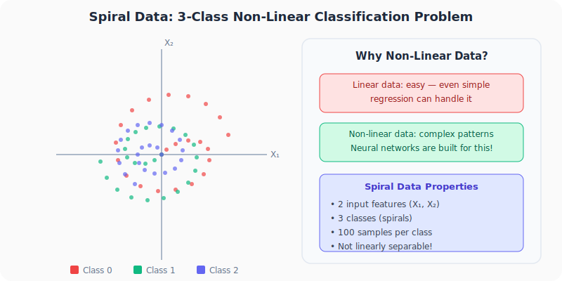
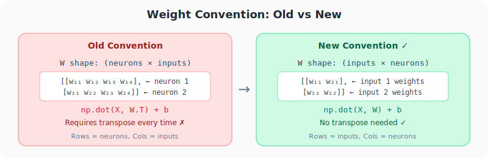
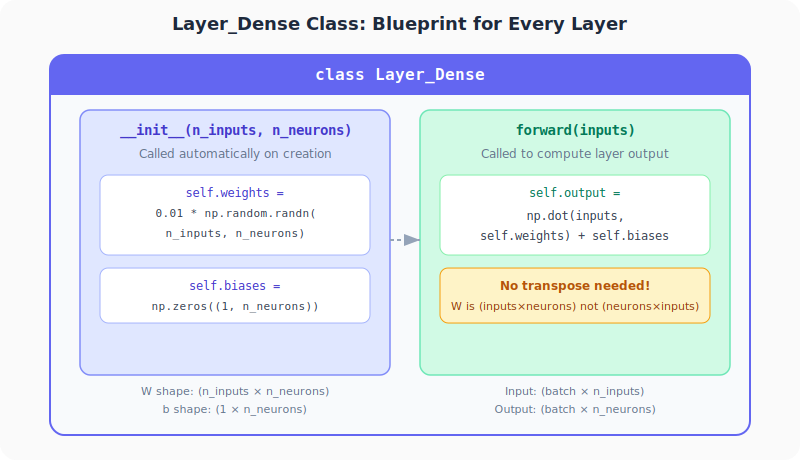

# Neural Networks from Scratch, Part 4: The Dense Layer Class & Spiral Data

*From hardcoded dot products to reusable Python classes, and our first real training data.*

---

## Why This Lecture Matters

Up to now, we've been writing `np.dot()` calls manually for every layer. That works for 2 layers but becomes unmanageable for 50. In this post, we build the `Layer_Dense` class, a reusable blueprint that handles weight initialization and forward computation for **any** layer, with a single line of code.

We also introduce **spiral data**, a non-linear classification problem that simple models can't solve. This is the dataset we'll use for the rest of the series.

---

## 1. Why Non-Linear Data?



Neural networks are overkill for linear data. Even basic regression can handle straight-line patterns. The real power of neural networks lies in finding patterns in **complex, non-linear data**.

The **spiral dataset** is a classic challenge:
- **2 input features** (X₁, X₂)
- **3 classes** (three intertwined spirals)
- **Not linearly separable**: no straight line can separate the classes

By the end of this series, our from-scratch neural network will learn to classify this data correctly.

### Generating Spiral Data

We use a helper package `nnfs` that provides a `spiral_data` function:

```python
import numpy as np
import nnfs
from nnfs.datasets import spiral_data

nnfs.init()

X, y = spiral_data(samples=100, classes=3)
# X.shape = (300, 2)  — 300 total samples, 2 features each
# y.shape = (300,)     — class label for each sample (0, 1, or 2)
```

- `X` contains the coordinates: 100 samples per class × 3 classes = 300 rows
- `y` contains the class labels (0, 1, or 2)

---

## 2. Python OOP Crash Course

Before building the class, let's demystify three terms that appear everywhere in Python neural network code:

### Class = Blueprint

```python
class Dog:
    def __init__(self, name, age):
        self.name = name
        self.age = age
```

A class defines the **structure**: what attributes and methods an object will have.

### Instance = Specific Object

```python
my_dog = Dog("Buddy", 3)
your_dog = Dog("Lucy", 5)
```

Each call creates a **separate object** with its own data. `my_dog.name` is "Buddy", `your_dog.name` is "Lucy".

### `self` = "This Specific Instance"

When you write `self.name = name` inside `__init__`, you're saying: "Store this value so **this particular instance** can access it later."

### `__init__` = Auto-Called on Creation

The `__init__` method runs **automatically** when you create an instance. You never call it directly.

---

## 3. The Weight Convention Change



Before building the class, we adopt a new convention. Previously, each **row** of W was one neuron's weights:

```
W = (neurons × inputs)  →  need W.T every time
```

Now, each **column** of W is one neuron's weights:

```
W = (inputs × neurons)  →  no transpose needed!
```

This simplifies the forward pass from `np.dot(X, W.T) + b` to just:

$$\text{output} = \text{np.dot}(X, W) + b$$

---

## 4. Building the Layer_Dense Class



```python
import numpy as np

class Layer_Dense:

    def __init__(self, n_inputs, n_neurons):
        # Initialize weights: small random values from Gaussian distribution
        self.weights = 0.01 * np.random.randn(n_inputs, n_neurons)
        # Initialize biases: zeros
        self.biases = np.zeros((1, n_neurons))

    def forward(self, inputs):
        # Calculate output: dot product + bias
        self.output = np.dot(inputs, self.weights) + self.biases
```

**That's it.** Two methods, six lines of actual code.

### Why `0.01 * np.random.randn()`?

`np.random.randn()` samples from a Gaussian (normal) distribution with mean=0, std=1. Multiplying by 0.01 keeps initial weights **very small**, which prevents outputs from exploding before the network has learned anything.

### Why `np.zeros()` for biases?

Starting biases at zero is standard practice. The weights already provide asymmetry between neurons, so biases don't need to add more randomness at initialization.

---

## 5. Using the Class

### Single layer with spiral data

```python
import numpy as np
import nnfs
from nnfs.datasets import spiral_data

nnfs.init()

X, y = spiral_data(samples=100, classes=3)

# Create a layer: 2 inputs (X₁, X₂), 3 neurons
dense1 = Layer_Dense(2, 3)

# Forward pass
dense1.forward(X)

print(dense1.output[:5])
```

**Output (random weights, yours will differ):**
```
[[ 0.0000e+00  0.0000e+00  0.0000e+00]
 [-1.0475e-04 -1.7756e-04 -2.2541e-04]
 [-2.0942e-04 -3.5502e-04 -4.5070e-04]
 [ 0.0000e+00  0.0000e+00  0.0000e+00]
 [ 3.2736e-05 -7.3169e-05  5.4913e-05]]
```

### Dimension trace

```
X:       (300 × 2)     — 300 samples, 2 features
W:       (2 × 3)       — 2 inputs, 3 neurons
X · W:   (300×2)·(2×3) = (300 × 3)
+ b:     (1 × 3)       — broadcast across 300 rows
Output:  (300 × 3)     — 300 samples, 3 outputs
```

### Stacking two layers

```python
# Layer 1: takes 2 inputs, has 3 neurons
dense1 = Layer_Dense(2, 3)

# Layer 2: takes 3 inputs (Layer 1's outputs), has 3 neurons
dense2 = Layer_Dense(3, 3)

# Forward pass through both layers
dense1.forward(X)
dense2.forward(dense1.output)

print(dense2.output[:5])
```

Notice how `dense2` takes **3 inputs** because `dense1` outputs 3 values (one per neuron). The output of one layer determines the input size of the next.

---

## 6. How Instances Keep Things Separate

Each `Layer_Dense(...)` call creates a **separate** object with its own weights and biases:

```python
dense1 = Layer_Dense(2, 3)   # has its own W₁ (2×3) and b₁ (1×3)
dense2 = Layer_Dense(3, 3)   # has its own W₂ (3×3) and b₂ (1×3)
```

- `dense1.weights` and `dense2.weights` are **completely independent**
- `dense1.forward(X)` computes with `dense1`'s weights
- `dense2.forward(dense1.output)` computes with `dense2`'s weights

This is the power of object-oriented programming: each layer manages its own state.

---

## Summary

| Concept | What We Learned |
|---------|----------------|
| **Spiral data** | Non-linear 3-class problem with 2D inputs, our training dataset |
| **`Layer_Dense.__init__`** | Initializes weights from Gaussian (×0.01) and biases as zeros |
| **`Layer_Dense.forward`** | Computes `np.dot(inputs, self.weights) + self.biases` |
| **Weight convention** | W is now `(inputs × neurons)`, no transpose needed |
| **Stacking layers** | `dense2.forward(dense1.output)`, each layer is an independent instance |

---

## What's Next

In **Part 5**, we'll explore:
- NumPy's `axis` parameter for summation
- The `keepdims` trick for broadcasting
- How array broadcasting rules work

These are essential tools for computing loss functions and activation functions later.

---

> **Try It Yourself:** Hands-on exercises for this lecture are in [Exercises](../../exercises.md) and [Quizzes](../../quizzes.md).
