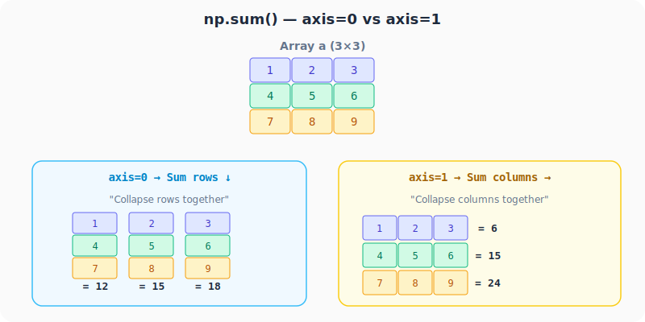
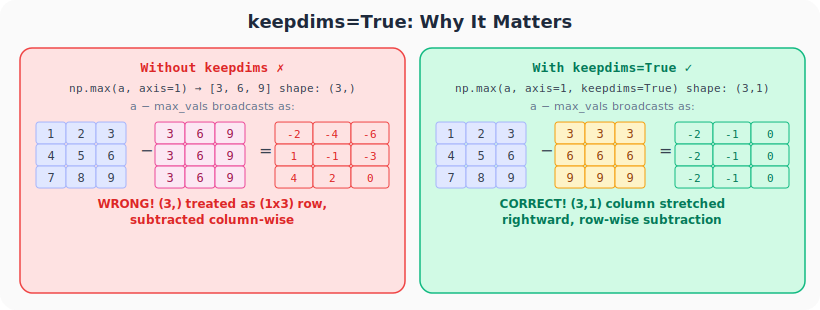
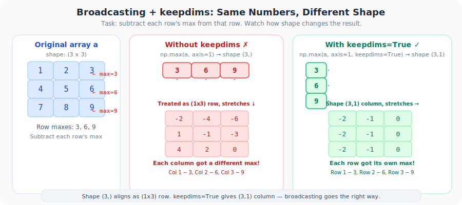
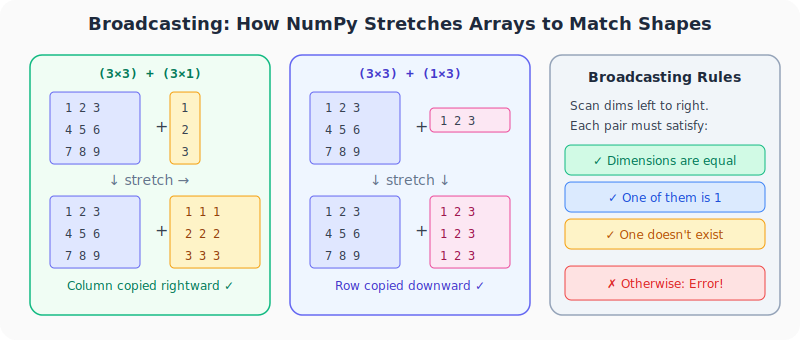

# Neural Networks from Scratch, Part 5: Array Summation, keepdims & Broadcasting

*Two NumPy concepts that trip up every beginner, and show up everywhere in neural network code.*

---

## Why This Lecture Matters

Before we can implement **Softmax** or **Cross-Entropy Loss**, we need to be comfortable with two NumPy features that appear in almost every neural network implementation:

1. **`axis` and `keepdims`**: controlling *how* arrays are summed
2. **Broadcasting**: how NumPy automatically stretches arrays to make shapes compatible

These seem like minor details until you get a **wrong answer with no error message**, the worst kind of bug.

---

## 1. Array Summation with `axis`

Given a 3×3 array:

```python
import numpy as np

a = np.array([[1, 2, 3],
              [4, 5, 6],
              [7, 8, 9]])
```



### No axis: flatten everything

```python
np.sum(a)           # 45 (1+2+3+4+5+6+7+8+9)
np.sum(a, axis=None) # 45 (same thing)
```

### `axis=0`: collapse rows (sum downward ↓)

```python
np.sum(a, axis=0)   # [12, 15, 18]
```

Each column is summed: `1+4+7=12`, `2+5+8=15`, `3+6+9=18`.

### `axis=1`: collapse columns (sum rightward →)

```python
np.sum(a, axis=1)   # [6, 15, 24]
```

Each row is summed: `1+2+3=6`, `4+5+6=15`, `7+8+9=24`.

> **Memory trick:** `axis=0` collapses axis 0 (rows), `axis=1` collapses axis 1 (columns). The axis you specify is the one that **disappears**.

### The shape problem

Both results above are **1D arrays** with shape `(3,)`. This matters when you try to use them in further operations, as we'll see next.

---

## 2. `keepdims=True`: Preserving Dimensions

Adding `keepdims=True` keeps the result as a **2D array**:

```python
# Without keepdims
np.sum(a, axis=0)                    # [12, 15, 18]  shape: (3,)
np.sum(a, axis=1)                    # [6, 15, 24]   shape: (3,)

# With keepdims=True
np.sum(a, axis=0, keepdims=True)     # [[12, 15, 18]]  shape: (1, 3) — row vector
np.sum(a, axis=1, keepdims=True)     # [[6], [15], [24]]  shape: (3, 1) — column vector
```

| Parameters | Result | Shape | Type |
|------------|--------|:---:|------|
| `axis=0` | `[12, 15, 18]` | (3,) | 1D |
| `axis=0, keepdims=True` | `[[12, 15, 18]]` | (1, 3) | 2D row vector |
| `axis=1` | `[6, 15, 24]` | (3,) | 1D |
| `axis=1, keepdims=True` | `[[6], [15], [24]]` | (3, 1) | 2D column vector |

This distinction is **critical** for correct broadcasting.

---

## 3. Why keepdims Matters: A Practical Example



**Task:** Subtract the maximum of each row from that row.

Expected result: `[[-2, -1, 0], [-2, -1, 0], [-2, -1, 0]]`

### Without keepdims (WRONG)

```python
max_vals = np.max(a, axis=1)          # [3, 6, 9], shape: (3,)
result = a - max_vals                  # Broadcasting treats (3,) as (1,3)!
print(result)
```
```
[[-2, -4, -6],
 [ 1, -1, -3],
 [ 4,  2,  0]]   ← WRONG!
```

NumPy treats the 1D array `[3, 6, 9]` as shape `(1, 3)`, a **row**. It subtracts 3 from column 1, 6 from column 2, 9 from column 3. Not what we wanted!

### With keepdims (CORRECT)

```python
max_vals = np.max(a, axis=1, keepdims=True)  # [[3], [6], [9]], shape: (3, 1)
result = a - max_vals                         # Column broadcasts rightward
print(result)
```
```
[[-2, -1, 0],
 [-2, -1, 0],
 [-2, -1, 0]]   ← CORRECT!
```

The `(3, 1)` column vector broadcasts **rightward**, subtracting 3 from row 1, 6 from row 2, 9 from row 3.

> **Rule of thumb:** When you need to operate on each row independently, use `axis=1, keepdims=True`. This gives you a column vector that broadcasts correctly across columns.

### See the shapes line up



`np.max(a, axis=1)` returns shape `(3,)`. In a 2D operation, NumPy aligns **trailing dimensions**, so `(3,)` behaves like `(1, 3)`, not like `(3, 1)`. `keepdims=True` preserves the second axis and gives the column shape we actually wanted.

---

## 4. Broadcasting Rules



Broadcasting is how NumPy handles operations between arrays of **different shapes**. It automatically "stretches" the smaller array to match the larger one.

### The Three Rules

When operating on two arrays, NumPy compares their shapes starting from the **trailing dimensions**, in other words, **right to left**. Each compared dimension must satisfy **one** of:

1. **Equal**: both dimensions are the same
2. **One is 1**: the dimension with 1 gets stretched
3. **One doesn't exist**: treated as 1 (gets stretched)

If none of these conditions hold → **error**.

### Examples

```python
# (3,3) + (3,1) → ✓ (3=3, 3 vs 1 → stretch)
# (3,3) + (1,3) → ✓ (3 vs 1 → stretch, 3=3)
# (3,3) + (3,)  → ✓ (3,) behaves like (1,3), then stretches downward
# (3,3) + (2,3) → ✗ (3≠2, neither is 1 → ERROR)
```

This right-to-left alignment is why 1D arrays surprise people so often. A shape like `(3,)` does **not** behave like a column by default.

### How stretching works

| Original shape | Treated as | Stretches to match |
|:---:|:---:|:---:|
| `(3, 1)` | column | Copies rightward → `(3, 3)` |
| `(1, 3)` | row | Copies downward → `(3, 3)` |
| `(3,)` | 1D | Becomes `(1, 3)` row, copies downward |

This is exactly why `keepdims` matters. It controls whether your result is a column `(3, 1)` or a 1D array `(3,)` that becomes a row `(1, 3)`.

---

## 5. Broadcasting in Neural Networks

Remember the forward pass formula?

$$\text{output} = \text{np.dot}(X, W) + b$$

Where `np.dot(X, W)` might be `(300, 3)` and `b` is `(1, 3)`. How can we add a **(300×3)** matrix and a **(1×3)** vector?

Broadcasting! NumPy checks:
- Dimension 1: 300 vs 1 → stretch the 1 ✓
- Dimension 2: 3 = 3 ✓

So `b = [2.0, 3.0, 0.5]` becomes:
```
[[2.0, 3.0, 0.5],
 [2.0, 3.0, 0.5],
 ...                ← 300 rows
 [2.0, 3.0, 0.5]]
```

The same bias values are added to every sample in the batch.

---

## Quick Reference

| Operation | axis | keepdims | Shape | Direction |
|-----------|:---:|:---:|:---:|-----------|
| `np.sum(a)` | None | - | scalar | Sum everything |
| `np.sum(a, axis=0)` | 0 | False | (3,) | Collapse rows ↓ |
| `np.sum(a, axis=1)` | 1 | False | (3,) | Collapse cols → |
| `np.sum(a, axis=0, keepdims=True)` | 0 | True | (1,3) | Row vector |
| `np.sum(a, axis=1, keepdims=True)` | 1 | True | (3,1) | Column vector |

---

## What's Next

In **Part 6**, we'll use these tools to implement:
- **ReLU** activation function
- **Softmax** activation function (which needs `axis=1, keepdims=True` and broadcasting!)

---

> **Try It Yourself:** Hands-on exercises for this lecture are in [Exercises](../../exercises.md) and [Quizzes](../../quizzes.md).
