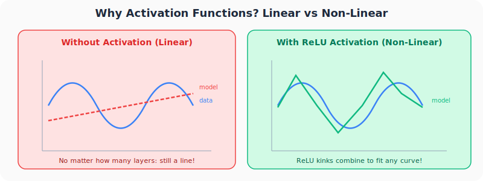
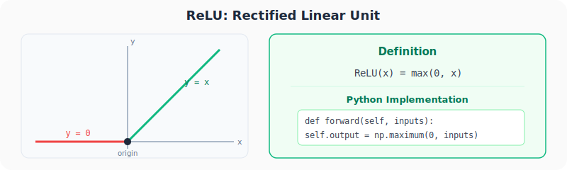
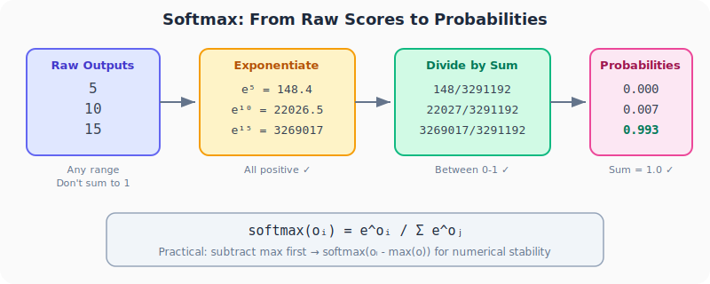
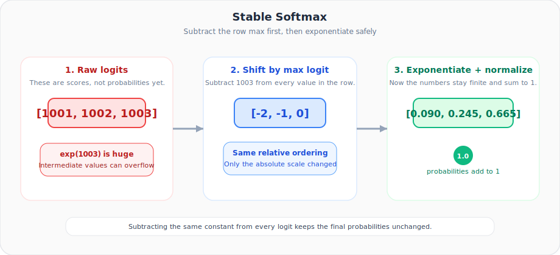
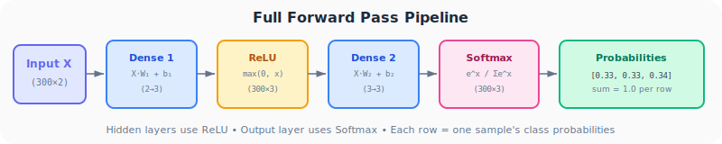

# Neural Networks from Scratch, Part 6: Activation Functions (ReLU & Softmax)

*The single most important ingredient that gives neural networks their power.*

---

## Why This Lecture Matters

Without activation functions, a neural network, no matter how deep, is just a fancy linear regression. Activation functions inject **non-linearity**, allowing networks to learn curves, spirals, and any complex pattern. This post covers the two activations we need:

- **ReLU** for hidden layers (introduces non-linearity)
- **Softmax** for the output layer (converts scores to probabilities)

---

## 1. The Problem: Stacked Linear Layers Are Still Linear



Currently our network computes:

$$F_2 = (X \cdot W_1 + b_1) \cdot W_2 + b_2$$

This is just matrix multiplication and addition, all **linear operations**. No matter how many layers we stack, the result collapses into a single linear transformation. A 100-layer network with no activation is mathematically equivalent to a 1-layer network.

The fix: apply a non-linear function **after each layer**.

$$F_2 = f_2(f_1(X \cdot W_1 + b_1) \cdot W_2 + b_2)$$

Where $f_1$ and $f_2$ are activation functions.

---

## 2. ReLU: Rectified Linear Unit



The simplest useful activation function:

$$\text{ReLU}(x) = \max(0, x)$$

- If input is positive → pass it through unchanged
- If input is negative → output zero

### Why does this tiny change matter?

A single ReLU creates a "kink," a hard bend at zero. By combining many neurons with different weights and biases, these kinks can be shifted and scaled to approximate **any curve**. The non-linearity compounds as layers are stacked.

### Implementation

```python
class Activation_ReLU:

    def forward(self, inputs):
        self.output = np.maximum(0, inputs)
```

That's it: one line. Note: `np.maximum` (element-wise max), not `np.max` (array-wide max).

```python
inputs = np.array([1, -2, 3, -0.5, 0])
relu_output = np.maximum(0, inputs)
# [1, 0, 3, 0, 0]
```

---

## 3. Why ReLU Isn't Enough for Classification

ReLU outputs can be **any non-negative number**: 0, 5, 10000. For classification (is this sample red, green, or blue?), we need:

1. Outputs between **0 and 1**
2. Outputs that **sum to 1** (probabilities)
3. A way to say "this sample has 80% chance of being class 2"

ReLU gives us none of these. That's why the **output layer** needs a different activation.

---

## 4. Softmax: Turning Scores into Probabilities



Softmax converts raw scores (any real numbers) into a valid probability distribution:

$$\text{softmax}(o_i) = \frac{e^{o_i}}{\sum_j e^{o_j}}$$

### Logits first, probabilities second

The dense layer does **not** output probabilities. It outputs raw scores, often called **logits**. Logits can be negative, positive, large, or small. Softmax turns those scores into something interpretable:

- bigger logits become bigger probabilities,
- smaller logits become smaller probabilities,
- and the final row sums to 1.

So softmax is not creating information from nowhere. It is **re-scaling relative scores** into a probability distribution.

### Three guarantees

| Property | Why it holds |
|----------|-------------|
| **All outputs > 0** | Exponential is always positive |
| **All outputs < 1** | Numerator is one term of the denominator sum |
| **Sum = 1** | $\sum \frac{e^{o_i}}{\sum e^{o_j}} = \frac{\sum e^{o_i}}{\sum e^{o_j}} = 1$ |

### Numerical stability trick

Raw exponentials can overflow (`e^1000` → infinity). Solution: subtract the row maximum first:

$$\text{softmax}(o_i) = \frac{e^{o_i - \max(o)}}{\sum_j e^{o_j - \max(o)}}$$

This is mathematically identical but keeps numbers manageable.

Why is it identical? Because subtracting the same constant $c$ from every logit multiplies both the numerator and denominator by the same factor:

$$
\frac{e^{o_i - c}}{\sum_j e^{o_j - c}} = \frac{e^{-c} e^{o_i}}{e^{-c} \sum_j e^{o_j}} = \frac{e^{o_i}}{\sum_j e^{o_j}}
$$

So the probabilities stay the same even though the intermediate exponentials become much safer to compute.



### Implementation

```python
class Activation_Softmax:

    def forward(self, inputs):
        # Subtract max for numerical stability (per row)
        exp_values = np.exp(inputs - np.max(inputs, axis=1, keepdims=True))

        # Normalize by row sum
        probabilities = exp_values / np.sum(exp_values, axis=1, keepdims=True)

        self.output = probabilities
```

### Why `axis=1, keepdims=True`?

From Part 5: `axis=1` operates along columns (per row), and `keepdims=True` preserves the `(n, 1)` column shape so broadcasting works correctly. Without `keepdims=True`, you'd get **wrong results** where max values get subtracted from the wrong rows.

---

## 5. The Full Forward Pass



Putting it all together with spiral data:

```python
import numpy as np
import nnfs
from nnfs.datasets import spiral_data

nnfs.init()

X, y = spiral_data(samples=100, classes=3)

# Create layers and activations
dense1 = Layer_Dense(2, 3)          # 2 inputs → 3 neurons
activation1 = Activation_ReLU()

dense2 = Layer_Dense(3, 3)          # 3 inputs → 3 neurons
activation2 = Activation_Softmax()

# Forward pass
dense1.forward(X)                    # Linear: X·W₁ + b₁
activation1.forward(dense1.output)   # Non-linear: ReLU

dense2.forward(activation1.output)   # Linear: ReLU_out·W₂ + b₂
activation2.forward(dense2.output)   # Probabilities: Softmax

# Check results
print(activation2.output[:5])
```

**Output (first 5 samples):**
```
[[0.33333 0.33333 0.33334]
 [0.33332 0.33332 0.33336]
 [0.33330 0.33331 0.33339]
 [0.33333 0.33333 0.33334]
 [0.33334 0.33333 0.33333]]
```

Each row sums to 1.0. The probabilities are roughly equal (~0.33 each) because the network hasn't been trained yet; it's just random weights. Training will push these toward confident predictions.

### The pattern

| Layer | Role | Activation |
|-------|------|-----------|
| Hidden layers | Feature extraction | **ReLU** |
| Output layer | Classification | **Softmax** |

---

## Summary

| Concept | What We Learned |
|---------|----------------|
| **Why activations** | Without them, any depth of layers collapses to a single linear function |
| **ReLU** | `max(0, x)`: zeros out negatives, passes positives. Used in hidden layers |
| **Softmax** | `e^x / sum(e^x)`: converts to probabilities (0-1, sum=1). Used in output layer |
| **Stability trick** | Subtract row max before exponentiating to prevent overflow |
| **Broadcasting** | `axis=1, keepdims=True` ensures per-row operations broadcast correctly |

---

## What's Next

In **Part 7**, we'll code the **complete forward pass** end-to-end and in **Part 8** we'll implement the **loss function** (Categorical Cross-Entropy) that measures how wrong our predictions are. That's the first step toward training.


---

> **Try It Yourself:** Hands-on exercises for this lecture are in [Exercises](../../exercises.md) and [Quizzes](../../quizzes.md).
