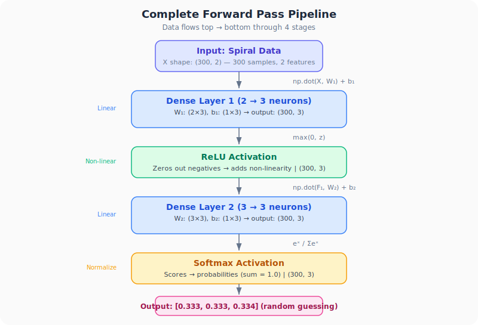
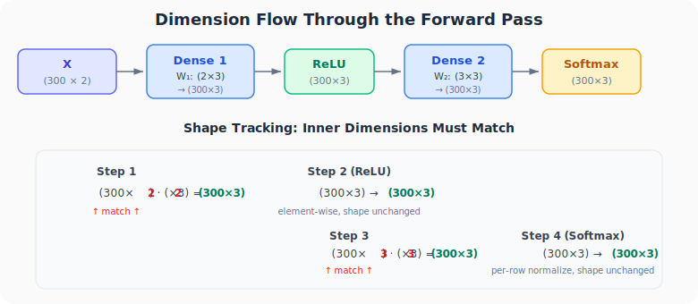

# Neural Networks from Scratch, Part 7: Coding the Complete Forward Pass

*Putting every building block together (neurons, layers, ReLU, Softmax) into one working pipeline.*

---

## The Milestone

We've built every piece individually. Now we assemble them into a **complete forward pass**: feeding spiral data through a two-layer network and getting probability outputs. This is the first time our code runs end-to-end.

---

## The Architecture



```
Input (2 features)
    ↓
Dense Layer 1 (2→3):  X·W₁ + b₁
    ↓
ReLU Activation:      max(0, output)
    ↓
Dense Layer 2 (3→3):  F₁·W₂ + b₂
    ↓
Softmax Activation:   e^x / Σe^x
    ↓
Output (3 probabilities)
```

In math, the complete forward pass computes:

$$\text{output} = \text{softmax}(\text{ReLU}(X \cdot W_1 + b_1) \cdot W_2 + b_2)$$

---

## The Full Code

All four classes we've built so far:

```python
import numpy as np
import nnfs
from nnfs.datasets import spiral_data

nnfs.init()

# ========== Classes ==========

class Layer_Dense:
    def __init__(self, n_inputs, n_neurons):
        self.weights = 0.01 * np.random.randn(n_inputs, n_neurons)
        self.biases = np.zeros((1, n_neurons))

    def forward(self, inputs):
        self.output = np.dot(inputs, self.weights) + self.biases

class Activation_ReLU:
    def forward(self, inputs):
        self.output = np.maximum(0, inputs)

class Activation_Softmax:
    def forward(self, inputs):
        exp_values = np.exp(inputs - np.max(inputs, axis=1, keepdims=True))
        probabilities = exp_values / np.sum(exp_values, axis=1, keepdims=True)
        self.output = probabilities

# ========== Data ==========

X, y = spiral_data(samples=100, classes=3)

# ========== Create Network ==========

dense1 = Layer_Dense(2, 3)        # Layer 1: 2 inputs, 3 neurons
activation1 = Activation_ReLU()   # Hidden activation

dense2 = Layer_Dense(3, 3)        # Layer 2: 3 inputs, 3 neurons
activation2 = Activation_Softmax() # Output activation

# ========== Forward Pass ==========

dense1.forward(X)                    # Step 1: X·W₁ + b₁
activation1.forward(dense1.output)   # Step 2: ReLU(step 1)
dense2.forward(activation1.output)   # Step 3: F₁·W₂ + b₂
activation2.forward(dense2.output)   # Step 4: Softmax(step 3)

# ========== Results ==========

print(activation2.output[:5])
```

**Output:**
```
[[0.33333 0.33333 0.33334]
 [0.33332 0.33332 0.33336]
 [0.33330 0.33331 0.33339]
 [0.33333 0.33333 0.33334]
 [0.33334 0.33333 0.33333]]
```

---

## Tracing the Dimensions



| Step | Operation | Input Shape | Output Shape |
|------|-----------|:---:|:---:|
| 1 | Dense 1 | (300, 2) | (300, 3) |
| 2 | ReLU | (300, 3) | (300, 3) |
| 3 | Dense 2 | (300, 3) | (300, 3) |
| 4 | Softmax | (300, 3) | (300, 3) |

- **300 rows** = 100 samples × 3 classes
- **3 columns** = 3 output neurons (one per class)
- Each row sums to **1.0** (probabilities)

---

## What the Output Tells Us

Every row is approximately `[0.333, 0.333, 0.333]` because the network is **guessing randomly**. With untrained (random) weights, the softmax outputs roughly equal probabilities for all classes. This makes sense: the network hasn't learned anything yet.

The next step is to define a **loss function** that quantifies *how wrong* these predictions are, so we can start training.

---

## The Power of Classes

Notice we never wrote `np.dot()` in the forward pass code. The classes handle everything:

```python
dense1.forward(X)                    # dot product inside
activation1.forward(dense1.output)   # ReLU inside
dense2.forward(activation1.output)   # dot product inside
activation2.forward(dense2.output)   # softmax inside
```

Adding more layers is trivial. Just add more `Layer_Dense` + `Activation` pairs.

---

## Summary

| Concept | What We Learned |
|---------|----------------|
| **End-to-end pipeline** | Dense → ReLU → Dense → Softmax processes input to probabilities |
| **Untrained output** | Random weights produce ~0.333 per class (uniform guessing) |
| **Shapes are preserved** | (300, 2) → (300, 3) → (300, 3) → (300, 3) → (300, 3) |
| **Classes encapsulate** | `forward()` hides dot products and activations behind clean interfaces |
| **Extensibility** | Adding layers = adding more Dense + Activation pairs |

> **Why is ~0.333 meaningful?** With 3 classes and untrained (random) weights, the network has no information to prefer any class. Softmax normalizes raw scores into probabilities that sum to 1.0, so each class gets approximately $\frac{1}{3} \approx 0.333$. This is the **baseline**; any trained network must beat this "random guessing" score.

---

## What's Next

In **Part 8**, we'll implement:
- **Categorical Cross-Entropy Loss**, the standard loss function for multiclass classification
- How to measure the distance between predicted probabilities and true labels
- The concept of **negative log likelihood**

---

> **Try It Yourself:** Hands-on exercises for this lecture are in [Exercises](../../exercises.md) and [Quizzes](../../quizzes.md).
