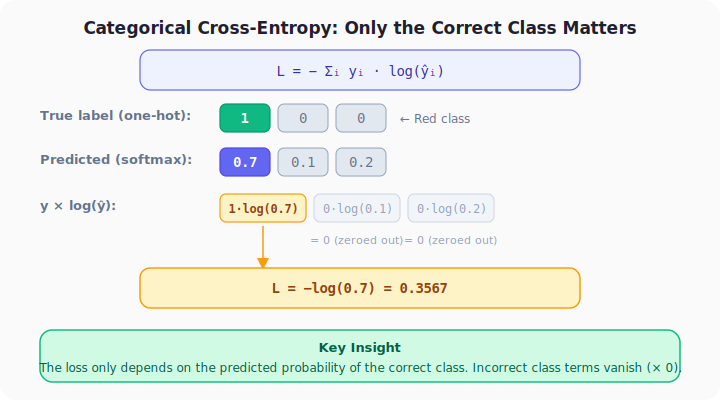
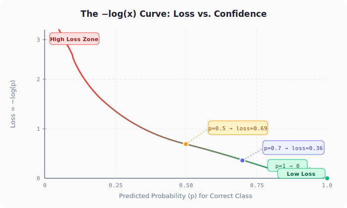
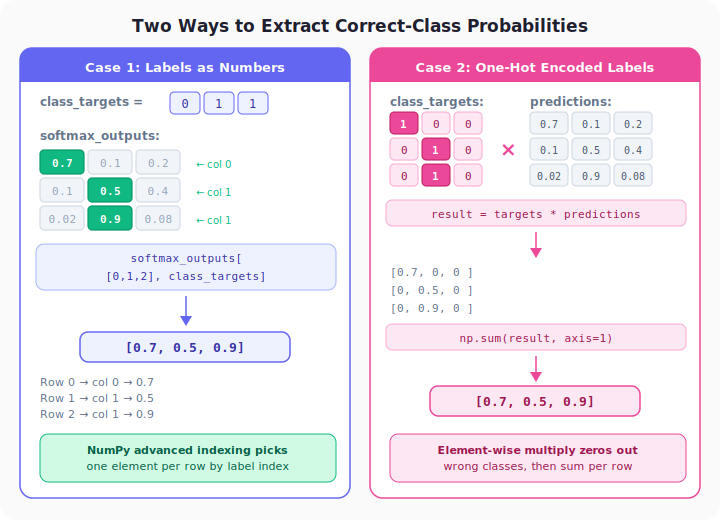
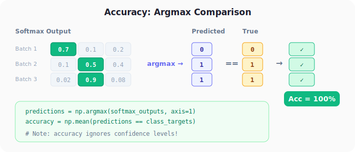

# Neural Networks from Scratch, Part 8: Loss Functions (Categorical Cross-Entropy)

*The number that tells your network how wrong it is.*

---

## 1. Why Do We Need a Loss Function?

Up to now we have a full forward pass: data flows through dense layers, ReLU, and softmax. The softmax output gives us a **probability distribution** over the classes, but those probabilities are based on *random* weights.

We need a single number that answers: **how wrong are we?**

That number is the **loss**. When the loss is high the network is making poor predictions; when it is low the predictions are good. Once we have this number we can start *optimising* the weights to reduce it.

---

## 2. Categorical Cross-Entropy: The Formula

For a classification task with $C$ classes the **categorical cross-entropy** loss for a single sample is:

$$L = -\sum_{i=1}^{C} y_i \cdot \log(\hat{y}_i)$$

where $y_i$ is the **true label** (one-hot encoded) and $\hat{y}_i$ is the **predicted probability** from softmax.

### The Key Simplification

Because $y_i$ is one-hot, every term where the true label is 0 vanishes. Only the correct class survives:

$$L = -\log(\hat{y}_{\text{correct class}})$$

This is the only value that matters: the predicted probability assigned to the *correct* class.



---

## 3. Intuition: The −log Curve

Why negative log? Plot $-\log(p)$ for $p \in (0, 1]$:



| Predicted $p$ | Loss $-\log(p)$ | Interpretation |
|:---:|:---:|:---|
| 1.0 | 0.00 | Perfect, zero loss |
| 0.9 | 0.105 | High confidence, low loss |
| 0.7 | 0.357 | Decent confidence |
| 0.5 | 0.693 | Coin-flip, high loss |
| 0.1 | 2.303 | Very wrong, huge loss |

Two important properties:
1. **Loss is always ≥ 0** (the negative sign makes the logarithm positive).
2. **log(1) = 0**, so a perfect prediction has zero loss.

---

## 4. Worked Example

Suppose our network outputs softmax probabilities for a batch of 3 samples, and the true labels are Red, Green, Green:

```
softmax_outputs = [[0.7, 0.1, 0.2],   # Batch 1
                   [0.1, 0.5, 0.4],   # Batch 2
                   [0.02, 0.9, 0.08]] # Batch 3

true_labels = [Red, Green, Green]  →  class indices [0, 1, 1]
```

For each sample we only need the probability of the *correct* class:

| Batch | True Class | Correct-Class Prob | Loss |
|:---:|:---:|:---:|:---:|
| 1 | Red (0) | 0.7 | $-\log(0.7) = 0.357$ |
| 2 | Green (1) | 0.5 | $-\log(0.5) = 0.693$ |
| 3 | Green (1) | 0.9 | $-\log(0.9) = 0.105$ |

**Mean loss** = $(0.357 + 0.693 + 0.105) / 3 = 0.385$

Batch 3 has the lowest loss (90% confidence in the correct class), while Batch 2 has the highest loss (only 50% confidence).

---

## 5. Two Ways to Extract Correct-Class Probabilities in Python

Depending on whether your labels are **integer indices** or **one-hot vectors**, Python handles the extraction differently.



### Case 1: Labels as Numbers

```python
import numpy as np

softmax_outputs = np.array([[0.7, 0.1, 0.2],
                            [0.1, 0.5, 0.4],
                            [0.02, 0.9, 0.08]])

class_targets = [0, 1, 1]   # Red, Green, Green

# Advanced indexing: row indices + label indices
correct_confidences = softmax_outputs[
    range(len(softmax_outputs)), class_targets
]
# → array([0.7, 0.5, 0.9])

neg_log = -np.log(correct_confidences)
# → array([0.3567, 0.6931, 0.1054])

mean_loss = np.mean(neg_log)
# → 0.385
```

**How it works:** `range(len(softmax_outputs))` produces `[0, 1, 2]` (row indices). NumPy pairs them element-wise with `class_targets = [0, 1, 1]` (column indices):

- Row 0, Col 0 → 0.7  
- Row 1, Col 1 → 0.5  
- Row 2, Col 1 → 0.9  

### Case 2: One-Hot Encoded Labels

```python
class_targets_onehot = np.array([[1, 0, 0],
                                  [0, 1, 0],
                                  [0, 1, 0]])

# Element-wise multiply zeros out wrong classes
correct_confidences = np.sum(
    class_targets_onehot * softmax_outputs, axis=1
)
# → array([0.7, 0.5, 0.9])

neg_log = -np.log(correct_confidences)
mean_loss = np.mean(neg_log)
# → 0.385  (identical result)
```

**How it works:** Multiplying by the one-hot vector keeps only the correct-class probability in each row. Summing across columns collapses the row to a single value.

---

## 6. Clipping: Avoiding log(0)

If the softmax output is exactly 0 for the correct class, $\log(0) = -\infty$, which crashes training. If it is exactly 1, $\log(1) = 0$ and certain gradient computations become problematic.

The fix is to **clip** predictions to a tiny range:

```python
y_pred_clipped = np.clip(y_pred, 1e-7, 1 - 1e-7)
```

This keeps every value in $[10^{-7},\ 1 - 10^{-7}]$, close enough to the originals that the loss is numerically accurate, but safe from infinities.

---

## 7. The Loss Classes

We implement two classes: `Loss_CategoricalCrossentropy` computes per-sample losses; `Loss` (its parent) takes the mean.

```python
class Loss:
    def calculate(self, output, y):
        sample_losses = self.forward(output, y)
        data_loss = np.mean(sample_losses)
        return data_loss


class Loss_CategoricalCrossentropy(Loss):
    def forward(self, y_pred, y_true):
        samples = len(y_pred)
        # Clip to avoid log(0)
        y_pred_clipped = np.clip(y_pred, 1e-7, 1 - 1e-7)

        # Case 1: class labels are integers
        if len(y_true.shape) == 1:
            correct_confidences = y_pred_clipped[
                range(samples), y_true
            ]
        # Case 2: class labels are one-hot
        elif len(y_true.shape) == 2:
            correct_confidences = np.sum(
                y_pred_clipped * y_true, axis=1
            )

        negative_log_likelihoods = -np.log(correct_confidences)
        return negative_log_likelihoods
```

Key design decisions:
- `forward()` returns the **per-sample** negative log likelihoods (useful for debugging).
- `calculate()` in the parent `Loss` class takes the mean, giving the final scalar loss.
- The shape check (`len(y_true.shape)`) handles both label formats automatically.

---

## 8. Full Forward Pass with Loss

Adding the loss function to our existing pipeline:

```python
import numpy as np
from nnfs.datasets import spiral_data

# Create dataset
X, y = spiral_data(samples=100, classes=3)

# Layer 1: 2 inputs → 3 neurons
dense1 = Layer_Dense(2, 3)
activation1 = Activation_ReLU()

# Layer 2: 3 inputs → 3 outputs (one per class)
dense2 = Layer_Dense(3, 3)
activation2 = Activation_Softmax()

# Loss function
loss_function = Loss_CategoricalCrossentropy()

# Forward pass
dense1.forward(X)
activation1.forward(dense1.output)
dense2.forward(activation1.output)
activation2.forward(dense2.output)

# Calculate loss
loss = loss_function.calculate(activation2.output, y)
print("Loss:", loss)
# → Loss: 1.0986   (≈ -log(1/3), essentially random guessing)
```

The loss ≈ 1.099 is very close to $-\log(1/3) = 1.0986$. This makes sense: with random weights the network assigns roughly equal probability to all 3 classes, no better than chance.

---

## 9. Accuracy: A Complementary Metric

Accuracy counts how many predictions are correct, ignoring confidence:

```python
predictions = np.argmax(activation2.output, axis=1)
accuracy = np.mean(predictions == y)
print("Accuracy:", accuracy)
# → ~0.33 (random guessing with 3 classes)
```



`np.argmax(row)` returns the index of the largest value, the class the network is "betting on". If that matches the true label, it counts as correct.

### Loss vs. Accuracy

| Metric | Measures | Differentiable? | Used for |
|:---|:---|:---:|:---|
| Cross-Entropy Loss | How *confident* the correct prediction is | Yes | Optimisation (training) |
| Accuracy | Whether the top prediction matches truth | No | Human-readable evaluation |

Accuracy is coarser: it treats 51% confidence the same as 99% confidence. Loss captures the full picture, which is why we optimise loss, not accuracy.

---

## 10. One-Hot Encoding Reference

| True Class | As Integer | As One-Hot |
|:---:|:---:|:---:|
| Red | 0 | `[1, 0, 0]` |
| Green | 1 | `[0, 1, 0]` |
| Blue | 2 | `[0, 0, 1]` |

Start with all zeros, set the position corresponding to the class to 1. Both formats encode the same information; datasets may use either.

---

## Summary

| Concept | What We Learned |
|---------|----------------|
| **Why loss** | Without it we cannot train. Cross-entropy gives a single scalar measuring how far predictions are from truth |
| **Only correct class matters** | One-hot label zeros out incorrect terms, so loss reduces to $-\log(p_{\text{correct}})$ |
| **The −log curve** | Loss = 0 when $p = 1$ (perfect), loss → ∞ as $p → 0$ (terrible) |
| **Clip predictions** | Clip to $[10^{-7}, 1-10^{-7}]$ before log to avoid numerical explosions |
| **Two label formats** | Integer indices use advanced indexing; one-hot uses element-wise multiply. Both give identical results |
| **Accuracy** | Intuitive but coarser. We train on loss, we report accuracy |

---

## What's Next

The loss tells us *how wrong* we are, but not *which direction to adjust the weights*. In **Part 9**, we introduce **optimisation**, the process of systematically reducing the loss by updating weights and biases.

---

> **Try It Yourself:** Hands-on exercises for this lecture are in [Exercises](../../exercises.md) and [Quizzes](../../quizzes.md).
