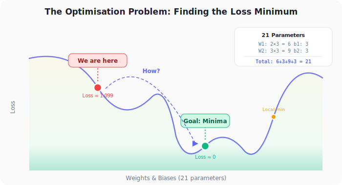
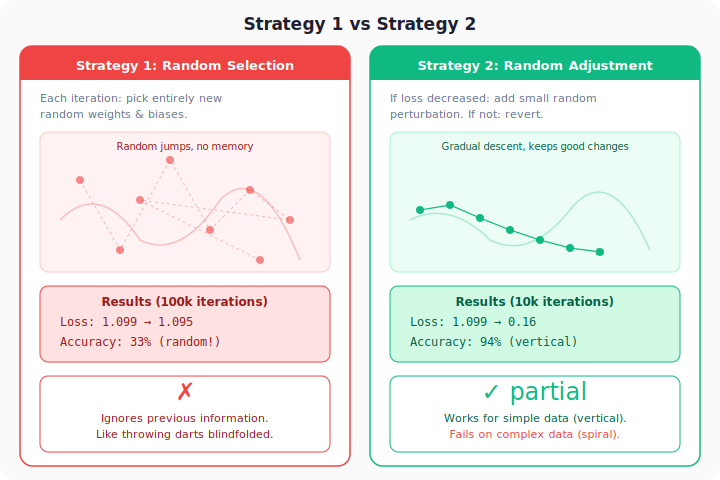
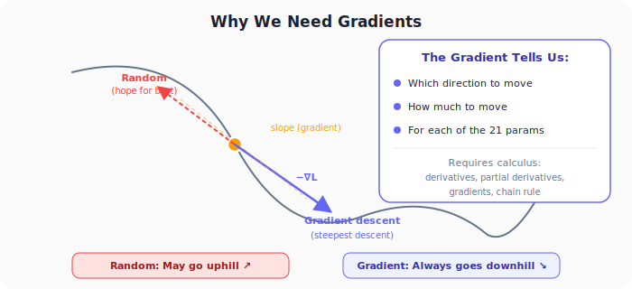

# Neural Networks from Scratch, Part 9: Introduction to Optimisation

*How do we move from random guessing to intelligent learning?*

---

## 1. Where We Stand

We have a complete forward pass that produces a loss value, but we have never **changed** the weights. Every parameter is still random.

Our tiny network has **21 learnable parameters**:

| Matrix | Shape | Count |
|:---:|:---:|:---:|
| W1 (layer 1 weights) | 2 × 3 | 6 |
| b1 (layer 1 biases) | 1 × 3 | 3 |
| W2 (layer 2 weights) | 3 × 3 | 9 |
| b2 (layer 2 biases) | 1 × 3 | 3 |
| **Total** | | **21** |

The question is: **how do we find the values of these 21 numbers that minimise the loss?**



---

## 2. Strategy 1: Randomly Select Weights & Biases

The simplest idea: generate completely random weights and biases, compute the loss, repeat 100,000 times, and keep the best set.

```python
best_loss = float('inf')

for iteration in range(100_000):
    # Completely new random weights each time
    dense1.weights = 0.05 * np.random.randn(2, 3)
    dense1.biases  = 0.05 * np.random.randn(1, 3)
    dense2.weights = 0.05 * np.random.randn(3, 3)
    dense2.biases  = 0.05 * np.random.randn(1, 3)

    # Forward pass
    dense1.forward(X)
    activation1.forward(dense1.output)
    dense2.forward(activation1.output)
    activation2.forward(dense2.output)

    loss = loss_function.calculate(activation2.output, y)

    if loss < best_loss:
        best_loss = loss
        # Save these weights as the best so far
        best_dense1_weights = dense1.weights.copy()
        best_dense1_biases  = dense1.biases.copy()
        best_dense2_weights = dense2.weights.copy()
        best_dense2_biases  = dense2.biases.copy()
        print(f"Iteration {iteration}, Loss: {loss:.4f}")
```

### Result

After 100,000 iterations the loss barely moves (from ~1.099 to ~1.095) and accuracy stays around **33%** (pure random guessing for 3 classes).

**Why it fails:** With 21 parameters, the search space is enormous. Picking values completely at random is like throwing darts in a dark room.

---

## 3. Strategy 2: Randomly Adjust Weights & Biases

A better idea: if a small change *reduced* the loss, keep it and make the next small change relative to the current position. If the loss *increased*, revert.

```python
for iteration in range(10_000):
    # Small perturbation of current weights (not replacement)
    dense1.weights += 0.05 * np.random.randn(2, 3)
    dense1.biases  += 0.05 * np.random.randn(1, 3)
    dense2.weights += 0.05 * np.random.randn(3, 3)
    dense2.biases  += 0.05 * np.random.randn(1, 3)

    # Forward pass + loss
    dense1.forward(X)
    activation1.forward(dense1.output)
    dense2.forward(activation1.output)
    activation2.forward(dense2.output)
    loss = loss_function.calculate(activation2.output, y)

    if loss < best_loss:
        best_loss = loss
        best_dense1_weights = dense1.weights.copy()
        best_dense1_biases  = dense1.biases.copy()
        best_dense2_weights = dense2.weights.copy()
        best_dense2_biases  = dense2.biases.copy()
    else:
        # Revert to the previous best
        dense1.weights = best_dense1_weights.copy()
        dense1.biases  = best_dense1_biases.copy()
        dense2.weights = best_dense2_weights.copy()
        dense2.biases  = best_dense2_biases.copy()
```

The critical difference is **`+=`** instead of **`=`**. We *adjust* the current weights by a small amount rather than replacing them entirely.

### Result on Simple Data (Vertical Dataset)

| Metric | Strategy 1 (100k iters) | Strategy 2 (10k iters) |
|:---|:---:|:---:|
| Loss | 1.095 | **0.16** |
| Accuracy | 33% | **94%** |

Strategy 2 works remarkably well: loss drops 10× and accuracy reaches 94%.

### Result on Complex Data (Spiral Dataset)

| Metric | Strategy 2 |
|:---|:---:|
| Loss | 1.04 |
| Accuracy | ~40% |

On the harder spiral dataset, Strategy 2 **fails**. The loss barely decreases from 1.1 to 1.04.



---

## 4. Why Strategy 2 Fails on Complex Data

Strategy 2 is on the right track. It keeps improvements and reverts bad changes. But the *direction* of each adjustment is still **random**.

Imagine standing on a hill in fog:
- **Strategy 1**: Teleport to a random location. Check if it's lower. (Almost never works.)
- **Strategy 2**: Take a random step. If lower, stay. If higher, step back. (Works on gentle slopes, not on rough terrain.)

What we really want is to know which direction is *downhill* before we step. That direction is the **negative gradient**.



---

## 5. The Gradient: The Missing Piece

The **gradient** of the loss with respect to the parameters tells us:

1. **Which direction** to change each parameter to decrease the loss.
2. **How much** to change it (steeper slope → bigger update).

For our 21 parameters, the gradient is a vector of 21 numbers, one partial derivative per parameter. Moving in the direction of the **negative gradient** ($-\nabla L$) is the direction of **steepest descent**.

This is the idea behind **gradient descent**:

$$w_{\text{new}} = w_{\text{old}} - \eta \cdot \nabla L$$

where $\eta$ is the **learning rate** (how big a step we take).

But to compute $\nabla L$, we need calculus: specifically **derivatives**, **partial derivatives**, and the **chain rule**.

---

## 6. The Roadmap Ahead

| Lecture | Topic |
|:---:|:---|
| 10 | Derivatives, Partial Derivatives, Gradients |
| 11 | The Chain Rule |
| 12–15 | Backpropagation (deriving gradients layer by layer) |
| 16–21 | Coding Backpropagation in Python |
| 22–27 | Optimisers (SGD, Momentum, AdaGrad, RMSProp, Adam) |

Everything from here forward is about computing gradients efficiently (backpropagation) and using them intelligently (optimisers).

---

## Summary

| Concept | What We Learned |
|---------|----------------|
| **Random selection** | Doesn't work. The parameter space is too large for blind search |
| **Random adjustment** | Better because it keeps good changes and reverts bad ones, but random direction is a bottleneck |
| **Gradients** | Tell us the exact direction and magnitude of steepest descent for every parameter |
| **Calculus requirements** | Derivatives, partial derivatives, and the chain rule are needed to compute gradients |
| **Update rule** | $w_{\text{new}} = w_{\text{old}} - \eta \cdot \nabla L$ is the core of gradient-based optimisation |

---

## What's Next

In **Part 10**, we build the calculus foundation: what are derivatives, partial derivatives, and gradients, and how they apply to neural network parameters.

---

> **Try It Yourself:** Hands-on exercises for this lecture are in [Exercises](../../exercises.md) and [Quizzes](../../quizzes.md).
