# Part 01 · Neurons and layers

> **TL;DR.** A neuron is a weighted sum plus a bias; a layer is several neurons sharing the same inputs, each with their own weights and bias. Once that single sentence is implemented in code, first by hand and then in two lines of NumPy that scale to entire batches, every learnable parameter in a feed-forward network has been touched.
>
> **Reading time:** ~14 minutes.
>
> **After reading this you will be able to:**
> - State, in one sentence, what a neuron and a layer compute.
> - Code a single neuron and a layer of neurons in plain Python, then collapse them into `np.dot(W, X) + b`.
> - Predict, before running the code, the shape of every intermediate array as a single sample becomes a batch.


*Every learnable parameter in a feed-forward network is either a weight or a  bias. The rest of the series is just rules for setting them.*

---

## 1. What this series builds, and why from scratch

A typical first encounter with a neural network in Keras is four lines.

```python
model = tf.keras.Sequential([
    tf.keras.layers.Dense(128, activation='relu'),
    tf.keras.layers.Dense(10, activation='softmax'),
])
model.compile(optimizer='adam', loss='categorical_crossentropy')
model.fit(X_train, y_train)
```

The code runs. The questions it leaves open do not.

- Why Adam, and not SGD?
- What does cross-entropy actually compute?
- How does backpropagation update the weights?
- When a shape mismatch is raised, which dimension is wrong, and why?

A neural network is not exotic mathematics. It is a stack of weighted sums, activation functions, and partial derivatives. Implementing each piece by hand replaces a library's confidence with personal understanding. This series builds every component (neurons, layers, activations, losses, backpropagation, optimisers, regularisation) without relying on a framework to do the thinking.

This first post stays at the most basic operation in the stack: the **forward pass through a single neuron, then a layer**. Activation functions arrive in [Part 06](../06-activation-functions-relu-and-softmax/index.md); loss in [Part 08](../08-loss-categorical-cross-entropy/index.md); backpropagation begins in [Part 12](../12-backprop-through-a-single-neuron/index.md). Everything that comes later is layered on top of what is built here.

---

## 2. Where the neuron came from

The mathematical neuron predates working hardware. Two papers do the heavy lifting.

In 1943, McCulloch and Pitts modelled a neuron as a threshold logic unit: a binary device that fires when the weighted sum of its boolean inputs exceeds a threshold (McCulloch & Pitts, 1943). The model was descriptive; the weights and threshold were set by hand.

Fifteen years later, Frank Rosenblatt's **perceptron** added a learning rule: weights would be adjusted automatically from labelled examples (Rosenblatt, 1958). The arithmetic (a weighted sum plus a bias, passed through a step) is the arithmetic still used today, sixty-eight years later. What changed is everything around it: the activation function (no longer a step), the loss function, the optimiser, the depth of the stack, and the scale of the data.

The implication for this series is small and useful. **The forward pass of a 2026 neural network is the same forward pass Rosenblatt published in 1958, repeated many times in parallel.** Everything from Part 02 onward is concerned with stacking those forward passes and learning the weights through gradient descent.

---

## 3. The neuron, formally

A neuron receives a vector of inputs, multiplies each input by a corresponding weight, sums the results, and adds a single bias. In symbols:

$$\text{output} = \sum_{i=1}^{n} w_i x_i + b.$$

There is no activation function yet; activations are the subject of Part 06. For now the neuron stops at the weighted sum plus bias.

Each symbol carries a specific role. Reading the table left-to-right gives the entire surface area of the neuron:

| Component | Symbol | Shape (single neuron) | Role | Lifetime | What fails when it is wrong |
|---|---|---|---|---|---|
| Inputs | $x_i$ | $(n,)$ | The data fed in | changes every forward pass | bad inputs → bad outputs (garbage in, garbage out) |
| Weights | $w_i$ | $(n,)$ | Importance of each input | learned during training, frozen at inference | wrong weights → wrong prediction |
| Bias | $b$ | scalar | A constant offset, one per neuron | learned during training, frozen at inference | missing bias → the neuron cannot fit data not centred on zero |
| Output | $\hat{y}$ | scalar | The weighted sum plus the bias | recomputed every forward pass | downstream layers receive the wrong signal |

A large weight magnifies its input's contribution; a near-zero weight ignores it. The bias shifts every output by the same amount, regardless of the inputs. The bias is what allows a neuron to fit data whose target is offset from the origin. That detail becomes important in Part 03 when stacking layers.

### 3.1. What a neuron is *not*

The boundary helps as much as the definition.

- **A neuron is not a classifier on its own.** It produces a single number, not a class label. Turning that number into a class requires an activation function (Part 06) and a loss function (Part 08).
- **A neuron is not non-linear.** The weighted-sum-plus-bias is a linear function of its inputs. Stacking linear neurons without activations between them gives back another linear function, no more expressive than a single layer.
- **A neuron is not learned in this post.** The weights and bias are *given*, not optimised. Learning enters the series in Part 09 (gradient descent) and Part 12 (backpropagation).

---

## 4. Coding a neuron with three inputs

Plain Python lists are enough to express both the inputs and the weights.

```python
inputs = [1, 2, 3]
weights = [0.2, 0.8, -0.5]
bias = 2

output = (inputs[0] * weights[0]
          + inputs[1] * weights[1]
          + inputs[2] * weights[2]
          + bias)

print(output)
```

**Output:**

```
2.3
```

The arithmetic, broken out term by term:

| Step | Calculation | Value |
|---|---|---|
| $x_1 w_1$ | $1 \times 0.2$ | $0.2$ |
| $x_2 w_2$ | $2 \times 0.8$ | $1.6$ |
| $x_3 w_3$ | $3 \times (-0.5)$ | $-1.5$ |
| Sum | $0.2 + 1.6 - 1.5$ | $0.3$ |
| Plus bias | $0.3 + 2$ | $2.3$ |

Python indexing starts at zero, so `inputs[0]` is the first element. That convention will hold throughout the series.

---

## 5. Coding a neuron with four inputs

Scaling to four inputs adds one weight; the bias count stays at one. **One weight per input, one bias per neuron.** The rule never changes.

```python
inputs = [1.0, 2.0, 3.0, 2.5]
weights = [0.2, 0.8, -0.5, 1.0]
bias = 2.0

output = (inputs[0] * weights[0]
          + inputs[1] * weights[1]
          + inputs[2] * weights[2]
          + inputs[3] * weights[3]
          + bias)

print(output)
```

**Output:**

```
4.8
```

| Step | Calculation | Value |
|---|---|---|
| $x_1 w_1$ | $1.0 \times 0.2$ | $0.2$ |
| $x_2 w_2$ | $2.0 \times 0.8$ | $1.6$ |
| $x_3 w_3$ | $3.0 \times (-0.5)$ | $-1.5$ |
| $x_4 w_4$ | $2.5 \times 1.0$ | $2.5$ |
| Sum | $0.2 + 1.6 - 1.5 + 2.5$ | $2.8$ |
| Plus bias | $2.8 + 2.0$ | $4.8$ |

The shape of the operation is invariant: one weight per input, one bias per neuron, one scalar out.

---

## 6. From a neuron to a layer

A **layer** is a group of neurons that all receive the same input vector but each carry their own weights and bias.


*One neuron with $n$ inputs has $n+1$ parameters. A layer of $m$ such neurons has $m(n+1)$, exactly $m$ times more.*

For a layer of three neurons fed by four inputs:

- Each neuron receives all four inputs.
- Each neuron owns its own four weights, giving $3 \times 4 = 12$ weights in total.
- Each neuron owns its own bias, giving three biases.
- The layer emits three outputs, one per neuron.
- **Total parameters: $3 \times 4 + 3 = 15$.**

Per-neuron arithmetic:

$$y_1 = w_{11} x_1 + w_{12} x_2 + w_{13} x_3 + w_{14} x_4 + b_1$$

$$y_2 = w_{21} x_1 + w_{22} x_2 + w_{23} x_3 + w_{24} x_4 + b_2$$

$$y_3 = w_{31} x_1 + w_{32} x_2 + w_{33} x_3 + w_{34} x_4 + b_3$$

The same three lines, written compactly:

$$\mathbf{y} = \mathbf{W} \mathbf{x} + \mathbf{b}.$$

The matrix $\mathbf{W}$ has shape $(m, n)$ where $m$ is the number of neurons and $n$ the number of inputs; $\mathbf{x}$ has shape $(n,)$; $\mathbf{b}$ has shape $(m,)$; and the output $\mathbf{y}$ has shape $(m,)$. The shape diary in §10 tracks all of this through a batch.

---

## 7. A layer, by hand

With three sets of weights, a list of lists is the natural representation.

```python
inputs = [1, 2, 3, 2.5]

weights = [[0.2, 0.8, -0.5, 1],         # Neuron 1
           [0.5, -0.91, 0.26, -0.5],    # Neuron 2
           [-0.26, -0.27, 0.17, 0.87]]  # Neuron 3

biases = [2, 3, 0.5]

outputs = [
    inputs[0]*weights[0][0] + inputs[1]*weights[0][1]
    + inputs[2]*weights[0][2] + inputs[3]*weights[0][3] + biases[0],

    inputs[0]*weights[1][0] + inputs[1]*weights[1][1]
    + inputs[2]*weights[1][2] + inputs[3]*weights[1][3] + biases[1],

    inputs[0]*weights[2][0] + inputs[1]*weights[2][1]
    + inputs[2]*weights[2][2] + inputs[3]*weights[2][3] + biases[2],
]

print(outputs)
```

**Output:**

```
[4.8, 1.21, 2.385]
```

| Neuron | Weighted sum | Plus bias | Output |
|---|---|---|---|
| 1 | $1(0.2) + 2(0.8) + 3(-0.5) + 2.5(1) = 2.8$ | $+ 2$ | $4.8$ |
| 2 | $1(0.5) + 2(-0.91) + 3(0.26) + 2.5(-0.5) = -1.79$ | $+ 3$ | $1.21$ |
| 3 | $1(-0.26) + 2(-0.27) + 3(0.17) + 2.5(0.87) = 1.885$ | $+ 0.5$ | $2.385$ |

The code is correct but does not scale: fifty neurons would mean fifty hand-written summations.

---

## 8. The same operation, three implementations

The neuron does not care which Python loop computes it. Three implementations produce identical numbers; each replaces the previous one's repetition with a stronger abstraction.


*The arithmetic does not change. The representation does, and with it both the length of the code and its speed.*

Two nested loops handle any number of neurons and any number of inputs.

```python
inputs = [1, 2, 3, 2.5]

weights = [[0.2, 0.8, -0.5, 1],
           [0.5, -0.91, 0.26, -0.5],
           [-0.26, -0.27, 0.17, 0.87]]

biases = [2, 3, 0.5]

layer_outputs = []
for neuron_weights, neuron_bias in zip(weights, biases):
    neuron_output = 0
    for n_input, weight in zip(inputs, neuron_weights):
        neuron_output += n_input * weight
    neuron_output += neuron_bias
    layer_outputs.append(neuron_output)

print(layer_outputs)
```

**Output:**

```
[4.8, 1.21, 2.385]
```

Tracing the outer loop once per neuron:

- Iteration 1 — weights $[0.2, 0.8, -0.5, 1]$, bias $2$. Inner sum $2.8$, plus bias $\to 4.8$.
- Iteration 2 — weights $[0.5, -0.91, 0.26, -0.5]$, bias $3$. Inner sum $-1.79$, plus bias $\to 1.21$.
- Iteration 3 — weights $[-0.26, -0.27, 0.17, 0.87]$, bias $0.5$. Inner sum $1.885$, plus bias $\to 2.385$.

Same numbers as §7, with code that no longer cares about the network's width. The inner loop is still a Python loop, however, and that is the next bottleneck.

---

## 9. Why NumPy wins

Python loops execute one bytecode instruction per iteration. NumPy hands the same work to compiled C routines that operate on the entire array at once. This strategy is called **vectorisation**, and for arrays the size of a real neural-network layer, it typically wins by two orders of magnitude or more (NumPy docs, latest).

The relevant operation is the **dot product**. The dot product of two vectors of equal length is the sum of their element-wise products, which is precisely the weighted sum a neuron computes:

$$\mathbf{w} \cdot \mathbf{x} = w_1 x_1 + w_2 x_2 + \dots + w_n x_n.$$

A single neuron, in NumPy:

```python
import numpy as np

inputs = [1.0, 2.0, 3.0, 2.5]
weights = [0.2, 0.8, -0.5, 1.0]
bias = 2.0

print(np.dot(weights, inputs) + bias)
```

**Output:**

```
4.8
```

A full layer requires no extra code. When `weights` is a 2-D array, `np.dot()` treats each row as a separate weight vector and computes a dot product with `inputs` for each, returning a vector of length equal to the number of rows.

```python
import numpy as np

inputs = [1.0, 2.0, 3.0, 2.5]
weights = [[0.2, 0.8, -0.5, 1],
           [0.5, -0.91, 0.26, -0.5],
           [-0.26, -0.27, 0.17, 0.87]]
biases = [2.0, 3.0, 0.5]

print(np.dot(weights, inputs) + biases)
```

**Output:**

```
[4.8  1.21 2.385]
```

Two lines, the same numbers as the hand-written and looped versions.

---

## 10. Handling batches, and the shape diary

Production training rarely feeds the network one sample at a time. A **batch** is a stack of input vectors, one per row.

```python
inputs = [[1.0, 2.0, 3.0, 2.5],     # Sample 1
          [2.0, 5.0, -1.0, 2.0],    # Sample 2
          [-1.5, 2.7, 3.3, -0.8]]   # Sample 3
```

With `inputs` of shape $(3, 4)$ and `weights` of shape $(3, 4)$, the inner dimensions do not match for matrix multiplication. Transposing the weights to $(4, 3)$ realigns them:

$$\text{outputs} = \text{inputs} \cdot \mathbf{W}^{\top} + \text{biases}.$$


*Tracking shapes is the cheapest debugging tool in deep learning. Print them after every operation; surprises here are 90% of "shape mismatch" errors.*

The diary in full:

| Setting | `X` shape | `W` shape | `b` shape | Operation | Output shape |
|---|---|---|---|---|---|
| Single neuron, single sample | $(n,)$ | $(n,)$ | scalar | `np.dot(W, X) + b` | scalar |
| Layer of $m$, single sample | $(n,)$ | $(m, n)$ | $(m,)$ | `np.dot(W, X) + b` | $(m,)$ |
| Layer of $m$, batch of $N$ | $(N, n)$ | $(m, n)$ | $(m,)$ | `np.dot(X, W.T) + b` | $(N, m)$ |

The transpose changes only the call signature, not the arithmetic. NumPy's broadcasting then adds the $(m,)$ bias vector to every one of the $N$ rows in the $(N, m)$ output, so each neuron's bias appears in its own column.

```python
import numpy as np

inputs = [[1.0, 2.0, 3.0, 2.5],
          [2.0, 5.0, -1.0, 2.0],
          [-1.5, 2.7, 3.3, -0.8]]

weights = [[0.2, 0.8, -0.5, 1],
           [0.5, -0.91, 0.26, -0.5],
           [-0.26, -0.27, 0.17, 0.87]]

biases = [2.0, 3.0, 0.5]

print(np.dot(inputs, np.array(weights).T) + biases)
```

**Output:**

```
[[ 4.8    1.21   2.385]
 [ 8.9   -1.81   0.2  ]
 [ 1.41   1.051  0.026]]
```

Each row is the layer's output for one input sample; each column belongs to one neuron.


*Three samples flow through the same three neurons in one call. The bias vector of shape $(3,)$ is broadcast across every row of the $(3, 3)$ result.*

---

## 11. The core formula

Every neuron in every feed-forward network computes:

$$\text{output} = \sum_{i=1}^{n} w_i x_i + b.$$

The next twenty-six posts add only three things to this core:

| What is added | When it arrives | Why |
|---|---|---|
| Activation functions (ReLU, Softmax) | Part 06 | Without them, stacking layers collapses to a single linear layer. |
| Loss functions (cross-entropy) | Part 08 | A way to score the predicted outputs against the truth. |
| Backpropagation + an optimiser | Parts 09–27 | A way to adjust $\mathbf{W}$ and $\mathbf{b}$ so the loss goes down. |

Once each is in place, the same forward pass that produced `[4.8, 1.21, 2.385]` becomes the inner loop of a network that can classify spirals, recognise digits, or sort sentiment.

---

## 12. Anticipated questions

- **Why call it a "neuron"?** Historical analogy with biological neurons. The mathematical object has very little to do with the biological one beyond "many inputs, one output, a threshold-like response". The name stuck because it was already in use before deep learning made it standard.
- **Where do the initial weights come from?** They are sampled randomly, usually from a small normal distribution. Initialisation is treated in detail when the Dense layer class is introduced in Part 04.
- **Why does the bias not also have one value per input?** Because the bias is added *after* the weighted sum collapses the inputs to a single number. One sum, one offset.
- **Does the order of arguments to `np.dot` matter?** Yes, and changing it is the single most common source of shape mismatches. Part 02 walks through `np.dot(A, B)` versus `np.dot(B, A)` for every combination of scalars, vectors, and matrices.

---

## Common pitfalls

- **Confusing the number of weights with the number of neurons.** Weights per layer equals (number of neurons) × (inputs per neuron). Only the bias count equals the neuron count.
- **Forgetting that `np.dot(weights, inputs)` requires the inner dimensions to match.** A $(3, 4)$ weight matrix and a $(4,)$ input vector give a $(3,)$ output; mismatched shapes raise a `ValueError`.
- **Transposing the wrong matrix when moving to batches.** For inputs of shape $(N, F)$ and weights of shape $(M, F)$, the correct call is `np.dot(inputs, weights.T)`, not `np.dot(weights, inputs.T)`.
- **Reading `inputs[0]` as the first sample in batch code, but as the first feature in single-sample code.** Always check the array's rank with `inputs.ndim` or `inputs.shape` before indexing.
- **Adding the bias inside the dot product.** The bias is added once to the weighted sum, not to each input.
- **Treating a layer as non-linear.** Without an activation function, stacking layers is equivalent to a single linear layer with composed weights. The non-linearity arrives in Part 06.
- **Dropping the bias to "simplify" the network.** Without a bias, every neuron's output is zero when every input is zero. The bias is small and cheap and almost always pays for itself.

---

## Further reading

- Goodfellow, I., Bengio, Y., Courville, A., *Deep Learning* — chapter 6, "Deep Feedforward Networks" (MIT Press, 2016).
- Kinsley, H. and Kukieła, D., *Neural Networks from Scratch in Python* (2020).
- McCulloch, W. S. and Pitts, W., *"A logical calculus of the ideas immanent in nervous activity"* (Bulletin of Mathematical Biophysics, 1943).
- NumPy, *"`numpy.dot` reference"* (latest).
- Rosenblatt, F., *"The perceptron: A probabilistic model for information storage and organization in the brain"* (Psychological Review, 1958).

Full citations in [REFERENCES.md](../../REFERENCES.md).

---

## What to read next

- **[Part 02 — NumPy and the dot product](../02-numpy-and-the-dot-product/index.md)** — the three forms of `np.dot()` (vector·vector, matrix·vector, matrix·matrix) and which one matches a neuron, a layer, and a batch.
- **[Part 04 — The Dense layer class and spiral data](../04-dense-layer-class-and-spiral-data/index.md)** — wrapping the layer in an object-oriented class and introducing the non-linear dataset used for classification throughout the series.
- **[Part 06 — Activation functions: ReLU and Softmax](../06-activation-functions-relu-and-softmax/index.md)** — the missing non-linearity that lets stacked layers express something a single layer cannot.

---

> **Try it yourself:** Hands-on exercises and quizzes for this lecture live in [Exercises](../../exercises.md) and [Quizzes](../../quizzes.md).
