# Part 02 · NumPy and the dot product

> **TL;DR.** `np.dot()` is the single most-used operation in deep-learning code, and almost every "shape mismatch" error a beginner sees comes from misunderstanding it. This post lays out its three forms (vector by vector, matrix by vector, matrix by matrix) and the one shape rule and argument order that decide which form runs.
>
> **Reading time:** ~13 minutes.
>
> **After reading this you will be able to:**
> - Name the three forms of `np.dot()` and match each one to a neuron, a layer, or a batch.
> - Predict whether `np.dot(A, B)` will succeed or raise a shape error, just from the shapes.
> - Explain when the transpose is needed and why a single neuron call works in any order but a batch call does not.


*Three forms of one call. The shape of the inputs decides what arithmetic happens; the shape of the inputs also decides what neural-network object the call represents.*

---

## 1. Why this one function matters

Part 01 implemented a layer in three increasingly compact ways. The final NumPy version was two lines:

```python
layer_output = np.dot(weights, inputs) + biases
```

Every modern deep-learning framework reduces the forward pass through a dense layer to that same call, dressed in different syntax. PyTorch writes `x @ W.T + b`. TensorFlow writes `tf.matmul(x, W, transpose_b=True) + b`. Each of these resolves, somewhere underneath, to a call into the **BLAS** library (Basic Linear Algebra Subprograms), the 1979 Fortran specification that still does the actual multiplication in C and assembly even on a 2026 GPU (Lawson et al., 1979). The math has not moved in forty-seven years; only its packaging has.

The implication for this series is direct. Every dense layer in every part of this series, forward and backward, will go through `np.dot()`. Getting comfortable with its three forms is the highest-leverage thing this post can teach.

---

## 2. The dot product, formally

For two vectors $\vec{a}$ and $\vec{b}$ of equal length $n$, the dot product is the sum of their element-wise products:

$$\vec{a} \cdot \vec{b} = \sum_{i=1}^{n} a_i b_i.$$

The result is a single number, a scalar. The arithmetic was named in the 1880s by physicists working with vectors in three dimensions, where it has a geometric meaning: $\vec{a} \cdot \vec{b} = \|\vec{a}\| \|\vec{b}\| \cos\theta$. That geometric reading is useful in physics, less useful for neural networks, because a neuron cares about the raw weighted sum of its inputs, not the angle between two vectors. The arithmetic reading (multiply, then sum) is what matters here.

Two consequences follow from that definition:

- **Vectors of different lengths cannot be dotted.** The sum is over $i = 1$ to $n$; both vectors need that same $n$.
- **The order of arguments does not matter** for vector by vector: $\sum a_i b_i$ and $\sum b_i a_i$ are the same sum.

The first fact will appear later as a shape-match requirement. The second fact is true only for the vector by vector case, and ceases to hold the moment a matrix enters the picture.

---

## 3. The three forms of `np.dot()`

NumPy overloads one function name with three distinct behaviours. Which behaviour runs is decided silently by the shapes of the arguments. Reading `np.dot(A, B)` without knowing the shapes of `A` and `B` is reading a function whose definition is unknown.

| Form | Inputs | Output | What it computes | Neural-network meaning |
|---|---|---|---|---|
| Vector · Vector | `(n,)` and `(n,)` | scalar | $\sum a_i b_i$ | one neuron, one sample |
| Matrix · Vector | `(m, n)` and `(n,)` | `(m,)` | one dot product per row of the matrix | a layer of $m$ neurons, one sample |
| Matrix · Matrix | `(m, n)` and `(n, p)` | `(m, p)` | one dot product per (row of first, column of second) pair | a layer of $m$ neurons, $p$ samples |

The three forms share a single rule: **the last axis of the first argument is contracted with the first axis of the second argument**. In every case, the dimensions being summed over must have the same length.

### 3.1. What `np.dot()` is *not*

A short boundary section, because the NumPy API has several functions that look similar and behave differently.

- **`np.dot()` is not element-wise multiplication.** The element-wise product `A * B` requires the two arrays to have identical (or broadcast-compatible) shapes, multiplies them position by position, and returns an array of the same shape. It is a different operation entirely.
- **`np.dot()` is not always interchangeable with `@` (the `__matmul__` operator) or `np.matmul()`.** They agree for 1-D and 2-D inputs. They diverge for arrays with 3 or more dimensions; for those, `@` and `np.matmul()` broadcast over the leading dimensions while `np.dot()` performs a tensor contraction. For this series, every array is at most 2-D, so the three are interchangeable here.
- **`np.dot()` is not a geometric dot product when given matrices.** With 2-D arguments it is matrix multiplication, and the geometric reading does not apply.

---

## 4. Vector · vector: order does not matter

The simplest case. Two 1-D arrays of the same length, one number out.

```python
import numpy as np

a = [1, 2, 3]
b = [4, 5, 6]

print(np.dot(a, b))   # 1*4 + 2*5 + 3*6 = 32
print(np.dot(b, a))   # 4*1 + 5*2 + 6*3 = 32
```

**Output:**

```
32
32
```

Both calls produce the same scalar because the underlying sum is commutative. This invariance does not survive the introduction of a matrix; it is unique to the vector by vector case.

The neural-network reading: a single neuron with $n$ inputs and $n$ weights produces its weighted sum with `np.dot(weights, inputs)` or `np.dot(inputs, weights)`. Both work. The bias is added afterwards.

---

## 5. Matrix · vector: order matters dramatically

Move one of the arguments up to 2-D and the symmetry collapses. With a $3 \times 3$ matrix `B` and a 3-element vector `a`, the two orderings produce two different vectors:

```python
a = np.array([1, 2, 3])

B = np.array([[ 4,  5,  6],
              [ 7,  8,  9],
              [10, 11, 12]])

print(np.dot(a, B))   # [48, 54, 60]
print(np.dot(B, a))   # [32, 50, 68]
```

Both calls succeed, both produce a 3-element vector, but the vectors are different. The reason is that `np.dot(a, B)` and `np.dot(B, a)` are computing different sums.


*The order of arguments rotates the vector by ninety degrees. With a matrix in the picture, the call is no longer commutative.*

**`np.dot(a, B)` — vector first.** NumPy treats `a` as a $(1, 3)$ row vector and computes one dot product for each *column* of `B`:

| Computation | Value |
|---|---|
| `a` · column 1 of B | $1 \cdot 4 + 2 \cdot 7 + 3 \cdot 10 = 48$ |
| `a` · column 2 of B | $1 \cdot 5 + 2 \cdot 8 + 3 \cdot 11 = 54$ |
| `a` · column 3 of B | $1 \cdot 6 + 2 \cdot 9 + 3 \cdot 12 = 60$ |

Result: `[48, 54, 60]`.

**`np.dot(B, a)` — matrix first.** NumPy treats `a` as a $(3, 1)$ column vector and computes one dot product for each *row* of `B`:

| Computation | Value |
|---|---|
| Row 1 of B · `a` | $4 \cdot 1 + 5 \cdot 2 + 6 \cdot 3 = 32$ |
| Row 2 of B · `a` | $7 \cdot 1 + 8 \cdot 2 + 9 \cdot 3 = 50$ |
| Row 3 of B · `a` | $10 \cdot 1 + 11 \cdot 2 + 12 \cdot 3 = 68$ |

Result: `[32, 50, 68]`.

Both calls happen to succeed because the matrix is square ($3 \times 3$) and the vector has length $3$, so either dimension can act as the contracted axis. The moment the matrix is non-square, only one of the two orderings will satisfy the shape rule. The other will raise `ValueError: shapes (m,n) and (k,) not aligned`.

---

## 6. Matrix · matrix: the shape rule, once and for all

For two 2-D arrays `A` of shape $(m, n)$ and `B` of shape $(n, p)$, the call `np.dot(A, B)` computes a $(m, p)$ matrix whose entry at row $i$, column $j$ is the dot product of row $i$ of `A` with column $j$ of `B`:

$$(A \cdot B)_{ij} = \sum_{k=1}^{n} A_{ik} B_{kj}.$$


*The two `n`s in `(m, n) · (n, p)` must be equal; they are contracted away. The `m` and `p` survive into the result.*

The summary is one sentence and one rule:

> **Inner dimensions match. Outer dimensions become the result.**

```python
A = np.array([[1, 2, 3, 4],
              [5, 6, 7, 8],
              [9, 10, 11, 12]])    # (3, 4)

B = np.array([[1, 2, 3],
              [4, 5, 6],
              [7, 8, 9],
              [10, 11, 12]])       # (4, 3)

print(np.dot(A, B))                 # (3, 4) · (4, 3) = (3, 3)
```

**Output:**

```
[[ 70  80  90]
 [158 184 210]
 [246 288 330]]
```

The same rule explains the matrix by vector case from §5. A 1-D vector of length $n$ acts as either a $(1, n)$ row or an $(n, 1)$ column, depending on whether it is on the left or the right of the call. The contracted axis is always the inner one.

---

## 7. The transpose, and when to reach for it

A transpose swaps the rows and columns of a matrix. In NumPy:

```python
W = np.array([[1, 2, 3, 4],
              [5, 6, 7, 8],
              [9, 10, 11, 12]])    # (3, 4)
print(W.T)                          # (4, 3)
```

For ordinary Python lists, `.T` does not exist; the matrix must first be promoted to an array with `np.array(W)`. Forgetting that wrapper is a common first-day error.

The transpose enters neural-network code for one reason. The convention this series uses, and the convention every framework uses, is **weights with one row per neuron**: $\mathbf{W}$ has shape $(m, n)$ where $m$ is the number of neurons in the layer and $n$ is the number of inputs each neuron consumes. The convention for inputs is **one row per sample**: $\mathbf{X}$ has shape $(N, n)$ where $N$ is the batch size and $n$ is the feature count. The two are easy to conflate in running prose, so to be explicit: capital $N$ counts samples, lowercase $n$ counts features.

Two layouts now exist, and they must be reconciled:

- **One sample at a time.** $\mathbf{X}$ is a 1-D vector of shape $(n,)$. The call `np.dot(W, X)` is $(m, n) \cdot (n,) \to (m,)$, which lines up; no transpose needed.
- **A batch of $N$ samples.** $\mathbf{X}$ is a 2-D matrix of shape $(N, n)$. The call `np.dot(X, W)` is $(N, n) \cdot (m, n)$, whose inner dimensions are $n$ and $m$. They do not match. The fix is to transpose `W` to $(n, m)$: `np.dot(X, W.T)` is $(N, n) \cdot (n, m) \to (N, m)$.

In both cases the answer comes out the same way: every output is a dot product of one input row with one weight row. The transpose is bookkeeping, not arithmetic.

---

## 8. Batching, end to end

The matrix by matrix form in §3 was framed neurons-first, as $(m, n) \cdot (n, p)$. A batch flips that around to samples-first, which is why the transpose appears: the inputs lead with the sample count, so the weights are transposed to bring the shared feature axis inward. A batch of three samples through a layer of three neurons:


*The transpose is what makes the shapes line up. Broadcasting handles the bias.*

```python
import numpy as np

inputs = np.array([[ 1.0,  2.0,  3.0,  2.5],     # Sample 1
                   [ 2.0,  5.0, -1.0,  2.0],     # Sample 2
                   [-1.5,  2.7,  3.3, -0.8]])    # Sample 3

weights = np.array([[ 0.2,   0.8,  -0.5,   1.0 ],
                    [ 0.5,  -0.91,  0.26, -0.5 ],
                    [-0.26, -0.27,  0.17,  0.87]])

biases = np.array([2.0, 3.0, 0.5])

outputs = np.dot(inputs, weights.T) + biases
print(outputs)
```

**Output:**

```
[[ 4.8    1.21   2.385]
 [ 8.9   -1.81   0.2  ]
 [ 1.41   1.051  0.026]]
```

Each row of the output is one sample's predictions across every neuron. Each column belongs to one neuron's predictions across every sample. The bias vector of shape $(3,)$ is broadcast across all three rows, so each neuron's bias appears in its own column. Broadcasting is covered in detail in [Part 05](../05-array-summation-keepdims-and-broadcasting/index.md).

The two equivalent ways to phrase the layer call:

$$\text{single sample:} \quad \mathbf{W} \cdot \vec{x} + \mathbf{b} \qquad \text{batch:} \quad \mathbf{X} \cdot \mathbf{W}^{\top} + \mathbf{b}$$

This series will use the batch form everywhere from Part 04 onward, because every real training step is a batch step.

---

## 9. The shape diary for `np.dot`

| Setting | Left | Right | Operation | Output |
|---|---|---|---|---|
| Single neuron, single sample | `(n,)` | `(n,)` | `np.dot(W, X)` | scalar |
| Layer of $m$, single sample | `(m, n)` | `(n,)` | `np.dot(W, X)` | `(m,)` |
| Layer of $m$, batch of $N$ | `(N, n)` | `(n, m)` | `np.dot(X, W.T)` | `(N, m)` |
| Two general matrices | `(m, n)` | `(n, p)` | `np.dot(A, B)` | `(m, p)` |

The fastest debugging move when a shape error is raised is to print the `.shape` of every array involved, then walk down this table. Ninety percent of the time the bug is a missing transpose or a swapped argument order.

---

## 10. Anticipated questions

- **Why does NumPy overload one function with three behaviours?** Historical reasons mostly. `np.dot` predates the `@` operator and `np.matmul`; over time, the function grew to handle whichever array ranks people threw at it. In new code, `@` is preferred for matrix multiplication and `np.inner` or explicit broadcasting for other contractions. This series uses `np.dot` because the underlying book (Kinsley and Kukieła, 2020) uses it; the choice is cosmetic.
- **What is the performance difference between `np.dot(W, X)` and a Python for-loop?** For arrays of a few hundred elements, two to three orders of magnitude. NumPy delegates to BLAS routines that operate on whole blocks of memory at once; Python loops execute one bytecode instruction per scalar (NumPy docs, latest).
- **Why does `np.dot(a, B)` succeed for a square `B`?** Because for a square matrix, both axis lengths match the vector's length, so either alignment is legal. The result will still differ between the two orderings.
- **Where does the convention "one row per neuron" come from?** It matches how dense layers are stored in every major framework. The alternative ("one column per neuron") works equally well mathematically; the conventions of an ecosystem are matters of agreement, not necessity.

---

## Common pitfalls

- **`np.dot(inputs, weights)` for a layer.** Shape mismatch when both are $(N, n)$ and $(m, n)$. Either transpose the weights (`np.dot(inputs, weights.T)`) or swap arguments (`np.dot(weights, inputs)` for a single sample).
- **Forgetting `.T` on weights for batches.** Same outcome: `ValueError: shapes ... not aligned`. The fix is always to make the inner dimensions match.
- **Forgetting `np.array()` before `.T`.** Python lists do not have a `.T` attribute. `np.array(weights).T` is the cheapest fix; converting weights once at the top of the function is cleaner.
- **Confusing row-per-neuron with column-per-neuron.** The series convention is row-per-neuron. Mixing conventions inside a project is the source of many "the network trains but learns nothing" bugs.
- **Using `*` instead of `np.dot`.** `*` is element-wise multiplication, not matrix multiplication. It requires shapes to match (or be broadcast-compatible) and returns an array of the same shape, not a contracted one.
- **Trusting a 3-D `np.dot` call to do what `@` would do.** They disagree for tensors of rank 3 or more. Stick with `@` or `np.matmul` if rank ever climbs above two.
- **Reaching for `np.dot` when an inner product is wanted.** For two 1-D arrays, `np.dot`, `np.inner`, and `a @ b` all return the same scalar. Pick one and use it consistently across a codebase.

---

## Further reading

- Goodfellow, I., Bengio, Y., and Courville, A., *Deep Learning* — chapter 2, "Linear Algebra" (MIT Press, 2016).
- Kinsley, H. and Kukieła, D., *Neural Networks from Scratch in Python* — chapter 3 (2020).
- Lawson, C., Hanson, R., Kincaid, D., and Krogh, F., *"Basic Linear Algebra Subprograms for FORTRAN Usage"* (ACM Transactions on Mathematical Software, 1979).
- NumPy, *"`numpy.dot`, `numpy.matmul`, and the `@` operator"* (latest).
- Strang, G., *Introduction to Linear Algebra* — chapter 2 (Wellesley-Cambridge, 6th edition, 2023).

Full citations in [REFERENCES.md](../../REFERENCES.md).

---

## What to read next

- **[Part 03 — Stacking layers and the forward pass](../03-stacking-layers-and-the-forward-pass/index.md)** — chaining two `np.dot` calls together so a network has more than one layer.
- **[Part 04 — The Dense layer class and spiral data](../04-dense-layer-class-and-spiral-data/index.md)** — wrapping the call in an OOP class and introducing the non-linear dataset for classification.
- **[Part 05 — Array summation, keepdims, and broadcasting](../05-array-summation-keepdims-and-broadcasting/index.md)** — the shape-shifting rules that let the bias vector merge cleanly into a batched output.

---

> **Try it yourself:** Hands-on exercises and quizzes for this lecture live in [Exercises](../../exercises.md) and [Quizzes](../../quizzes.md).
