# Part 03 · Stacking layers and the forward pass

> **TL;DR.** A deep network is the same single-layer formula applied $L$ times, with each layer's output piped into the next layer's input. This post chains two layers together, walks through the shapes for a batch of three samples, and explains why a stack with no activation function between layers is still a single linear function in disguise.
>
> **Reading time:** ~12 minutes.
>
> **After reading this you will be able to:**
> - Implement a two-layer forward pass in NumPy and predict every intermediate shape.
> - Pick the correct weight-matrix shape for each layer given the layer sizes around it.
> - Explain in one sentence why a stack of linear layers without activations is no more powerful than a single linear layer.


*Each box is the same operation: a dot product, plus a bias. The depth comes from chaining the boxes, not from adding new mathematics.*

---

## 1. From one layer to many

Parts 01 and 02 built the smallest interesting object in deep learning: a single dense layer. That object is enough to recognise simple linear patterns and not much else. The power of the field comes from stacking, where the output of one layer is fed as the input to the next.

The mathematics of stacking does not introduce a new operation. Each layer applies the same call:

$$\mathbf{Z}_\ell = \mathbf{X}_\ell \cdot \mathbf{W}_\ell^{\top} + \mathbf{b}_\ell,$$

with $\mathbf{X}_\ell$ either the original input (for layer 1) or the previous layer's output $\mathbf{Z}_{\ell - 1}$. Chaining two of these calls is the entire forward pass of a two-layer network. Chaining fifty of them gives a fifty-layer network. No new arithmetic is invented along the way; the only new thing to track is shape continuity, namely that the number of weights per neuron in layer $\ell$ must equal the number of neurons in layer $\ell - 1$.

The historical version of this idea is older than backpropagation. Ivakhnenko and Lapa described multi-layer "group method of data handling" networks in 1965, twenty-one years before Rumelhart, Hinton, and Williams gave the modern training algorithm (Ivakhnenko & Lapa, 1965; Rumelhart, Hinton & Williams, 1986). The forward pass has been clear for sixty-one years. What was missing was a way to learn the weights, and that arrives in Parts 09 through 21.

---

## 2. A recap of what one layer does

A single dense layer is fully specified by three things:

| Symbol | Shape | What it is |
|---|---|---|
| $\mathbf{X}$ | $(N, n)$ | a batch of $N$ samples, each with $n$ features |
| $\mathbf{W}$ | $(m, n)$ | weights for $m$ neurons, each consuming $n$ inputs |
| $\mathbf{b}$ | $(m,)$ | one bias per neuron |

The output is:

$$\mathbf{Z} = \mathbf{X} \cdot \mathbf{W}^{\top} + \mathbf{b},$$

and has shape $(N, m)$. The transpose is bookkeeping, as discussed in [Part 02](../02-numpy-and-the-dot-product/index.md), and exists because the convention this series uses is "one row of $\mathbf{W}$ per neuron". Every framework keeps that convention; this post inherits it.

---

## 3. The architecture, drawn out

Take a network with four input features, three neurons in the first hidden layer, and three neurons in the second hidden layer. Three concrete sizes: $n = 4$, $m_1 = 3$, $m_2 = 3$.

The weight matrices follow from one rule:

> The number of weights per neuron in layer $\ell$ equals the number of neurons in layer $\ell - 1$.

Reading that off the architecture:

- Layer 1 has $m_1 = 3$ neurons, each receiving $n = 4$ inputs. $\mathbf{W}_1$ has shape $(3, 4)$.
- Layer 2 has $m_2 = 3$ neurons, each receiving $m_1 = 3$ inputs. $\mathbf{W}_2$ has shape $(3, 3)$.

The biases $\mathbf{b}_1$ and $\mathbf{b}_2$ have shape $(3,)$ each, one bias per neuron in their layer.

### 3.1. What stacking does *not* do

A boundary section, because the next post depends on it.

- **Stacking does not add expressive power on its own.** A composition of linear maps is itself a linear map: $\mathbf{X} \mapsto \mathbf{X} \cdot \mathbf{W}_1^{\top} \mathbf{W}_2^{\top} + (\text{constants})$. The two layers can be collapsed into a single equivalent layer of the same input and output shape; §4 works the substitution out line by line and names that single equivalent weight and bias. Without a non-linearity between them, depth is decorative.
- **Stacking does not create features automatically.** The intermediate vector $\mathbf{Z}_1$ is sometimes called a "representation" (the re-encoding of the input that a layer hands to the next layer), but for a stack of linear layers that representation is just another linear projection of the input. Real feature learning needs the activations introduced in [Part 06](../06-activation-functions-relu-and-softmax/index.md).
- **Stacking does not change the cost of `np.dot`.** Each layer is one matrix multiplication; the total cost is the sum. Adding a layer costs FLOPs (floating-point operations) linearly: the total is the sum over layers. Widening a layer costs them quadratically, because a layer mapping $m$ inputs to $m$ neurons does about $m^2$ multiply-adds per sample, so doubling the width roughly quadruples the work.

The universal-approximation result of Cybenko (1989) and Hornik (1991) explains why the next post matters: with a single hidden layer and a non-linearity, a network can approximate any continuous function. The non-linearity is doing the heavy lifting, not the depth.

---

## 4. The forward pass chain

For the two-layer network above, the forward pass is two calls:

$$\mathbf{Z}_1 = \mathbf{X} \cdot \mathbf{W}_1^{\top} + \mathbf{b}_1$$

$$\mathbf{Z}_2 = \mathbf{Z}_1 \cdot \mathbf{W}_2^{\top} + \mathbf{b}_2$$

Step 1 produces a shape $(N, 3)$ array. Step 2 takes that as its input and produces another shape $(N, 3)$ array. Replacing $\mathbf{Z}_1$ in the second line with the right-hand side of the first gives:

$$\mathbf{Z}_2 = (\mathbf{X} \cdot \mathbf{W}_1^{\top} + \mathbf{b}_1) \cdot \mathbf{W}_2^{\top} + \mathbf{b}_2.$$

Multiplying out and grouping the constant pieces shows the collapse explicitly:

$$\mathbf{Z}_2 = \mathbf{X} \cdot \underbrace{(\mathbf{W}_1^{\top} \mathbf{W}_2^{\top})}_{\mathbf{W}_\ast} + \underbrace{(\mathbf{b}_1 \mathbf{W}_2^{\top} + \mathbf{b}_2)}_{\mathbf{b}_\ast} = \mathbf{X} \cdot \mathbf{W}_\ast + \mathbf{b}_\ast.$$

The right-hand side is a single dense layer with weight $\mathbf{W}_\ast$ and bias $\mathbf{b}_\ast$. The two layers are mathematically one, which is the point §3.1 made. The next post breaks that linearity by inserting an activation function between $\mathbf{Z}_1$ and the call to $\mathbf{W}_2$, so $\mathbf{Z}_1$ can no longer be substituted away.

For an arbitrary depth $L$, the pattern reads:

$$\mathbf{Z}_\ell = \mathbf{Z}_{\ell - 1} \cdot \mathbf{W}_\ell^{\top} + \mathbf{b}_\ell, \qquad \mathbf{Z}_0 = \mathbf{X}.$$

Every layer is the same line of code; only the indices change.

---

## 5. Tracing the shapes

Concrete shapes for the batch case, with $N = 3$ samples flowing through the network:

| Step | Operation | Input shape | Output shape | Why |
|---|---|---|---|---|
| Input | $\mathbf{X}$ | — | $(3, 4)$ | 3 samples, 4 features each |
| Layer 1 | $\mathbf{X} \cdot \mathbf{W}_1^{\top}$ | $(3, 4) \cdot (4, 3)$ | $(3, 3)$ | inner dim 4 = 4 |
| Layer 1 | $+\ \mathbf{b}_1$ | $(3, 3) + (3,)$ | $(3, 3)$ | broadcast bias across rows |
| Layer 2 | $\mathbf{Z}_1 \cdot \mathbf{W}_2^{\top}$ | $(3, 3) \cdot (3, 3)$ | $(3, 3)$ | inner dim 3 = 3 |
| Layer 2 | $+\ \mathbf{b}_2$ | $(3, 3) + (3,)$ | $(3, 3)$ | broadcast bias across rows |


*Every layer enforces the same shape rule. A mismatch anywhere will surface here, not later.*

The diary of intermediate shapes catches almost every "shape mismatch" error before it happens. Printing `F1.shape` after layer 1 and checking it against the expected $(N, m_1)$ is the fastest debugging move available.

---

## 6. Coding two layers

Putting the architecture into NumPy is six lines.

```python
import numpy as np

# A batch of 3 samples, 4 features each.
inputs = np.array([[ 1.0,  2.0,  3.0,  2.5],
                   [ 2.0,  5.0, -1.0,  2.0],
                   [-1.5,  2.7,  3.3, -0.8]])

# Layer 1: 3 neurons, 4 weights each.
weights1 = np.array([[ 0.2,   0.8,  -0.5,   1.0 ],
                     [ 0.5,  -0.91,  0.26, -0.5 ],
                     [-0.26, -0.27,  0.17,  0.87]])
biases1  = np.array([2.0, 3.0, 0.5])

# Layer 2: 3 neurons, 3 weights each.
weights2 = np.array([[ 0.1,  -0.14,  0.5 ],
                     [-0.5,   0.12, -0.33],
                     [-0.44,  0.73, -0.13]])
biases2  = np.array([-1.0, 2.0, -0.5])

# Forward pass.
layer1_outputs = np.dot(inputs,         weights1.T) + biases1
layer2_outputs = np.dot(layer1_outputs, weights2.T) + biases2

print("Layer 1 outputs:")
print(layer1_outputs)
print("\nLayer 2 outputs:")
print(layer2_outputs)
```

**Output:**

```
Layer 1 outputs:
[[ 4.8    1.21   2.385]
 [ 8.9   -1.81   0.2  ]
 [ 1.41   1.051  0.026]]

Layer 2 outputs:
[[ 0.5031  -1.04185 -2.03875]
 [ 0.2434  -2.7332  -5.7633 ]
 [-0.99314  1.41254 -0.35655]]
```

These layer-2 numbers could be reproduced by a single equivalent layer: collapse the two weight matrices into one $\mathbf{W}_\ast$ and the two biases into one $\mathbf{b}_\ast$ (the substitution in §4), and that one layer maps $\mathbf{X}$ to exactly the same output. That is the property §3.1 warned about. Until the activation function arrives in Part 06, $\mathbf{Z}_2$ is just a linear function of $\mathbf{X}$ wearing a slightly more complicated outfit.

### 6.1. Extending to more layers

The pattern survives any depth without modification:

```python
f1 = np.dot(X,  w1.T) + b1
f2 = np.dot(f1, w2.T) + b2
f3 = np.dot(f2, w3.T) + b3
f4 = np.dot(f3, w4.T) + b4
f5 = np.dot(f4, w5.T) + b5    # final output
```

Each line is structurally identical. The only constraint is that each `wN` must have its inner dimension equal to the previous layer's output size.

---

## 7. The weight-matrix shape rule, restated

A useful table to read whenever a new layer is added.

| Layer | Receives from | Number of neurons | Weight matrix shape |
|---|---|:---:|:---:|
| 1 | the input vector (length $n$) | $m_1$ | $(m_1, n)$ |
| 2 | layer 1 (length $m_1$) | $m_2$ | $(m_2, m_1)$ |
| 3 | layer 2 (length $m_2$) | $m_3$ | $(m_3, m_2)$ |
| $\ell$ | layer $\ell - 1$ (length $m_{\ell - 1}$) | $m_\ell$ | $(m_\ell,\ m_{\ell - 1})$ |

Bias vectors follow trivially: $\mathbf{b}_\ell$ has shape $(m_\ell,)$.

---

## 8. What the forward pass really means

The word "forward" refers to direction of data flow, not of time. The data starts at the input and is repeatedly transformed by `np.dot` and bias addition until it emerges at the output. There is no notion of training, no derivatives, no loss; everything in this post happens with frozen weights.

In a trained network, the forward pass is what produces predictions at inference time. In a training loop, the forward pass is the first half of every step; the backward pass that follows (Parts 12 through 21) reverses through the same layers in the opposite direction, computing gradients with respect to the weights. The two halves share their architecture exactly.

The forward pass is also where most "the model trains but learns nothing" bugs live. A typo in a shape, a misplaced transpose, or a sign error in the bias is silent at training time; the loss simply does not go down. Printing intermediate shapes is the cheapest insurance available, and the next post will introduce a `Layer_Dense` class that wraps each call and stores both the inputs and the outputs, ready for backpropagation later.

---

## 9. Anticipated questions

- **Why is there no activation function in this post?** Because the goal here is to make the forward pass mechanical and to set up the structural argument in §3.1. Activations enter the picture in Part 06, where the stack stops being linear.
- **Does a deeper network always beat a wider one?** No. For a fixed number of parameters, depth versus width is a genuine trade-off. Very deep networks gain expressive power but suffer optimisation difficulties (vanishing gradients, in particular). This series focuses on shallow networks because the implementation pedagogy is clearer; the same principles scale.
- **Can layers have different numbers of neurons?** Yes, and they almost always do. The only constraint is shape continuity: layer $\ell$'s output dimension must equal layer $\ell + 1$'s input dimension.
- **What happens to the original input shape after the first layer?** It is collapsed into the layer-1 output and never appears again. The original dimensionality $n$ is gone after the first matrix multiply.

---

## 10. Summary

| Concept | Takeaway |
|---|---|
| Forward pass | Apply the dense-layer formula once per layer, left to right |
| Chaining | $\mathbf{Z}_\ell = \mathbf{Z}_{\ell-1} \cdot \mathbf{W}_\ell^{\top} + \mathbf{b}_\ell$, $\mathbf{Z}_0 = \mathbf{X}$ |
| Output to input | Layer $\ell$'s output is layer $\ell+1$'s input |
| Shape rule | $\mathbf{W}_\ell$ has shape $(m_\ell,\ m_{\ell-1})$; $\mathbf{b}_\ell$ has shape $(m_\ell,)$ |
| Linear stack | Without an activation, depth adds nothing the next post does not |
| Any depth | Same call repeated $L$ times for $L$ layers |

---

## Common pitfalls

- **Forgetting that a stack of linear layers is itself linear.** Until Part 06 introduces ReLU or sigmoid between the layers, the network is one matrix in disguise. Stacking pre-activation does not make a problem harder.
- **Mis-sizing $\mathbf{W}_2$ to match $\mathbf{W}_1$'s input shape instead of $\mathbf{W}_1$'s output shape.** $\mathbf{W}_2$ consumes the layer-1 output (length $m_1$), not the original input (length $n$).
- **Forgetting the transpose on every layer.** Each `np.dot(F, W.T)` needs `.T`, not just the first one.
- **Storing biases as a column vector instead of a 1-D array.** Broadcasting works correctly only when the bias has shape $(m,)$; a $(m, 1)$ bias will broadcast across columns in unexpected ways.
- **Allocating the wrong-sized weight matrix.** A weight matrix of shape $(m_{\ell-1}, m_\ell)$ instead of $(m_\ell, m_{\ell-1})$ silently swaps the roles of neurons and inputs.
- **Saving only the final output.** The backward pass in Part 12 needs every layer's input and output. Forward passes that throw away intermediates have to be re-run from scratch during training.
- **Comparing two consecutive forward passes that produce different numbers.** They should be bit-identical for the same input and the same weights. If they are not, something is being reseeded or accidentally mutated.

---

## Further reading

- Cybenko, G., *"Approximation by Superpositions of a Sigmoidal Function"* (Mathematics of Control, Signals and Systems, 1989).
- Goodfellow, I., Bengio, Y., and Courville, A., *Deep Learning* — chapter 6, "Deep Feedforward Networks" (MIT Press, 2016).
- Hornik, K., *"Approximation Capabilities of Multilayer Feedforward Networks"* (Neural Networks, 1991).
- Ivakhnenko, A. G. and Lapa, V. G., *"Cybernetic Predicting Devices"* (CCM Information Corporation, 1965).
- Rumelhart, D., Hinton, G., and Williams, R., *"Learning representations by back-propagating errors"* (Nature, 1986).

Full citations in [REFERENCES.md](../../REFERENCES.md).

---

## What to read next

- **[Part 04 — The Dense layer class and spiral data](../04-dense-layer-class-and-spiral-data/index.md)** — wrapping the per-layer call in an OOP class and introducing the non-linear dataset used for classification.
- **[Part 06 — Activation functions: ReLU and Softmax](../06-activation-functions-relu-and-softmax/index.md)** — the missing non-linearity that makes depth matter.
- **[Part 12 — Backpropagation through a single neuron](../12-backprop-through-a-single-neuron/index.md)** — the reverse trip through the same network architecture.

---

> **Try it yourself:** Hands-on exercises and quizzes for this lecture live in [Exercises](../../exercises.md) and [Quizzes](../../quizzes.md).
