# Part 04 · The Dense layer class and spiral data

> **TL;DR.** Writing `np.dot` calls by hand for every layer was tractable for two layers and would be unmaintainable for fifty. This post packages the forward pass into a `Layer_Dense` class with two methods, `__init__` (which allocates weights and biases) and `forward` (which runs the dot product plus bias). The same post introduces the spiral dataset, a deliberately non-linear three-class classification problem that the series will use as its standard benchmark from now on.
>
> **Reading time:** ~13 minutes.
>
> **After reading this you will be able to:**
> - Implement a reusable `Layer_Dense` class that handles weight initialisation and the forward pass.
> - Generate the spiral dataset and explain in one sentence why it is hard.
> - Choose between the two common weight-matrix conventions and say which one this series uses, and why.


*The series' standard benchmark. Linear models cannot solve it; the rest of the series builds a network that can.*

---

## 1. Why this post exists

Up to now the forward pass has been hand-coded for each layer. That worked for a two-layer demo. It would not survive a fifty-layer network or any experiment that re-arranges layers across runs. The same code repeated five times is a smell; repeated fifty times is a bug factory.

Two improvements make the next twenty-seven parts of the series possible:

1. **A `Layer_Dense` class.** One object per layer, holding its own weights and biases. The forward pass becomes a single method call. The class is the smallest possible mirror of what every production framework calls a "module": PyTorch's `nn.Module`, Keras' `Layer`, JAX/Flax's `nn.Dense`. The pattern travels.
2. **A standard dataset to point the network at.** The spiral dataset, introduced by Kinsley and Kukieła (2020) as a deliberate non-linear benchmark, is hard enough to require a real network and small enough to train on a laptop in seconds. This post generates it; Part 06 onward trains on it.

Together they are the smallest amount of scaffolding needed before training can begin.

---

## 2. The spiral dataset

A glance at the picture in the hero explains the problem: three intertwined spirals, each one a different class. No straight line separates any pair of classes. A linear model, no matter how its inputs are weighted, cannot achieve better than chance on this dataset because chance for three classes is 33% and a single linear decision boundary cannot carve three spiral-shaped regions.

In code, the dataset comes from the `nnfs` helper package, which exists for exactly this purpose:

```python
import numpy as np
import nnfs
from nnfs.datasets import spiral_data

nnfs.init()                                 # fix the RNG seed for reproducibility

X, y = spiral_data(samples=100, classes=3)
# X.shape = (300, 2)   — 100 samples per class × 3 classes
# y.shape = (300,)     — class label (0, 1, or 2) for each row
```

`X` is a `(300, 2)` matrix: each row is a single 2-D point in the plane. `y` is a 1-D array of class labels, one per row. The pair `(X, y)` is the universal supervised-learning format: inputs and the labels they should predict.

### 2.1. Why this dataset and not MNIST

MNIST is the canonical first dataset for deep learning, but for a from-scratch series it gets in the way: each image is 784 features, the training set is 60 000 samples, and the visualisations require a grid of greyscale tiles. The spiral dataset has 2 features and 300 samples, which means every intermediate computation can be plotted on a single chart and inspected by hand. MNIST arrives in the [MNIST from scratch project](../../projects/01-mnist-from-scratch/README.md); for now, two features and three classes are the right scale.

---

## 3. A short Python OOP refresher

Three words appear in every Python class and confuse first-time readers consistently.

| Term | What it is | The Python neural-network code that uses it |
|---|---|---|
| Class | A blueprint that defines what attributes and methods an object will have. | `class Layer_Dense:` |
| Instance | A specific object created from the blueprint. Each instance has its own data. | `dense1 = Layer_Dense(2, 3)` |
| `self` | A name that refers to "this particular instance" inside a method. | `self.weights = ...` |
| `__init__` | A method that runs automatically when an instance is created. | `def __init__(self, n_inputs, n_neurons): ...` |

A two-line example makes the relationships concrete:

```python
class Dog:
    def __init__(self, name):
        self.name = name

a = Dog("Buddy")    # __init__ runs with self = a, name = "Buddy"
b = Dog("Lucy")     # __init__ runs again with self = b, name = "Lucy"
print(a.name, b.name)   # "Buddy Lucy"
```

`a` and `b` are independent instances. Each has its own `name`. Nothing about `a` leaks into `b`. The same independence will hold for `dense1` and `dense2` once they are layers.

For a deeper Python refresher the standard reference is Ramalho's *Fluent Python* (Ramalho, 2022); for the specific pattern of "module-style" classes in deep learning, the PyTorch `nn.Module` documentation is the canonical source.

---

## 4. The weight-matrix convention, revisited

Parts 01 through 03 stored weights with one row per neuron: $W$ of shape $(m, n)$ for $m$ neurons of $n$ inputs each. Every batch forward pass needed a transpose: `np.dot(X, W.T) + b`.

This post switches conventions. From now on, weights are stored with one **column** per neuron: $W$ of shape $(n, m)$. The transpose disappears.

| Convention | $W$ shape | Forward pass |
|---|---|---|
| Old (Parts 01–03) | $(m, n)$ — rows are neurons | `np.dot(X, W.T) + b` |
| New (Part 04 onward) | $(n, m)$ — columns are neurons | `np.dot(X, W) + b` |

The arithmetic is identical. The numbers come out the same. Only the layout of `W` in memory and the call site change. The new layout matches the standard adopted by `nnfs` (Kinsley & Kukieła, 2020) and is the one this series uses for all remaining parts.

### 4.1. Why bother switching

Two reasons, both practical.

- **No transpose in the call site.** `np.dot(X, W) + b` reads more naturally than `np.dot(X, W.T) + b`, and there is one fewer place for a missing `.T` to break the code.
- **Weight initialisation matches the call shape.** When the new layer is created, the weights are allocated as `np.random.randn(n_inputs, n_neurons)`. This is the same shape that will be passed to `np.dot`. The two operations stay consistent.

The cost is a one-time mental adjustment: the row count of $W$ is now the input size, not the neuron count.

---

## 5. The `Layer_Dense` class

Six lines of body, two methods.

```python
import numpy as np

class Layer_Dense:

    def __init__(self, n_inputs, n_neurons):
        # Small random weights; zero biases.
        self.weights = 0.01 * np.random.randn(n_inputs, n_neurons)
        self.biases  = np.zeros((1, n_neurons))

    def forward(self, inputs):
        self.output = np.dot(inputs, self.weights) + self.biases
```

Each line does one thing, and each thing has a reason.

### 5.1. `__init__` allocates the state

The constructor takes two integers: how many inputs each neuron consumes (`n_inputs`) and how many neurons live in this layer (`n_neurons`). It uses those to allocate the two arrays the layer will own.

**`self.weights = 0.01 * np.random.randn(n_inputs, n_neurons)`** draws each weight independently from a standard normal distribution and scales the result by 0.01. The reason for the scaling is to keep early-training activations small. Pure $\mathcal{N}(0, 1)$ weights are too large: after a few layers, the outputs grow exponentially, and gradient-based training diverges in its first few steps. A multiplier of 0.01 is a deliberately conservative default that works for shallow networks. The deeper your network gets, the more important principled initialisation becomes; Xavier/Glorot (Glorot & Bengio, 2010) and He initialisation (He et al., 2015) are the standard upgrades, but neither is needed yet.

**`self.biases = np.zeros((1, n_neurons))`** starts every bias at zero. Asymmetry between neurons comes from the random weights; adding random biases on top does not help and complicates debugging. The shape is `(1, n_neurons)` rather than `(n_neurons,)` so that broadcasting against a batch of shape `(N, n_neurons)` is unambiguous; either shape works in practice, but the explicit row-vector shape is clearer about intent.

### 5.2. `forward` runs the computation

`forward` takes the layer's input (either the original data or the previous layer's output), runs the matrix multiplication, adds the bias, and stores the result on the instance as `self.output`. The result is stored rather than returned because the backward pass (Parts 16 onward) will need it again, and rerunning the forward pass to recover it would be wasteful.

### 5.3. What `Layer_Dense` is *not*

A boundary section, because the class is intentionally minimal and the next several posts will extend it.

- **It is not non-linear.** There is no activation function in `forward`. Stacking these layers alone produces the same problem from Part 03: a stack of linear layers is itself linear. Activations enter in [Part 06](../06-activation-functions-relu-and-softmax/index.md).
- **It is not a model.** A trained model is a layer plus a loss plus a training loop. This class is just one layer's forward pass.
- **It does not train itself.** The weights are random and stay random. Updating them requires gradients (Parts 12–21) and an optimiser (Parts 22–27).
- **It is not stateful across calls in the right way for inference.** Calling `forward` overwrites `self.output`. For the backward pass to work, `self.inputs = inputs` should also be stored; this is added in [Part 16](../16-coding-backpropagation/index.md). It is left out here to keep this version minimal.

---

## 6. Using the class

A single layer with spiral data:

```python
import numpy as np
import nnfs
from nnfs.datasets import spiral_data

nnfs.init()

X, y = spiral_data(samples=100, classes=3)

dense1 = Layer_Dense(2, 3)   # 2 input features, 3 neurons
dense1.forward(X)

print(dense1.output[:5])
```

**Output (yours will differ because of the RNG, but `nnfs.init()` should make it reproducible):**

```
[[ 0.0000e+00  0.0000e+00  0.0000e+00]
 [-1.0475e-04 -1.7756e-04 -2.2541e-04]
 [-2.0942e-04 -3.5502e-04 -4.5070e-04]
 [ 0.0000e+00  0.0000e+00  0.0000e+00]
 [ 3.2736e-05 -7.3169e-05  5.4913e-05]]
```

The numbers are tiny because the weights were multiplied by 0.01 and the inputs are in roughly the unit range. That is the expected scale for layer-1 output at initialisation.

### 6.1. Shape trace

| Symbol | Shape | Where it comes from |
|---|---|---|
| `X` | $(300, 2)$ | 300 spiral points, 2 features each |
| `dense1.weights` | $(2, 3)$ | `n_inputs=2`, `n_neurons=3` |
| `dense1.biases` | $(1, 3)$ | one bias per neuron, row-vector form |
| `np.dot(X, dense1.weights)` | $(300, 3)$ | $(300, 2) \cdot (2, 3)$ |
| `dense1.output` | $(300, 3)$ | bias broadcast across all 300 rows |

### 6.2. Two stacked layers

```python
dense1 = Layer_Dense(2, 3)    # 2 inputs (the X1, X2 spiral coordinates), 3 neurons
dense2 = Layer_Dense(3, 3)    # 3 inputs (dense1's outputs), 3 neurons

dense1.forward(X)
dense2.forward(dense1.output)

print(dense2.output[:5])
```

`dense2` is created with `n_inputs=3` because that is what `dense1` produces. The shape-continuity rule from [Part 03](../03-stacking-layers-and-the-forward-pass/index.md) is still in force; the class does not relax it.

The two instances do not share weights. `dense1.weights` is a different array, with different random numbers, from `dense2.weights`. Their forward passes do not interfere with one another. This is what object orientation buys: state encapsulated in instances rather than smeared across the script.

---

## 7. Anticipated questions

- **Why a class instead of just two functions?** Two reasons. First, the layer's state (its weights and biases) needs a home that travels with the layer; a class instance is the natural one. Second, when the backward pass arrives, every layer will need to store its own gradients too. Without a class, those gradients would have to be threaded through every function call.
- **Why `np.random.randn` and not `np.random.normal(0, 1, size)`?** Same distribution; `randn` is the shorter form. `normal` is preferred when the distribution's parameters are not 0 and 1.
- **Why `(1, n_neurons)` for the bias instead of `(n_neurons,)`?** Both work, because NumPy broadcasts the bias across the batch either way. The `(1, n_neurons)` shape makes the intent ("this is a row vector that gets added to each row of the output") explicit, which helps when reading the code months later.
- **What does `nnfs.init()` do?** It sets a fixed RNG seed and forces NumPy's default floating-point type to `float32`. The first makes results reproducible; the second matches the memory layout used by most deep-learning frameworks.
- **Why does `0.01 * np.random.randn` work for a few layers but break for deep networks?** Because the variance of each layer's output depends on the variance of its weights and inputs. With a constant 0.01 multiplier, signals can shrink to nothing or explode to infinity as depth increases. Xavier/Glorot and He initialisation set the scaling factor per-layer to keep the variance roughly constant; they are introduced when needed in later parts.

---

## 8. Summary

| Concept | Takeaway |
|---|---|
| Spiral data | Three intertwined non-linear classes; the series' standard benchmark |
| Class | A blueprint that defines what attributes and methods an object has |
| Instance | A specific object with its own data, created from a class |
| `self` | A reference to "this particular instance" inside a method |
| `__init__` | Runs automatically when an instance is created; allocates weights and biases |
| `forward` | Runs the dot product, adds the bias, stores the output on `self` |
| Weight convention | This post switches to $W$ of shape $(n, m)$; the transpose disappears from the forward call |

---

## Common pitfalls

- **Reusing the same `Layer_Dense` instance for different roles.** Each layer in a stack should be its own instance. Sharing an instance means sharing weights, which is rarely what is wanted.
- **Forgetting that weights are random at creation time.** Two different runs of the script will produce two different sets of weights unless `nnfs.init()` (or `np.random.seed(...)`) is called first.
- **Setting `n_inputs` to the batch size by mistake.** `n_inputs` is the feature count, not the sample count. For spiral data, `n_inputs=2` regardless of how many samples are in `X`.
- **Storing weights with shape `(n_neurons, n_inputs)` after the switch.** The new convention is `(n_inputs, n_neurons)`; reversing it will reintroduce the need for a transpose and break the per-layer math.
- **Calling `forward` and then expecting the return value.** The method writes to `self.output` and returns `None`. Always read `dense1.output`, not `result = dense1.forward(X)`.
- **Skipping `nnfs.init()` and getting weird floating-point behaviour.** Without it, NumPy defaults to `float64`, which is fine numerically but doubles the memory footprint and silently differs from what every framework uses. Always call it at the top of the script.
- **Choosing the same neuron count for every layer.** Layer widths are hyperparameters; making them all equal is a default, not a requirement. Common topologies have layers that taper down toward the output.

---

## Further reading

- Glorot, X. and Bengio, Y., *"Understanding the Difficulty of Training Deep Feedforward Neural Networks"* (AISTATS, 2010).
- He, K., Zhang, X., Ren, S., and Sun, J., *"Delving Deep into Rectifiers"* (ICCV, 2015).
- Kinsley, H. and Kukieła, D., *Neural Networks from Scratch in Python* — chapter 4 (2020).
- Paszke, A., et al., *"PyTorch: An Imperative Style, High-Performance Deep Learning Library"* (NeurIPS, 2019).
- Ramalho, L., *Fluent Python* — chapters on classes and protocols (O'Reilly, 2nd edition, 2022).

Full citations in [REFERENCES.md](../../REFERENCES.md).

---

## What to read next

- **[Part 05 — Array summation, keepdims, and broadcasting](../05-array-summation-keepdims-and-broadcasting/index.md)** — the shape rules that make the bias addition above work, and the patterns that come up again in loss and softmax.
- **[Part 06 — Activation functions: ReLU and Softmax](../06-activation-functions-relu-and-softmax/index.md)** — the non-linearity that finally lets stacked layers learn things a single linear layer cannot.
- **[Part 16 — Coding backpropagation](../16-coding-backpropagation/index.md)** — the version of `Layer_Dense` that also stores its inputs, ready to run the backward pass.

---

> **Try it yourself:** Hands-on exercises and quizzes for this lecture live in [Exercises](../../exercises.md) and [Quizzes](../../quizzes.md).
