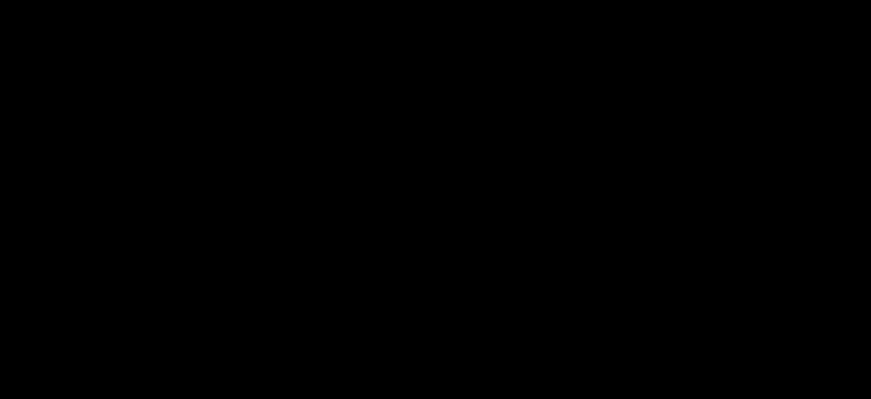

# 04 - The Dense layer class and spiral data

> **TL;DR.** Hand-writing `np.dot` calls for every layer is tractable for two layers and unmaintainable for fifty. This post packages the forward pass into a reusable `Layer_Dense` class, switches the weight matrix to one column per neuron so that the transpose leaves the forward call, and introduces the spiral dataset, a deliberately non-linear three-class benchmark that the series works on up to post 31.
>
> **Prerequisites:** [Post 03](../03-stacking-layers-and-the-forward-pass/index.md).
> **Safe to skip?** Skip it if the reader can already write `Layer_Dense` with its `(n_inputs, n_neurons)` weights from memory, knows the shapes that `spiral_data(samples=100, classes=3)` returns, and can say why a linear model fails on that data.
>
> **After reading, you will be able to:**
>
> - Implement a Layer_Dense class whose constructor allocates small random weights and zero biases and whose forward method computes a batch's output.
> - Generate the spiral dataset with spiral_data and state the shape and meaning of the arrays X and y it returns.
> - Explain in one sentence why no linear model can separate the three spiral classes.
> - Convert a layer between the two weight-matrix conventions and name the one the series uses from this post on.
> - Trace the shape of every array as a batch passes through one or two Layer_Dense instances.


*The series' standard benchmark, sketched with 30 markers per class. No straight line separates the classes; the rest of the series builds a network whose boundary bends around the arms.*

---

## 1. The question: how is a layer packaged, and what is it pointed at?

Up to now the forward pass has been hand-coded for each layer. That worked for a two-layer demo. It would not survive a fifty-layer network or any experiment that re-arranges layers across runs. The same code repeated five times is a smell; repeated fifty times is a bug factory.

Two additions make the rest of the series possible:

1. **A `Layer_Dense` class.** One object per layer, holding its own weights and biases. The forward pass becomes a single method call. The class is the smallest possible mirror of what every production framework calls a module or a layer: PyTorch's `nn.Module`, Keras's `Layer`, Flax's `nn.Module`, whose dense layers are `nn.Linear`, `Dense` and `nn.Dense`. The pattern travels.
2. **A standard dataset to point the network at.** The spiral dataset is hard enough to require a real network and small enough to train on a laptop in seconds. Its generator comes from the neural-network case study in the Stanford CS231n course notes, and the `nnfs` helper package that accompanies the book of Kinsley and Kukieła (2020) ships a version of it as `spiral_data`. This post generates it; post 06 passes it through the first activation functions, and the training loop that learns it is written in post 22.

Together they are the smallest amount of scaffolding needed before training can begin.

Two plain functions, one that creates the arrays and one that runs the forward pass, would also work for a single layer. A class is preferred for two reasons. First, the layer's state (its weights and biases) needs a home that travels with the layer; a class instance is the natural one. Second, when the backward pass arrives, every layer will need to store its own gradients too. Without a class, those gradients would have to be threaded through every function call.

---

## 2. The spiral dataset

A glance at the hero figure explains the problem: three intertwined spiral arms, each one a different class. No straight line separates any pair of classes. Each arm starts at the origin, ends at distance 1 from it, and turns through about 10 radians on the way, a little more than one and a half full turns, so the three arms wrap around one another.

In code, the dataset comes from the `nnfs` helper package, which exists for exactly this purpose:

```python
import numpy as np
import nnfs
from nnfs.datasets import spiral_data

nnfs.init()                                 # seed 0, float32 arrays, a patched np.dot

X, y = spiral_data(samples=100, classes=3)
# X.shape = (300, 2)   : 100 samples per class, 3 classes, two coordinates per sample
# y.shape = (300,)     : class label (0, 1, or 2) for each row

print("X:", X.shape, X.dtype)
print("y:", y.shape, y.dtype)
print("samples per class:", np.bincount(y))
print("first three rows of X:")
print(X[:3])
print("labels of rows 98 to 101:", y[98:102])
```

```text
X: (300, 2) float32
y: (300,) uint8
samples per class: [100 100 100]
first three rows of X:
[[0.         0.        ]
 [0.00299556 0.00964661]
 [0.01288097 0.01556285]]
labels of rows 98 to 101: [0 0 1 1]
```

`X` is a `(300, 2)` matrix: each row is a single 2-D point in the plane. `y` is a 1-D array of class labels, one per row. Each row of `X` is one **sample** (one example) and each column is one **feature** (one input dimension), so the spiral data has 300 samples and 2 features. The pair `(X, y)` is the universal supervised-learning format: inputs and the labels they should predict.

The rows are ordered by class: rows 0 to 99 belong to class 0, rows 100 to 199 to class 1, and rows 200 to 299 to class 2. Within a class the points run outwards along the arm, so the first row of every class is the origin itself. The arguments set the size and nothing else. `X` always has `samples * classes` rows and 2 columns: `samples=100, classes=5` gives the shape `(500, 2)`, and `samples=1000, classes=3` gives `(3000, 2)`.

`nnfs.init()` does three things. It seeds NumPy's random generator with 0, so every run draws the same numbers. It wraps `np.zeros`, `np.random.randn` and `np.eye` so that they return `float32` arrays, the default precision of deep-learning frameworks, in place of NumPy's `float64`. And it replaces `np.dot` with a version that computes in `float64` and returns `float32`, which the package does to keep results consistent from one machine to the next. Arrays made in any other way, with `np.array` or `np.ones` for instance, stay `float64`.

### 2.1. How well does a fitted straight-line model do?

A linear classifier for three classes computes three scores, each a weighted sum of the two coordinates plus a bias, and answers with the class whose score is largest. That cuts the plane into at most three regions with straight edges, and no arrangement of straight cuts can follow three arms that wrap around one another. A linear model, no matter how its inputs are weighted, therefore cannot separate the classes, and in practice it does only a little better than chance, which for three equally frequent classes is one in three, 33.3 percent.

The script `snippets/linear_baseline.py` puts a number on it. One `Layer_Dense(2, 3)` followed by softmax is exactly such a linear classifier; trained until it stops improving on the 300 points, it gets 118 of them right, 39.3 percent. A least-squares fit, an unrelated way of fitting a straight-line model, also gets 118. Always answering the same class gets 100. Both fits minimise a smooth loss and not the number of wrong answers, so 118 is what a fitted linear model scores here, not the most that three straight-edged regions could get right. The script borrows its training loop from later posts (the softmax of post 06, the loss of post 08, the gradient of post 19, the update of post 22) and nothing else in this post depends on it; it is there to turn "hard" into a number.

### 2.2. Why this dataset and not MNIST



*Two features is what keeps the data, and later every decision boundary drawn through it, on a single chart that can be checked by eye, all the way to post 31.*

MNIST is the canonical first dataset for deep learning, but for a from-scratch series it gets in the way: each image is 784 features, the training set is 60,000 samples, and the visualisations require a grid of greyscale tiles. The spiral dataset has 2 features and 300 samples, which means the data, and later the boundary a network draws through it, fit on a single chart and can be inspected by eye, as the figure above sets out. MNIST arrives in the [MNIST from scratch project](../../projects/mnist-from-scratch/README.md); for now, two features and three classes are the right scale.

---

## 3. A short Python OOP refresher

Four terms appear in every Python class and confuse first-time readers consistently.

| Term | What it is | The Python neural-network code that uses it |
|---|---|---|
| Class | A blueprint that defines what attributes and methods an object will have. | `class Layer_Dense:` |
| Instance | A specific object created from the blueprint. Each instance has its own data. | `dense1 = Layer_Dense(2, 3)` |
| `self` | A name that refers to "this particular instance" inside a method. | `self.weights = ...` |
| `__init__` | A method that runs automatically when an instance is created. | `def __init__(self, n_inputs, n_neurons): ...` |

A short example makes the relationships concrete:

```python
class Dog:
    def __init__(self, name):
        self.name = name

a = Dog("Buddy")    # __init__ runs with self = a, name = "Buddy"
b = Dog("Lucy")     # __init__ runs again with self = b, name = "Lucy"
print(a.name, b.name)   # "Buddy Lucy"

a.name = "Rex"          # change one instance
print(a.name, b.name)   # "Rex Lucy": b is untouched
```

`a` and `b` are independent instances. Each has its own `name`. Nothing about `a` leaks into `b`: renaming `a` leaves `b.name` at `"Lucy"`. The same independence will hold for `dense1` and `dense2` once they are layers.

For a deeper Python refresher the standard reference is Ramalho's *Fluent Python* (Ramalho, 2022); for the specific pattern of "module-style" classes in deep learning, the PyTorch `nn.Module` documentation is the canonical source.

---

## 4. The weight-matrix convention, revisited

Posts 01 to 03 stored weights with one row per neuron: $\mathbf{W}$ of shape $(n_\text{neurons}, n_\text{inputs})$, which post 03 wrote as $(m, n)$ for $m$ neurons of $n$ inputs each. Every batch forward pass needed a transpose: `np.dot(X, W.T) + b`.

This post switches conventions. From now on, weights are stored with one **column** per neuron: $\mathbf{W}$ of shape $(n_\text{inputs}, n_\text{neurons})$. The transpose disappears, and a layer computes

$$\mathbf{Z} = \mathbf{X}\mathbf{W} + \mathbf{b}$$

| Convention | $\mathbf{W}$ shape | Forward pass |
|---|---|---|
| Old (posts 01 to 03) | $(n_\text{neurons}, n_\text{inputs})$, rows are neurons | `np.dot(X, W.T) + b` |
| New (post 04 onward) | $(n_\text{inputs}, n_\text{neurons})$, columns are neurons | `np.dot(X, W) + b` |

The arithmetic is identical. The numbers come out the same. Only the layout of `W` in memory and the call site change, and converting a layer from one convention to the other is a single transpose. The script `snippets/weight_convention.py` checks this on the first layer of post 03, 3 neurons over 4 inputs, written out in both layouts:

```python
# Old layout (posts 01 to 03): one ROW per neuron, shape (n_neurons, n_inputs) = (3, 4).
weights_old = np.array([[ 0.2,   0.8,  -0.5,   1.0 ],
                        [ 0.5,  -0.91,  0.26, -0.5 ],
                        [-0.26, -0.27,  0.17,  0.87]])
output_old = np.dot(inputs, weights_old.T) + biases

# New layout (post 04 onward): one COLUMN per neuron, shape (n_inputs, n_neurons) = (4, 3).
weights_new = np.array([[ 0.2,   0.5,  -0.26],
                        [ 0.8,  -0.91, -0.27],
                        [-0.5,   0.26,  0.17],
                        [ 1.0,  -0.5,   0.87]])
output_new = np.dot(inputs, weights_new) + biases
```

The first row of `weights_old` is the first column of `weights_new`: the same four weights of the same neuron, stored along the other axis. Both calls print the output of post 03, whose first row is 4.8, 1.21, 2.385, and the script ends with `outputs identical: True`.

The new layout is the one the `nnfs` book uses (Kinsley & Kukieła, 2020), and it is the one this series uses in every remaining post. Frameworks are split on the choice: Keras stores the kernel of a `Dense` layer as (inputs, units), the layout adopted here, while PyTorch's `nn.Linear` stores its weight as `(out_features, in_features)`, the layout of posts 01 to 03, and applies the transpose inside its own forward call. Neither is more correct; what matters is knowing which one a given piece of code uses.

### 4.1. Why bother switching

Two reasons, both practical.

- **No transpose in the call site.** `np.dot(X, W) + b` reads more naturally than `np.dot(X, W.T) + b`, and there is one fewer place for a missing `.T` to break the code.
- **Weight initialisation matches the call shape.** When the new layer is created, the weights are allocated as `np.random.randn(n_inputs, n_neurons)`. This is the same shape that will be passed to `np.dot`. The two operations stay consistent.

The cost is a one-time mental adjustment: the row count of $\mathbf{W}$ is now the input size, not the neuron count. The bias changes shape at the same time, from the $(n_\text{neurons},)$ array of post 03 to a $(1, n_\text{neurons})$ row; section 5.1 gives the reason.

---

## 5. The `Layer_Dense` class

A **dense layer** is a layer in which every input feeds every neuron, which is what the matrix product of the last three posts computes. The class that implements it has two methods and, counting the `class` line, six lines of code.

```python
class Layer_Dense:

    def __init__(self, n_inputs, n_neurons):
        # Small random weights; zero biases.
        self.weights = 0.01 * np.random.randn(n_inputs, n_neurons)
        self.biases  = np.zeros((1, n_neurons))

    def forward(self, inputs):
        self.output = np.dot(inputs, self.weights) + self.biases
```

The figure below draws the class as a blueprint and, under it, the two instances that section 6 creates from it.


*One blueprint, two instances. Each instance owns its own weights, biases and output; the only thing that passes from one to the other is `dense1.output`.*

Each line does one thing, and each thing has a reason.

### 5.1. `__init__` allocates the state

The constructor takes two integers: how many inputs each neuron consumes (`n_inputs`) and how many neurons live in this layer (`n_neurons`). It uses those to allocate the two arrays the layer will own. Choosing their starting values is called **initialisation**.

**`self.weights = 0.01 * np.random.randn(n_inputs, n_neurons)`** draws each weight independently from a standard normal distribution and scales the result by 0.01. `np.random.normal(0, 1, (n_inputs, n_neurons))` draws from the same distribution; `randn` is the shorter form, and `normal` is preferred when the distribution's parameters are not 0 and 1. The reason for the scaling is to keep the layer outputs small at the start of training. Pure $\mathcal{N}(0, 1)$ weights are too large once layers are stacked: each layer multiplies the typical size of its input by roughly the weight scale times the square root of the number of inputs per neuron, so the outputs grow exponentially with depth.

The script `snippets/init_scale.py` measures this on six stacked layers of 64 neurons fed with the spiral data. With a scale of 1.0 the standard deviation of the outputs is 0.57 after the first layer and 21,510 after the sixth, about 8 times larger per layer ($1.0 \times \sqrt{64} = 8$). With 0.01 the same stack runs the other way, from 0.0057 down to $2.2 \times 10^{-8}$, about 12 times smaller per layer ($0.01 \times \sqrt{64} = 0.08$). A multiplier of 0.01 is therefore a deliberately conservative default: it works for the shallow networks of this series, and in a deep one it fades the signal out instead of blowing it up. The scale that does neither depends on the width of the layer. For 64 inputs per neuron it is $1/\sqrt{64} = 0.125$, and with that scale the script's third column stays between 0.07 and 0.09 through all six layers. Choosing the scale per layer in this way is what Xavier/Glorot initialisation (Glorot & Bengio, 2010) and He initialisation (He et al., 2015) do; they are the subject of post 33, and neither is needed yet.

**`self.biases = np.zeros((1, n_neurons))`** starts every bias at zero. Asymmetry between neurons comes from the random weights: if every weight started at the same value, all the neurons of a layer would compute the same output and, once training begins, receive the same update, so they would stay copies of one another. Random weights rule that out, which is known as symmetry breaking; adding random biases on top does not help and complicates debugging. The shape is `(1, n_neurons)` and not `(n_neurons,)`. Both work in the forward pass, because NumPy broadcasts the bias across the batch either way (post 05 gives the rule), but the `(1, n_neurons)` shape makes the intent ("this is a row vector that gets added to each row of the output") explicit, which helps when reading the code months later.

### 5.2. `forward` runs the computation

`forward` takes the layer's input (either the original data or the previous layer's output), runs the matrix multiplication, adds the bias, and stores the result on the instance as `self.output`. The method returns nothing. Storing the result on the instance is the convention that every component in this series follows: the next layer reads `dense1.output`, and a script can print or check any intermediate array after the call. The backward pass will need one more stored array, the layer's input, and post 16 adds it.

### 5.3. What `Layer_Dense` is *not*

A boundary section, because the class is intentionally minimal and the next several posts will extend it.

- **It is not non-linear.** There is no activation function in `forward`. Stacking these layers alone produces the same problem as in post 03: a stack of linear layers is itself linear. Activations enter in post 06.
- **It is not a model.** A trained model is a stack of layers plus a loss plus a training loop. This class is just one layer's forward pass.
- **It does not train itself.** The weights are random and stay random. Updating them requires gradients (posts 12 to 21) and an optimiser (posts 22 to 27).
- **It does not yet remember its input.** Calling `forward` overwrites `self.output` and keeps no reference to `inputs`. For the backward pass to work, `self.inputs = inputs` must also be stored; this is added in post 16. It is left out here to keep this version minimal.

---

## 6. Using the class

A single layer with spiral data:

```python
nnfs.init()

X, y = spiral_data(samples=100, classes=3)

dense1 = Layer_Dense(2, 3)   # 2 input features, 3 neurons
dense1.forward(X)

print(dense1.output[:5])
```

**Output (deterministic, because `nnfs.init()` fixes the RNG seed):**

```text
[[ 0.0000000e+00  0.0000000e+00  0.0000000e+00]
 [-1.0475188e-04  1.1395361e-04 -4.7983500e-05]
 [-2.7414842e-04  3.1729150e-04 -8.6921798e-05]
 [-4.2188365e-04  5.2666257e-04 -5.5912682e-05]
 [-5.7707680e-04  7.1401405e-04 -8.9430439e-05]]
```

The first row is exactly zero: the first sample of class 0 is the origin, a zero input times any weights is zero, and the biases are zero. The other four rows are tiny for two reasons. The weights were multiplied by 0.01, and these four samples are the next points along the arm, all within 0.05 of the origin. Over all 300 rows the largest entry in absolute value is 0.0175, which is the expected scale for a first layer at initialisation: weights near 0.01 times inputs no larger than 1.

### 6.1. Shape trace

| Symbol | Shape | Where it comes from |
|---|---|---|
| `X` | $(300, 2)$ | 300 spiral points, 2 features each |
| `dense1.weights` | $(2, 3)$ | `n_inputs=2`, `n_neurons=3` |
| `dense1.biases` | $(1, 3)$ | one bias per neuron, row-vector form |
| `np.dot(X, dense1.weights)` | $(300, 3)$ | $(300, 2) \cdot (2, 3)$ |
| `dense1.output` | $(300, 3)$ | bias broadcast across all 300 rows |

The layer owns $2 \times 3 = 6$ weights and 3 biases, 9 numbers in all. In general a `Layer_Dense(n_inputs, n_neurons)` has $n_\text{inputs} \cdot n_\text{neurons} + n_\text{neurons}$ parameters, and the size of the batch never enters the count.

### 6.2. Two stacked layers

The script continues with a second layer that reads the output of the first:

```python
dense2 = Layer_Dense(3, 3)    # 3 inputs (the three outputs of dense1), 3 neurons
dense2.forward(dense1.output)

print(dense2.output[:5])
```

```text
[[0.0000000e+00 0.0000000e+00 0.0000000e+00]
 [1.7565117e-06 1.6089588e-06 6.8606624e-07]
 [4.1309927e-06 3.9028992e-06 1.8521655e-06]
 [5.4186435e-06 5.3859658e-06 2.9643538e-06]
 [7.5680446e-06 7.4703939e-06 4.0358373e-06]]
```

`dense2` is created with `n_inputs=3` because that is what `dense1` produces. The shape-continuity rule from post 03 is still in force; the class does not relax it. Its output has shape $(300, 3)$, from $(300, 3) \cdot (3, 3)$ plus a $(1, 3)$ bias. The two layers happen to have the same number of neurons here, but nothing requires that: layer widths are hyperparameters, making them all equal is a default and not a rule, and common topologies taper down towards the output. Only the `n_inputs` of each layer is fixed, by the data for the first layer and by the layer before it for every other one.

The two instances do not share weights. `dense1.weights` is a different array, with different random numbers, from `dense2.weights`. Their forward passes do not interfere with one another. This is what object orientation buys: state encapsulated in instances and not smeared across the script. `dense2` owns $3 \times 3 + 3 = 12$ numbers, so the two-layer stack has $9 + 12 = 21$ parameters.

The outputs of the second layer are smaller again, at most 0.00021 in absolute value against 0.0175 for the first: every layer with 0.01-scaled weights shrinks the signal, the effect that section 5.1 measured on a deeper stack.

---

## 7. Make it run: seven short scripts

Every printed block in this post comes from a script in `snippets/`, and so does every number the post reports from a run. Each one runs from the series root in under a second on a CPU, for example `python posts/04-dense-layer-class-and-spiral-data/snippets/dense_layer.py`. Five of them need the `nnfs` package (`pip install nnfs`) besides NumPy; `weight_convention.py` needs NumPy alone and `classes_and_instances.py` nothing at all.

| Script | Section | What it prints |
|---|---|---|
| `spiral_dataset.py` | 2 | the shapes, types and first rows shown in section 2, each arm running from distance 0.00 to 1.00, and the shapes `(30, 2)`, `(3000, 2)` and `(500, 2)` for other arguments |
| `linear_baseline.py` | 2.1 | the block below: 100 of 300 for one fixed answer, 118 of 300 for a trained linear layer and for least squares |
| `classes_and_instances.py` | 3 | `Buddy Lucy`, then `Rex Lucy` |
| `weight_convention.py` | 4 | the same $(3, 3)$ output from both layouts, then `outputs identical: True` |
| `dense_layer.py` | 5 and 6 | the two five-row blocks of section 6, the shapes of section 6.1, the parameter counts 9 and 12, and the largest absolute outputs 0.017456729 and 0.00020713627 |
| `init_scale.py` | 5.1 | the table below |
| `pitfalls.py` | 8 | every error message and comparison quoted in section 8 |

`linear_baseline.py` prints:

```text
always answering one class: 100 of 300 correct, 33.3%
step    0: loss 1.0985, 101 of 300 correct, 33.7%
step   10: loss 1.0882, 117 of 300 correct, 39.0%
step  100: loss 1.0830, 118 of 300 correct, 39.3%
step 1000: loss 1.0830, 118 of 300 correct, 39.3%
least squares: 118 of 300 correct, 39.3%
least-squares predictions per class: [100 129  71]
```

Between step 100 and step 1,000 neither the loss, to four decimals, nor the number of correct answers changes: the fit has converged, and more training does not move it past 118. The loss column is explained in post 08.

`init_scale.py` prints:

```text
standard deviation of each layer's output, 64 neurons per layer
layer   scale 0.01      scale 1.0       scale 0.125
1       5.651e-03       5.651e-01       7.063e-02
2       4.787e-04       4.787e+00       7.480e-02
3       4.095e-05       4.095e+01       7.997e-02
4       3.359e-06       3.359e+02       8.201e-02
5       2.586e-07       2.586e+03       7.892e-02
6       2.151e-08       2.151e+04       8.204e-02
average change per extra layer (layer 6 over layer 1, fifth root):
  scale 0.01: x 0.082   (scale * sqrt(64) = 0.08)
  scale 1.0: x 8.243   (scale * sqrt(64) = 8.00)
  scale 0.125: x 1.030   (scale * sqrt(64) = 1.00)
```

The script uses the same random draws for all three columns, so every entry of the middle column is $100^L$ times the entry to its left, where $L$ is the layer number: with no activation and zero biases, multiplying every weight by 100 multiplies the output of layer $L$ by $100^L$.

---

## 8. What can go wrong?

Each failure below is triggered on purpose by `snippets/pitfalls.py`, which prints the messages quoted here.

- **The batch size is passed as `n_inputs`.** `n_inputs` is the number of features, 2 for the spiral data however many samples `X` holds. `Layer_Dense(300, 3)` builds a $(300, 3)$ weight matrix, and the forward pass stops with `ValueError: shapes (300,2) and (300,3) not aligned: 2 (dim 1) != 300 (dim 0)`.
- **The weights are left in the old layout.** With a $(3, 2)$ matrix, one row per neuron, `np.dot(X, W)` fails loudly: `ValueError: shapes (300,2) and (3,2) not aligned: 2 (dim 1) != 3 (dim 0)`. The dangerous case is a layer with as many neurons as inputs. Both layouts are then $(3, 3)$, no error is raised, and the output has the right shape and the wrong numbers.
- **The return value of `forward` is used.** The method stores its result and returns `None`, so `result = dense1.forward(X)` followed by `result[:5]` raises `TypeError: 'NoneType' object is not subscriptable`. The output is read from `dense1.output`.
- **The numbers do not match the ones printed here.** The weights of a layer are the next numbers in the random stream, so they depend on everything drawn before them. In section 6 `spiral_data` draws 300 numbers first, the noise on each point's angle, and `dense1` receives the six after those; its first weight row is `[-0.01306527  0.01658131 -0.00118164]`. Created before the data, the same layer receives the first six numbers of the stream, and its first row is `[0.01764052 0.00400157 0.00978738]`. Without any seed the weights change on every run. Two instances created in one run always differ, and setting the seed again replays the same weights.
- **`nnfs.init()` is left out, or added to an older script.** Without it, the same seed gives `float64` arrays. The outputs of section 6 then agree with the printed ones to within $1.6 \times 10^{-9}$, but they print with one more digit, and the memory footprint doubles. With it, `np.dot` accepts arrays only: the plain Python lists that post 01 handed to `np.dot` now raise `AttributeError: 'list' object has no attribute 'astype'`, and wrapping them in `np.array` is the fix. The call belongs at the top of the script, before any array or layer is created.
- **The 0.01 scale is carried into a deep network.** Nothing raises an error. The outputs just shrink layer after layer, to a standard deviation of $2.2 \times 10^{-8}$ after six 64-neuron layers in section 7. Post 33 shows what that does to training and replaces the fixed 0.01 with a scale computed from the layer's width.

---

## 9. Summary

| Concept | Takeaway |
|---|---|
| Spiral data | Three intertwined non-linear classes, 300 samples and 2 features; the series' standard benchmark |
| Linear baseline | 118 of 300 correct, 39.3 percent, against 33.3 percent for one fixed answer |
| Class | A blueprint that defines what attributes and methods an object has |
| Instance | A specific object with its own data, created from a class |
| `self` | A reference to "this particular instance" inside a method |
| `__init__` | Runs automatically when an instance is created; allocates weights and biases |
| `forward` | Runs the dot product, adds the bias, stores the output on `self` |
| Weight convention | This post switches to $\mathbf{W}$ of shape $(n_\text{inputs}, n_\text{neurons})$; the transpose disappears from the forward call |
| Parameters | $n_\text{inputs} \cdot n_\text{neurons} + n_\text{neurons}$ per layer: 9 for `Layer_Dense(2, 3)`, 21 for the two-layer stack |

---

## Common pitfalls

1. **Reusing the same `Layer_Dense` instance for different roles.** Each layer in a stack should be its own instance. Sharing an instance means sharing weights, which is rarely what is wanted.
2. **Forgetting that weights are random at creation time.** Two different runs of the script will produce two different sets of weights unless `nnfs.init()` (or `np.random.seed(...)`) is called first.
3. **Setting `n_inputs` to the batch size by mistake.** `n_inputs` is the feature count, not the sample count. For spiral data, `n_inputs=2` regardless of how many samples are in `X`.
4. **Storing weights with shape `(n_neurons, n_inputs)` after the switch.** The new convention is `(n_inputs, n_neurons)`. Reversing it raises a shape error for most layers and silently computes the wrong numbers for a square one.
5. **Calling `forward` and then expecting the return value.** The method writes to `self.output` and returns `None`. Always read `dense1.output`, not `result = dense1.forward(X)`.

---

## Further reading

- Glorot, X. and Bengio, Y., *"Understanding the Difficulty of Training Deep Feedforward Neural Networks"* (AISTATS, 2010).
- He, K., Zhang, X., Ren, S., and Sun, J., *"Delving Deep into Rectifiers: Surpassing Human-Level Performance on ImageNet Classification"* (ICCV, 2015).
- Kinsley, H. and Kukieła, D., *Neural Networks from Scratch in Python*, chapter 3 (2020), and the `nnfs` package that ships `spiral_data`.
- Paszke, A., et al., *"PyTorch: An Imperative Style, High-Performance Deep Learning Library"* (NeurIPS, 2019).
- Ramalho, L., *Fluent Python*, the chapters on classes and protocols (O'Reilly, 2nd edition, 2022).
- Stanford CS231n, *Convolutional Neural Networks for Visual Recognition*, course notes, ["Putting it together: Minimal Neural Network Case Study"](https://cs231n.github.io/neural-networks-case-study/). The source of the spiral generator.

Full citations are in [REFERENCES.md](../../REFERENCES.md).

---

## What to read next

- **[Post 05 - Array summation, keepdims, and broadcasting](../05-array-summation-keepdims-and-broadcasting/index.md):** the shape rules that make the bias addition above work, and the patterns that come up again in loss and softmax.
- **[Post 16 - Coding backpropagation](../16-coding-backpropagation/index.md):** the version of `Layer_Dense` that also stores its inputs, ready to run the backward pass.
