# Part 05 · Array summation, keepdims, and broadcasting

> **TL;DR.** Two NumPy features sit between every neural-network beginner and a working softmax: the `axis` parameter of reductions like `np.sum` and `np.max`, and the broadcasting rules that decide which array shapes can be combined element-wise, both of which can produce wrong answers without raising errors. This post nails down the meaning of `axis`, explains why `keepdims=True` is the default safe choice, and lays out the broadcasting rules in the order NumPy actually applies them.
>
> **Reading time:** ~12 minutes.
>
> **After reading this you will be able to:**
> - Predict the shape of `np.sum(a, axis=k, keepdims=...)` for any 2-D `a`.
> - Read two shapes side by side and say whether they broadcast, without running the code.
> - Spot the silent-wrong-answer bug where a 1-D `(n,)` array gets broadcast as a row when a column was intended.


*The axis you name is the one that disappears. Everything in this post hinges on that single sentence.*

---

## 1. Why two NumPy features deserve their own post

Most numerical bugs make themselves known: a shape mismatch raises a `ValueError`, a divide-by-zero raises a `RuntimeWarning`. The two features in this post fail more quietly. `np.sum(a, axis=1)` returns a result of the right rank for a sensible-looking call, then broadcasts incorrectly when used in a later subtraction. The code runs. The numbers are wrong. The training loop reports a loss that drifts in the wrong direction.

Softmax, cross-entropy, batch-normalisation, and almost every loss function the next twenty parts touch require correct reductions along a chosen axis and correct broadcasting against the result. Settling these mechanics now is cheaper than debugging them inside a forward pass three posts from now.

Broadcasting itself is older than NumPy. The conformability rules trace back to Iverson's APL in 1962; NumPy formalised them for Python in version 1.0 (2006), and they are now the de-facto standard in every array library, including PyTorch, TensorFlow, and JAX (Harris et al., 2020). The rules in §4 are not NumPy-specific; the same shape gymnastics applies in every framework.

---

## 2. Array summation with `axis`

Take a 3-by-3 array:

```python
import numpy as np

a = np.array([[1, 2, 3],
              [4, 5, 6],
              [7, 8, 9]])
```

`np.sum` reduces the array along one or more axes. Three behaviours are worth distinguishing.

### 2.1. No `axis`: flatten everything

```python
np.sum(a)             # 45
np.sum(a, axis=None)  # 45 (same thing)
```

Every element is summed. The result is a scalar.

### 2.2. `axis=0`: collapse rows, sum each column

```python
np.sum(a, axis=0)     # [12, 15, 18]
```

The result has shape `(3,)`. Each entry is one column's sum: `1+4+7=12`, `2+5+8=15`, `3+6+9=18`. The row axis is gone.

### 2.3. `axis=1`: collapse columns, sum each row

```python
np.sum(a, axis=1)     # [6, 15, 24]
```

Again shape `(3,)`. Each entry is one row's sum: `1+2+3=6`, `4+5+6=15`, `7+8+9=24`. The column axis is gone.

### 2.4. The mnemonic that survives every dimension

> The axis you pass is the axis that disappears.

For a 2-D array, `axis=0` collapses the row dimension and leaves the column dimension; `axis=1` does the opposite. For a 3-D batch of shape `(N, H, W)`, `axis=0` reduces across the batch, leaving a shape-`(H, W)` result. The rule does not change with rank, as a quick check confirms:

```python
b = np.ones((4, 2, 3))               # shape (4, 2, 3)
np.sum(b, axis=0).shape              # (2, 3)  — the named axis 0 is gone
np.sum(b, axis=1).shape              # (4, 3)  — axis 1 is gone
```

### 2.5. What is *not* obvious about the result

Both `np.sum(a, axis=0)` and `np.sum(a, axis=1)` return a 1-D array of shape `(3,)`. That 1-D shape is the source of the silent-bug class that §3 catalogues. A 1-D `(n,)` array is not the same thing as a row vector of shape `(1, n)` nor a column vector of shape `(n, 1)`. NumPy's broadcasting rules treat the three differently, and the difference is invisible at the `print` site.

---

## 3. `keepdims=True`: preserving the reduced axis

Adding `keepdims=True` keeps the reduced axis around as a length-1 dimension, instead of dropping it.

```python
np.sum(a, axis=0, keepdims=True)     # [[12, 15, 18]]   shape (1, 3)
np.sum(a, axis=1, keepdims=True)     # [[6], [15], [24]] shape (3, 1)
```

Summary of the four combinations:

| Call | Result | Shape | Geometric interpretation |
|---|---|:---:|---|
| `np.sum(a, axis=0)` | `[12, 15, 18]` | `(3,)` | 1-D array |
| `np.sum(a, axis=0, keepdims=True)` | `[[12, 15, 18]]` | `(1, 3)` | row vector |
| `np.sum(a, axis=1)` | `[6, 15, 24]` | `(3,)` | 1-D array |
| `np.sum(a, axis=1, keepdims=True)` | `[[6], [15], [24]]` | `(3, 1)` | column vector |

The first and third look identical when printed. They are. But the way they interact with broadcasting downstream is opposite, which is what makes them so easy to confuse.

### 3.1. The silent-bug example: per-row max subtraction

A pattern from softmax: subtract the largest value in each row from every entry of that row. The expected result for the `a` above is three rows that each end with zero:

```
[[-2, -1, 0],
 [-2, -1, 0],
 [-2, -1, 0]]
```


*Same code shape, same call style. The only difference is `keepdims=True`. One result is correct; one is silently wrong.*

**Without `keepdims` (silently wrong):**

```python
max_vals = np.max(a, axis=1)        # [3, 6, 9]   shape (3,)
print(a - max_vals)
# [[-2, -4, -6],
#  [ 1, -1, -3],
#  [ 4,  2,  0]]
```

NumPy treats `[3, 6, 9]` as a 1-D array, which broadcasts as a row vector against the 2-D `a`. So `3` is subtracted from column 0 of every row, `6` from column 1, `9` from column 2. The arithmetic runs without error. The numbers are wrong.

**With `keepdims=True` (correct):**

```python
max_vals = np.max(a, axis=1, keepdims=True)  # [[3], [6], [9]]   shape (3, 1)
print(a - max_vals)
# [[-2, -1, 0],
#  [-2, -1, 0],
#  [-2, -1, 0]]
```

Now `max_vals` is a column vector. Broadcasting extends it across the three columns, subtracting `3` from row 0, `6` from row 1, `9` from row 2. The result matches the expectation.

### 3.2. The rule of thumb

> When reducing along an axis and then operating against the original 2-D array, always pass `keepdims=True`.

The rule costs nothing when it is not needed and prevents the wrong-shape-broadcast bug when it is. Codebases that adopt it everywhere have visibly fewer silent failures.

---

## 4. The broadcasting rules

Broadcasting is the mechanism that lets NumPy combine arrays of different shapes element-wise. Without it, `a + b` would only work when `a.shape == b.shape`. With it, a `(300, 3)` matrix can have a `(3,)` bias added to every row by writing `a + b`, no `np.tile` or explicit replication needed.

The rules NumPy applies are, in order:

1. **Align trailing dimensions.** If the two arrays have different ranks, the shorter shape is left-padded with 1s until both have the same length. So `(3,)` paired with a 2-D operand is treated as `(1, 3)`.
2. **Compatibility check.** For each pair of aligned dimensions, the two sizes must be equal, or one of them must be 1. If neither holds, NumPy raises an error.
3. **Stretch the 1s.** Any dimension of size 1 in either operand is conceptually replicated to match the other operand's size in that dimension.
4. **Operate element-wise.** The (now equal-shape) operands are combined.


*A 1-D shape `(n,)` is always padded to `(1, n)`. It can never be interpreted as a column on its own.*

A few worked compatibility checks:

| Left shape | Right shape | Result | Reason |
|---|---|---|---|
| `(3, 3)` | `(3, 1)` | `(3, 3)` | column 1 stretches across 3 columns |
| `(3, 3)` | `(1, 3)` | `(3, 3)` | row of 1 stretches across 3 rows |
| `(3, 3)` | `(3,)` | `(3, 3)` | `(3,)` padded to `(1, 3)`, then row-stretches |
| `(300, 3)` | `(3,)` | `(300, 3)` | same as above, with a bigger leading dim |
| `(3, 3)` | `(2, 3)` | error | inner dims are 3 vs 2; neither is 1 |
| `(3, 3)` | `(3, 2)` | error | column dim is 3 vs 2; neither is 1 |

### 4.1. What broadcasting is *not*

A boundary section, because the distinction matters in code.

- **Broadcasting is not matrix multiplication.** `a + b` and `a * b` are element-wise after broadcasting; they are not `np.dot(a, b)`. Mixing them up is one of the most common errors in custom layer implementations.
- **Broadcasting is not a reshape.** It does not copy data; it sets up a virtual replication that the underlying loop uses without ever materialising the larger array. This is fast, but it means the result's shape is determined by the rules, not by what was intended.
- **Broadcasting is commutative in shape and result.** `a + b` and `b + a` always give the same numbers, and the broadcast shape is determined symmetrically from both operands. The order only matters for in-place operations like `a += b`, where the left operand's shape must already accommodate the result.

---

## 5. Broadcasting in a neural-network forward pass

The bias addition from Part 04 is the textbook example. The dot product produces a `(300, 3)` matrix of layer outputs. The bias is stored as a `(1, 3)` row vector. Adding them looks like a shape mismatch and works anyway:

```python
out = np.dot(X, W) + b          # X: (300, 2), W: (2, 3), b: (1, 3)
# np.dot(X, W) has shape (300, 3)
# b has shape (1, 3)
# (300, 3) + (1, 3) → broadcasts to (300, 3)
```

The bias of shape `(1, 3)` is implicitly replicated 300 times down the row axis. Every sample sees the same three bias values added to its three neuron outputs. No `for` loop. No `np.tile`. One operator.

The same pattern appears in softmax (subtract per-row max then divide by per-row sum), in batch normalisation (subtract per-channel mean, divide by per-channel std), and in cross-entropy (compute log-likelihoods row by row). Every one of these uses `keepdims=True` to keep the reduction's column shape, then broadcasts back against the original 2-D array. Internalising the pattern now pays back across the rest of the series.

---

## 6. The shape diary for reductions and broadcasting

| Operation | `a` shape | Reduction | Output shape | Notes |
|---|---|---|---|---|
| `np.sum(a)` | `(N, F)` | full | scalar | rarely what is wanted in deep learning |
| `np.sum(a, axis=0)` | `(N, F)` | drop $N$ | `(F,)` | per-feature sum across the batch |
| `np.sum(a, axis=1)` | `(N, F)` | drop $F$ | `(N,)` | per-sample sum across features |
| `np.sum(a, axis=0, keepdims=True)` | `(N, F)` | drop $N$ | `(1, F)` | broadcasts cleanly back against `a` |
| `np.sum(a, axis=1, keepdims=True)` | `(N, F)` | drop $F$ | `(N, 1)` | broadcasts cleanly back against `a` |

A 1-D array of shape `(F,)` and a row-vector of shape `(1, F)` print identically. They broadcast identically against a 2-D `(N, F)` array. The trouble starts only when an operation requires the result to be a column, in which case the 1-D form silently does the wrong thing.

---

## 7. Anticipated questions

- **Does `keepdims=True` slow things down?** No. The output is one extra dimension of length 1; no extra data is allocated.
- **What about `np.mean`, `np.max`, `np.std`?** Same `axis` and `keepdims` interface, same rules, same caveats. The bug in §3.1 happens whenever the result is fed back into a broadcasting operation.
- **Why is the silent failure so easy to miss?** Because the wrong result still has plausible shape and plausible numbers. A typical first sign is a loss curve that decreases too slowly, or a model that learns inverted predictions.
- **Is there a way to disable broadcasting?** Yes. `np.add(a, b, out=...)` with explicit shape constraints will raise. In practice, this is almost never done; the better discipline is to be deliberate about shapes upfront.
- **When should the 1-D form be preferred?** When the result is the final output of a script or a reduction that will not be broadcast again. For intermediates inside a layer, `keepdims=True` is the safer default.

---

## 8. Summary

| Concept | Takeaway |
|---|---|
| `axis` | The axis named is the axis that disappears |
| `keepdims=True` | Keeps the reduced axis as a length-1 dimension, preserving rank |
| 1-D vs row vector | A `(F,)` shape always broadcasts as a row, never as a column |
| Broadcasting rules | Align trailing dims, stretch any size-1 dim, fail otherwise |
| Forward-pass example | `(300, 3) + (1, 3)` works because the row stretches across the batch |

---

## Common pitfalls

- **Subtracting `np.max(a, axis=1)` from `a` without `keepdims=True`.** The result is wrong but raises no error. Always pass `keepdims=True` when the reduction will be broadcast back against the original.
- **Expecting `(n,)` to broadcast as a column.** It will not. To get column behaviour, use `(n, 1)` explicitly, either via `keepdims=True` or `.reshape(-1, 1)`.
- **Using `*` and expecting matrix multiplication.** `*` is element-wise (with broadcasting). For matrix multiplication, use `np.dot`, `@`, or `np.matmul`.
- **Allowing broadcasting in tensor-like dimensions you did not intend.** A `(N, 3)` plus a `(N,)` will pad to `(N, 3)` plus `(1, N)`, then fail unless `N = 3`. Be deliberate.
- **Confusing `axis=0` with "the first thing in each row".** `axis=0` is the axis whose index changes as you walk down rows; it is collapsed by the reduction, not iterated.
- **Storing biases with shape `(F,)` instead of `(1, F)`.** Both work for the forward pass, but the explicit `(1, F)` shape is clearer about intent and survives a later change that introduces a 3-D tensor.
- **Trusting a print to confirm the shape.** `print(arr)` does not show the shape unambiguously. Always check `arr.shape`.

---

## Further reading

- Harris, C. R., et al., *"Array programming with NumPy"* (Nature, 2020).
- Iverson, K. E., *A Programming Language* (Wiley, 1962).
- Kinsley, H. and Kukieła, D., *Neural Networks from Scratch in Python*, chapter 5 (2020).
- NumPy, *"Broadcasting"* (latest documentation).
- NumPy, *"`numpy.sum`, `numpy.max`, `numpy.mean` reductions"* (latest).

Full citations in [REFERENCES.md](../../REFERENCES.md).

---

## What to read next

- **[Part 06 — Activation functions: ReLU and Softmax](../06-activation-functions-relu-and-softmax/index.md)**: the first real consumers of `keepdims=True`, in softmax's per-row normalisation.
- **[Part 08 — Loss: categorical cross-entropy](../08-loss-categorical-cross-entropy/index.md)**: broadcasting against one-hot label vectors and per-sample log-likelihoods.
- **[Part 16 — Coding backpropagation](../16-coding-backpropagation/index.md)**: gradient reductions across the batch dimension follow the same `axis=0` pattern.

---

> **Try it yourself:** Hands-on exercises and quizzes for this lecture live in [Exercises](../../exercises.md) and [Quizzes](../../quizzes.md).
