# Part 06 · Activation functions: ReLU and Softmax

> **TL;DR.** Without a non-linear function between layers, a deep network is mathematically identical to a single linear layer; this post fixes that. Hidden layers get **ReLU**, the function `max(0, x)` that introduced the modern era of deep learning when Glorot, Bordes, and Bengio published it in 2011. Output layers for classification get **Softmax**, which turns raw layer outputs into a valid probability distribution that sums to one. Together they make the difference between a network that can only fit lines and a network that can fit anything.
>
> **Reading time:** ~13 minutes.
>
> **After reading this you will be able to:**
> - State, in one sentence, why a stack of linear layers needs a non-linear activation between them.
> - Implement `Activation_ReLU` and `Activation_Softmax` classes that follow the same pattern as `Layer_Dense`.
> - Explain why softmax subtracts the per-row max before exponentiating, and what would go wrong without that step.


*The single most important architectural decision in this series: insert a non-linearity between every pair of dense layers.*

---

## 1. What activations buy

[Part 03](../03-stacking-layers-and-the-forward-pass/index.md) ended with a quiet warning: a stack of dense layers without an activation between them is itself a dense layer. The forward pass

$$F_2 = (X \cdot W_1 + b_1) \cdot W_2 + b_2$$

expands to a single linear map $X \cdot (W_1 W_2) + (b_1 W_2 + b_2)$. Two layers, one effective layer. Fifty layers, still one effective layer. Depth without a non-linearity is a mirage.

The fix is small and decisive. Insert a non-linear function $f$ between each pair of dense layers:

$$F_2 = f_2(f_1(X \cdot W_1 + b_1) \cdot W_2 + b_2).$$

With $f_1$ and $f_2$ non-linear, the composition is no longer collapsible. Cybenko's universal-approximation theorem (1989) and Hornik (1991) made the formal claim: a single hidden layer with a non-linear activation can approximate any continuous function. The activation is the source of that power. Without it, the depth does nothing.

This post introduces the two activations that carry the rest of the series:

| Activation | Where it lives | What it does |
|---|---|---|
| **ReLU** | every hidden layer | injects non-linearity; cheap, simple, gradient-friendly |
| **Softmax** | the output layer (for classification) | turns raw scores into a probability distribution |

---

## 2. ReLU, formally

The rectified linear unit (ReLU) is the function:

$$\text{ReLU}(x) = \max(0, x).$$

Negative inputs become zero. Positive inputs pass through unchanged. The plot is two straight lines meeting at the origin, with a sharp kink at $x = 0$.

That kink is everything. A single ReLU adds one bend to the function the network represents. Stacking many neurons with different weights and biases shifts and scales these bends. Putting them in two or three layers lets the network compose hundreds of bends into any continuous shape: spirals, decision boundaries, image edges, anything.

### 2.1. Why ReLU and not the older alternatives

The history is short and consequential. Sigmoid and tanh were the standard hidden-layer activations for decades. Both saturate for large positive or negative inputs, which causes the **vanishing-gradient problem**: in a deep network, the gradient signal disappears before it reaches the early layers (Hochreiter, 1991). Training stalls.

Glorot, Bordes, and Bengio (2011) showed that ReLU does not have this problem on the positive side, and that empirically it trains deeper networks faster. Within two years it was the default hidden activation in every framework. Krizhevsky, Sutskever, and Hinton's AlexNet (2012) used ReLU in all hidden layers and won the ImageNet competition by a margin so large it ended the era of hand-crafted vision features. ReLU is the cheapest piece of mathematics that has had the largest practical effect on deep learning.

### 2.2. What ReLU is *not*

A boundary section, because the function has well-known limitations that later posts will refine.

- **ReLU is not smooth.** Its derivative is discontinuous at $x = 0$. In practice this rarely matters because the chance of an input being exactly zero is essentially zero; numerical implementations pick one side and move on.
- **ReLU does not centre activations around zero.** All outputs are non-negative. This biases later layers' inputs and is part of why batch normalisation (covered later) often helps.
- **ReLU does not save dead neurons.** A neuron whose weights drive all inputs negative will output zero forever, with a gradient of zero, never updating again. The "dying ReLU" problem motivates variants like Leaky ReLU and GELU, both deferred to a later post.
- **ReLU is not a probability function.** Its outputs can be any non-negative number, including 0, 5, or 10000. Classification needs something else for the output layer.

### 2.3. Implementation

Wrapped in the same class pattern as `Layer_Dense`:

```python
import numpy as np

class Activation_ReLU:

    def forward(self, inputs):
        self.output = np.maximum(0, inputs)
```

One line. `np.maximum(0, inputs)` is element-wise; it returns an array of the same shape with negatives replaced by zero. This is different from `np.max(inputs)`, which collapses the whole array to a single scalar.

```python
inputs = np.array([1, -2, 3, -0.5, 0])
print(np.maximum(0, inputs))   # [1. 0. 3. 0. 0.]
```

The class stores the result on `self.output` for the next layer to consume, matching the `Layer_Dense` convention.

---

## 3. Why ReLU is not enough for the output layer

ReLU produces non-negative numbers of any size. Classification needs three properties ReLU does not provide:

1. **Outputs in `[0, 1]`.** A class probability cannot be 5.
2. **Outputs that sum to 1.** Across the possible classes for one sample, the probabilities must form a valid distribution.
3. **A "confidence" interpretation.** "This sample is class 2 with 80% probability" is what a downstream loss function and a downstream human consumer both expect.

Softmax provides all three with one well-defined operation.

---

## 4. Softmax, formally

For an input vector of $C$ raw scores $o_1, o_2, \dots, o_C$ (one per class), the softmax of element $i$ is:

$$\text{softmax}(o_i) = \frac{e^{o_i}}{\sum_{j=1}^{C} e^{o_j}}.$$

The numerator exponentiates one score. The denominator is the sum of the exponentials of every score in the same sample's row. Three guarantees fall out of the definition:

| Property | Why it holds |
|---|---|
| All outputs `> 0` | the exponential is always positive |
| All outputs `< 1` | the numerator is one term of the denominator sum |
| Outputs sum to 1 | $\sum_i \frac{e^{o_i}}{\sum_j e^{o_j}} = \frac{\sum_i e^{o_i}}{\sum_j e^{o_j}} = 1$ |

The dense layer that feeds softmax does not produce probabilities. It produces raw scores often called **logits**, which can be negative, positive, large, or small. Softmax rescales them into a probability distribution without adding information. Bigger logits become bigger probabilities; smaller logits become smaller probabilities; the row totals to 1.

### 4.1. Where softmax comes from

Softmax appears in Bridle's 1990 paper *"Probabilistic Interpretation of Feedforward Classification Network Outputs"*, where it was introduced as the canonical output activation for multi-class classification. The same paper showed that pairing softmax with the cross-entropy loss (Part 08) yields the maximum-likelihood estimator for the network's parameters under a categorical distribution. That pairing is so universal that almost every classification network in production today uses it.

### 4.2. The numerical-stability trick

The naive softmax can overflow. If one logit is large, say $o = 1000$, then $e^{1000}$ exceeds the largest floating-point number and becomes `inf`. The ratio `inf / inf` is `nan`, which silently corrupts training.

The fix is to subtract the per-row maximum from every logit before exponentiating:

$$\text{softmax}(o_i) = \frac{e^{o_i - \max(o)}}{\sum_{j} e^{o_j - \max(o)}}.$$

This is mathematically identical to the original definition. Subtracting the same constant $c$ from every logit multiplies both the numerator and denominator by $e^{-c}$, which cancels:

$$\frac{e^{o_i - c}}{\sum_j e^{o_j - c}} = \frac{e^{-c} e^{o_i}}{e^{-c} \sum_j e^{o_j}} = \frac{e^{o_i}}{\sum_j e^{o_j}}.$$


*Same output probabilities, vastly safer intermediates. After subtracting the max, every exponent is `≤ 0` and every `e^x` is in `(0, 1]`.*

After the subtraction the largest exponent is exactly zero, so the largest `e^x` is exactly one. No overflow is possible. The cost is two extra ops per sample (`np.max` and a broadcast subtraction); the benefit is that the numerics simply work.

### 4.3. Implementation

```python
class Activation_Softmax:

    def forward(self, inputs):
        # Subtract the per-row max for stability.
        shifted = inputs - np.max(inputs, axis=1, keepdims=True)
        # Exponentiate and normalise per row.
        exp_values    = np.exp(shifted)
        probabilities = exp_values / np.sum(exp_values, axis=1, keepdims=True)
        self.output   = probabilities
```

The `axis=1, keepdims=True` argument set is exactly what [Part 05](../05-array-summation-keepdims-and-broadcasting/index.md) was for. `axis=1` reduces along the class axis (per sample); `keepdims=True` returns a column of shape `(N, 1)` that broadcasts correctly when subtracted from the original `(N, C)` matrix. Drop `keepdims=True` and the silent-wrong-answer bug from Part 05 §3.1 reappears, producing probabilities that look fine but encode the wrong rows' maxima.

---

## 5. The forward pass, end to end

The pieces from Parts 04 and 05 plus the two activations from this post now form a complete (untrained) classifier:

```python
import numpy as np
import nnfs
from nnfs.datasets import spiral_data

nnfs.init()

X, y = spiral_data(samples=100, classes=3)

dense1      = Layer_Dense(2, 3)            # 2 inputs, 3 hidden neurons
activation1 = Activation_ReLU()

dense2      = Layer_Dense(3, 3)            # 3 inputs, 3 output neurons (1 per class)
activation2 = Activation_Softmax()

dense1.forward(X)                          # linear
activation1.forward(dense1.output)         # ReLU
dense2.forward(activation1.output)         # linear
activation2.forward(dense2.output)         # softmax → probabilities

print(activation2.output[:5])
```

**Output (first five samples):**

```
[[0.33333 0.33333 0.33334]
 [0.33332 0.33332 0.33336]
 [0.33330 0.33331 0.33339]
 [0.33333 0.33333 0.33334]
 [0.33334 0.33333 0.33333]]
```

Every row sums to 1.0 and every row is approximately `[1/3, 1/3, 1/3]` because the network is still untrained. With random weights, no logit is meaningfully larger than the others, so softmax returns near-uniform probabilities. After Parts 09 onward the weights will move, and these rows will sharpen into confident predictions like `[0.95, 0.03, 0.02]`.


*Four objects in a row. Each one stores its output on `self`. The next object reads from the previous one's `self.output`. No external state, no glue code.*

### 5.1. The default pattern

For every classification network in this series, and almost every one in production, the activations follow this pattern:

| Layer position | Activation | Reason |
|---|---|---|
| every hidden layer | **ReLU** | cheap non-linearity, gradient-friendly, default since 2012 |
| output layer (classification) | **Softmax** | probability distribution over classes |
| output layer (regression) | none (identity) | the prediction is a real number, not a probability |
| output layer (binary classification) | **sigmoid** | a single probability for "is this class 1?"; covered in a later post |

A network that follows this default has its activations in the right places without further thought. Departures from the pattern have specific reasons; without one, follow the default.

---

## 6. Anticipated questions

- **Why apply ReLU after the dense layer, not before?** Because the dense layer expects its inputs to be the previous layer's *outputs*, post-activation. Putting ReLU first would zero out useful negative inputs before the layer ever sees them, and the dense layer's weights would never learn to use the full input range.
- **Why no activation on the very first input?** The input data is not the output of a layer; it is the original feature vector. Applying ReLU to it would simply destroy any negative features for no benefit.
- **Why no activation on the output layer for regression?** Because the prediction needs to be allowed to take any real value, positive or negative. Forcing it through ReLU or softmax would constrain the prediction in a way the task does not want.
- **Does softmax also need to be applied to logits during training?** Yes, but a numerical shortcut exists. The softmax + cross-entropy combination has a derivative so clean that Part 19 will compute them jointly without ever materialising the intermediate probabilities. For now, applying them separately is correct.
- **Why does the untrained network output near-uniform probabilities?** Because the weights are initialised to small random values around zero, the dense-layer outputs are also small and near-symmetric around zero. After softmax these collapse to approximately `1/C` per class, where `C` is the class count.

---

## 7. Summary

| Concept | Takeaway |
|---|---|
| Without activations | Any depth of layers collapses to one linear map |
| ReLU | `max(0, x)`; cheap, gradient-friendly; default hidden activation since 2012 |
| Softmax | `e^x / sum(e^x)` per row; outputs are probabilities that sum to 1 |
| Stability trick | Subtract the per-row max before exponentiating to avoid overflow |
| `axis=1, keepdims=True` | Required so the per-row max broadcasts back correctly |
| Default pattern | ReLU on every hidden layer; Softmax on the output for classification |

---

## Common pitfalls

- **Using `np.max` instead of `np.maximum`.** `np.max` collapses the array to a scalar; `np.maximum` operates element-wise. ReLU needs the latter.
- **Omitting `axis=1, keepdims=True` in softmax.** Silent wrong answer. The max broadcasts as a row instead of a column and rows of probabilities lose their meaning.
- **Skipping the max-subtraction trick.** Code that works on small toy logits will produce `nan`s the first time it sees a real, well-trained network's output. Always subtract the max.
- **Applying ReLU to the output layer of a classifier.** The output goes to softmax. Inserting ReLU first throws away any negative logits before they can be exponentiated, and the resulting probabilities are skewed.
- **Applying softmax to the input data.** Softmax is for raw logits, not for raw inputs. Doing this turns the dataset into probabilities and breaks everything downstream.
- **Forgetting that ReLU's derivative is discontinuous at zero.** It rarely matters in floating point, but it does mean some custom optimisers and analytic tools need a defensive choice (typically derivative = 0 at exactly zero).
- **Using sigmoid for hidden layers in a deep network.** Sigmoid saturates and stalls training in deep networks. Use ReLU for hidden layers unless you have a specific reason not to.

---

## Further reading

- Bridle, J. S., *"Probabilistic Interpretation of Feedforward Classification Network Outputs"* (Neurocomputing, NATO ASI Series, 1990).
- Cybenko, G., *"Approximation by Superpositions of a Sigmoidal Function"* (Mathematics of Control, Signals and Systems, 1989).
- Glorot, X., Bordes, A., and Bengio, Y., *"Deep Sparse Rectifier Neural Networks"* (AISTATS, 2011).
- Hochreiter, S., *"Untersuchungen zu dynamischen neuronalen Netzen"* (Diploma thesis, TU München, 1991).
- Krizhevsky, A., Sutskever, I., and Hinton, G., *"ImageNet Classification with Deep Convolutional Neural Networks"* (NeurIPS, 2012).
- Kinsley, H. and Kukieła, D., *Neural Networks from Scratch in Python* — chapter 6 (2020).

Full citations in [REFERENCES.md](../../REFERENCES.md).

---

## What to read next

- **[Part 07 — Coding the complete forward pass](../07-coding-the-complete-forward-pass/index.md)** — wiring the four objects (Dense, ReLU, Dense, Softmax) into a single end-to-end script and inspecting the intermediate shapes.
- **[Part 08 — Loss: categorical cross-entropy](../08-loss-categorical-cross-entropy/index.md)** — the loss function that pairs with softmax and tells the network how wrong its probabilities are.
- **[Part 19 — Softmax derivatives and the combined backward pass](../19-softmax-derivatives-and-the-combined-backward-pass/index.md)** — the elegant cancellation that makes softmax + cross-entropy faster to backprop together than separately.

---

> **Try it yourself:** Hands-on exercises and quizzes for this lecture live in [Exercises](../../exercises.md) and [Quizzes](../../quizzes.md).
