# Part 07 · Coding the complete forward pass

> **TL;DR.** Every class built so far (Layer_Dense, Activation_ReLU, Activation_Softmax) snaps together into a working two-layer classifier in fewer than a dozen lines. This post assembles the pipeline, runs it on the spiral dataset, audits the shapes at every step, and explains why the untrained output is approximately `[1/3, 1/3, 1/3]` for every sample.
>
> **After reading this you will be able to:**
> - Assemble a complete forward-pass script using the four classes from Parts 04 and 06.
> - Audit the shape of every intermediate array against the network's architecture.
> - Explain why the untrained output is approximately uniform across classes, and why that is the right baseline.


*One script, four objects, end-to-end. From here, every subsequent post extends or measures this pipeline.*

---

## 1. What this post integrates

The last five posts each added one piece:

- **Part 03** chained two `np.dot` calls into a forward pass.
- **Part 04** wrapped the call in a reusable `Layer_Dense` class and introduced the spiral dataset.
- **Part 05** nailed down the `axis` and broadcasting rules needed for softmax.
- **Part 06** added the `Activation_ReLU` and `Activation_Softmax` classes.

This post is the first one where all of those classes appear in the same script. The numbers it prints are uninformative on purpose: nothing has been trained yet. What is now solid is the forward pass itself, ready to be paired with a loss function in Part 08 and a learning algorithm from Part 09 onward. The output is not a trained classifier; it is a trained-classifier-shaped object that produces sensible-looking outputs at random. That shape is what training will later push into something useful.

In production terms, this is the **inference path** of a classification network. Everything from Part 12 onward is the **training path** that adjusts the weights inside `dense1` and `dense2` so the same forward pass produces useful predictions.

---

## 2. The architecture

The network is the smallest one that can solve a non-linear classification problem:

| Layer | Object | Input shape | Output shape | Role |
|---|---|---|---|---|
| 1 | `dense1` (`Layer_Dense(2, 3)`) | `(N, 2)` | `(N, 3)` | combine the two input features into three hidden units |
| 1 | `activation1` (`Activation_ReLU()`) | `(N, 3)` | `(N, 3)` | inject the non-linearity |
| 2 | `dense2` (`Layer_Dense(3, 3)`) | `(N, 3)` | `(N, 3)` | combine the hidden units into three class logits |
| 2 | `activation2` (`Activation_Softmax()`) | `(N, 3)` | `(N, 3)` | turn logits into a per-row probability distribution |

The mathematics, in one line:

$$\hat{\mathbf{y}} = \text{softmax}\bigl( \text{ReLU}(\mathbf{X} \cdot \mathbf{W}_1 + \mathbf{b}_1) \cdot \mathbf{W}_2 + \mathbf{b}_2 \bigr).$$

Every component is something the previous posts already built. This post calls them in order.

---

## 3. The complete script

```python
import numpy as np
import nnfs
from nnfs.datasets import spiral_data

nnfs.init()

# ============================ Classes (already built in Parts 04 and 06) ============================

class Layer_Dense:
    def __init__(self, n_inputs, n_neurons):
        self.weights = 0.01 * np.random.randn(n_inputs, n_neurons)
        self.biases  = np.zeros((1, n_neurons))

    def forward(self, inputs):
        self.output = np.dot(inputs, self.weights) + self.biases


class Activation_ReLU:
    def forward(self, inputs):
        self.output = np.maximum(0, inputs)


class Activation_Softmax:
    def forward(self, inputs):
        shifted       = inputs - np.max(inputs, axis=1, keepdims=True)
        exp_values    = np.exp(shifted)
        probabilities = exp_values / np.sum(exp_values, axis=1, keepdims=True)
        self.output   = probabilities


# ============================ Data ============================

X, y = spiral_data(samples=100, classes=3)

# ============================ Build the network ============================

dense1      = Layer_Dense(2, 3)         # 2 inputs (X1, X2), 3 hidden neurons
activation1 = Activation_ReLU()

dense2      = Layer_Dense(3, 3)         # 3 inputs (hidden), 3 outputs (one per class)
activation2 = Activation_Softmax()

# ============================ Forward pass ============================

dense1.forward(X)                       # step 1: linear
activation1.forward(dense1.output)      # step 2: ReLU
dense2.forward(activation1.output)      # step 3: linear → logits
activation2.forward(dense2.output)      # step 4: softmax → probabilities

# ============================ Inspect ============================

print(activation2.output[:5])
```

**Output:**

```
[[0.33333 0.33333 0.33334]
 [0.33332 0.33332 0.33336]
 [0.33330 0.33331 0.33339]
 [0.33333 0.33333 0.33334]
 [0.33334 0.33333 0.33333]]
```

Every row sums to 1.0. Every row is approximately `[1/3, 1/3, 1/3]`. The network is producing well-formed probability distributions; it has no opinion yet about which distribution is right.

---

## 4. Tracing the shapes

For the standard spiral input (`100` samples per class × `3` classes = `300` rows of `2` features):


*The batch dimension `300` is preserved at every step. Only the feature dimension changes, and only at the dense layers.*

The diary in table form:

| Step | Source | Operation | In shape | Out shape | Notes |
|---|---|---|---|---|---|
| 0 | `X` | input data | `—` | `(300, 2)` | `spiral_data(samples=100, classes=3)` |
| 1 | `dense1` | `X · W1 + b1` | `(300, 2)` | `(300, 3)` | `W1: (2, 3)`, `b1: (1, 3)` |
| 2 | `activation1` | `max(0, ·)` | `(300, 3)` | `(300, 3)` | element-wise; shape unchanged |
| 3 | `dense2` | `A1 · W2 + b2` | `(300, 3)` | `(300, 3)` | `W2: (3, 3)`, `b2: (1, 3)` |
| 4 | `activation2` | softmax along axis=1 | `(300, 3)` | `(300, 3)` | per-row normalisation; shape unchanged |

Here `A1` is the ReLU activation output from step 2 (`activation1.output`), the array fed forward into `dense2`.

Two observations matter for the next several parts.

First, **the batch dimension `300` never changes**. Every step preserves the per-sample row count. Confirming this in the debugger is the fastest way to catch a transposed array.

Second, **activation functions never change the shape**. They are pointwise (ReLU) or per-row normalising (softmax). Shape changes happen only at the dense layers, where the new feature count comes from the layer's neuron count.

---

## 5. What the uniform output means

A trained classifier on this dataset would output rows like `[0.95, 0.03, 0.02]` for a confident class-0 sample and `[0.10, 0.85, 0.05]` for a class-1 sample. The output here is `[0.333, 0.333, 0.333]` for every sample. Two reasons explain this.

**The weights are random and small.** `0.01 * np.random.randn(n_in, n_out)` produces values that are normally distributed with standard deviation $0.01$. Their product with the input features (which are also small numbers in the spiral data) yields very small logits, near zero, with no class clearly dominating. Concretely: a feature of magnitude $\approx 0.5$ times a weight of magnitude $\approx 0.01$, summed over two inputs, gives a logit on the order of $0.01$, a hundredth of a unit.

**Softmax of near-zero logits is uniform.** When every logit is approximately the same number, $\text{softmax}(o)_i \approx 1/C$ for all $i$, where $o$ denotes those logits (the `dense2` output) and $C$ is the class count. With three classes, that is approximately $0.333$.

Both facts are useful baselines.

- **The output is well-formed.** The pipeline produces a valid probability distribution. If `np.sum(activation2.output, axis=1)` were not approximately `1.0` for every row, the softmax implementation would be broken.
- **The output beats chance by nothing.** Predicting the argmax of these probabilities gives the right answer roughly 33% of the time, the same as a random guess. Training must beat this baseline to do anything useful.

The training loop introduced in Part 09 will repeatedly compute the forward pass, measure the loss against the true labels, and adjust the weights to reduce that loss. The forward pass itself does not change; the weights do.

---

## 6. What this script is *not*

A boundary section, because the integration is the headline and the limits are easy to overlook.

- **It is not training.** The weights are random and stay random. No gradients are computed. No optimiser runs.
- **It is not a measurement of model quality.** Without a loss function or an accuracy metric, the output is just an array; there is no number that says "the model is 35% right".
- **It is not the only architecture this code supports.** The same four classes wire up any feed-forward classifier of any depth. Adding a third hidden layer is one more `Layer_Dense` + `Activation_ReLU` pair before the final `dense2` / `activation2`.
- **It is not a final implementation.** Part 16 will revisit `Layer_Dense.forward` and add `self.inputs = inputs` so the backward pass can use it. The current version is the smallest forward-pass-only form.

---

## 7. Extending the depth

Adding layers requires no new code patterns:

```python
dense1      = Layer_Dense(2, 64)
activation1 = Activation_ReLU()

dense2      = Layer_Dense(64, 64)
activation2 = Activation_ReLU()

dense3      = Layer_Dense(64, 3)
activation3 = Activation_Softmax()

dense1.forward(X)
activation1.forward(dense1.output)
dense2.forward(activation1.output)
activation2.forward(dense2.output)
dense3.forward(activation2.output)
activation3.forward(dense3.output)

print(activation3.output[:5])
```

The same four lines, repeated. The only constraint is the shape-continuity rule from [Part 03](../03-stacking-layers-and-the-forward-pass/index.md): each layer's `n_inputs` must equal the previous layer's `n_neurons`. Production code typically wraps this loop in a `Model` class that stores a list of layers and walks through them in order; Part 20 will build exactly that wrapper.

---

## 8. Anticipated questions

- **Why might the output differ from the values printed here?** Because the weights are random. `nnfs.init()` seeds NumPy's RNG to a fixed value, so the same seed should reproduce the same numbers; if the values differ, check that `nnfs.init()` is the first call after the imports.
- **Why does `print(activation2.output[:5])` only show five rows?** Slicing with `[:5]` keeps the output readable. The full result has 300 rows; printing all of them would scroll past most terminals.
- **What if the rows do not sum exactly to 1.0?** Floating-point arithmetic can leave the sum at `0.99999999` or `1.00000001`. The difference is the last few bits of `float32` and is normal. Any difference larger than `1e-5` indicates a bug in the softmax.
- **Can the network be used to make a prediction now?** Technically yes: take `np.argmax(activation2.output, axis=1)` to get a class index per row. The accuracy would be approximately 33%. A useful prediction requires training first.

---

## 9. Summary

| Concept | Takeaway |
|---|---|
| End-to-end pipeline | `dense1 → relu → dense2 → softmax`, four method calls |
| Shape invariants | batch dim unchanged; activations leave shape alone; dense layers change the feature dim |
| Untrained output | approximately `[1/C, 1/C, ..., 1/C]` per row; ~33% baseline accuracy |
| Encapsulation | the script never calls `np.dot` or `np.exp` directly; classes hide them |
| Extending depth | add more `Layer_Dense` + `Activation_ReLU` pairs; no new code patterns |

---

## Common pitfalls

- **Feeding `dense2.forward(dense1.output)` instead of `dense2.forward(activation1.output)`.** Skipping the activation removes the non-linearity and collapses two dense layers back into one. The output will still run; the network is now linear and useless.
- **Mismatched `n_neurons` between layers.** `dense2 = Layer_Dense(2, 3)` after `dense1 = Layer_Dense(2, 3)` raises a `ValueError` at `dense2.forward(activation1.output)` because the input shape is `(N, 3)`, not `(N, 2)`. The fix is `dense2 = Layer_Dense(3, 3)`.
- **Forgetting `nnfs.init()`.** Without it, results vary run to run, and NumPy uses `float64` instead of the `float32` used by every framework. The forward pass still works; reproducibility does not.
- **Calling `forward` and trying to read the return value.** `forward` writes to `self.output` and returns `None`. Always read `dense1.output`, never `result = dense1.forward(X)`.
- **Putting softmax in the middle of the network.** Softmax belongs at the very end of a classification network. Inserting it earlier compresses information across classes too soon and is rarely what is wanted.
- **Confusing the output shape with the class count.** The output has shape `(N, C)`, where `C` is the number of classes. Each row is a probability distribution; each column is "the probability of class `c` for each of the `N` samples".
- **Assuming the network is doing something useful.** It is not. Until training begins in Part 09, the output is structurally correct and numerically random.

---

## Further reading

- Goodfellow, I., Bengio, Y., and Courville, A., *Deep Learning*, chapter 6, "Deep Feedforward Networks" (MIT Press, 2016).
- Kinsley, H. and Kukieła, D., *Neural Networks from Scratch in Python*, chapter 7 (2020).
- NumPy, *"`numpy.argmax` and per-row reductions"* (latest documentation).

Full citations in [REFERENCES.md](../../REFERENCES.md).

---

## What to read next

- **[Part 08 — Loss: categorical cross-entropy](../08-loss-categorical-cross-entropy/index.md)**: the loss function that turns the uniform output into a number to minimise.
- **[Part 09 — Introduction to optimisation](../09-introduction-to-optimisation/index.md)**: why random search fails and why gradients are the right way to update weights.
- **[Part 16 — Coding backpropagation](../16-coding-backpropagation/index.md)**: the extended version of `Layer_Dense` that stores its inputs for the backward pass.

---

> **Try it yourself:** Hands-on exercises and quizzes for this lecture live in [Exercises](../../exercises.md) and [Quizzes](../../quizzes.md).
