# Part 08 · Loss: categorical cross-entropy

> **TL;DR.** For multi-class classification the standard loss is **categorical cross-entropy**, the negative logarithm of the probability the network assigned to the *correct* class. This post derives that formula, explains why it pairs naturally with softmax, walks through both integer-label and one-hot-label implementations, and adds two new classes (`Loss` and `Loss_CategoricalCrossentropy`) to the growing toolkit.
>
> **Reading time:** ~12 minutes.
>
> **After reading this you will be able to:**
> - Compute the categorical cross-entropy loss for a batch of softmax outputs against integer or one-hot labels.
> - Explain in one sentence why `-log` is the right function for turning a probability into a loss.
> - State why predictions are clipped to `[1e-7, 1 - 1e-7]` before taking the log.


*Categorical cross-entropy is the negative log of the predicted probability assigned to the correct class. The curve does all the work.*

---

## 1. Why a loss function is needed

The forward pass from [Part 07](../07-coding-the-complete-forward-pass/index.md) produces a per-row probability distribution. With random weights, every row is approximately `[1/3, 1/3, 1/3]`. The forward pass cannot, by itself, tell whether those probabilities are good or bad. Something else has to turn the prediction and the true label into one summary number.

That number is the **loss**. A loss function takes a model's output and the true target and returns a non-negative scalar that is small when the prediction is good and large when it is bad. Training is exactly the process of adjusting the weights to reduce this scalar.

Two roles fall out of this definition:

- **The scoreboard.** A loss number is a single comparable measurement: 1.10 is worse than 0.40, and the relative magnitude is meaningful, not just the ordering.
- **The optimisation target.** Because training works by computing the gradient of the loss with respect to every weight, the loss has to be differentiable. The number is what gets minimised; the gradient says *how* to minimise it.

For multi-class classification with softmax outputs, the standard loss is **categorical cross-entropy**.

---

## 2. Categorical cross-entropy, formally

For a single sample with $C$ classes, true label $\mathbf{y}$ (one-hot vector with a 1 in the correct position), and predicted probabilities $\hat{\mathbf{y}}$ (the softmax output):

$$L = -\sum_{i=1}^{C} y_i \log(\hat{y}_i).$$

Because $\mathbf{y}$ is one-hot, every term in the sum where $y_i = 0$ vanishes. Only the term for the correct class survives:

$$L = -\log(\hat{y}_{\text{correct}}).$$

This is the entire formula. The loss is the negative logarithm of the probability the network assigned to the right class. Nothing else matters: the probabilities the network assigned to the wrong classes do not enter the formula at all.

### 2.1. Where the formula comes from

The shape is not arbitrary. Categorical cross-entropy is the **negative log-likelihood** of the data under the model: if the network's output is interpreted as a probability distribution over classes, then $-\log(\hat{y}_{\text{correct}})$ is the log-likelihood of having observed the correct label, with a sign flip so the optimiser can minimise rather than maximise. Concretely, the likelihood the model assigns to one observed label *is* $\hat{y}_{\text{correct}}$; maximising that probability is the same as minimising $-\log(\hat{y}_{\text{correct}})$, and the log turns a product of per-sample likelihoods over a batch into a sum that is cheaper and more stable to compute.

The pairing with softmax is not a coincidence either. Bridle (1990) showed that softmax + cross-entropy together constitute the maximum-likelihood estimator under a categorical (multinomial) distribution. Goodfellow, Bengio, and Courville (*Deep Learning*, chapter 5) give the full derivation. For this series the practical takeaway is that **softmax on the output layer and cross-entropy as the loss are the default classification pair**, used by essentially every classification network in production.

A second pairing is also worth flagging: the combined softmax + cross-entropy derivative is famously clean ([Part 19](../19-softmax-derivatives-and-the-combined-backward-pass/index.md)). The two functions are not just compatible; they make each other faster to compute backwards.

### 2.2. What this loss is *not*

A boundary section, because the function gets misapplied often.

- **It is not for regression.** Cross-entropy expects probabilities and labels, not arbitrary real numbers. Regression uses mean-squared error or related losses, covered in a later post.
- **It is not the usual choice for binary classification.** With two classes one typically uses *binary* cross-entropy ([Part 34](../34-sigmoid-and-binary-cross-entropy/index.md)), the single-output equivalent with a simpler formula. Categorical cross-entropy still works for two classes (with two softmax outputs), but binary cross-entropy is the more economical pairing.
- **It does not produce a gradient on its own.** The number it returns is a measurement; the optimiser (Part 22 onward) is what actually updates the weights based on its derivative.
- **It is not the same as accuracy.** Two networks can have the same accuracy (same top-1 prediction count) but very different losses, because the loss also cares about confidence. §10 returns to this.

---

## 3. The intuition of the `-log` curve

Plotting $-\log(p)$ for $p \in (0, 1]$ shows why this particular function is the right loss for a probability:

| Predicted $p$ | $-\log(p)$ | Interpretation |
|:---:|:---:|:---|
| 1.00 | 0.000 | perfect prediction; zero loss |
| 0.90 | 0.105 | very confident and right; small loss |
| 0.70 | 0.357 | reasonably confident; moderate loss |
| 0.50 | 0.693 | coin flip on the right class; high loss |
| 0.10 | 2.303 | wrong and confident; huge loss |
| 0.01 | 4.605 | wrong and very confident; punitive loss |

Two properties hold for every point on the curve:

- **Loss is non-negative.** The probability lives in $(0, 1]$, so $\log(p) \le 0$, so $-\log(p) \ge 0$.
- **Loss is zero only at perfect confidence.** $\log(1) = 0$, so the only way to score zero loss on a sample is to predict the correct class with probability exactly 1.

The slope grows steeply as $p$ approaches zero. A prediction of 0.01 on the correct class scores $4.605$, about six and a half times the $0.693$ of a 0.5 prediction (read straight off the table above). This non-linear penalty is the source of the loss's training signal: a confident-and-wrong prediction generates a much larger gradient than an uncertain prediction, which pulls the weights more strongly toward correcting it.

---

## 4. Worked example

Three samples through the network produce softmax outputs:

```
softmax_outputs = [[0.7,  0.1, 0.2 ],     # sample 1
                   [0.1,  0.5, 0.4 ],     # sample 2
                   [0.02, 0.9, 0.08]]     # sample 3
```

The true labels are class 0, class 1, class 1. For each sample, the loss is the negative log of the probability assigned to that sample's true class:

| Sample | True class | Correct-class probability | Loss = $-\log(p)$ |
|:---:|:---:|:---:|:---:|
| 1 | 0 | 0.70 | 0.357 |
| 2 | 1 | 0.50 | 0.693 |
| 3 | 1 | 0.90 | 0.105 |

The **batch loss** is the mean of the per-sample losses:

$$\bar{L} = \frac{0.357 + 0.693 + 0.105}{3} = 0.385.$$

Sample 3 has the lowest loss (90% confidence in the right class). Sample 2 has the highest loss (only 50% confidence, even though the top prediction is correct). Notice that the wrong-class probabilities in each row never enter the calculation.

---

## 5. Two label formats, two ways to index

Datasets ship class labels in one of two formats. Both formats encode the same information; the implementation has to handle each one differently.

| Format | Example for 3 classes | When to expect it |
|---|---|---|
| **Integer index** | `[0, 1, 1]` | most natural when class IDs come from a database or sklearn |
| **One-hot vector** | `[[1,0,0], [0,1,0], [0,1,0]]` | common in image classification, when classes are pre-encoded |


*Same arithmetic, two ergonomic paths. The result is the same vector of correct-class probabilities.*

### 5.1. Integer labels: advanced indexing

```python
import numpy as np

softmax_outputs = np.array([[0.7,  0.1, 0.2 ],
                            [0.1,  0.5, 0.4 ],
                            [0.02, 0.9, 0.08]])

class_targets = [0, 1, 1]

correct_confidences = softmax_outputs[
    range(len(softmax_outputs)),
    class_targets
]
# → array([0.7, 0.5, 0.9])
```

`range(len(softmax_outputs))` produces row indices `[0, 1, 2]`. NumPy's advanced indexing pairs them element-wise with the column indices in `class_targets`:

- row 0, col 0 → 0.7
- row 1, col 1 → 0.5
- row 2, col 1 → 0.9

### 5.2. One-hot labels: element-wise multiply, then sum

```python
class_targets_onehot = np.array([[1, 0, 0],
                                 [0, 1, 0],
                                 [0, 1, 0]])

correct_confidences = np.sum(
    class_targets_onehot * softmax_outputs,
    axis=1
)
# → array([0.7, 0.5, 0.9])
```

The element-wise product `class_targets_onehot * softmax_outputs` zeros out every wrong-class column. Summing along `axis=1` collapses each row to the single surviving value: the correct-class probability.

The two paths produce identical results. The implementation in §7 checks the rank of the label array and picks the appropriate one.

---

## 6. Clipping: never take `log(0)`

If a softmax output for the correct class is exactly zero (which can happen if the network is extremely confident in the wrong direction), $\log(0) = -\infty$, and the loss becomes infinite. Clipping the upper end to $1 - 10^{-7}$ is the symmetric counterpart: a prediction of exactly 1 would record exactly zero loss for that sample and, in the combined softmax + cross-entropy backward pass ([Part 19](../19-softmax-derivatives-and-the-combined-backward-pass/index.md)), exactly zero gradient, removing its training signal. Keeping it just below 1 keeps the clip balanced and every sample slightly informative.

The standard fix is to **clip** predictions into a safe range before taking the log:

```python
y_pred_clipped = np.clip(y_pred, 1e-7, 1 - 1e-7)
```

This keeps every value in $[10^{-7}, 1 - 10^{-7}]$. The change is small enough that it does not measurably affect the loss for any sensible prediction, but it makes the numerics safe. The same clip appears in essentially every production deep-learning library, typically wrapped inside a fused-op kernel.

---

## 7. The two classes: `Loss` and `Loss_CategoricalCrossentropy`

The implementation splits into a base class that handles the batch average and a subclass that computes the per-sample losses. The base class will host other losses later (mean squared error in regression, binary cross-entropy in two-class problems).

```python
class Loss:
    def calculate(self, output, y):
        sample_losses = self.forward(output, y)
        data_loss     = np.mean(sample_losses)
        return data_loss


class Loss_CategoricalCrossentropy(Loss):
    def forward(self, y_pred, y_true):
        samples        = len(y_pred)
        y_pred_clipped = np.clip(y_pred, 1e-7, 1 - 1e-7)

        # Integer labels:
        if len(y_true.shape) == 1:
            correct_confidences = y_pred_clipped[
                range(samples),
                y_true
            ]
        # One-hot labels:
        elif len(y_true.shape) == 2:
            correct_confidences = np.sum(
                y_pred_clipped * y_true,
                axis=1
            )

        negative_log_likelihoods = -np.log(correct_confidences)
        return negative_log_likelihoods
```

Three design choices are worth naming.

- **`forward` returns per-sample losses.** This is useful for debugging (which samples are killing the average?) and for downstream weighting (Part 19 will use this directly).
- **`calculate` returns the batch mean.** A single scalar is what the optimiser will minimise, and what gets logged each epoch.
- **The label-format detection is at runtime.** Checking `len(y_true.shape)` lets the caller pass either format without converting beforehand. Production code often forces one format earlier in the pipeline; this version supports both for ergonomic reasons.

---

## 8. Full forward pass with the loss

The complete script from [Part 07](../07-coding-the-complete-forward-pass/index.md), now with a loss measurement at the end:

```python
import numpy as np
import nnfs
from nnfs.datasets import spiral_data

nnfs.init()

X, y = spiral_data(samples=100, classes=3)

dense1      = Layer_Dense(2, 3)
activation1 = Activation_ReLU()
dense2      = Layer_Dense(3, 3)
activation2 = Activation_Softmax()
loss_fn     = Loss_CategoricalCrossentropy()

dense1.forward(X)
activation1.forward(dense1.output)
dense2.forward(activation1.output)
activation2.forward(dense2.output)

loss = loss_fn.calculate(activation2.output, y)
print(f"Loss: {loss:.4f}")
```

**Output:**

```
Loss: 1.0986
```

That number is not random. With three classes and a uniform output of $1/3$ per class, the loss should be exactly $-\log(1/3) \approx 1.0986$. The match confirms two things: the softmax is producing the right baseline distribution, and the cross-entropy is computing the right baseline loss. Training will push this number down; any number below 1.099 is genuine learning.

### 8.1. Useful reference numbers

| Class count $C$ | Random-guess loss $-\log(1/C)$ |
|:---:|:---:|
| 2 | 0.693 |
| 3 | 1.099 |
| 10 | 2.303 |
| 100 | 4.605 |
| 1000 | 6.908 |

Any training run that does not get the loss below the corresponding baseline number is doing no better than chance.

---

## 9. Accuracy: the complementary metric

Accuracy counts how often the top prediction is correct, ignoring how confident the network was:

```python
predictions = np.argmax(activation2.output, axis=1)
accuracy    = np.mean(predictions == y)
print(f"Accuracy: {accuracy:.3f}")
# Accuracy: ~0.333  (random guessing with 3 classes)
```

`np.argmax(row)` returns the column index of the largest value: the class the network is "betting on". If that index matches the true label, the prediction is counted as correct.

| Metric | What it measures | Differentiable? | Used for |
|---|---|:---:|---|
| Categorical cross-entropy | how confident the correct prediction is | yes | optimisation (training) |
| Accuracy | whether the top prediction matches the truth | no | human-readable reporting |

Accuracy is coarser. A prediction of `[0.51, 0.49]` for class 0 and a prediction of `[0.99, 0.01]` for class 0 are both "correct" by accuracy. The loss treats them very differently. Networks are optimised on loss and reported on accuracy because the two metrics answer two different questions.

---

## 10. Anticipated questions

- **Why average the losses rather than sum them?** Averaging makes the scalar comparable across batches of different sizes. Summing would mean a bigger batch has a bigger loss simply because there are more terms in the sum, which is rarely what is wanted.
- **Is the clip range `1e-7` magic?** It is conventional, not magic. Any value smaller than the smallest float that survives `log` without underflow would work; `1e-7` is far enough from zero to be safe, far enough from one to be precise, and it is what most production code uses.
- **What happens if the wrong-class probabilities are very confident?** They do not enter the formula directly. They enter indirectly through softmax: a confident wrong prediction means the correct-class probability is small, which means a large `-log` loss. The math is consistent.
- **Why use one-hot labels at all if integer labels are simpler?** One-hot labels generalise more cleanly: they support "soft labels" (e.g. `[0.9, 0.05, 0.05]` for a sample that is mostly class 0 but with some label noise), and they compose with mixup, label smoothing, and other regularisation tricks covered in later posts.
- **Can accuracy just be used as the loss?** No. Accuracy is not differentiable: a tiny change in the weights either leaves the argmax alone (zero gradient) or flips it (infinite gradient). Gradient descent cannot make use of that signal. Cross-entropy is the smooth surrogate.

---

## 11. Summary

| Concept | Takeaway |
|---|---|
| Loss function | A scalar that says how wrong the network's predictions are; a single number to minimise |
| Categorical cross-entropy | $L = -\log(\hat{y}_{\text{correct}})$ per sample; sum reduces to one term because labels are one-hot |
| The `-log` curve | Zero loss at perfect confidence; explodes as confidence drops; non-negative everywhere |
| Two label formats | Integer indices use advanced indexing; one-hot uses element-wise multiply; identical result |
| Clipping | `np.clip(y_pred, 1e-7, 1 - 1e-7)` before `log` avoids `nan` and `inf` |
| Baseline | Random guessing with $C$ classes gives loss $-\log(1/C)$; anything lower is genuine learning |
| Loss vs accuracy | Train on loss (differentiable); report accuracy (interpretable) |

---

## Common pitfalls

- **Taking `log(y_pred)` without clipping.** A single zero anywhere in `y_pred` produces `-inf` and contaminates the batch mean to `nan`. Always clip first.
- **Forgetting that integer labels and one-hot labels need different indexing.** Mixing them up gives a `IndexError` (for integers passed where one-hot is expected) or wrong results (for one-hot passed where integers are expected).
- **Summing the per-sample losses instead of averaging.** A batch-of-32 loss should not be 32× larger than a batch-of-1 loss for the same prediction quality. Always average.
- **Reporting loss in cross-entropy units to a non-technical audience.** "Loss = 0.385" means nothing to a non-ML reader. Report accuracy alongside, and explain the baseline (`-log(1/C)`) if loss must appear.
- **Comparing losses across datasets with different class counts.** A loss of 1.5 means "above chance" for a 3-class problem and "well below chance" for a 100-class problem. Always interpret relative to the random-guess baseline.
- **Treating `mean_loss = 1.099` as "the model is doing okay".** That value is precisely the chance baseline; it means the model has learned nothing. Useful learning starts when the loss drops below that number.
- **Using categorical cross-entropy for regression or binary classification.** Each task has its own loss; the wrong loss does not just produce worse results, it produces gradients that pull the network in the wrong direction.

---

## Further reading

- Bridle, J. S., *"Probabilistic Interpretation of Feedforward Classification Network Outputs"* (Neurocomputing, NATO ASI Series, 1990).
- Goodfellow, I., Bengio, Y., and Courville, A., *Deep Learning*, chapter 5 (Machine Learning Basics) and chapter 6 (Deep Feedforward Networks) (MIT Press, 2016).
- Kinsley, H. and Kukieła, D., *Neural Networks from Scratch in Python*, chapter 8 (2020).
- Shannon, C. E., *"A Mathematical Theory of Communication"* (Bell System Technical Journal, 1948).

Full citations in [REFERENCES.md](../../REFERENCES.md).

---

## What to read next

- **[Part 09 — Introduction to optimisation](../09-introduction-to-optimisation/index.md)**: the algorithm that uses this loss to actually move the weights, starting from why random search fails.
- **[Part 18 — Backpropagation through the loss function](../18-backpropagation-through-the-loss-function/index.md)**: the gradient of categorical cross-entropy with respect to softmax inputs.
- **[Part 19 — Softmax derivatives and the combined backward pass](../19-softmax-derivatives-and-the-combined-backward-pass/index.md)**: the elegant cancellation that makes softmax + cross-entropy faster backward than apart.

---

> **Try it yourself:** Hands-on exercises and quizzes for this lecture live in [Exercises](../../exercises.md) and [Quizzes](../../quizzes.md).
