# Part 09 · Introduction to optimisation

> **TL;DR.** Now that a loss number exists, the next question is how to move the 21 parameters of this tiny network to make that number smaller. Two naive strategies make it clear why the answer cannot be random search: completely random weights barely beat chance, and even random perturbations stall on hard data. The right answer is **gradient descent**, the algorithm at the heart of every modern neural-network training loop, which uses calculus to compute the exact direction each parameter should move. Parts 10 through 27 build that algorithm piece by piece; this post motivates why it has to exist.
>
> **Reading time:** ~12 minutes.
>
> **After reading this you will be able to:**
> - Explain why random search fails to optimise a 21-parameter classifier and why random perturbation fails on non-trivial data.
> - State the gradient-descent update rule and identify what each symbol means.
> - Predict which of Parts 10–27 covers which piece of the training story.


*The fastest way to motivate gradient descent is to watch the alternatives fail. They do, fast.*

---

## 1. The state of the project

Eight posts in, the script has every piece of a working classifier:

- a `Layer_Dense` class that allocates random weights and computes a linear forward pass,
- two activations (`Activation_ReLU` and `Activation_Softmax`) that handle hidden and output layers,
- a `Loss_CategoricalCrossentropy` class that turns predictions into a single non-negative number,
- an end-to-end pipeline that runs all of the above on the spiral dataset.

What is missing is exactly one thing: a way to update the 21 random numbers in `dense1.weights`, `dense1.biases`, `dense2.weights`, and `dense2.biases` so that the loss goes down.

The 21 parameters in the current architecture are not many by modern standards (a small ResNet has ~10 million; GPT-3 has 175 billion), but every one of them needs an update rule. The same update rule has to work for both, just at different scales.

| Parameter array | Shape | Count |
|---|:---:|:---:|
| `W1` | `(2, 3)` | 6 |
| `b1` | `(1, 3)` | 3 |
| `W2` | `(3, 3)` | 9 |
| `b2` | `(1, 3)` | 3 |
| **total** | | **21** |

The question this post sets up: **what is the right algorithm for moving these 21 numbers in the direction that lowers the loss?**

---

## 2. Strategy 1: random selection

The simplest possible idea is to throw away the weights every iteration, regenerate them from scratch, compute the loss, and keep whichever set scored best.

```python
best_loss = float('inf')

for iteration in range(100_000):
    dense1.weights = 0.05 * np.random.randn(2, 3)
    dense1.biases  = 0.05 * np.random.randn(1, 3)
    dense2.weights = 0.05 * np.random.randn(3, 3)
    dense2.biases  = 0.05 * np.random.randn(1, 3)

    dense1.forward(X)
    activation1.forward(dense1.output)
    dense2.forward(activation1.output)
    activation2.forward(dense2.output)
    loss = loss_fn.calculate(activation2.output, y)

    if loss < best_loss:
        best_loss = loss
        # Snapshot the winning weights.
        ...
```

**Result on the spiral dataset, after 100 000 iterations:** loss drops from 1.099 to roughly 1.095. Accuracy stays at ~33%. The network has done nothing useful.

The reason is geometric. Twenty-one parameters define a 21-dimensional space. Sampling values uniformly in that space is like dropping darts into a 21-dimensional dartboard and hoping one of them lands in a winning region whose total volume is a tiny fraction of the whole. The probability of landing in a good region is astronomically small, and 100 000 throws is not enough to encounter it.

For modern networks the situation is far worse. A network with one million parameters has a parameter space whose dimension is also one million. Random search there is genuinely hopeless; even random search on 21 parameters is borderline useless.

---

## 3. Strategy 2: random perturbation

A better idea: instead of throwing away the current weights every iteration, *adjust* them by a small random amount. If the loss goes down, keep the change. If it goes up, revert.

```python
for iteration in range(10_000):
    dense1.weights += 0.05 * np.random.randn(2, 3)
    dense1.biases  += 0.05 * np.random.randn(1, 3)
    dense2.weights += 0.05 * np.random.randn(3, 3)
    dense2.biases  += 0.05 * np.random.randn(1, 3)

    # forward pass + loss
    loss = loss_fn.calculate(activation2.output, y)

    if loss < best_loss:
        best_loss = loss
        # Keep the change.
        ...
    else:
        # Revert.
        ...
```

The only difference from Strategy 1 is one character: **`+=`** instead of `=`. The weights drift around their current values rather than being replaced wholesale.

**Result on a simple "vertical" dataset (three classes separated by vertical bars):** loss drops to ~0.16; accuracy reaches ~94%. The strategy *appears* to work.

**Result on the spiral dataset (three intertwined classes):** loss stalls around 1.04; accuracy stays around 40%. The strategy fails.

The geometric reason is the same one that doomed Strategy 1, but in disguise. On a simple landscape (vertical dataset) most random directions in 21-dimensional space point either downhill or sideways; the algorithm hill-walks to a reasonable local minimum. On a complex landscape (spiral dataset) most random directions point uphill, and the few that point downhill happen to lead into shallow local minima the algorithm cannot escape.

The fundamental problem is that **random perturbation is direction-blind**. It is willing to keep good updates but it cannot tell *which* direction is "good" without trying. With 21 parameters, the chance that a random direction happens to point downhill is dominated by the curvature of the landscape, which on the spiral dataset is mostly bad.

---

## 4. Why random search cannot scale

Two observations make it final.

**The volume of "good" regions shrinks faster than the budget grows.** In 21-dimensional parameter space, the fraction of the space corresponding to "loss below 0.5" is a tiny fraction of the whole. Doubling the number of random samples does not double the chance of hitting that fraction; the relationship is roughly logarithmic. Even on the toy network, an honest random search needs more samples than a laptop will complete in human time.

**Random perturbation has no notion of "downhill".** It samples a direction and asks the loss. By the time it gets the answer, it has already wasted an entire forward pass. The fix is not to be cleverer about sampling; the fix is to know the right direction *before* taking the step.

The right direction is given by **calculus**.

---

## 5. The gradient: the missing piece

For any function of multiple variables, the **gradient** is the vector of partial derivatives. For the loss $L$ as a function of the 21 parameters $w_1, w_2, \dots, w_{21}$:

$$\nabla L = \left(\frac{\partial L}{\partial w_1},\ \frac{\partial L}{\partial w_2},\ \dots,\ \frac{\partial L}{\partial w_{21}}\right).$$

Two facts about this vector matter.

- **The direction of $\nabla L$ is the direction of steepest *ascent*** in parameter space; the loss increases fastest if every parameter moves in proportion to its component of $\nabla L$.
- **The direction of $-\nabla L$ is therefore the direction of steepest *descent*.** Moving every parameter against its component of the gradient reduces the loss as quickly as possible per unit step.

This is the foundation of **gradient descent**. At every iteration the update rule is:

$$w_{\text{new}} = w_{\text{old}} - \eta \cdot \nabla L,$$

where $\eta$ is the **learning rate**, a small positive scalar that controls how big the step is. The minus sign is what makes the algorithm a *descent* algorithm.

The idea is older than neural networks. Cauchy described it in 1847 as the method for minimising a function of several variables (Cauchy, 1847). It became the engine of neural-network training when Rumelhart, Hinton, and Williams paired it with **backpropagation** (Rumelhart, Hinton, & Williams, 1986), an efficient algorithm for computing $\nabla L$ in a deep network. Parts 12 through 21 derive backpropagation from scratch; the present post only motivates it.

---

## 6. What gradient descent is *not*

A boundary section, because the algorithm has well-known limitations that later posts will refine.

- **It is not guaranteed to find the global minimum.** Gradient descent converges to whichever minimum the algorithm walks into first. Most loss surfaces in deep learning have many local minima and saddle points; reaching the "best" one is a research topic, not a guarantee.
- **It is not magic when the step size is wrong.** A learning rate too small makes training crawl; a learning rate too large makes it diverge. Parts 22–27 introduce optimisers that adapt the step size automatically.
- **It is not free.** Computing $\nabla L$ requires a backward pass through the entire network. Forward and backward together is roughly 2–3× the cost of a forward pass alone, paid every iteration.
- **It is not random search wearing a suit.** Random perturbation and gradient descent differ in what they know before each step. Random perturbation knows nothing and tries blindly; gradient descent knows the slope of the loss with respect to every weight before committing to a move.
- **It is not the final story.** Stochastic gradient descent (mini-batches), momentum, Adam, and other techniques covered later refine the simple "step against the gradient" rule. They all rely on the same gradient as their starting point.

---

## 7. Why this post comes before the calculus

The choice of post order is deliberate. Many introductions begin with the calculus and arrive at "and therefore gradient descent" several chapters later. This series goes the other way: **first see why blind methods fail; then learn the tools that make targeted methods possible**.

Motivation arrives first, mechanism second. The next two posts (Parts 10 and 11) build the calculus toolkit, then Parts 12 through 21 derive backpropagation, then Parts 22 through 27 introduce successively smarter optimisers. By the end of Part 27, the spiral classifier is a real, trained network.

| Part | Topic | What it adds |
|:---:|---|---|
| 10 | Derivatives and partial derivatives | the language for talking about slopes |
| 11 | The chain rule | the rule for composing slopes through a network |
| 12–15 | Backpropagation, derived | gradient of the loss with respect to every layer's inputs and weights |
| 16–21 | Backpropagation, coded | a `backward` method on every class |
| 22–27 | Optimisers | better step rules: GD, decay, momentum, AdaGrad, RMSProp, Adam |

Everything in this list is in service of the one update rule from §5. The rule itself does not change; the methods for computing $\nabla L$ and for using it both get more sophisticated.

---

## 8. The hill-in-fog metaphor

A useful visual: imagine standing on a hill in dense fog, holding a loss meter that reads your current height above sea level. Your job is to reach the lowest point.

| Algorithm | What you do | Result |
|---|---|---|
| Random selection | Teleport to a random coordinate, check the loss, repeat. | Almost never useful: the bottom is a small region; random teleports rarely land in it. |
| Random perturbation | Take a small random step. If lower, keep. If higher, step back. | Works on gentle slopes; fails on rough terrain because most random directions are not downhill. |
| Gradient descent | Feel the ground around your feet with your hand (the gradient). Step in the steepest downhill direction. | Reaches a low point reliably, though not necessarily the *global* lowest. |

The metaphor breaks down in high dimensions (a 21-dimensional hill is hard to visualise), but the core intuition transfers. The reason gradient descent works is the same reason a hiker who can feel the slope under their boots gets down a mountain faster than one who teleports randomly: information about direction is what makes the difference.

---

## 9. Anticipated questions

- **Can the gradient ever be exactly zero away from a minimum?** Yes, at saddle points (where the loss increases in some directions and decreases in others). High-dimensional loss surfaces have many saddle points; modern optimisers spend more time escaping them than escaping bad local minima.
- **Is `eta` (the learning rate) the only hyperparameter?** In vanilla gradient descent, yes. Variants like momentum and Adam introduce more, covered in Parts 22–27.
- **Why is it called "stochastic" gradient descent in practice?** Because most real training uses **mini-batches**: a subset of the training data at each step rather than the full dataset. The gradient computed on a mini-batch is a noisy estimate of the true gradient; the noise helps escape saddle points. Mini-batching is covered when the training loop is built in Part 22.
- **What if I cannot compute the gradient analytically?** Then numerical gradients (Part 10) approximate $\nabla L$ by perturbing each parameter and measuring the change. They are slow but provide a useful sanity check for analytical gradients computed by backpropagation. This series uses numerical gradients only as a debugging tool; backpropagation is the production algorithm.
- **Why not use a second-order method (Newton's method, L-BFGS)?** Those use second derivatives (the Hessian) for faster convergence. They are excellent for small problems and impractical at scale: the Hessian for a million-parameter network would be a trillion-entry matrix. Gradient descent and its variants scale; second-order methods do not.

---

## 10. Summary

| Concept | Takeaway |
|---|---|
| 21 parameters, 21 unknowns | Even the toy network has a 21-dimensional optimisation problem |
| Random selection | Fails: parameter space is too large for blind sampling |
| Random perturbation | Works on easy data, fails on hard data; direction-blind |
| Gradient | The vector of partial derivatives; its negative is the steepest-descent direction |
| Update rule | $w_{\text{new}} = w_{\text{old}} - \eta \cdot \nabla L$ |
| Learning rate $\eta$ | Step size; too small means crawl, too large means diverge |
| What's coming | Calculus (10–11), backpropagation (12–21), optimisers (22–27) |

---

## Common pitfalls

- **Conflating "low loss" with "low loss on the training set".** A loss of zero on training is meaningless if the test loss is high. Generalisation, covered in [Part 28](../28-generalization-and-testing/index.md), is the other half of training.
- **Setting the learning rate by intuition.** A value that works for one architecture may diverge for another. Always confirm with a learning-rate scan or a sensible default (Adam typically uses `1e-3`).
- **Comparing random search to gradient descent on a toy problem.** On a 2-parameter or 3-parameter problem random search can win; the geometric argument only kicks in at higher dimensions.
- **Updating weights inside the loop without storing the previous values.** When the perturbation strategy needs to revert, it needs the *previous* weights, not the current ones. Forgetting to copy before perturbing is a classic bug.
- **Confusing the gradient with a regular vector subtraction.** $\nabla L$ is a function-valued derivative; "subtracting the gradient" means subtracting one number per parameter, not one number total.
- **Expecting gradient descent to find the global minimum.** It finds a minimum, not the minimum. For deep networks, the difference is rarely a problem in practice but is a real theoretical caveat.
- **Forgetting that the loss must be differentiable.** This is why the series spent Part 08 on cross-entropy and not on accuracy: accuracy has a flat-then-jump shape that gradient descent cannot use.

---

## Further reading

- Cauchy, A.-L., *"Méthode générale pour la résolution des systèmes d'équations simultanées"* (Comptes rendus de l'Académie des sciences, 1847).
- Goodfellow, I., Bengio, Y., and Courville, A., *Deep Learning* — chapter 4 (Numerical Computation) and chapter 8 (Optimization for Training Deep Models) (MIT Press, 2016).
- Kinsley, H. and Kukieła, D., *Neural Networks from Scratch in Python* — chapter 9 (2020).
- Rumelhart, D., Hinton, G., and Williams, R., *"Learning representations by back-propagating errors"* (Nature, 1986).
- Ruder, S., *"An overview of gradient descent optimization algorithms"* (arXiv:1609.04747, 2016).

Full citations in [REFERENCES.md](../../REFERENCES.md).

---

## What to read next

- **[Part 10 — Derivatives, partial derivatives, and gradients](../10-derivatives-partial-derivatives-and-gradients/index.md)** — the calculus toolkit needed before backpropagation can be derived.
- **[Part 11 — The chain rule](../11-the-chain-rule/index.md)** — the rule that lets gradients propagate through a stack of layers.
- **[Part 22 — Gradient-descent optimiser](../22-gradient-descent-optimiser/index.md)** — the simplest update rule, applied to the spiral classifier with real gradients (from Parts 12–21).

---

> **Try it yourself:** Hands-on exercises and quizzes for this lecture live in [Exercises](../../exercises.md) and [Quizzes](../../quizzes.md).
