# Part 10 · Derivatives, partial derivatives, and gradients

> **TL;DR.** Gradient descent (Part 09) needs gradients, and a gradient is just a vector of partial derivatives, each one an ordinary derivative that ignores every variable except one. This post builds the three concepts in order: the **derivative** (slope of a single-variable function), the **partial derivative** (the same idea with the other variables held constant), and the **gradient** (the partial derivatives packed into a vector that points in the direction of steepest ascent).
>
> **Reading time:** ~12 minutes.
>
> **After reading this you will be able to:**
> - Differentiate any polynomial using the power and sum rules.
> - Compute partial derivatives of multi-variable functions by treating the other variables as constants.
> - Read a gradient vector and say what each component means for a single weight in the network.

*Three points on the same curve, three tangent lines, three slopes. The derivative is the function that gives the slope at any point.*

---

## 1. Why this calculus, specifically

Part 09 ended with the gradient descent update rule:

$$\theta_{\text{new}} = \theta_{\text{old}} - \alpha \cdot \nabla L.$$

Three symbols carry weight in that line. The learning rate $\alpha$ is a scalar covered in Part 22 onward. The parameters $\theta$ are familiar from the `Layer_Dense` class. The third symbol, $\nabla L$, is the **gradient** of the loss with respect to the parameters. Computing $\nabla L$ is what backpropagation does (Parts 12–21), but understanding what it *is* requires three building blocks of calculus:

| Building block | Question it answers | Where it appears next |
|---|---|---|
| **Derivative** | How does $f(x)$ change with $x$ for a single-variable function? | Activation derivatives (Part 17), loss derivatives (Part 18) |
| **Partial derivative** | How does $f(w_1, w_2, \dots)$ change with one of its variables, holding others fixed? | Layer derivatives (Parts 13–15), every weight update |
| **Gradient** | What is the vector of all the partial derivatives, taken together? | The right-hand side of every optimiser update (Part 22+) |

The whole subject of differential calculus is older than neural networks by three hundred years; it was the breakthrough Newton and Leibniz independently published in the 1660s and 1670s (Newton, 1671; Leibniz, 1684). The neural-network use of it is narrow: only derivatives of polynomials, ReLUs, softmaxes, and cross-entropies will appear. This post covers the polynomial case and points to where each special case is derived in later parts.

---

## 2. Derivatives, formally

For a function of a single real variable $f(x)$, the **derivative** $f'(x)$ at a point is the slope of the tangent line to the graph at that point. Equivalently, it is the limit of the average rate of change as the change shrinks to zero:

$$f'(x) = \frac{df}{dx} = \lim_{\Delta x \to 0} \frac{f(x + \Delta x) - f(x)}{\Delta x}.$$

Intuitively, $f'(x)$ answers the question: "if $x$ is nudged by a very small amount, by how much does $f$ change, per unit of nudge?" The answer is a number: the local slope.

### 2.1. The power rule

For any monomial $a x^n$:

$$\frac{d}{dx}\bigl[a x^n\bigr] = n \cdot a \cdot x^{n-1}.$$

This rule alone covers most cases that appear in neural-network derivations.

| $f(x)$ | $f'(x)$ | Note |
|:---:|:---:|:---|
| $c$ (constant) | $0$ | Flat function; slope is zero everywhere |
| $x$ | $1$ | Constant slope of one |
| $x^2$ | $2x$ | Slope grows linearly with $x$ |
| $2x^2$ | $4x$ | Same shape, scaled twice as steep |
| $x^3$ | $3x^2$ | Slope grows quadratically |
| $5x^4$ | $20x^3$ | Multiply by the exponent, drop it by one |

### 2.2. The sum rule

The derivative distributes over addition:

$$\frac{d}{dx}\bigl[f(x) + g(x)\bigr] = f'(x) + g'(x).$$

So differentiating a polynomial means differentiating each term and summing the results.

**Example.** $f(x) = x^3 + 2x^2 + 6$:

$$f'(x) = 3x^2 + 4x + 0 = 3x^2 + 4x.$$

The constant $6$ vanishes because its derivative is zero; everything else uses the power rule term by term.

### 2.3. Intuition: slope as sensitivity

The numerical value of $f'(x)$ at a point has three readings, all useful for neural networks:

- **Large positive slope.** A small increase in $x$ causes a large increase in $f$. Sensitivity is high; the input matters.
- **Near-zero slope.** A small change in $x$ causes almost no change in $f$. Sensitivity is low; the input barely matters near this point.
- **Negative slope.** A small increase in $x$ causes a *decrease* in $f$. The input still matters, but the direction is reversed.

When $f$ is the loss and $x$ is a weight, all three readings turn into update decisions: increase weights with a large negative $\frac{\partial L}{\partial w}$ (loss drops), decrease weights with a large positive one, leave near-zero weights alone for now.

### 2.4. What a derivative is *not*

A boundary section, because the concept gets misused often.

- **A derivative is not a delta.** It is a *rate*, not a difference. The actual change in $f$ for a finite step $\Delta x$ is approximately $f'(x) \cdot \Delta x$, not $f'(x)$ itself.
- **A derivative is not always defined.** Functions with corners (like ReLU at $x=0$) are non-differentiable at the corner. Practical implementations pick one side and move on.
- **A derivative is not a function value.** $f(x)$ is what the function equals at $x$; $f'(x)$ is how steeply it changes there. The two coincide for the special case $f(x) = e^x$.
- **A derivative is not the same as a finite-difference approximation.** Numerical gradients (Part 09 §9 question) approximate $f'(x)$ by sampling $f(x + \epsilon) - f(x - \epsilon)$ over a small $\epsilon$. They are useful for verifying analytical derivatives but slow and noisy in production.

---

## 3. Partial derivatives

A real neural network has many parameters. The loss is a function of all of them at once:

$$L = f(w_1, w_2, \dots, w_{21}).$$

A **partial derivative** measures the sensitivity of $f$ to one of its inputs while holding every other input fixed. The notation uses $\partial$ instead of $d$ to flag this:

$$\frac{\partial f}{\partial w_k} = \text{slope of } f \text{ along the } w_k \text{ axis, with all other } w_j \text{ frozen.}$$

The mechanical rule for computing one is just as friendly. To compute $\frac{\partial f}{\partial x}$ of a function $f(x, y, z)$, **treat $y$ and $z$ as constants** and differentiate normally with respect to $x$.

### 3.1. Worked examples

**Example 1.** $f(x, y) = 2x + 3y^2$.

$$\frac{\partial f}{\partial x} = 2, \qquad \frac{\partial f}{\partial y} = 6y.$$

When $x$ is the variable, the $3y^2$ term is a constant and contributes zero. When $y$ is the variable, the $2x$ term is a constant and contributes zero.

**Example 2.** $f(x, y, z) = 3x^3 z - y^2 + 5z + 2yz$.

$$\frac{\partial f}{\partial x} = 9x^2 z.$$

Only the $3x^3 z$ term involves $x$; everything else is a constant.

$$\frac{\partial f}{\partial y} = -2y + 2z.$$

The $-y^2$ term gives $-2y$; the $2yz$ term gives $2z$ (since $z$ is held constant); the other terms have no $y$ and contribute zero.

$$\frac{\partial f}{\partial z} = 3x^3 + 5 + 2y.$$

Three terms involve $z$; differentiate each with respect to $z$ and sum.

**Example 3: the ReLU derivative.** $\text{ReLU}(x) = \max(x, 0)$:

$$\frac{\partial}{\partial x} \text{ReLU}(x) = \begin{cases} 1 & \text{if } x > 0 \\ 0 & \text{if } x \le 0 \end{cases}$$

This is the exact formula backpropagation will use for the ReLU layer in [Part 17](../17-backpropagation-through-activation-functions/index.md). At $x = 0$ the derivative is technically undefined; by convention frameworks pick zero (which makes the dying-ReLU problem from Part 06 §2.2 a real concern).

### 3.2. Why the variable-freezing trick works

The trick to computing partial derivatives is geometrically obvious once visualised. A multi-variable function defines a surface in higher-dimensional space. "Walking along the $x$ axis" means moving while keeping every other coordinate fixed; the slope of the surface along that walk depends only on how $f$ varies with $x$, not on the other variables. The other variables become silent witnesses to the calculation.

This is also why neural-network calculus is friendly. Each parameter has a partial derivative that ignores every other parameter, so all 21 of the network's partial derivatives can be computed independently (and in parallel, in practice).

---

## 4. The gradient

The **gradient** of $f$ at a point is the vector of all its partial derivatives:

$$\nabla f = \left( \frac{\partial f}{\partial w_1},\ \frac{\partial f}{\partial w_2},\ \dots,\ \frac{\partial f}{\partial w_n} \right).$$

For a function of $n$ variables, the gradient is a vector of $n$ numbers, one per variable. It is the natural object to manipulate in code: NumPy arrays, PyTorch tensors, and JAX arrays all store gradients as arrays of the same shape as the parameters.

*One partial derivative per direction. The gradient bundles them into a single object that points uphill.*

### 4.1. Two properties that matter for training

**The gradient points in the direction of steepest ascent.** Moving in parameter space (the space whose axes are the parameters $w_1, \dots, w_n$) along $\nabla f$ increases $f$ as fast as possible per unit step. The reason is that the rate of change in any direction is the directional derivative, which is largest exactly when the step lines up with $\nabla f$. Therefore moving along $-\nabla f$ decreases $f$ as fast as possible per unit step, which is the geometric reason gradient descent uses the *negative* gradient.

**The magnitude of the gradient encodes the local steepness.** $\|\nabla f\|$ is small near a flat region of $f$ and large near a steep region. When the magnitude becomes very small, the optimiser is near a minimum (or a saddle point: a spot that slopes up in some directions and down in others) and the steps it takes are small.

For neural networks, this is everything. The optimiser update becomes:

$$\theta_{\text{new}} = \theta_{\text{old}} - \alpha \cdot \nabla L,$$

where $\theta$ is the flat vector of all parameters and $\nabla L$ is the same-shaped vector of all partial derivatives of the loss.

### 4.2. Reading a gradient component-by-component

For the toy 21-parameter network, the loss gradient is a 21-element vector. Component $i$ is the partial derivative of the loss with respect to one specific weight or bias:

$$\nabla L = \left( \frac{\partial L}{\partial w_1^{(1)}},\ \dots,\ \frac{\partial L}{\partial b_3^{(2)}} \right).$$

Each component answers a single, local question:

- **Large positive component** ($\partial L / \partial w \gg 0$). Increasing this weight would increase the loss. Therefore *decrease* it. The optimiser does this automatically via the minus sign.
- **Large negative component** ($\partial L / \partial w \ll 0$). Increasing this weight would decrease the loss. The optimiser, via the minus sign, increases it.
- **Near-zero component** ($\partial L / \partial w \approx 0$). This weight barely affects the loss right now. The optimiser leaves it nearly unchanged.

The whole training loop is the repeated application of those three rules across every parameter at once.

### 4.3. What the gradient is *not*

A boundary section.

- **It is not the function value.** Knowing $\nabla L$ does not reveal what $L$ is, only how it would change for small parameter moves.
- **It is not unique to a parameterisation.** Writing $w' = w/2$ as a new parameter makes the gradient with respect to $w'$ different (twice as big). The optimiser's behaviour follows whichever parameterisation is used.
- **It is not the direction to the global minimum.** It is the direction of *local* steepest descent. Global minimisation is a separate problem; gradient descent walks downhill into whatever minimum is nearest.
- **It is not free in cost.** Computing $\nabla L$ for a deep network requires a backward pass that costs roughly the same as a forward pass. Parts 12–21 derive the efficient algorithm (backpropagation); naively, the cost would scale with the number of parameters.

---

## 5. Connecting calculus to the network

The pieces line up cleanly:

| Calculus object | What it computes for the network | Where it lives in code |
|---|---|---|
| Derivative $f'(x)$ | Per-element activation slope (e.g. ReLU' = 0 or 1) | `Activation_ReLU.backward` (Part 17) |
| Partial derivative $\partial L / \partial w$ | Sensitivity of the loss to one weight | each layer's `dweights` array |
| Gradient $\nabla L$ | The full vector of partial derivatives | the concatenation of every layer's `dweights` and `dbiases` |

The chain rule, introduced in [Part 11](../11-the-chain-rule/index.md), is what lets the partial derivatives of layered functions be computed by composing the partial derivatives of the pieces. Without the chain rule, computing $\partial L / \partial w_{1,1}^{(1)}$ for a deep network would require manually expanding the entire forward pass into one giant expression and differentiating it. With the chain rule, the same number can be computed by multiplying together small per-layer derivatives, which is exactly what backpropagation does.

---

## 6. Anticipated questions

- **Is it necessary to memorise derivative rules beyond the power rule?** For this series, no. Activations like ReLU, sigmoid, and tanh have specific derivatives derived in Part 17. The softmax derivative is derived in Part 19. Everything else reduces to the power rule plus the chain rule.
- **What happens to the derivative at a corner of a piecewise function?** Strictly, it does not exist there. In practice, both software and the formalism pick one side; for ReLU at $x = 0$ the standard choice is $0$.
- **Are derivatives the same as differentials?** Closely related. A differential `dy = f'(x) dx` is the linear approximation to the change in $y$ for a small change in $x$. Derivatives are the slope; differentials use that slope to estimate a finite change.
- **Why is the gradient a row vector in some textbooks and a column vector in others?** Pure convention. NumPy's flat arrays are agnostic; the optimiser only needs componentwise multiplication and subtraction.
- **What if the function is not smooth (lots of corners)?** Subgradient methods extend gradient descent to non-smooth functions. They are out of scope for this series; the only non-smooth operator in use here (ReLU) is handled by pretending the corner has slope zero.

---

## 7. Summary

| Concept | Takeaway |
|---|---|
| Derivative | Local slope of a single-variable function; the rate at which $f$ changes per unit change in $x$ |
| Power rule | $\frac{d}{dx} a x^n = n a x^{n-1}$ |
| Sum rule | The derivative of a sum is the sum of derivatives |
| Partial derivative | Slope along one axis of a multi-variable function; freeze the others, then differentiate |
| ReLU derivative | $1$ if input is positive, $0$ otherwise |
| Gradient $\nabla f$ | Vector of all partial derivatives; points uphill; magnitude says how steep |
| Why this matters | Gradient descent uses $-\nabla L$ as the per-step direction in parameter space |

---

## Common pitfalls

- **Confusing $f(x)$ with $f'(x)$.** They have the same input but answer different questions: $f(x)$ is the function's value; $f'(x)$ is the slope at that value.
- **Forgetting the chain rule when a variable is buried inside.** $\frac{d}{dx}(2x + 1)^2$ is not $2 \cdot (2x + 1)$. Part 11 covers this; for now, use the power rule only on the outermost expression and beware of nested terms.
- **Treating the gradient as a scalar.** It is a vector. NumPy code multiplies it elementwise by the learning rate before subtracting, not as a single number.
- **Differentiating with respect to a constant.** A constant has derivative zero, by definition. A term like $3y^2$ contributes nothing to $\partial f/\partial x$.
- **Trusting that ReLU is differentiable at zero.** It is not. Almost every implementation picks $0$ there, but if a custom optimiser or analytical step depends on the choice, it is worth checking.
- **Computing all partial derivatives by hand for a deep network.** This is what backpropagation automates. Manual derivation is useful for one layer; for a stack, the algorithm is what is wanted.
- **Mixing up gradient ascent and descent.** $+\nabla L$ goes uphill (increases the loss); $-\nabla L$ goes downhill (decreases the loss). The optimiser always subtracts.

---

## Further reading

- Goodfellow, I., Bengio, Y., and Courville, A., *Deep Learning* — chapter 4 (Numerical Computation) (MIT Press, 2016).
- Kinsley, H. and Kukieła, D., *Neural Networks from Scratch in Python* — chapter 10 (2020).
- Leibniz, G. W., *"Nova Methodus pro Maximis et Minimis"* (Acta Eruditorum, 1684).
- Newton, I., *Method of Fluxions* (1671; published 1736).
- Strang, G., *Calculus* — chapters 1–4 (Wellesley-Cambridge, 2010).

Full citations in [REFERENCES.md](../../REFERENCES.md).

---

## What to read next

- **[Part 11 — The chain rule](../11-the-chain-rule/index.md)** — the rule that composes derivatives through a stack of layers; the engine behind backpropagation.
- **[Part 12 — Backpropagation through a single neuron](../12-backprop-through-a-single-neuron/index.md)** — the first concrete application of the calculus, on the smallest possible network.
- **[Part 17 — Backpropagation through activation functions](../17-backpropagation-through-activation-functions/index.md)** — ReLU's piecewise derivative used in code.

---

> **Try it yourself:** Hands-on exercises and quizzes for this lecture live in [Exercises](../../exercises.md) and [Quizzes](../../quizzes.md).
