# Part 11 · The chain rule

> **TL;DR.** A neural network is a chain of functions, so the derivative of the loss with respect to any weight is buried several functions deep, and the **chain rule** turns that intimidating derivative into a product of small, local derivatives, one per function in the chain. This post states the rule, works through scalar and polynomial examples, and shows how applying it backwards through a network is exactly backpropagation, derived in Parts 12 through 21.
>
> **Reading time:** ~11 minutes.
>
> **After reading this you will be able to:**
> - State the chain rule in one sentence and apply it to a polynomial composition.
> - Identify the local derivative of each function in a small neural-network composition.
> - Predict how many local-derivative factors will appear in the gradient for a weight in any given layer.

*Each box in the chain has its own local derivative. The gradient of the final output with respect to the first input is the product of all of them.*

---

## 1. Why the chain rule matters more than any other calculus rule

The forward pass of a neural network is a **composition of functions**. Data enters as an input vector, gets multiplied by `W_1`, has a bias added, passes through ReLU, gets multiplied by `W_2`, has another bias added, passes through softmax, and finally enters cross-entropy with the true labels to produce the loss. Schematically:

$$L = \text{CrossEntropy}\Big(\text{Softmax}\big(\mathbf{W}_2 \cdot \text{ReLU}(\mathbf{W}_1 \mathbf{x} + \mathbf{b}_1) + \mathbf{b}_2\big),\ \mathbf{y}\Big).$$

To update `W_1`, the optimiser needs $\partial L / \partial \mathbf{W}_1$: how the loss at the end of that long expression changes when `W_1` is nudged at the beginning. Computing that derivative by expanding the whole expression and differentiating it directly is possible but appalling. The chain rule gives a vastly better path: compute each function's *local* derivative, then multiply them together.

This is the only piece of calculus that genuinely separates deep learning from ordinary numerical optimisation. Cauchy described gradient descent in 1847 (Part 09 §5), but it remained impractical for layered models until the modern statement of the chain rule made multi-layer gradients tractable. Rumelhart, Hinton, and Williams (1986) put the two together as **backpropagation**, the algorithm that powers every modern training loop. Parts 12 through 21 derive backpropagation step by step; this post explains the rule it relies on.

---

## 2. The rule, formally

If $y$ depends on an intermediate $z$, and $z$ depends on $x$, then $y$ ultimately depends on $x$ through $z$:

$$y = f(g(x)) \quad \text{where} \quad z = g(x).$$

The chain rule says the derivative of $y$ with respect to $x$ is the product of two local derivatives:

$$\frac{dy}{dx} = \frac{dy}{dz} \cdot \frac{dz}{dx} = f'(z) \cdot g'(x).$$

In words: **multiply the slope of the outer function by the slope of the inner function**. The slopes are evaluated at the right points: $f'$ at the value $z = g(x)$, and $g'$ at the original $x$. Everything else cancels.

The visual picture: a small change in $x$ produces a change in $z$ of $g'(x)$ times that nudge; a small change in $z$ produces a change in $y$ of $f'(z)$ times that nudge. Compose the two and the net effect on $y$ is the product of the two scaling factors.

### 2.1. What the chain rule is *not*

A short boundary section, because the rule is often misapplied.

- **It is not the product rule.** $\frac{d}{dx}[f(x) \cdot g(x)]$ uses the product rule, not the chain rule. The chain rule is for *composition* ($f$ applied to $g(x)$), not for *multiplication* ($f$ times $g$).
- **It is not a single-variable theorem.** The same rule holds for partial derivatives of multi-variable functions; backpropagation uses the partial-derivative form everywhere.
- **It is not magic for non-differentiable functions.** ReLU has a corner; the chain rule still applies *almost everywhere*, with the convention that the derivative at the corner is zero (Part 06).
- **It is not just a mathematical trick.** Each factor in the product corresponds to one layer or function in the network. Reading the chain rule for a neural network *is* reading the architecture backwards.

---

## 3. A non-network example: distance, time, and fuel

A driver leaves New York for California, with constant speed and constant fuel economy.

| Quantity | Symbol | Relationship |
|---|:---:|---|
| Time (hours) | $x$ | independent variable |
| Distance (km) | $z = 60x$ | car covers 60 km per hour |
| Fuel (litres) | $y = z / 30$ | car uses 1 litre per 30 km |

The question: how does fuel consumption change with time, $dy/dx$?

The answer is not obvious from the equations because $y$ does not mention $x$ at all. The chain rule supplies it:

$$\frac{dy}{dx} = \frac{dy}{dz} \cdot \frac{dz}{dx} = \frac{1}{30} \cdot 60 = 2 \quad \text{litres per hour}.$$

The interpretation matches physical intuition. The car burns 1 litre per 30 km and drives 60 km per hour, so it burns 2 litres per hour. The chain rule did the bookkeeping that linked "fuel per kilometre" to "kilometres per hour" without ever asking what `x` was in absolute terms.

For neural networks, the same structure appears with thousands of variables instead of three, but the rule is unchanged.

---

## 4. A polynomial example

Compute $\frac{d}{dx}\bigl[3(2x^2)^5\bigr]$.

This expression is a composition of a power and a polynomial. The chain rule turns it into three small steps.

**Step 1. Identify inner and outer.** Let $g(x) = 2x^2$ (the inner function), and $f(z) = 3z^5$ (the outer function applied to $z = g(x)$).

**Step 2. Local derivatives.**

$$g'(x) = 4x, \qquad f'(z) = 15 z^4.$$

**Step 3. Multiply.**

$$\frac{d}{dx}\bigl[3(2x^2)^5\bigr] = f'(g(x)) \cdot g'(x) = 15 (2x^2)^4 \cdot 4x.$$

Expanding:

$$= 15 \cdot 16 x^8 \cdot 4x = 960 x^9.$$

Three local steps, one combined answer. None of the individual derivatives is hard; the chain rule strings them together.

---

## 5. The extended chain rule

For three composed functions, $y = f(g(h(x)))$, the rule extends by adding another local-derivative factor:

$$\frac{dy}{dx} = f' \cdot g' \cdot h'.$$

For four functions, four factors. For $L$ functions, $L$ factors. Every additional function in the composition adds one more local derivative to the product, evaluated at the appropriate point.

This is exactly the structure of a deep neural network. Each layer is a function; each function contributes one factor to the gradient with respect to the input. The depth of the network determines the depth of the chain, and the chain rule applies regardless.

### 5.1. The same rule with partial derivatives

The network in the next section uses partial derivatives instead of plain $d$, so it helps to see one small case first. Suppose a scalar loss $L = u + v$ depends on $x$ through two intermediates, $u = 2x$ and $v = x^2$. The chain rule reads off the same way, with $\partial$ replacing $d$:

$$\frac{\partial L}{\partial x} = \frac{\partial L}{\partial u} \cdot \frac{\partial u}{\partial x} + \frac{\partial L}{\partial v} \cdot \frac{\partial v}{\partial x} = 1 \cdot 2 + 1 \cdot 2x = 2 + 2x.$$

The only new ingredient versus the scalar examples above is that a variable feeding two paths sums its contributions (Part 15 returns to this). The product-of-local-derivatives structure is unchanged, which is why the network factors below look just like the scalar chain.

---

## 6. The chain rule, applied to a neural network

Take the two-layer classifier built in [Part 07](../07-coding-the-complete-forward-pass/index.md):

$$L = \text{CrossEntropy}\Big(\text{Softmax}\big(\mathbf{W}_2 \cdot \text{ReLU}(\mathbf{W}_1 \mathbf{x} + \mathbf{b}_1) + \mathbf{b}_2\big),\ \mathbf{y}\Big).$$

Read from the inside out, four operations stack between the input and the loss:

| Position | Function | Symbol |
|:---:|---|---|
| innermost | first dense layer | $\mathbf{z}_1 = \mathbf{W}_1 \mathbf{x} + \mathbf{b}_1$ |
| next | ReLU activation | $\mathbf{a}_1 = \text{ReLU}(\mathbf{z}_1)$ |
| next | second dense layer | $\mathbf{z}_2 = \mathbf{W}_2 \mathbf{a}_1 + \mathbf{b}_2$ |
| outermost | softmax + cross-entropy | $L = \text{CE}(\text{softmax}(\mathbf{z}_2),\ \mathbf{y})$ |

Here $\mathbf{z}_1$, $\mathbf{a}_1$, and $\mathbf{z}_2$ are vectors (one entry per neuron in their layer), and $L$ is a single scalar, so every link in the chain below maps between vectors and that scalar.

To compute $\partial L / \partial \mathbf{W}_1$, the chain rule produces one factor per function in the chain:

$$\frac{\partial L}{\partial \mathbf{W}_1} = \frac{\partial L}{\partial \mathbf{z}_2} \cdot \frac{\partial \mathbf{z}_2}{\partial \mathbf{a}_1} \cdot \frac{\partial \mathbf{a}_1}{\partial \mathbf{z}_1} \cdot \frac{\partial \mathbf{z}_1}{\partial \mathbf{W}_1}.$$

*Read right to left: the loss's local derivative, then softmax + cross-entropy, then the second dense layer, then ReLU, then the first dense layer. Four factors, one for each function.*

Each factor is something a layer can compute on its own:

- `Loss.backward()` computes $\partial L / \partial \mathbf{z}_2$.
- `Activation_Softmax.backward()` is folded into the loss factor (Part 19's combined trick).
- `Layer_Dense.backward()` computes $\partial \mathbf{z}_2 / \partial \mathbf{a}_1$ and $\partial \mathbf{z}_1 / \partial \mathbf{W}_1$.
- `Activation_ReLU.backward()` computes $\partial \mathbf{a}_1 / \partial \mathbf{z}_1$.

The backward pass walks through the chain in reverse, multiplying the running gradient by the current layer's local derivative at each step. That walk is **backpropagation**; the only piece this post has not yet supplied is the formula for each local derivative, which is what Parts 12 through 21 derive.

### 6.1. The structural takeaway

The chain rule does two things at once for a neural network. First, it makes the gradient *computable* even though the forward expression is deeply nested. Second, it makes the gradient *modular*: every class only needs to know its own local derivative; gluing them together is the chain rule's job.

The same modularity is why PyTorch's `loss.backward()` works without any special intervention. PyTorch builds a graph of the forward computation, then walks it backward applying the chain rule one node at a time. The series builds the same machinery by hand, layer by layer, starting with the smallest case (a single neuron) in Part 12.

---

## 7. The pattern, in three steps

Reading off the chain rule for any composition is mechanical:

| Step | Action |
|:---:|---|
| 1 | Identify the chain of composed functions, outermost to innermost. |
| 2 | Compute each function's local derivative, at the value the previous function produced. |
| 3 | Multiply all local derivatives together. |

The actual work in the next nine posts is **Step 2**: deriving the local derivative for `Layer_Dense`, `Activation_ReLU`, `Activation_Softmax`, and `Loss_CategoricalCrossentropy`. Step 3 is straightforward matrix arithmetic; Step 1 is just reading the architecture.

---

## 8. Anticipated questions

- **Does the chain rule apply to partial derivatives the same way?** Yes, with the matching notation. $\partial L / \partial w$ for $L$ depending on $w$ through several variables uses partial derivatives at each link of the chain. The product structure is identical.
- **What about when a variable appears more than once in the chain?** The chain rule still holds, but the result becomes a sum of paths. This is the **multivariate chain rule**: gradients from every path through which the variable affects the output add together. It comes up explicitly in [Part 15](../15-gradients-with-respect-to-inputs/index.md) for inputs that feed multiple neurons.
- **Does the order of multiplication matter?** Scalar multiplications commute, so for one-variable chains the order is free. Matrix-valued local derivatives do not commute; the order is determined by the dimensions, which Parts 13–14 work through.
- **Why is backpropagation called "backward" when the chain rule is symmetric in multiplication?** Because the gradient is computed efficiently by starting at the loss (the rightmost factor) and multiplying back, reusing the running product. Going forward would still work mathematically but require recomputing the running product for each parameter, which is `L` times more expensive for a network of depth `L`.
- **Can the chain rule fail?** Only at points where one of the individual derivatives does not exist (e.g. ReLU at zero). Almost everywhere else it is the workhorse of the entire field.

---

## 9. Summary

| Concept | Takeaway |
|---|---|
| The rule | $\frac{dy}{dx} = \frac{dy}{dz} \cdot \frac{dz}{dx}$ for $y = f(g(x))$ |
| Extended | $L$ composed functions → $L$ local-derivative factors multiplied together |
| Network reading | Each layer/function contributes one factor to the gradient with respect to its input |
| Backpropagation | The chain rule walked backwards through the network, reusing the running product |
| Per-layer responsibility | Each class only needs to know its own local derivative; the rule glues the rest |

---

## Common pitfalls

- **Confusing the chain rule with the product rule.** Composition (function applied to a function) uses the chain rule; multiplication uses the product rule.
- **Evaluating the outer derivative at the wrong point.** $f'(g(x))$ means "compute $f'$, then plug in $g(x)$ as the argument." Mistakenly using $f'(x)$ loses the chain.
- **Dropping a factor in a long chain.** Every function in the composition contributes exactly one local derivative. Missing one is the most common source of "the gradient looks right but training does not converge" bugs.
- **Multiplying matrices in the wrong order.** Matrix products do not commute. The chain rule for matrices fixes the order; Parts 13 and 14 work it out explicitly.
- **Forgetting that ReLU's derivative is zero on the negative side.** A neuron that is dead (always outputs zero) contributes a zero factor, which silently kills the gradient through that path.
- **Assuming `loss.backward()` does something other than this.** Every framework's backward pass is the chain rule. There is no other algorithm.
- **Trying to apply the chain rule by expanding the whole forward expression first.** That defeats the purpose. The whole point is to keep the local derivatives local.

---

## Further reading

- Goodfellow, I., Bengio, Y., and Courville, A., *Deep Learning* — chapter 6, "Deep Feedforward Networks" (MIT Press, 2016).
- Griewank, A. and Walther, A., *Evaluating Derivatives: Principles and Techniques of Algorithmic Differentiation* — chapter 3 (SIAM, 2008).
- Kinsley, H. and Kukieła, D., *Neural Networks from Scratch in Python* — chapter 11 (2020).
- Linnainmaa, S., *"The representation of the cumulative rounding error of an algorithm as a Taylor expansion of the local rounding errors"* (Master's thesis, University of Helsinki, 1970).
- Rumelhart, D., Hinton, G., and Williams, R., *"Learning representations by back-propagating errors"* (Nature, 1986).

Full citations in [REFERENCES.md](../../REFERENCES.md).

---

## What to read next

- **[Part 12 — Backpropagation through a single neuron](../12-backprop-through-a-single-neuron/index.md)** — the first concrete application of the chain rule, on the smallest possible network.
- **[Part 13 — Backpropagation through a layer of neurons](../13-backprop-through-a-layer/index.md)** — extending the calculation from one neuron to a full dense layer.
- **[Part 14 — Matrices in backpropagation](../14-matrices-in-backpropagation/index.md)** — the matrix-form chain rule that Parts 16–21 implement in code.

---

> **Try it yourself:** Hands-on exercises and quizzes for this lecture live in [Exercises](../../exercises.md) and [Quizzes](../../quizzes.md).
