# Part 12 · Backpropagation through a single neuron

> **TL;DR.** Backpropagation is the chain rule applied to a single neuron in this post, and to bigger and bigger pieces in the nine posts after. This post takes the smallest interesting case (one neuron, three inputs, a ReLU, a squared-error loss) and walks the chain rule from the loss back to each weight. Four local derivatives multiply together at every step; the only one that differs between parameters is the local derivative of the multiplication node. The result is a small, mechanical recipe that scales unchanged to entire layers.
>
> **Reading time:** ~12 minutes.
>
> **After reading this you will be able to:**
> - Identify the four chain-rule factors in a single-neuron backward pass.
> - Compute the gradient of the loss with respect to each weight and bias for a 3-input neuron, by hand.
> - Run a 200-iteration gradient-descent loop on a one-neuron network and watch the loss drop.


*One neuron, one chain. Every weight gets the same upstream gradient; only the last factor differs.*

---

## 1. The smallest interesting case

[Part 11](../11-the-chain-rule/index.md) ended with a chain-rule formula for a two-layer classifier. This post starts at the other end: the smallest possible network where the chain rule still has more than one factor. The architecture has one neuron, three inputs, three weights, one bias, a ReLU activation, and a squared-error loss against a target.

The point is *not* to train a useful model. The point is to derive every step of the backward pass on something simple enough to walk through by hand, then verify the numbers in a 200-iteration training loop. Every later post extends this same recipe; nothing new is introduced until [Part 13](../13-backprop-through-a-layer/index.md).

Backpropagation as a name predates this series by forty years. Linnainmaa (1970) described the algorithmic form in a master's thesis; Werbos applied it to neural networks in his 1974 PhD; Rumelhart, Hinton, and Williams (1986) gave it the name and the famous formulation that now appears in every deep-learning textbook (Linnainmaa, 1970; Werbos, 1974; Rumelhart, Hinton & Williams, 1986). The mathematics has not changed since.

---

## 2. The setup

A single neuron with three inputs:

| Parameter | Symbol | Value |
|---|---|---|
| Inputs | $x_0, x_1, x_2$ | $1,\ -2,\ 3$ |
| Weights | $w_0, w_1, w_2$ | $-3,\ -1,\ 2$ |
| Bias | $b$ | $1$ |
| Target output | $y$ | $0$ |

The forward computation:

$$z = x_0 w_0 + x_1 w_1 + x_2 w_2 + b,$$

$$\hat{y} = \text{ReLU}(z) = \max(0, z),$$

$$L = (\hat{y} - y)^2 = \hat{y}^2 \quad (\text{since } y = 0).$$

**Goal of this post:** compute $\partial L / \partial w_0$, $\partial L / \partial w_1$, $\partial L / \partial w_2$, and $\partial L / \partial b$. Those four numbers are everything the optimiser needs.

### 2.1. Why squared error here and not cross-entropy

Squared error is the simplest loss whose derivative is trivial: $\partial L / \partial \hat{y} = 2(\hat{y} - y)$. For a single-neuron network with a single target value (no probabilities, no classes), squared error is also pedagogically right; it is the loss used for regression. Cross-entropy returns in [Part 18](../18-backpropagation-through-the-loss-function/index.md) once the network has multiple outputs and labels.

---

## 3. The forward pass, by hand

Plug the numbers in:

$$z = (1)(-3) + (-2)(-1) + (3)(2) + 1 = -3 + 2 + 6 + 1 = 6.$$

$$\hat{y} = \text{ReLU}(6) = 6.$$

$$L = 6^2 = 36.$$

The loss is 36. Gradient descent will start from these specific weight values and try to reduce that 36 by adjusting the four parameters in the direction the chain rule dictates.

---

## 4. The backward pass

The composition for $L$, read inside-out, is:

$$L = \Bigl(\text{ReLU}\bigl(\underbrace{x_0 w_0 + x_1 w_1 + x_2 w_2 + b}_{z}\bigr)\Bigr)^2.$$

The chain rule for $\partial L / \partial w_0$ produces four factors, one per function in the chain:

$$\frac{\partial L}{\partial w_0} = \underbrace{\frac{\partial L}{\partial \hat{y}}}_{\textcircled{1}} \cdot \underbrace{\frac{\partial \hat{y}}{\partial z}}_{\textcircled{2}} \cdot \underbrace{\frac{\partial z}{\partial (x_0 w_0)}}_{\textcircled{3}} \cdot \underbrace{\frac{\partial (x_0 w_0)}{\partial w_0}}_{\textcircled{4}}.$$

Each of the four factors is a single derivative this series has already named. Computing them one at a time:

**Factor ①** is the derivative of the squared-error loss with respect to the network's output:

$$\frac{\partial L}{\partial \hat{y}} = 2 \hat{y} = 2 \cdot 6 = 12.$$

**Factor ②** is the derivative of ReLU at $z = 6$. Since $z > 0$, the derivative is $1$ (Part 10 §3.1):

$$\frac{\partial \hat{y}}{\partial z} = 1.$$

**Factor ③** is the derivative of the sum with respect to one of its terms. A sum's derivative with respect to any single addend is $1$:

$$\frac{\partial z}{\partial (x_0 w_0)} = 1.$$

**Factor ④** is the derivative of the product $x_0 w_0$ with respect to $w_0$. Treating $x_0$ as a constant:

$$\frac{\partial (x_0 w_0)}{\partial w_0} = x_0 = 1.$$

Multiplying all four:

$$\frac{\partial L}{\partial w_0} = 12 \cdot 1 \cdot 1 \cdot 1 = 12.$$

That is the gradient of the loss with respect to the first weight. Three more weights and one bias to go.

### 4.1. The pattern is clearer than the formula

A close look at the four factors shows that **only factor ④ depends on the parameter being differentiated**. Factors ①, ②, and ③ are the same regardless of whether we are computing the gradient for $w_0$, $w_1$, $w_2$, or $b$. Their product ($12 \cdot 1 \cdot 1 = 12$) is the **upstream gradient** that arrives at the multiplication node. From there:

- For $w_i$, factor ④ is the corresponding input $x_i$.
- For $b$, the bias is just added (no multiplication), so factor ④ is $1$.

This is the part that scales unchanged to bigger networks: every weight's gradient is **the upstream gradient times the input connected to that weight**. Memorising this one sentence is most of backpropagation.

---

## 5. All four gradients

Applying the rule from §4.1:

| Parameter | Upstream gradient (①×②×③) | Factor ④ | Total gradient |
|:---:|:---:|:---:|:---:|
| $w_0$ | $12$ | $x_0 = 1$ | $\mathbf{12}$ |
| $w_1$ | $12$ | $x_1 = -2$ | $\mathbf{-24}$ |
| $w_2$ | $12$ | $x_2 = 3$ | $\mathbf{36}$ |
| $b$ | $12$ | $1$ | $\mathbf{12}$ |

The gradients have the right *signs*: $w_1$ is multiplied by a negative input, so its gradient is negative (meaning the optimiser should *increase* $w_1$ to reduce the loss). The gradients have the right *magnitudes*: $w_2$, multiplied by the largest absolute input, gets the largest absolute gradient.

---

## 6. One gradient-descent step

With a learning rate $\eta = 0.01$ and the update rule $w_{\text{new}} = w_{\text{old}} - \eta \cdot (\partial L / \partial w)$:

| Parameter | Old value | Gradient | $-\eta \cdot \nabla$ | New value |
|:---:|:---:|:---:|:---:|:---:|
| $w_0$ | $-3$ | $12$ | $-0.12$ | $-3.12$ |
| $w_1$ | $-1$ | $-24$ | $+0.24$ | $-0.76$ |
| $w_2$ | $2$ | $36$ | $-0.36$ | $1.64$ |
| $b$ | $1$ | $12$ | $-0.12$ | $0.88$ |

Running the new weights through the forward pass:

$$z_{\text{new}} = (1)(-3.12) + (-2)(-0.76) + (3)(1.64) + 0.88 = -3.12 + 1.52 + 4.92 + 0.88 = 4.20.$$

$$\hat{y}_{\text{new}} = \text{ReLU}(4.20) = 4.20.$$

$$L_{\text{new}} = 4.20^2 \approx 17.64.$$

The loss dropped from $36$ to about $17.6$ in a single step. After 200 iterations of the same update rule, the loss converges to about $0.20$. The network has learned to produce an output close to the target.

### 6.1. Why the loss does not converge to exactly zero

ReLU produces non-negative outputs. The target $y = 0$ is the boundary case: the loss is zero only when $\hat{y}$ is exactly zero, which means $z$ must be exactly zero or negative. Gradient descent steers $z$ toward that boundary asymptotically, but the gradient also shrinks to zero as the output approaches the target, so the steps become tiny. The 200th iteration is close, not exact.

---

## 7. The Python implementation

```python
import numpy as np

weights = np.array([-3.0, -1.0, 2.0])
bias    = 1.0
inputs  = np.array([1.0, -2.0, 3.0])
target  = 0.0
lr      = 0.01

def relu(x):            return max(0, x)
def relu_deriv(x):      return 1.0 if x > 0 else 0.0

for i in range(200):
    # Forward pass.
    z      = float(np.dot(inputs, weights)) + bias
    yhat   = relu(z)
    loss   = (yhat - target) ** 2

    # Backward pass: four local derivatives, multiplied.
    dL_dy  = 2 * (yhat - target)        # factor ①
    dy_dz  = relu_deriv(z)              # factor ②
    upstream = dL_dy * dy_dz            # factors ① × ②  (factor ③ is 1 for sums)

    dweights = upstream * inputs        # × factor ④ for each weight (input value)
    dbias    = upstream * 1.0           # × factor ④ for the bias (just 1)

    # Update.
    weights -= lr * dweights
    bias    -= lr * dbias

    if i % 50 == 0:
        print(f"iter {i:3d}  loss = {loss:.4f}")
```

**Output:**

```
iter   0  loss = 36.0000
iter  50  loss = 1.2543
iter 100  loss = 0.4568
iter 150  loss = 0.2762
```

After 200 iterations, the loss is approximately $0.195$. The weights have moved away from their random initial values toward a configuration that brings the neuron's output close to the target.

The structure of the code is the structure of the math: forward to compute, backward to differentiate, update to descend. Every later post in the series follows the same three-step shape.

---

## 8. Why "back" propagation

The backward pass starts at the loss (the right end of the forward chain) and walks left, multiplying the running gradient by each function's local derivative as it passes that function. By the time the walk reaches the weights at the left end, the running product is exactly the gradient of the loss with respect to those weights.

```
Loss ← ReLU ← Sum ← Multiply ← Weights
 12     ×1     ×1     ×x_i
```

The arrows point in the direction the gradient flows. At each arrow, one local derivative gets multiplied into the running gradient. The order matters: starting from the loss and walking left means the upstream gradient is computed once and reused for every parameter. Starting from a weight and walking right would require recomputing the whole upstream gradient for every weight separately, which scales badly with depth.

---

## 9. What this version of backprop is *not*

A boundary section, because the recipe above is the simplest possible case.

- **It is not the full algorithm for a network.** This post covers one neuron. Layers (Part 13), matrix forms (Part 14), gradients with respect to inputs (Part 15), and the actual `backward` methods on each class (Parts 16–19) all come after.
- **It is not vectorised.** The implementation uses scalar Python ops to make every step inspectable. The matrix form in Part 14 computes the same result for an entire layer in one call.
- **It is not the cross-entropy backward.** The squared-error derivative is straightforward; cross-entropy's interaction with softmax has a clean shortcut covered in [Part 19](../19-softmax-derivatives-and-the-combined-backward-pass/index.md).
- **It is not the gradient with respect to the inputs.** This post computes $\partial L / \partial w$, not $\partial L / \partial x$. The latter is what gets passed to the previous layer in a deeper network; Part 15 covers it.
- **It is not numerical-gradient checking.** Comparing the analytical gradients here against `(L(w + ε) - L(w - ε)) / (2ε)` is a useful debugging exercise; the series includes a [gradient-checking appendix](../../gradient_checking.md) for that.

---

## 10. Anticipated questions

- **Why is the bias gradient equal to the upstream gradient with no input multiplier?** Because the bias is added, not multiplied. The derivative of $z = (\dots) + b$ with respect to $b$ is $1$. There is no input "connected to" the bias to multiply by.
- **What happens if the ReLU input is negative?** Factor ② becomes $0$, and the whole upstream gradient is killed. The neuron has no signal to learn from until it crosses back into positive territory. This is the dying-ReLU problem (Part 06 §2.2) in microcosm.
- **Does the order of the four factors matter?** No, scalar multiplication commutes. The order is fixed for clarity (loss first, weights last) and to match the right-to-left walk of the algorithm.
- **What if the inputs change during training?** They do not, in this post. Inputs are data; weights are parameters. The gradients computed are with respect to the parameters; the inputs are constants during the backward pass.
- **Why is the loss exactly 36 and not just "around" 36?** Because the example is fully deterministic. No randomness anywhere; the same inputs, weights, and bias always give the same loss.

---

## 11. Summary

| Concept | Takeaway |
|---|---|
| Backprop | The chain rule, walked right to left through the forward graph |
| Four factors | ① loss-vs-output, ② activation-vs-z, ③ z-vs-(xw), ④ (xw)-vs-w |
| Upstream gradient | The product of factors ①, ②, ③: shared by every parameter |
| Per-weight factor | The input value $x_i$ for that weight; for the bias it is $1$ |
| One step | $w_{\text{new}} = w_{\text{old}} - \eta \cdot (\partial L / \partial w)$, applied parameter by parameter |

---

## Common pitfalls

- **Forgetting that the bias has no input.** The bias gradient is just the upstream gradient. Multiplying it by an input that does not exist produces a unit-length error nobody catches until training stalls.
- **Confusing "upstream gradient" with "the loss".** The upstream gradient is $\partial L / \partial \hat{y}$ scaled by the activation's local derivative; the loss is a scalar. They are different objects with different shapes.
- **Applying ReLU's derivative naively at $z = 0$.** Most implementations return $0$ there; a few return $1$. Pick one and stay consistent across the forward and backward passes.
- **Computing the backward pass on the wrong $z$.** ReLU's derivative depends on the value of $z$ from the *forward* pass, not on the current weight values. The forward pass has to store $z$ (or `inputs`, or both) for the backward pass to use.
- **Using a learning rate that makes the gradient overshoot.** With $\eta = 1$ on this example, the first step would land at $z = 6 - 12 = -6$, the ReLU would kill the gradient, and training would freeze. Small learning rates exist for exactly this reason.
- **Confusing $\partial L / \partial w$ with $\partial L / \partial x$.** The former updates the weight; the latter is passed to a previous layer during backprop. Different shapes, different meanings; both will be needed by Part 15.
- **Skipping the forward pass and trying to backprop directly.** The backward pass needs intermediate values from the forward pass (the value of $z$ for the ReLU derivative, the value of $\hat{y}$ for the loss derivative). Skipping the forward pass leaves the gradients undefined.

---

## Further reading

- Goodfellow, I., Bengio, Y., and Courville, A., *Deep Learning* — chapter 6.5 (Back-Propagation and Other Differentiation Algorithms) (MIT Press, 2016).
- Kinsley, H. and Kukieła, D., *Neural Networks from Scratch in Python* — chapter 12 (2020).
- Linnainmaa, S., *"The representation of the cumulative rounding error of an algorithm as a Taylor expansion of the local rounding errors"* (Master's thesis, University of Helsinki, 1970).
- Rumelhart, D., Hinton, G., and Williams, R., *"Learning representations by back-propagating errors"* (Nature, 1986).
- Werbos, P. J., *"Beyond Regression: New Tools for Prediction and Analysis in the Behavioral Sciences"* (PhD thesis, Harvard University, 1974).

Full citations in [REFERENCES.md](../../REFERENCES.md).

---

## What to read next

- **[Part 13 — Backpropagation through a layer of neurons](../13-backprop-through-a-layer/index.md)** — extending the recipe from one neuron to several neurons that share the same inputs.
- **[Part 14 — Matrices in backpropagation](../14-matrices-in-backpropagation/index.md)** — the matrix form that replaces per-weight scalar updates with one matrix update per layer.
- **[Part 16 — Coding backpropagation](../16-coding-backpropagation/index.md)** — the version of `Layer_Dense` with a `backward` method, ready for the full training loop.

---

> **Try it yourself:** Hands-on exercises and quizzes for this lecture live in [Exercises](../../exercises.md) and [Quizzes](../../quizzes.md).
