# Part 13 · Backpropagation through a layer of neurons

> **TL;DR.** The single-neuron recipe from Part 12 scales without modification to an entire layer. The same chain rule walks back through each neuron in parallel; the same upstream gradient is broadcast across every neuron; the same "upstream × input" pattern produces the gradient for every weight. The total number of partial derivatives grows from 4 (one neuron, 3 weights + 1 bias) to 15 (three neurons, 12 weights + 3 biases), but the structure is identical and a 200-iteration training loop drops the loss to essentially zero.
>
> **Reading time:** ~11 minutes.
>
> **After reading this you will be able to:**
> - Apply the chain rule across all 15 parameters of a layer with one upstream gradient and per-weight inputs.
> - Write the per-neuron backward pass as a Python loop and recognise where it becomes a matrix multiplication (Part 14).
> - Predict the gradient of any weight in any neuron given the input vector and the layer's upstream gradient.


*One upstream gradient, three local ReLU gates, twelve weight gradients. The pattern from Part 12, run three times in parallel.*

---

## 1. From one neuron to a layer

Part 12 derived the backward pass for a single neuron: four chain-rule factors, one upstream gradient, one input-vector multiplication. The result was four numbers (three weight gradients, one bias gradient) that the optimiser used to update the parameters.

This post takes the next step. The architecture has **three neurons** sharing the same four-dimensional input. Each neuron has its own four weights and its own bias, for a total of 15 learnable parameters. Their outputs are summed and squared to produce a scalar loss.

Nothing new in the math is introduced. The single-neuron chain rule runs once per neuron, gets the same upstream signal from the loss, and produces the same "upstream × input" pattern for every weight. The point of the post is to make that **same-pattern-times-three** structure explicit, then formalise it as a matrix product in Part 14.

---

## 2. The architecture

| Component | Detail |
|---|---|
| Inputs | $X_1 = 1,\ X_2 = 2,\ X_3 = 3,\ X_4 = 4$ |
| Neurons | 3, each with 4 weights and 1 bias |
| Activations | ReLU on each neuron output |
| Layer output | $Y = A_1 + A_2 + A_3$ |
| Loss | $L = Y^2$ (target = 0) |
| Parameters | $3 \times 4 = 12$ weights + 3 biases = **15** |

Symbolic forward pass for neuron $k$ (where $k = 1, 2, 3$ and $j = 1, 2, 3, 4$):

$$Z_k = \sum_{j=1}^{4} W_{kj} X_j + b_k, \qquad A_k = \text{ReLU}(Z_k).$$

Layer output and loss:

$$Y = A_1 + A_2 + A_3, \qquad L = Y^2.$$

The squared-error loss with a target of zero is the same simplification used in Part 12. It keeps the backward pass clean while preserving every interesting derivative.

---

## 3. The chain rule for one weight

To compute $\partial L / \partial W_{11}$ (the first weight of the first neuron), the chain rule unfolds the same way as in Part 12, with one extra step for the layer-output sum:

$$\frac{\partial L}{\partial W_{11}} = \underbrace{\frac{\partial L}{\partial Y}}_{2Y} \cdot \underbrace{\frac{\partial Y}{\partial A_1}}_{1} \cdot \underbrace{\frac{\partial A_1}{\partial Z_1}}_{\text{ReLU}'(Z_1)} \cdot \underbrace{\frac{\partial Z_1}{\partial W_{11}}}_{X_1}.$$

The four factors and their meanings:

- $\partial L / \partial Y = 2Y$: derivative of the squared-error loss.
- $\partial Y / \partial A_1 = 1$: derivative of a sum with respect to one of its addends.
- $\partial A_1 / \partial Z_1 = \mathbb{1}[Z_1 > 0]$: the ReLU derivative gate.
- $\partial Z_1 / \partial W_{11} = X_1$: the local derivative of the multiplication node.

Two of these factors (the squared-error and the sum derivatives) are shared by every weight in the layer. One factor (the ReLU gate) is shared across the four weights of the *same* neuron. Only the last factor (the input) changes between weights within the same neuron. Reading this list bottom-up gives the algorithm.

### 3.1. Generalising to every weight in the layer

For neuron $k$, weight index $j$:

$$\frac{\partial L}{\partial W_{kj}} = 2Y \cdot 1 \cdot \mathbb{1}[Z_k > 0] \cdot X_j.$$

Three things to read off:

- **The same upstream gradient $2Y$ appears once per weight.** Computing it once at the loss is enough.
- **The ReLU gate depends only on the neuron index $k$, not on $j$.** All four weights of neuron $k$ share the same gate.
- **Only $X_j$ varies across the weights of a single neuron.** The input vector is the per-weight scaling factor.

For the bias of neuron $k$:

$$\frac{\partial L}{\partial b_k} = 2Y \cdot 1 \cdot \mathbb{1}[Z_k > 0] \cdot 1.$$

The bias's "input" is the constant $1$, so its gradient is just the upstream-times-ReLU-gate product.

---

## 4. The forward pass, with numbers

```python
import numpy as np

inputs  = np.array([1, 2, 3, 4])

weights = np.array([[0.1, 0.2, 0.3, 0.4],     # Neuron 1
                    [0.5, 0.6, 0.7, 0.8],     # Neuron 2
                    [0.9, 1.0, 1.1, 1.2]])    # Neuron 3

biases  = np.array([0.1, 0.2, 0.3])

Z = weights @ inputs + biases       # [3.1, 7.2, 11.3]
A = np.maximum(0, Z)                # [3.1, 7.2, 11.3]  (all > 0)
Y = np.sum(A)                       # 21.6
L = Y ** 2                          # 466.56
```

| Quantity | Value |
|---|---|
| $Z_1, Z_2, Z_3$ | $3.1,\ 7.2,\ 11.3$ |
| $A_1, A_2, A_3$ | $3.1,\ 7.2,\ 11.3$ (every $Z_k > 0$, so ReLU is the identity here) |
| $Y$ | $21.6$ |
| $L$ | $\mathbf{466.56}$ |

Every $Z_k$ is positive, so every ReLU gate is $1$. The backward pass simplifies dramatically.

---

## 5. The backward pass

With every gate equal to $1$, the formula collapses to:

$$\frac{\partial L}{\partial W_{kj}} = 2Y \cdot X_j = 43.2 \cdot X_j.$$

The upstream gradient is $2Y = 43.2$, shared by all twelve weights and all three biases.

| Weight | $X_j$ | Gradient |
|---|:---:|---:|
| $W_{11}, W_{21}, W_{31}$ | $X_1 = 1$ | $43.2$ |
| $W_{12}, W_{22}, W_{32}$ | $X_2 = 2$ | $86.4$ |
| $W_{13}, W_{23}, W_{33}$ | $X_3 = 3$ | $129.6$ |
| $W_{14}, W_{24}, W_{34}$ | $X_4 = 4$ | $172.8$ |

And the biases:

$$\frac{\partial L}{\partial b_k} = 2Y \cdot 1 = 43.2 \qquad \text{for } k = 1, 2, 3.$$

Two observations explain the structure. **The gradient for every weight that multiplies the same input is identical** (because the rest of the chain is shared); this is why all weights in the column $j$ get the same gradient. **The gradient grows linearly with the input magnitude**, which is why $X_4 = 4$ produces the largest gradient and $X_1 = 1$ the smallest. Both observations carry over to the matrix form in Part 14.

---

## 6. One gradient-descent step

With $\alpha = 0.001$:

$$\mathbf{W}_{\text{new}} = \mathbf{W}_{\text{old}} - \alpha \cdot \frac{\partial L}{\partial \mathbf{W}}.$$

After applying the rule to all 15 parameters once:

| Metric | Before | After |
|---|---:|---:|
| $Y$ | $21.6$ | $17.58$ |
| $L$ | $466.56$ | $\mathbf{309.14}$ |

The loss drops by roughly one-third in a single step. The learning rate is intentionally small; a bigger step would oscillate over the target.

---

## 7. The full implementation

```python
import numpy as np

inputs  = np.array([1, 2, 3, 4], dtype=float)
weights = np.array([[0.1, 0.2, 0.3, 0.4],
                    [0.5, 0.6, 0.7, 0.8],
                    [0.9, 1.0, 1.1, 1.2]])
biases  = np.array([0.1, 0.2, 0.3])
lr      = 0.001

def relu(x):        return np.maximum(0, x)
def relu_deriv(x):  return np.where(x > 0, 1.0, 0.0)

for i in range(200):
    # Forward.
    Z = weights @ inputs + biases
    A = relu(Z)
    Y = np.sum(A)
    L = Y ** 2

    # Backward: one upstream value, broadcast across all neurons.
    dL_dY  = 2 * Y                              # scalar
    dY_dA  = np.ones_like(A)                    # all 1s
    dA_dZ  = relu_deriv(Z)                      # gate per neuron
    dL_dZ  = dL_dY * dY_dA * dA_dZ              # per-neuron upstream

    # Per-neuron, per-input gradient: outer product.
    dL_dW  = dL_dZ.reshape(-1, 1) * inputs      # shape (3, 4)
    dL_dB  = dL_dZ                              # shape (3,)

    # Update.
    weights -= lr * dL_dW
    biases  -= lr * dL_dB

    if i % 20 == 0 or i == 199:
        print(f"iter {i:3d}  loss = {L:.6f}")
```

**Output (selected iterations):**

```
iter   0  loss = 466.560000
iter  20  loss = 5.329596
iter  40  loss = 0.411915
iter  60  loss = 0.031836
iter  80  loss = 0.002461
iter 100  loss = 0.000190
iter 199  loss = 0.000000
```

The loss converges to effectively zero. The network has learned a set of weights for which the three neurons' ReLU'd outputs sum to zero, which is the target. The geometry is uninteresting (with a target of zero and a single sample, many parameter configurations satisfy it); the mechanics of the backward pass are what this post is about.

### 7.1. Where the matrix product is hiding

The line that computes `dL_dW` is the structural heart of the post:

```python
dL_dW = dL_dZ.reshape(-1, 1) * inputs    # shape (3, 4)
```

The reshape turns `dL_dZ` (shape `(3,)`) into a column vector of shape `(3, 1)`. NumPy broadcasts that column against the input row `(4,)` to produce a `(3, 4)` matrix of per-weight gradients. This is exactly the **outer product** of `dL_dZ` and `inputs`. Part 14 generalises it to a single `np.dot` call that works for an entire batch at once.

---

## 8. What this post adds beyond Part 12

A short comparison, to make the scaling explicit.

| Property | Part 12 (one neuron) | Part 13 (one layer) |
|---|:---:|:---:|
| Parameters | 4 | 15 |
| Forward shape | scalar `z` | vector `Z`, shape `(3,)` |
| Loss derivative | scalar $2 \hat{y}$ | scalar $2Y$ (shared) |
| Activation derivative | scalar | vector, one gate per neuron |
| Weight gradient | vector × input | outer product of `dL_dZ` and `inputs` |
| Bias gradient | scalar | vector, equals `dL_dZ` |

The structural recipe is unchanged. The shape of each quantity grows by one dimension.

---

## 9. What this version is *not*

- **It is not the batched form.** This post uses a single input vector. Real training uses a batch of `N` samples; the batched form is in Part 14 and gets coded into the class in Part 16.
- **It is not the gradient with respect to the inputs.** Backprop through a deeper network needs $\partial L / \partial \mathbf{X}$ at every layer; Part 15 derives it.
- **It does not store intermediate values in a class.** The forward pass here recomputes everything on the fly. The `Layer_Dense.backward` method in Part 16 stores `self.inputs` so the backward call can use them without recomputing.
- **It does not handle multiple loss functions.** A squared-error layer-output loss is enough to demonstrate the mechanics; the cross-entropy backward is derived separately in Part 18.

---

## 10. Anticipated questions

- **Why are all three biases' gradients equal in this example?** Because the ReLU gates are all $1$ and `dY/dA` is also $1$ for every neuron. With different inputs (some negative, some positive) the ReLU gates would differ, and the bias gradients would differ accordingly.
- **What changes if a neuron's $Z_k$ is negative?** That neuron's gate becomes $0$. All four of its weight gradients and its bias gradient drop to zero. The neuron does not learn from this sample.
- **Why is `dL_dW` shape `(3, 4)` and not `(4, 3)`?** Because this post stores `weights` as `(n_neurons, n_inputs)` = `(3, 4)`, matching Part 12's per-neuron layout, so the gradient comes out the same shape. From [Part 04](../04-dense-layer-class-and-spiral-data/index.md) onward the production class uses the transposed convention `(n_inputs, n_neurons)`, where the weight gradient is `(4, 3)` instead. Either works, as long as the gradient's shape mirrors the weight's; Part 14 walks through both.
- **Why does the loss converge to zero on this example but not on the spiral dataset?** Because there is only one input vector and one scalar target. A network with 15 parameters can fit one sample exactly with many possible weight configurations. The spiral dataset has 300 samples that pull in different directions; the loss settles at a non-zero minimum.

---

## 11. Summary

| Concept | Takeaway |
|---|---|
| Same chain rule, more neurons | Backprop through a layer is Part 12's recipe applied once per neuron |
| Upstream sharing | $\partial L / \partial Y$ is one scalar reused across all 15 parameters |
| Per-neuron gate | The ReLU derivative is one scalar per neuron, shared across its four weights |
| Per-weight scaling | The input $X_j$ is the only thing that changes between the weights of one neuron |
| Bias gradient | Equals the per-neuron upstream (`dL_dZ`); no input factor |
| Outer product | The per-weight gradient matrix is `dL_dZ × inputs` — a glimpse of Part 14's matrix form |

---

## Common pitfalls

- **Forgetting that each neuron has its own ReLU gate.** Treating the gates as a single scalar instead of a length-`m` vector lets the wrong neurons learn at the wrong times.
- **Reshaping `inputs` instead of `dL_dZ`.** The outer product `dL_dZ.reshape(-1, 1) * inputs` puts the neuron axis first; flipping it transposes the gradient matrix and breaks the update.
- **Mixing the two weight conventions in the same code.** From [Part 04](../04-dense-layer-class-and-spiral-data/index.md) onward, the standard is `weights: (n_inputs, n_neurons)`. The example here uses `(n_neurons, n_inputs)` to match Part 12's notation; the production class in Part 16 uses the new convention. Pick one in your own code and never mix them.
- **Assuming all gates are $1$.** They are in this contrived example, where every $Z_k$ is positive at initialisation. Real networks have many neurons that fire and many that do not; the gates are a real per-neuron filter.
- **Updating `weights` before computing `dL_dW`.** The update has to use the *current* weights' gradient, not the post-update ones. Always compute every gradient first, then update.
- **Conflating the per-sample loss with the batch loss.** This post uses one sample. A batch averages the per-sample losses; the gradient with respect to weights also averages. Part 14 covers the batch form.
- **Trying to read the gradient as "intuition" instead of mechanics.** The numbers come out the way they do because of the chain-rule recipe. Trying to predict them by intuition is unreliable; trust the formula.

---

## Further reading

- Goodfellow, I., Bengio, Y., and Courville, A., *Deep Learning* — chapter 6.5 (Back-Propagation) (MIT Press, 2016).
- Kinsley, H. and Kukieła, D., *Neural Networks from Scratch in Python* — chapter 13 (2020).
- Nielsen, M., *Neural Networks and Deep Learning* — chapter 2 (online, 2015).
- Rumelhart, D., Hinton, G., and Williams, R., *"Learning representations by back-propagating errors"* (Nature, 1986).

Full citations in [REFERENCES.md](../../REFERENCES.md).

---

## What to read next

- **[Part 14 — Matrices in backpropagation](../14-matrices-in-backpropagation/index.md)** — turning the per-neuron loop above into a single `np.dot` call that handles a whole batch.
- **[Part 15 — Gradients with respect to inputs](../15-gradients-with-respect-to-inputs/index.md)** — what to pass back to the previous layer when there is one.
- **[Part 16 — Coding backpropagation](../16-coding-backpropagation/index.md)** — adding the `backward` method to `Layer_Dense`, the production version of what this post does by hand.

---

> **Try it yourself:** Hands-on exercises and quizzes for this lecture live in [Exercises](../../exercises.md) and [Quizzes](../../quizzes.md).
