# Part 14 · Matrices in backpropagation

> **TL;DR.** Part 13's twelve per-weight gradients collapse into a single matrix multiplication, $\partial L / \partial \mathbf{W} = (\partial L / \partial \mathbf{Z})^{\top} \cdot \mathbf{X}$, with the three bias gradients handled by one separate sum. This post derives that two-line backward pass, verifies it produces Part 13's exact numbers, and shows the formula extends unchanged to batched inputs.
>
> **Reading time:** ~11 minutes.
>
> **After reading this you will be able to:**
> - Compute weight and bias gradients for a dense layer with two NumPy lines.
> - Read off the shape of each gradient array from the shape of the inputs and the layer.
> - Explain why a matrix-form gradient computation automatically sums contributions across a batch.


*One matrix multiplication. Twelve weight gradients. The shape matches the stored weight matrix exactly.*

---

## 1. The case for matrices

Part 13 derived twelve weight gradients by writing one expression per weight. That worked for a layer with three neurons. A layer with ten thousand neurons would have ten million weight gradients; no honest implementation can compute them one at a time.

The fix is to express the whole computation as a single matrix product. The chain rule does not change; the bookkeeping does. The per-neuron, per-input gradient

$$\frac{\partial L}{\partial W_{kj}} = \frac{\partial L}{\partial Z_k} \cdot X_j$$

is the entry of a matrix whose rows are neurons and whose columns are inputs. Reading off the dimensions makes the matrix product write itself; this post derives that product and verifies the numbers against Part 13.

The same matrix form is what NumPy executes when PyTorch's `loss.backward()` walks across a dense layer. The actual implementation in [Part 16](../16-coding-backpropagation/index.md) is two lines.

---

## 2. The weight gradient as a matrix product

This series stores the layer's weights with **one row per neuron, one column per input** (from [Part 13](../13-backprop-through-a-layer/index.md)'s notation; the new convention from Part 04 stores them transposed, with one column per neuron — Part 16 reconciles the two). The single-sample versions of the matrices:

| Quantity | Shape | Meaning |
|---|:---:|---|
| $\mathbf{X}$ | $(1, n)$ | one sample, $n$ features |
| $\mathbf{Z}$ | $(1, m)$ | pre-activation, one entry per neuron |
| $\partial L / \partial \mathbf{Z}$ | $(1, m)$ | upstream gradient (the loss's sensitivity to each pre-activation, derived in Section 3) |
| $\partial L / \partial \mathbf{W}$ | $(m, n)$ | one row per neuron, one column per input |

The chain rule gave $\partial L / \partial W_{kj} = (\partial L / \partial Z_k) \cdot X_j$. That is the $(k, j)$ entry of the **outer product** of the column vector $(\partial L / \partial \mathbf{Z})^{\top}$ (shape $(m, 1)$) and the row vector $\mathbf{X}$ (shape $(1, n)$):

$$\frac{\partial L}{\partial \mathbf{W}} = \left(\frac{\partial L}{\partial \mathbf{Z}}\right)^{\top} \cdot \mathbf{X}.$$

Shape check: $(m, 1) \cdot (1, n) = (m, n)$. The result has the same shape as the stored weight matrix `weights[k, j]`, so the gradient can be applied directly with `weights -= lr * dL_dW`.

### 2.1. Why this is an outer product, not a dot product

The outer product produces a *matrix*; the dot product produces a *scalar*. For two same-length vectors, both operations exist:

- **Dot product**: $\mathbf{a} \cdot \mathbf{b} = \sum_i a_i b_i$, returns a scalar.
- **Outer product**: $\mathbf{a} \otimes \mathbf{b} = \mathbf{a} \mathbf{b}^{\top}$, returns a matrix whose $(i, j)$ entry is $a_i b_j$.

For the gradient, every $(k, j)$ pair needs its own number (the gradient of $W_{kj}$), so the outer product is the right structure. NumPy computes it via `dL_dZ.T @ X` for row-vector operands, or `np.outer(dL_dZ, X)` more explicitly.

---

## 3. Where $\partial L / \partial \mathbf{Z}$ comes from

The matrix form of the weight gradient relies on the upstream gradient $\partial L / \partial \mathbf{Z}$. That quantity is the chain rule applied through everything between the loss and the layer's pre-activations:

$$\frac{\partial L}{\partial Z_k} = \frac{\partial L}{\partial Y} \cdot \frac{\partial Y}{\partial A_k} \cdot \frac{\partial A_k}{\partial Z_k}.$$

For the example in Part 13:

| Factor | Value |
|---|:---:|
| $\partial L / \partial Y$ | $2Y = 43.2$ (shared scalar; Part 13's output was $Y = 21.6$) |
| $\partial Y / \partial A_k$ | $1$ (sum's derivative) |
| $\partial A_k / \partial Z_k$ | ReLU gate (the rectified linear unit passes positives and zeroes negatives), here $1$ for every $k$ |

So $\partial L / \partial \mathbf{Z} = [43.2,\ 43.2,\ 43.2]$. This is the per-neuron upstream that the matrix product will broadcast into every weight gradient.

In code, computing the upstream is the same `dL_dZ = dL_dY * dY_dA * dA_dZ` from Part 13. The new step is the matrix product that consumes it.

---

## 4. Numerical verification (single input)

Setting up the matrices with NumPy's shape conventions:

```python
import numpy as np

X     = np.array([[1, 2, 3, 4]])           # shape (1, 4)
dL_dZ = np.array([[43.2, 43.2, 43.2]])     # shape (1, 3)

dL_dW = dL_dZ.T @ X                         # (3, 1) @ (1, 4) = (3, 4)
print(dL_dW)
```

**Output:**

```
[[ 43.2  86.4 129.6 172.8]
 [ 43.2  86.4 129.6 172.8]
 [ 43.2  86.4 129.6 172.8]]
```

The same twelve numbers from Part 13's manual table, now arranged as a $(3, 4)$ matrix whose rows correspond to neurons and whose columns correspond to inputs. Both layouts encode the same information; the matrix layout is what NumPy and every framework actually store.

The match is not approximate. The matrix product *is* the chain-rule formula, just packaged into one operation. No accuracy is sacrificed for the speed.

---

## 5. Bias gradients

The bias's "input" is always $1$, so the chain rule gives:

$$\frac{\partial L}{\partial b_k} = \frac{\partial L}{\partial Z_k}.$$

For the entire layer, the bias-gradient vector is just the upstream-gradient vector:

$$\frac{\partial L}{\partial \mathbf{b}} = \frac{\partial L}{\partial \mathbf{Z}}.$$

No matrix product needed. In code:

```python
dL_dB = dL_dZ.flatten()         # shape (m,) for a single sample
# or for a row-vector convention:
dL_dB = dL_dZ                   # shape (1, m)
```

The shape choice (row vs flat) depends on the convention the rest of the project uses. The values are identical.

---

## 6. Extending to batches

In real training, the input is a batch of $N$ samples, not a single one. The shapes update predictably:

| Quantity | Single sample | Batch of $N$ |
|---|:---:|:---:|
| $\mathbf{X}$ | $(1, n)$ | $(N, n)$ |
| $\partial L / \partial \mathbf{Z}$ | $(1, m)$ | $(N, m)$ |
| $\partial L / \partial \mathbf{W}$ | $(m, n)$ | $(m, n)$ (unchanged) |
| $\partial L / \partial \mathbf{b}$ | $(m,)$ | $(m,)$ (unchanged) |

The crucial observation: **the gradient shapes do not depend on the batch size**. The weights and biases are the same regardless of how many samples were fed in; only the inputs and the per-sample upstream gradients grow.

For batches, the formula is still:

$$\frac{\partial L}{\partial \mathbf{W}} = \left(\frac{\partial L}{\partial \mathbf{Z}}\right)^{\top} \cdot \mathbf{X}.$$

The shapes now multiply as $(m, N) \cdot (N, n) = (m, n)$. The transpose moves the batch axis to the contracted dimension. Multiplying matrices with that contraction **automatically sums the per-sample contributions**: each entry of the result is a sum over the batch index $i$ of $(\partial L / \partial Z_{ki}) \cdot X_{ij}$. Whatever the batch size, the gradient comes out the right shape for updating the weights.

For biases, the per-neuron upstream has to be summed across the batch axis explicitly:

$$\frac{\partial L}{\partial \mathbf{b}} = \sum_{i=1}^{N} \frac{\partial L}{\partial \mathbf{Z}}\bigl|_{\text{row } i}.$$

In NumPy:

```python
dL_dB = np.sum(dL_dZ, axis=0)    # shape (m,)
```

The `axis=0` sums across the batch dimension, leaving one number per neuron, which matches `biases.shape`.

### 6.1. Worked batch example

```python
X = np.array([[ 1.0,  2.0,  3.0,  2.5],
              [ 2.0,  5.0, -1.0,  2.0],
              [-1.5,  2.7,  3.3, -0.8]])

dL_dZ = np.array([[1, 1, 1],
                  [2, 2, 2],
                  [3, 3, 3]])

dL_dW = dL_dZ.T @ X
dL_dB = np.sum(dL_dZ, axis=0)

print("Weight gradients:")
print(dL_dW)
print("Bias gradients:", dL_dB)
```

**Output:**

```
Weight gradients:
[[ 0.5 20.1 10.9  4.1]
 [ 0.5 20.1 10.9  4.1]
 [ 0.5 20.1 10.9  4.1]]
Bias gradients: [6 6 6]
```

The weight-gradient matrix shape is $(3, 4)$, the same as in the single-sample case. The values are different (they aggregate three samples' contributions), but the shape never changed. That stability is what makes the matrix form drop-in for any batch size.

---

## 7. The two-line backward pass

Combining the weight and bias formulas, the layer's backward pass is exactly two lines:

```python
dL_dW = dL_dZ.T @ X              # weight gradient: (m, n)
dL_dB = np.sum(dL_dZ, axis=0)    # bias gradient:   (m,)
```

That is the entire mechanism, regardless of layer width, regardless of batch size, regardless of which dataset is being trained on. Part 16 wraps these two lines inside `Layer_Dense.backward` and Part 21 puts the result inside a complete training loop.

### 7.1. What this version is *not*

A boundary section, because two lines hide some choices.

- **It is not the gradient with respect to the inputs.** Backprop through a deeper network also needs $\partial L / \partial \mathbf{X}$ to pass to the previous layer. That gradient gets its own matrix-form derivation in [Part 15](../15-gradients-with-respect-to-inputs/index.md).
- **It is not the gradient through the activation.** This post assumes the upstream $\partial L / \partial \mathbf{Z}$ has already had the activation derivative folded in. Part 17 walks through the activation's own backward step.
- **It is not the gradient through the loss.** The upstream into the last dense layer comes from the loss's own backward pass; cross-entropy's is in Part 18, the combined softmax + cross-entropy shortcut is in Part 19.
- **It is not specific to ReLU.** The matrix form is identical regardless of which activation produces the gate that scales $\partial L / \partial \mathbf{Z}$. Different activations change the upstream, not the matrix product.
- **It is not the only valid convention.** Different libraries store weights as `(n_inputs, n_neurons)` instead. The matrix product flips accordingly: `X.T @ dL_dZ` produces the gradient in the transposed layout. The relationship is mechanical; pick a convention and stick to it.

---

## 8. The convention reconciliation

The series uses two slightly different weight layouts:

| Source | `weights` shape | Forward pass | Weight gradient |
|---|:---:|:---:|:---:|
| Part 13 (this side of the post) | `(m, n)` | `weights @ X` | `dL_dZ.T @ X` |
| Part 04 onward (the production class) | `(n, m)` | `X @ weights` | `X.T @ dL_dZ` |

Both produce the same numbers. The first writes weights row-wise (one row per neuron); the second writes them column-wise (one column per neuron). The first is closer to how people derive backprop on paper; the second matches how NumPy and PyTorch store layers in memory. From Part 16 onward, the production class uses the second; this post uses the first to match Part 13's notation.

Mixing the two in a single codebase is a guaranteed bug. Decide once.

---

## 9. Anticipated questions

- **Why does the matrix product automatically sum across the batch?** Because the transpose moves the batch axis to the contracted (inner) dimension of the multiplication. Whenever an axis appears as the contraction axis, the product sums over it. No explicit summation is needed.
- **Why is the bias gradient summed but the weight gradient is not?** They are summed in the same way; for the weights, the sum is hidden inside the matrix product. For the bias, no input value scales each sample's contribution, so the sum collapses to a vector of per-neuron totals (`np.sum(dL_dZ, axis=0)`).
- **What if the *mean* gradient is wanted instead of the *sum*?** Divide by $N$. Most modern losses already include a $1/N$ factor (Part 08 used `np.mean`), so the gradient pipeline does not need to repeat the division. Always check the loss to know whether the gradient is per-sample, per-batch-sum, or per-batch-mean.
- **Does `np.outer(dL_dZ, X)` work?** Only for 1-D inputs. For 2-D shapes (single-sample row vectors or batched matrices) use the matrix product `dL_dZ.T @ X`; `np.outer` flattens its inputs and may give the wrong shape.
- **What happens if the upstream gradient is all zero?** The weight gradient is all zero. This is what "dead ReLU" looks like at the matrix level: an entire row of `dL_dZ` is zero, so the corresponding row of `dL_dW` is zero, so the neuron's weights do not change.

---

## 10. Summary

| Concept | Takeaway |
|---|---|
| Outer product structure | $\partial L / \partial W_{kj} = (\partial L / \partial Z_k) \cdot X_j$ is the $(k, j)$ entry of an outer product |
| Matrix form | $\partial L / \partial \mathbf{W} = (\partial L / \partial \mathbf{Z})^{\top} \cdot \mathbf{X}$ |
| Shape invariance | The gradient matrix has the same shape as the stored weights, regardless of batch size |
| Bias gradient | $\partial L / \partial \mathbf{b} = \sum_{\text{batch}} \partial L / \partial \mathbf{Z}$ |
| Batches | The matrix product sums across samples automatically; no extra loop |
| Two-line backward | `dL_dW = dL_dZ.T @ X; dL_dB = np.sum(dL_dZ, axis=0)` |

---

## Common pitfalls

- **Forgetting the transpose.** `dL_dZ @ X` (without `.T`) does not have matching inner dimensions for typical layer shapes; it raises `ValueError` or, worse, silently broadcasts in 1-D edge cases.
- **Confusing row-vector and column-vector conventions.** `dL_dZ` of shape `(1, m)` versus `(m,)` produce different things when multiplied. Always be explicit about the shape.
- **Using `np.outer` for batched inputs.** `np.outer` only handles 1-D operands. For 2-D batches, use `@` or `np.dot`.
- **Treating `dL_dW` as if it depends on the batch size.** The shape is `(m, n)` no matter how many samples were used to compute it. Updates work the same way.
- **Forgetting `axis=0` in `np.sum(dL_dZ, axis=0)`.** Without it, NumPy sums everything to a scalar. The bias gradient must be a vector of length `m`.
- **Mixing the two weight-layout conventions.** Code written for `weights: (m, n)` will silently misbehave if `weights: (n, m)` slips in. Use one convention throughout a project.
- **Believing the matrix form is an approximation.** It is exact. The numbers are identical to Part 13's manual computation; only the bookkeeping is different.

---

## Further reading

- Goodfellow, I., Bengio, Y., and Courville, A., *Deep Learning* — chapter 6.5.2 (Computational Graphs) (MIT Press, 2016).
- Kinsley, H. and Kukieła, D., *Neural Networks from Scratch in Python* — chapter 14 (2020).
- Magnus, J. R. and Neudecker, H., *Matrix Differential Calculus with Applications in Statistics and Econometrics* (Wiley, 3rd edition, 2019).
- Petersen, K. B. and Pedersen, M. S., *The Matrix Cookbook* (2012).

Full citations in [REFERENCES.md](../../REFERENCES.md).

---

## What to read next

- **[Part 15 — Gradients with respect to inputs](../15-gradients-with-respect-to-inputs/index.md)** — the other matrix product needed for backprop in a stacked network.
- **[Part 16 — Coding backpropagation](../16-coding-backpropagation/index.md)** — the `Layer_Dense.backward` method that uses both matrix gradients from this post and the next.
- **[Part 21 — Coding the full backpropagation](../21-coding-the-full-backpropagation/index.md)** — the complete training loop with all `backward` methods working together.

---

> **Try it yourself:** Hands-on exercises and quizzes for this lecture live in [Exercises](../../exercises.md) and [Quizzes](../../quizzes.md).
