# Part 15 · Gradients with respect to inputs

> **TL;DR.** Stacking layers requires one more gradient beyond the weight gradient: $\partial L / \partial \mathbf{X}$, the gradient of the loss with respect to the layer's *inputs*, which is a sum of contributions because each input feeds every neuron. This post derives the matrix form $\partial L / \partial \mathbf{X} = (\partial L / \partial \mathbf{Z}) \cdot \mathbf{W}$ and shows how it completes the dense layer's backward pass as three lines of NumPy, one each for weights, biases, and inputs.
>
> **After reading this you will be able to:**
> - State why the input gradient is a sum, while the weight gradient is not.
> - Derive $\partial L / \partial \mathbf{X} = (\partial L / \partial \mathbf{Z}) \cdot \mathbf{W}$ from the chain rule and verify it numerically.
> - List the three lines of NumPy that complete the backward pass of a dense layer.


*A weight has exactly one path through the layer. An input has $m$ paths, one per neuron. The gradient sums them.*

---

## 1. Why a third gradient is needed

[Part 14](../14-matrices-in-backpropagation/index.md) computed the gradient of the loss with respect to the layer's weights and biases. For a single dense layer training on its own (the post's example), those two gradients are everything; the optimiser can update the parameters and the loop continues.

For a network with **two or more layers**, that is not enough. The backward pass needs to walk all the way to the first layer, and to get there it has to cross every intermediate layer. Each crossing requires the upstream gradient of the *previous* layer, which is the same thing as the input gradient of the *current* layer.

In one sentence: **a layer's input gradient is the next-earlier layer's upstream gradient**. Without it, backprop stops at the boundary between layers and the network cannot learn its earlier weights.

The structure of the calculation is the same as for the weight gradient (a matrix product), but the formula is different because inputs play a different role in the forward pass than weights do.

---

## 2. Why this gradient is a sum

The chain rule for a weight had one path through the network for each weight: $W_{kj}$ affects only neuron $k$'s output $Z_k$, so its gradient involves only $Z_k$'s upstream.

An input $X_j$ has the opposite structure. **It feeds every neuron in the layer.** In a layer of $m$ neurons, $X_j$ contributes to $Z_1, Z_2, \dots, Z_m$ through the weights $W_{1j}, W_{2j}, \dots, W_{mj}$.

The multivariate chain rule handles this exactly by **summing the contributions from every path**:

$$\frac{\partial L}{\partial X_j} = \sum_{k=1}^{m} \frac{\partial L}{\partial Z_k} \cdot \frac{\partial Z_k}{\partial X_j} = \sum_{k=1}^{m} \frac{\partial L}{\partial Z_k} \cdot W_{kj}.$$

For each neuron $k$, the local derivative $\partial Z_k / \partial X_j$ is the weight $W_{kj}$ (because $Z_k = \sum_j W_{kj} X_j + b_k$, and $X_j$ appears once, multiplied by $W_{kj}$). Summing across $k$ gives the input gradient.

### 2.1. Why the weight gradient was not a sum

The same multivariate chain rule technically applies to weight gradients too, but each $W_{kj}$ has exactly one path through the layer ($X_j \to Z_k$), so the sum has one term. With one term, the sum becomes a single product, which is what Part 13 derived without ever using the word "sum".

For inputs, the same chain rule has $m$ terms instead of one. The matrix form below packages those $m$ terms into a dot product.

---

## 3. The matrix form

For all four inputs of the running example layer at once:

$$\frac{\partial L}{\partial X_j} = \sum_{k=1}^{m} \frac{\partial L}{\partial Z_k} \cdot W_{kj}.$$

That sum is exactly the dot product of the row vector $\partial L / \partial \mathbf{Z}$ with the $j$-th column of $\mathbf{W}$. Doing it for every $j$ at once is a matrix product:

$$\frac{\partial L}{\partial \mathbf{X}} = \frac{\partial L}{\partial \mathbf{Z}} \cdot \mathbf{W}.$$

Shape check, using the same convention as Part 14 (`W` is `(m, n)` with one row per neuron):

| Operand | Shape | Role |
|---|:---:|---|
| $\partial L / \partial \mathbf{Z}$ | $(1, m)$ | upstream gradient |
| $\mathbf{W}$ | $(m, n)$ | layer weights |
| $\partial L / \partial \mathbf{X}$ | $(1, n)$ | gradient one entry per input feature |

$(1, m) \cdot (m, n) = (1, n)$. The matching inner dimension $m$ is the one being summed over: exactly the $m$ neurons whose contributions the formula sums.

---

## 4. Numerical verification

Using Part 13's setup ($Y = 21.6$, every ReLU gate is $1$ because all pre-activations were positive in that example, so $\partial L / \partial \mathbf{Z} = [43.2, 43.2, 43.2]$):

```python
import numpy as np

weights = np.array([[0.1, 0.2, 0.3, 0.4],
                    [0.5, 0.6, 0.7, 0.8],
                    [0.9, 1.0, 1.1, 1.2]])

dL_dZ = np.array([[43.2, 43.2, 43.2]])     # (1, 3)

dL_dX = dL_dZ @ weights                     # (1, 3) @ (3, 4) = (1, 4)
print(dL_dX)
```

**Output:**

```
[[ 64.8   77.76  90.72 103.68]]
```

Verifying by hand:

| Input | Sum of $W_{k,j}$ across $k$ | Times $43.2$ | Result |
|:---:|:---:|:---:|---:|
| $X_1$ | $0.1 + 0.5 + 0.9 = 1.5$ | $43.2 \cdot 1.5$ | $64.80$ |
| $X_2$ | $0.2 + 0.6 + 1.0 = 1.8$ | $43.2 \cdot 1.8$ | $77.76$ |
| $X_3$ | $0.3 + 0.7 + 1.1 = 2.1$ | $43.2 \cdot 2.1$ | $90.72$ |
| $X_4$ | $0.4 + 0.8 + 1.2 = 2.4$ | $43.2 \cdot 2.4$ | $103.68$ |

The matrix product reproduces the hand calculations exactly. Each entry is the sum of three contributions, one per neuron.

### 4.1. Convention note

Because this series stores weights as `(m, n) = (neurons, inputs)` for the Part 13 derivation, the formula reads $(\partial L / \partial \mathbf{Z}) \cdot \mathbf{W}$ without a transpose. The production convention from Part 04 onward stores `weights: (n, m)`, so the same gradient becomes $(\partial L / \partial \mathbf{Z}) \cdot \mathbf{W}^{\top}$, with `dL_dX = dL_dZ @ weights.T` in code. The result is identical; the transpose placement depends on the layout. Part 16 uses the production convention.

---

## 5. Batches

The extension to batches is the same as for the weight gradient: the matrix product just has bigger operands.

| Quantity | Single sample | Batch of $N$ |
|---|:---:|:---:|
| $\partial L / \partial \mathbf{Z}$ | $(1, m)$ | $(N, m)$ |
| $\mathbf{W}$ | $(m, n)$ | $(m, n)$ (unchanged) |
| $\partial L / \partial \mathbf{X}$ | $(1, n)$ | $(N, n)$ |

$(N, m) \cdot (m, n) = (N, n)$. Each *row* of the result is the input gradient for one sample; samples do not interact in this calculation. Unlike the weight gradient, the input gradient is **not** summed across the batch: it stays per-sample because the next-earlier layer's gradient for that sample needs it.

```python
dL_dX = dL_dZ @ weights         # shape (N, n)
```

One line, one matrix product, handles every sample at once.

---

## 6. The complete backward toolkit for a dense layer

Combining Parts 13, 14, and 15:

| Gradient | Formula | NumPy | Shape |
|---|:---:|:---:|:---:|
| Weights | $(\partial L / \partial \mathbf{Z})^{\top} \cdot \mathbf{X}$ | `dL_dZ.T @ X` | `(m, n)` |
| Biases | $\sum_{\text{batch}} \partial L / \partial \mathbf{Z}$ | `np.sum(dL_dZ, axis=0)` | `(m,)` |
| Inputs | $(\partial L / \partial \mathbf{Z}) \cdot \mathbf{W}$ | `dL_dZ @ W` | `(N, n)` |

Here `W` is the same array the runnable blocks above call `weights`. Note also that the weight and bias gradient shapes are batch-invariant (they aggregate the whole batch into one update), while only the input gradient carries the batch dimension $N$, because it stays per-sample.

These three lines are the **entire backward pass** of a dense layer. Part 16 wraps them in a `backward` method on the `Layer_Dense` class. From that point on, every layer in every depth network has a forward and a backward method, and the optimiser only sees the resulting gradients.

### 6.1. What this version is *not*

A boundary section.

- **It is not the activation's backward step.** The upstream $\partial L / \partial \mathbf{Z}$ has already had the activation gate folded in. Part 17 derives the activation's own backward.
- **It is not the loss's backward step.** The first $\partial L / \partial \mathbf{Z}$ comes from the loss class's own backward; that derivation is in Part 18.
- **It is not the gradient with respect to the input *data*.** For training, the input gradient is what flows to the previous layer's pre-activations. For adversarial-example construction or feature-attribution methods, the gradient with respect to the original input is sometimes computed by stopping backprop at the input layer.
- **It is not specific to ReLU networks.** The formula is identical for any activation. The differences only show up in how the activation backward produces the upstream gradient.

---

## 7. Anticipated questions

- **Why does the input gradient sum across neurons but the weight gradient does not?** Because each weight appears in exactly one neuron's forward computation, while each input appears in every neuron's forward computation. The multivariate chain rule sums over the number of paths each variable takes; that is one for weights and `m` for inputs.
- **Why does the batch dimension stay on the input gradient but get summed for the bias gradient?** The bias is one value that is shared across all samples in a batch, so its gradient aggregates the contributions from every sample. The input is *not* shared: each sample has its own input vector, and each input vector has its own gradient. Aggregating across samples would mix them up.
- **Is the input gradient ever discarded?** Yes, at the very first layer. The very-first input is the dataset; there is no earlier layer to pass the gradient to. Production code computes it anyway because the cost is small and code uniformity is high; some libraries skip the computation as an optimisation.
- **Why does the matrix product `dL_dZ @ weights` look so different from `dL_dZ.T @ X`?** The transpose placement is what distinguishes the two: input gradient takes `dL_dZ` on the left (contract over neurons); weight gradient takes it on the right (after transposing to contract over the batch axis). The pattern is general for any chain-rule formula expressed in matrices.
- **What if a layer has no activation function?** Then the upstream gradient $\partial L / \partial \mathbf{Z}$ comes directly from the next layer's input gradient, with no activation gate in between. The three formulas in §6 still apply.

---

## 8. Summary

| Concept | Takeaway |
|---|---|
| Why $\partial L / \partial \mathbf{X}$ matters | Without it, gradient cannot reach the previous layer |
| Sum-of-paths | Each input touches every neuron; its gradient sums over all of them |
| Matrix form | $\partial L / \partial \mathbf{X} = (\partial L / \partial \mathbf{Z}) \cdot \mathbf{W}$ |
| Batch behaviour | Per-sample, not summed (unlike biases) |
| Three-line backward | Weights, biases, inputs: one matrix expression each |

---

## Common pitfalls

- **Forgetting that input gradients are per-sample.** Summing across the batch axis here mixes samples and breaks the upstream gradient for the previous layer.
- **Confusing the matrix product order.** Input gradient uses `dL_dZ @ W` (or `dL_dZ @ W.T` under the production convention). Reversing the operand order or flipping the transpose silently changes the shape.
- **Trying to compute input gradient without computing $\partial L / \partial \mathbf{Z}$ first.** The upstream gradient at the pre-activation is the input to every backward formula for the layer. Skipping it leaves the three formulas undefined.
- **Using the input gradient to update the weights.** It updates nothing in the current layer; it is passed to the previous layer. Confusing the two breaks the update direction.
- **Discarding the input gradient at intermediate layers as an optimisation.** Only the very first layer's input gradient is unused. Intermediate layers' input gradients are essential.
- **Assuming the input-gradient formula changes for different activations.** It does not. Only the upstream gradient changes; the formula above is the same.
- **Mixing the two weight conventions.** As in Part 14: `(m, n)` versus `(n, m)` flips whether the formula needs `weights` or `weights.T`. Pick one layout and keep it.

---

## Further reading

- Goodfellow, I., Bengio, Y., and Courville, A., *Deep Learning*, chapter 6.5 (Back-Propagation) (MIT Press, 2016).
- Kinsley, H. and Kukieła, D., *Neural Networks from Scratch in Python*, chapter 15 (2020).
- Nielsen, M., *Neural Networks and Deep Learning*, chapter 2, "How the backpropagation algorithm works" (online, 2015).

Full citations in [REFERENCES.md](../../REFERENCES.md).

---

## What to read next

- **[Part 16 — Coding backpropagation](../16-coding-backpropagation/index.md)**: `Layer_Dense.backward` with all three formulas wired into the production class.
- **[Part 17 — Backpropagation through activation functions](../17-backpropagation-through-activation-functions/index.md)**: the activation gate that produces the upstream gradient.
- **[Part 18 — Backpropagation through the loss function](../18-backpropagation-through-the-loss-function/index.md)**: where the first upstream gradient comes from in the chain.

---

> **Try it yourself:** Hands-on exercises and quizzes for this lecture live in [Exercises](../../exercises.md) and [Quizzes](../../quizzes.md).
