# Part 16 · Coding backpropagation

> **TL;DR.** Three lectures of theory (Parts 13, 14, 15) become three lines of code. This post adds a `backward` method to `Layer_Dense` and `Activation_ReLU`, caches the inputs each layer needs during the backward pass, and verifies the resulting gradients against the manual numbers from earlier posts. By the end of the post, every layer in the series carries its own forward and backward step, and the network is one missing piece (the loss-and-softmax backward, Parts 18–19) away from a complete training loop.
>
> **Reading time:** ~10 minutes.
>
> **After reading this you will be able to:**
> - Implement `Layer_Dense.backward(dvalues)` in three NumPy lines and explain what each one does.
> - Implement `Activation_ReLU.backward(dvalues)` as a masked copy.
> - Identify what each layer caches during the forward pass and why the backward pass needs it.


*One forward call. One backward call. Three gradients out. Symmetric with the production frameworks.*

---

## 1. The interface a layer needs

[Part 04](../04-dense-layer-class-and-spiral-data/index.md) introduced `Layer_Dense` with only a `forward` method. Backpropagation needs a mirror operation: a `backward` method that accepts the upstream gradient (named **dvalues** by convention) and produces three things.

| Gradient stored on the layer | Meaning | Used by |
|---|---|---|
| `self.dweights` | $\partial L / \partial \mathbf{W}$ | the optimiser, to update the weights |
| `self.dbiases` | $\partial L / \partial \mathbf{b}$ | the optimiser, to update the biases |
| `self.dinputs` | $\partial L / \partial \mathbf{X}$ | the previous layer, as *its* `dvalues` |

The first two are what the optimiser consumes (Part 22 onward). The third is what flows upstream to the next layer in the backward walk. Together, they are the complete contract of a layer in any modern deep-learning framework.

The three matrix expressions for these gradients were derived in Parts 13–15:

| Gradient | Formula | NumPy |
|---|:---:|:---:|
| `dweights` | $\mathbf{X}^{\top} \cdot \text{dvalues}$ | `self.inputs.T @ dvalues` |
| `dbiases` | $\sum_{\text{batch}} \text{dvalues}$ | `np.sum(dvalues, axis=0, keepdims=True)` |
| `dinputs` | $\text{dvalues} \cdot \mathbf{W}^{\top}$ | `dvalues @ self.weights.T` |

Three lines, plus one line in `forward` to cache the inputs.

---

## 2. The `Layer_Dense` class with backward

```python
import numpy as np

class Layer_Dense:

    def __init__(self, n_inputs, n_neurons):
        self.weights = 0.01 * np.random.randn(n_inputs, n_neurons)
        self.biases  = np.zeros((1, n_neurons))

    def forward(self, inputs):
        self.inputs = inputs                              # cache for backward
        self.output = inputs @ self.weights + self.biases

    def backward(self, dvalues):
        self.dweights = self.inputs.T @ dvalues
        self.dbiases  = np.sum(dvalues, axis=0, keepdims=True)
        self.dinputs  = dvalues @ self.weights.T
```

Three things to notice.

**The forward method caches `self.inputs`.** Without this line, the weight gradient `self.inputs.T @ dvalues` would have nothing to use. The forward pass already has the inputs in hand; the only cost is keeping a reference. Production frameworks do the same thing internally; they call it the layer's "activations" or "context".

**The bias gradient uses `keepdims=True`.** The shape stays `(1, n_neurons)`, matching `self.biases.shape`. The optimiser will later compute `self.biases -= lr * self.dbiases`; the shapes have to align for the in-place subtract to be unambiguous.

**`self.dinputs` is the gradient with respect to the *input*, not the *weight*.** The previous layer will read it as its own `dvalues`. This is what makes the gradient flow through a stack of layers.

### 2.1. The new weight convention

The class uses the **column-per-neuron** weight layout introduced in [Part 04](../04-dense-layer-class-and-spiral-data/index.md): `weights` has shape `(n_inputs, n_neurons)`. The backward formulas use that layout consistently:

- `inputs @ weights` for the forward pass (no transpose).
- `self.inputs.T @ dvalues` for the weight gradient.
- `dvalues @ self.weights.T` for the input gradient.

The transposes appear in `backward` exactly because the layout is `(n, m)` rather than `(m, n)`. Part 14's derivation used the `(m, n)` layout; the formulas are equivalent under the swap.

---

## 3. Numerical check

Verifying the three gradients against the manual numbers from Parts 13–15:

```python
X = np.array([[ 1.0,  2.0,  3.0,  2.5],
              [ 2.0,  5.0, -1.0,  2.0],
              [-1.5,  2.7,  3.3, -0.8]])

dvalues = np.array([[1, 1, 1],
                    [2, 2, 2],
                    [3, 3, 3]])

# Weights stored as (n_inputs, n_neurons) = (4, 3).
weights = np.array([[0.1, 0.5, 0.9],
                    [0.2, 0.6, 1.0],
                    [0.3, 0.7, 1.1],
                    [0.4, 0.8, 1.2]])

dweights = X.T @ dvalues
dbiases  = np.sum(dvalues, axis=0, keepdims=True)
dinputs  = dvalues @ weights.T

print("dweights:\n", dweights)
print("dbiases: ",  dbiases)
print("dinputs:\n", dinputs)
```

**Output:**

```
dweights:
 [[ 0.5  0.5  0.5]
 [20.1 20.1 20.1]
 [10.9 10.9 10.9]
 [ 4.1  4.1  4.1]]
dbiases:  [[6 6 6]]
dinputs:
 [[1.5 1.8 2.1 2.4]
 [3.0 3.6 4.2 4.8]
 [4.5 5.4 6.3 7.2]]
```

Every number matches the manual derivations from Parts 13–15. The matrix form is faithful; the class is consistent with the math.

---

## 4. ReLU with backward

ReLU's local derivative is $1$ when its input was positive and $0$ otherwise. The backward step is therefore:

$$\frac{\partial L}{\partial z_k} = \frac{\partial L}{\partial a_k} \cdot \mathbb{1}[z_k > 0].$$

In code:

```python
class Activation_ReLU:

    def forward(self, inputs):
        self.inputs = inputs
        self.output = np.maximum(0, inputs)

    def backward(self, dvalues):
        self.dinputs = dvalues.copy()
        self.dinputs[self.inputs <= 0] = 0
```

**The forward caches `self.inputs`** for the same reason `Layer_Dense` does: the backward step needs to know which entries were non-positive.

**The backward step is a masked copy.** Start from a copy of `dvalues` (so the caller's array is not mutated), then zero out positions where the cached input was $\le 0$. Whatever the dvalue was at those positions, it is killed by the gate.

### 4.1. Why a copy, not an in-place modification

`self.dinputs = dvalues` (without `.copy()`) would alias the caller's array. The next line `self.dinputs[self.inputs <= 0] = 0` would then mutate the caller's array, with no warning. The copy is one extra allocation and prevents an entire class of nasty bugs.

Numerical check:

```python
inputs  = np.array([1, -2, 3])
dvalues = np.array([5,  6, 7])

dinputs = dvalues.copy()
dinputs[inputs <= 0] = 0
print(dinputs)   # [5, 0, 7]
```

At the middle position, the input was $-2$ (non-positive), so the gradient gets killed. The first and last positions had positive inputs, so the gradient passes through unchanged.

---

## 5. Caching: what each class stores

Every class with a `backward` method stores something during its `forward`. The cached values are what the backward step needs to recompute the gradient without redoing the forward pass.

| Class | Cached during `forward` | Used during `backward` |
|---|---|---|
| `Layer_Dense` | `self.inputs` | weight-gradient computation |
| `Activation_ReLU` | `self.inputs` | masking the gradient where input ≤ 0 |
| `Activation_Softmax` (Part 19) | `self.output` | Jacobian construction or combined-CE shortcut |
| `Loss_CategoricalCrossentropy` (Part 18) | per-sample correct-class probabilities | per-sample gradient |

The cost of caching is the memory footprint of one extra array per layer. For inference (no backward pass needed), production frameworks switch caching off by toggling a mode (`model.eval()` in PyTorch, `training=False` in Keras). For this series the cache is always on, because every example also trains.

---

## 6. Full backward chain (preview)

With `Layer_Dense` and `Activation_ReLU` each carrying a `backward`, the backward pass for a two-layer classifier looks like this (still missing the loss and softmax backwards, which come in Parts 18–19):

```python
# Forward pass.
dense1.forward(X)
activation1.forward(dense1.output)
dense2.forward(activation1.output)
# softmax + loss (forward) ... (Part 18)

# Backward pass.
# loss_backward + softmax_backward ... (Part 19)
dense2.backward(softmax_backward_output)
activation1.backward(dense2.dinputs)
dense1.backward(activation1.dinputs)
```

Each layer's `backward` receives `dvalues = previous_layer.dinputs` and writes its own `dweights`, `dbiases`, and `dinputs`. The chain walks right to left through the same architecture the forward pass walked left to right. Part 21 closes the loop with the full training script.

---

## 7. What this version is *not*

A boundary section.

- **It is not the complete backward pass.** Softmax and cross-entropy still need their own `backward` methods (Parts 18 and 19); only after those are in place does an end-to-end backward run.
- **It is not optimised for memory.** Every layer keeps a reference to its inputs for the entire forward-backward cycle. For very large networks, gradient checkpointing trades memory for compute; out of scope here.
- **It is not the only class style.** Production code often passes a `context` object instead of mutating `self`. Either approach works; this series uses `self`-based caching to keep the implementation small.
- **It does not validate the gradients.** The numerical check above is a sanity check on a single example. Real implementations include a separate gradient-checking pass that compares analytical gradients against numerical ones (the [gradient-checking appendix](../../gradient_checking.md) walks through it).

---

## 8. Anticipated questions

- **Why does `dweights` come out as `(n_inputs, n_neurons)` and not `(n_neurons, n_inputs)`?** Because the production weight layout from Part 04 is `(n_inputs, n_neurons)`. The gradient has the same shape as the parameter so that `weights -= lr * dweights` is in-place safe.
- **What if I forget the `keepdims=True`?** `dbiases` will come out shape `(n_neurons,)` instead of `(1, n_neurons)`. Subtracting from `self.biases` (shape `(1, n_neurons)`) still works because of broadcasting, but mixing 1-D and 2-D arrays is the kind of thing that explodes when a later refactor adds another axis. Always use `keepdims=True`.
- **Can I implement `backward` without storing `self.inputs`?** Only by recomputing the forward pass inside `backward`, which doubles the cost. For tiny layers it might be fine; for production layers it is wasteful.
- **What happens if `dvalues.shape` does not match `self.output.shape`?** `dvalues` should always have the same shape as `self.output` (it is the gradient with respect to the output). A mismatch is a bug in whichever upstream code produced `dvalues`.
- **Does the `np.maximum(0, inputs)` line in ReLU need to cache the input or the output?** Either works; the input is more common because ReLU is the simplest case where both happen to be the same when the input is positive. For other activations (sigmoid, tanh) the output is typically more useful to cache, because the derivatives have clean expressions in terms of the output.

---

## 9. Summary

| Concept | Takeaway |
|---|---|
| Layer interface | Every layer has `forward`, `backward`, and three gradients (`dweights`, `dbiases`, `dinputs`) |
| Caching | `forward` stores the inputs; `backward` consumes them |
| Three-line backward | `dweights`, `dbiases`, `dinputs` are one matrix expression each |
| ReLU backward | A masked copy: zero gradient wherever the input was non-positive |
| Layer chain | Each layer's `dinputs` is the next-earlier layer's `dvalues` |
| Two pieces still missing | Softmax backward and cross-entropy backward — Parts 18 and 19 |

---

## Common pitfalls

- **Forgetting `self.inputs = inputs` in `forward`.** `backward` has no inputs to work with, and `AttributeError` surfaces at the first backward call. Always cache.
- **Mutating `dvalues` instead of copying.** `Activation_ReLU.backward` must not write into the caller's array. Always start with `dvalues.copy()`.
- **Omitting `keepdims=True` on the bias gradient.** Shapes look the same on a single layer, but in a deeper stack the `(n,)` vs `(1, n)` distinction silently breaks broadcasting later.
- **Mixing the two weight conventions.** This class uses `(n_inputs, n_neurons)`; the derivation in Parts 13–14 used `(m, n)`. Keep the convention consistent across your own code; transpose only at the boundary if interfacing with other code.
- **Reading `dweights` as if it were `weights`.** It is the *gradient* of the weights, not the new weights. The optimiser subtracts it scaled by the learning rate.
- **Returning gradients instead of storing them.** Production frameworks return `(dweights, dbiases, dinputs)` from `backward`. This series stores them on `self` for consistency with `forward`'s pattern, but both styles work.
- **Calling `backward` before `forward`.** `self.inputs` does not exist yet, so the first line of `backward` raises `AttributeError`. Always run the forward pass first.

---

## Further reading

- Goodfellow, I., Bengio, Y., and Courville, A., *Deep Learning* — chapter 6.5 (Back-Propagation) (MIT Press, 2016).
- Kinsley, H. and Kukieła, D., *Neural Networks from Scratch in Python* — chapter 16 (2020).
- Paszke, A., et al., *"PyTorch: An Imperative Style, High-Performance Deep Learning Library"* (NeurIPS, 2019).

Full citations in [REFERENCES.md](../../REFERENCES.md).

---

## What to read next

- **[Part 17 — Backpropagation through activation functions](../17-backpropagation-through-activation-functions/index.md)** — a deeper look at ReLU's backward and the setup for softmax.
- **[Part 18 — Backpropagation through the loss function](../18-backpropagation-through-the-loss-function/index.md)** — the first `backward` in the chain: from the loss back to softmax's input.
- **[Part 19 — Softmax derivatives and the combined backward pass](../19-softmax-derivatives-and-the-combined-backward-pass/index.md)** — the clean shortcut that pairs softmax with cross-entropy.

---

> **Try it yourself:** Hands-on exercises and quizzes for this lecture live in [Exercises](../../exercises.md) and [Quizzes](../../quizzes.md).
