# Part 17 · Backpropagation through activation functions

> **TL;DR.** Activation functions need their own backward step, and the structure of that step depends entirely on whether the activation is **element-wise** (ReLU, sigmoid, tanh), with a diagonal Jacobian that reduces to one multiply or mask, or **coupled** (softmax), with a dense Jacobian that needs real matrix arithmetic. This post derives the element-wise case in full and previews why softmax needs its own dedicated post (Part 19).
>
> **Reading time:** ~10 minutes.
>
> **After reading this you will be able to:**
> - Apply the element-wise activation backward in one line for ReLU, sigmoid, or tanh.
> - State why ReLU's backward is faster than sigmoid's, even though both share the same code shape.
> - Explain why softmax cannot be backpropagated element-wise and what kind of structure it needs instead.


*Element-wise activations: diagonal Jacobian, scalar multiply per element. Coupled activations: full Jacobian, matrix multiply per sample.*

---

## 1. Where activations sit in the backward chain

A typical block in the forward pass is:

$$\mathbf{Z} = \mathbf{X} \mathbf{W} + \mathbf{b} \;\xrightarrow{\text{ReLU}}\; \mathbf{A} = \text{ReLU}(\mathbf{Z}).$$

During backpropagation through that block, the activation receives the gradient at its *output*, $\partial L / \partial \mathbf{A}$ (named `dvalues` in code), and must produce the gradient at its *input*, $\partial L / \partial \mathbf{Z}$, to hand back to the dense layer's `backward`. The chain rule says:

$$\frac{\partial L}{\partial z_k} = \frac{\partial L}{\partial a_k} \cdot \frac{\partial a_k}{\partial z_k}.$$

The shape of this expression depends on what kind of activation is in play. Two regimes matter:

- **Element-wise activation** (ReLU, sigmoid, tanh, GELU, leaky ReLU, etc.). $a_k$ depends only on $z_k$. The Jacobian $\partial \mathbf{A} / \partial \mathbf{Z}$ is diagonal; the formula above can be applied per element.
- **Coupled activation** (softmax). $a_k$ depends on *every* $z_j$, because the softmax denominator sums over all inputs. The Jacobian is dense; the formula needs a matrix product.

The whole rest of this post is the consequence of that distinction.

---

## 2. ReLU's backward, in detail

ReLU is $f(z) = \max(0, z)$. Its derivative is a step function:

$$\frac{\partial \text{ReLU}}{\partial z} = \begin{cases} 1 & z > 0 \\ 0 & z \le 0. \end{cases}$$

For the chain rule:

$$\frac{\partial L}{\partial z_k} = \frac{\partial L}{\partial a_k} \cdot \mathbb{1}[z_k > 0] = \begin{cases} \frac{\partial L}{\partial a_k} & z_k > 0 \\ 0 & z_k \le 0. \end{cases}$$

In words: **the gradient passes through where the input was positive and gets killed where the input was non-positive**. That single sentence is the entire ReLU backward.

### 2.1. Worked example

| Neuron | $z_k$ (forward input) | $\partial L / \partial a_k$ (dvalue) | $\partial L / \partial z_k$ (gradient out) |
|:---:|:---:|:---:|:---:|
| 1 | $1.0$ (positive) | $5$ | $\mathbf{5}$ |
| 2 | $-2.0$ (non-positive) | $6$ | $\mathbf{0}$ |
| 3 | $3.0$ (positive) | $7$ | $\mathbf{7}$ |

Neuron 2's gradient is zeroed because the input fell in ReLU's flat region. This is the dying-ReLU phenomenon Part 06 §2.2 warned about: any time a neuron stays in the flat region across an entire training run, its gradient is zero forever, and it never learns.

### 2.2. The code (one line of real work)

```python
class Activation_ReLU:

    def forward(self, inputs):
        self.inputs = inputs
        self.output = np.maximum(0, inputs)

    def backward(self, dvalues):
        self.dinputs = dvalues.copy()           # start from a copy
        self.dinputs[self.inputs <= 0] = 0      # mask wherever input was ≤ 0
```

The `.copy()` is non-negotiable; without it, the caller's `dvalues` array gets mutated and silent corruption follows. The masking step is `O(n)` and trivially vectorised.

---

## 3. The general element-wise pattern

ReLU is one instance of a broader pattern. Any element-wise activation $a_k = f(z_k)$ has backward:

$$\frac{\partial L}{\partial z_k} = \frac{\partial L}{\partial a_k} \cdot f'(z_k).$$

For the whole vector (or batch), this is one **element-wise multiplication** in NumPy: `dinputs = dvalues * f_prime(Z)`. No matrix arithmetic; no reshape; no transpose.

Three common cases:

| Activation | $f(z)$ | $f'(z)$ | Backward formula |
|---|---|---|---|
| **ReLU** | $\max(0, z)$ | $1$ if $z > 0$, else $0$ | mask: zero where $z \le 0$ |
| **Sigmoid** | $\sigma(z) = 1 / (1 + e^{-z})$ | $\sigma(z) \cdot (1 - \sigma(z))$ | element-wise multiply by $\sigma(z)(1 - \sigma(z))$ |
| **Tanh** | $(e^z - e^{-z}) / (e^z + e^{-z})$ | $1 - \tanh^2(z)$ | element-wise multiply by $1 - \tanh(z)^2$ |

All three follow the same code structure; only the derivative formula changes. ReLU's binary derivative is what makes it the fastest to backprop through.

### 3.1. The Jacobian view

For an element-wise activation acting on an $m$-vector, the Jacobian $\partial \mathbf{A} / \partial \mathbf{Z}$ is an $m \times m$ matrix whose $(k, j)$ entry is $\partial a_k / \partial z_j$. For element-wise activations, this entry is zero unless $k = j$, because $a_k$ does not depend on $z_j$ when $k \ne j$. The Jacobian is therefore **diagonal**, with $f'(z_k)$ on the diagonal.

Multiplying any vector by a diagonal matrix is the same as multiplying each entry by the corresponding diagonal value, which is exactly the element-wise multiplication above. The matrix form is correct but unnecessary; the element-wise form is the optimised version.

---

## 4. Why softmax is different

Softmax is **not** element-wise. Each output is

$$a_k = \frac{e^{z_k}}{\sum_j e^{z_j}},$$

so $a_k$ depends on every $z_j$, not just $z_k$. The Jacobian $\partial \mathbf{A} / \partial \mathbf{Z}$ is therefore not diagonal; it is a full $m \times m$ matrix with structure but no sparsity.

Concretely, the Jacobian entries are:

$$\frac{\partial a_k}{\partial z_j} = \begin{cases} a_k (1 - a_k) & k = j \\ -a_k a_j & k \ne j. \end{cases}$$

For an element-wise activation, "multiply by the Jacobian" reduces to one element-wise multiply. For softmax, it requires a real matrix multiplication per sample, which is more expensive in compute and memory.

[Part 19](../19-softmax-derivatives-and-the-combined-backward-pass/index.md) derives this Jacobian in detail and shows how pairing softmax with cross-entropy produces a clean cancellation that avoids materialising the full Jacobian altogether.

---

## 5. Toolkit status

After Parts 16 and 17, the building blocks the series has built are:

| Class | `forward` | `backward` |
|---|:---:|:---:|
| `Layer_Dense` | done (Part 04) | done (Part 16) |
| `Activation_ReLU` | done (Part 06) | done (Part 16, detailed here) |
| `Activation_Softmax` | done (Part 06) | **pending** ([Part 19](../19-softmax-derivatives-and-the-combined-backward-pass/index.md)) |
| `Loss_CategoricalCrossentropy` | done (Part 08) | **pending** ([Part 18](../18-backpropagation-through-the-loss-function/index.md)) |

Two backward methods left. Part 18 covers the cross-entropy backward in isolation; Part 19 ties softmax and cross-entropy together into a single combined backward that is faster than computing the two separately.

---

## 6. What this post is *not*

A boundary section.

- **It is not the softmax backward.** Only the contrast that motivates Part 19. The actual derivation is there.
- **It is not a recommendation for sigmoid or tanh as hidden activations.** Both are listed for completeness; both saturate and suffer from vanishing gradients in deep networks, where repeated multiplication by derivative factors below 1 shrinks the signal toward zero across layers. ReLU remains the default for hidden layers.
- **It is not the only ReLU variant.** Leaky ReLU, parametric ReLU (PReLU), and GELU all relax the strict zero-derivative side. All of them are still element-wise; the backward is still a one-liner with a different derivative.
- **It does not solve the dying ReLU problem.** Knowing the backward zeros the gradient at $z \le 0$ is a description, not a fix. The fix (better initialisation, leaky ReLU, batch normalisation) is covered in later posts and in the references.

---

## 7. Anticipated questions

- **Why does the masking approach work for ReLU specifically?** Because ReLU's derivative is exactly $1$ (passes the gradient through unchanged) or exactly $0$ (kills the gradient). For activations whose derivative is some continuous function, the backward step is an element-wise *multiplication*, not a mask.
- **Why mask using `self.inputs <= 0` rather than `self.output <= 0`?** Either works; the input version is the one this series uses because it matches the derivative formula directly. The output version misses the case where the input was exactly $0$ (which is mapped to $0$ either way), but both are fine in practice.
- **Does the choice between `inputs <= 0` and `inputs < 0` matter?** Practically no. At $z = 0$ the derivative is technically undefined; almost every implementation picks $0$, and `<=` matches that choice.
- **Why is ReLU's backward sometimes called "lossless" when its derivative is zero on one side?** It is lossless on the positive side: the gradient passes through unchanged, with no shrinking factor. Sigmoid and tanh shrink the gradient even on the side where they are active, so they lose signal through depth. ReLU's positive-side derivative is exactly 1.
- **Does the input layer need a `backward` method?** No. The input layer has no learnable parameters and no upstream activation. Its `dinputs` is the gradient with respect to the data, which is not used during training. Some frameworks skip the computation entirely.

---

## 8. Summary

| Concept | Takeaway |
|---|---|
| Element-wise vs coupled | Diagonal Jacobian → scalar/mask backward; full Jacobian → matrix backward |
| ReLU backward | Mask: keep gradient where input was positive, zero it elsewhere |
| Sigmoid/tanh backward | Element-wise multiply by the continuous derivative |
| Softmax backward | Full Jacobian; needs its own derivation (Part 19) |
| Code shape | All element-wise activations are one line; softmax is more |
| Practical default | ReLU on every hidden layer; softmax on the output for classification |

---

## Common pitfalls

- **Forgetting `.copy()` in the masked backward.** Mutating the caller's `dvalues` is a classic source of cross-layer data corruption.
- **Masking by output instead of input.** They differ at exactly the boundary $z = 0$. Pick one (the input version is conventional) and use it everywhere.
- **Using sigmoid for hidden layers.** Sigmoid's derivative peaks at $0.25$ and approaches zero for large positive or negative inputs; gradients shrink through depth.
- **Computing softmax backward element-wise.** It is the one place where the element-wise pattern does not apply. The Jacobian is full; the backward is a matrix product.
- **Forgetting to cache `self.inputs` in `forward`.** Without it, the masking line has nothing to test against. Always cache.
- **Returning `dinputs` instead of storing it.** Consistency with `Layer_Dense.backward` matters; downstream code reads `activation.dinputs`, not a return value.
- **Treating `np.maximum(0, x)` as if it returned a Boolean.** It does not; it returns the masked-to-zero version of `x`. The mask in the backward step is `self.inputs <= 0`, not `self.output`.

---

## Further reading

- Goodfellow, I., Bengio, Y., and Courville, A., *Deep Learning* — chapter 6.3 (Hidden Units) (MIT Press, 2016).
- Glorot, X., Bordes, A., and Bengio, Y., *"Deep Sparse Rectifier Neural Networks"* (AISTATS, 2011).
- He, K., Zhang, X., Ren, S., and Sun, J., *"Delving Deep into Rectifiers"* (ICCV, 2015).
- Hendrycks, D. and Gimpel, K., *"Gaussian Error Linear Units (GELUs)"* (arXiv:1606.08415, 2016).
- Kinsley, H. and Kukieła, D., *Neural Networks from Scratch in Python* — chapter 17 (2020).

Full citations in [REFERENCES.md](../../REFERENCES.md).

---

## What to read next

- **[Part 18 — Backpropagation through the loss function](../18-backpropagation-through-the-loss-function/index.md)** — the first `backward` in the chain: from the loss back to softmax's input.
- **[Part 19 — Softmax derivatives and the combined backward pass](../19-softmax-derivatives-and-the-combined-backward-pass/index.md)** — the full softmax Jacobian and the clean cancellation when paired with cross-entropy.
- **[Part 20 — Assembling full backpropagation](../20-assembling-full-backpropagation/index.md)** — how every backward method snaps together in the training loop.

---

> **Try it yourself:** Hands-on exercises and quizzes for this lecture live in [Exercises](../../exercises.md) and [Quizzes](../../quizzes.md).
