# Part 18 · Backpropagation through the loss function

> **TL;DR.** Backpropagation has to start somewhere. That somewhere is the loss function: the gradient of $L$ with respect to the network's output is the first upstream gradient every other layer's `backward` will consume. For categorical cross-entropy, that gradient is the element-wise division $-\mathbf{y} / \hat{\mathbf{y}}$, with one non-zero entry per row (because the one-hot true label kills the rest). Dividing by the batch size keeps the gradient magnitude independent of `N`, so the learning rate stays meaningful across batch sizes. With this `backward` method on `Loss_CategoricalCrossentropy`, the only remaining piece is the softmax backward, covered in Part 19.
>
> **Reading time:** ~10 minutes.
>
> **After reading this you will be able to:**
> - Derive the cross-entropy gradient $-\mathbf{y} / \hat{\mathbf{y}}$ from the loss definition.
> - Implement `Loss_CategoricalCrossentropy.backward` that handles both integer and one-hot labels.
> - Explain why the gradient is divided by the batch size and what would go wrong without it.


*Backprop starts at the loss. With one-hot labels, only one entry per row survives the division; the rest are zero.*

---

## 1. Where backprop starts

The classification pipeline from [Part 07](../07-coding-the-complete-forward-pass/index.md) is:

$$\text{inputs} \to (\text{Dense} + \text{ReLU})^{*} \to \text{Softmax} \to \hat{\mathbf{y}} \to \text{Cross-Entropy} \to L.$$

Backpropagation walks this pipeline right to left. The very first gradient is $\partial L / \partial \hat{\mathbf{y}}$: the loss's local derivative with respect to its own input. Every other class's `backward` method will receive this gradient (or something derived from it) as its `dvalues`. Without a correct gradient at the loss, nothing further downstream produces meaningful updates.

This post derives that first gradient for categorical cross-entropy, implements it as `Loss_CategoricalCrossentropy.backward`, and prepares the upstream for softmax (Part 19).

---

## 2. The gradient, from the definition

For a single sample $i$ with one-hot true label $\mathbf{y}_i$ and predicted probabilities $\hat{\mathbf{y}}_i$, the categorical cross-entropy loss is:

$$L_i = -\sum_{j=1}^{C} y_{ij} \ln(\hat{y}_{ij}).$$

The partial derivative with respect to a single predicted probability $\hat{y}_{ij}$:

$$\frac{\partial L_i}{\partial \hat{y}_{ij}} = -\frac{y_{ij}}{\hat{y}_{ij}}.$$

Two facts make this small and clean.

**Only the correct-class entry contributes.** Because $\mathbf{y}_i$ is one-hot, $y_{ij}$ is $1$ at the true class and $0$ everywhere else. Every term in the gradient row except the correct-class one is zero.

**The non-zero entry is $-1/\hat{y}_{ij^{\star}}$** where $j^{\star}$ is the correct class. The smaller the predicted probability, the larger (more negative) the gradient. A confident-but-wrong prediction triggers a very large gradient pull, which is exactly the training signal cross-entropy is designed for.

### 2.1. Worked example (single sample)

True label: $[1, 0, 0]$. Prediction: $[0.7, 0.2, 0.1]$.

$$\frac{\partial L}{\partial \hat{\mathbf{y}}} = -\frac{[1, 0, 0]}{[0.7, 0.2, 0.1]} = [-1.43,\ 0,\ 0].$$

The first entry is $-1 / 0.7 \approx -1.43$; the other two are $0 / x = 0$ regardless of $x$. The gradient row has the same shape as the prediction row but only one meaningful number.

---

## 3. Batch behaviour

For a batch of $N$ samples, the loss in [Part 08](../08-loss-categorical-cross-entropy/index.md) was defined as the **mean** of per-sample losses:

$$L = \frac{1}{N} \sum_{i=1}^{N} L_i.$$

Differentiating through the $1/N$ factor:

$$\frac{\partial L}{\partial \hat{y}_{ij}} = -\frac{y_{ij}}{\hat{y}_{ij} \cdot N}.$$

Two consequences:

- **The gradient is per-sample.** Each row has its own one-hot mask and its own division; samples do not interact in this formula.
- **The gradient is scaled by $1/N$.** Without this scaling, the total gradient magnitude would grow linearly with batch size, and the learning rate would have to shrink proportionally. With the scaling, the same learning rate works for any batch size.

### 3.1. Worked batch example

```python
y_true = np.array([[1, 0, 0],
                   [0, 1, 0],
                   [0, 0, 1]])

y_pred = np.array([[0.7, 0.2, 0.1],
                   [0.1, 0.6, 0.3],
                   [0.0, 0.0, 1.0]])

N = 3
dinputs = (-y_true / y_pred) / N
print(dinputs)
```

**Output:**

```
[[-0.476  0.     0.   ]
 [ 0.    -0.556  0.   ]
 [ 0.     0.    -0.333]]
```

Each row has exactly one non-zero entry: $-1/(N \cdot \hat{y}_{ij^{\star}})$ at the correct class. The non-zero entries get larger (more negative) as the predicted correct-class probability gets smaller; sample 3 happens to predict $1.0$ for the correct class, so its gradient is the smallest in magnitude.

Wait, sample 3's prediction has a `0.0` for two of the three classes, which would explode `-y_true / y_pred` to `-inf`. The `0.0`s are in the *wrong* positions, where `y_true` is also `0`, so the division is `0 / 0 = nan` in pure NumPy, not what the example shows. The lecture's snippet glosses over a real-world subtlety: production code clips the predictions before this division for exactly this reason. The full `backward` method in §5 handles it cleanly.

---

## 4. Handling integer labels

Datasets often ship class labels as integer indices (e.g. `[0, 1, 2]`) rather than one-hot vectors. The cross-entropy gradient formula is written for one-hot, so the implementation has to either convert or handle integer labels directly. The conversion is one line:

```python
y_true_indices = np.array([0, 1, 2])

n_labels = y_pred.shape[1]                  # number of classes
y_true_onehot = np.eye(n_labels)[y_true_indices]
```

`np.eye(n)` produces the identity matrix of size $n$. Indexing by an integer row picks out that row, which is a one-hot vector with a `1` at position `[index]`. Stacking across the batch gives the full one-hot matrix.

The production class checks the rank of `y_true` at runtime: if it is 1-D, it converts; if it is 2-D, it assumes one-hot and proceeds directly.

---

## 5. The complete `backward` method

```python
class Loss_CategoricalCrossentropy:

    def forward(self, y_pred, y_true):
        samples = len(y_pred)
        y_pred_clipped = np.clip(y_pred, 1e-7, 1 - 1e-7)

        if len(y_true.shape) == 1:
            correct = y_pred_clipped[range(samples), y_true]
        else:
            correct = np.sum(y_pred_clipped * y_true, axis=1)

        return -np.log(correct)

    def backward(self, dvalues, y_true):
        samples = len(dvalues)
        labels  = len(dvalues[0])

        # Convert integer labels to one-hot if needed.
        if len(y_true.shape) == 1:
            y_true = np.eye(labels)[y_true]

        # Element-wise gradient, normalised by batch size.
        self.dinputs = -y_true / dvalues
        self.dinputs = self.dinputs / samples
```

Three details deserve naming.

**The label-format check is the same one `forward` uses.** Backward must support whichever format was passed in; the conversion is cheap.

**`dvalues` is the prediction array.** In the loss's `backward`, the upstream gradient is the loss itself (a scalar), so the implementation skips the explicit upstream multiplication and goes straight to the local gradient $-\mathbf{y} / \hat{\mathbf{y}}$. The chain-rule "× upstream" step is implicit because the upstream is `1`.

**Clipping appears in `forward`, not in `backward`.** The gradient formula has $\hat{y}$ in the denominator, so if any value in `dvalues` is zero, the result is `inf`. Two defences exist: clip inside `backward`, or trust that `forward` was called first and the clipped predictions are what reach `backward`. The class in [Part 16](../16-coding-backpropagation/index.md) uses the latter pattern; production code often does both for safety.

---

## 6. Why divide by the batch size

A short subsection because the question comes up every time.

If `forward` returned the per-sample losses individually (without averaging), then `backward` would need to differentiate through whatever post-processing reduced them to a scalar. For a mean-loss `forward`, that post-processing is `(1/N) * sum(per_sample_losses)`. Differentiating through the `(1/N)` factor produces the `(1/N)` in the gradient.

If the loss were instead summed (not averaged), the gradient would not be divided by `N`. The learning rate would then have to be `N` times smaller for the same training dynamics; matching one batch size to another would require manual rescaling. Averaging makes the loss and its gradient invariant to batch size, which is the conventional choice.

---

## 7. What this post is *not*

A boundary section.

- **It is not the full softmax + cross-entropy backward.** The clean shortcut that pairs them together (the famous $\hat{y} - y$ formula) lives in [Part 19](../19-softmax-derivatives-and-the-combined-backward-pass/index.md). This post derives only the loss's contribution; Part 19 multiplies it by the softmax Jacobian and watches things cancel.
- **It is not the only loss backward.** Squared-error backward is in Part 12; binary cross-entropy and mean absolute error have their own derivations not covered in this series.
- **It does not handle label smoothing.** Soft labels (where `y_true` is not strictly one-hot) work with the same formula but with the additional gradient terms surviving. The implementation in §5 already handles that case because it uses the general $-\mathbf{y} / \hat{\mathbf{y}}$ form, not the correct-class shortcut.
- **It is not where the learning rate is set.** The `1/N` normalisation is per-sample averaging, not learning-rate tuning. Both happen; both matter; they are different knobs.

---

## 8. Anticipated questions

- **What if `y_pred` contains a literal zero at the correct-class position?** `forward`'s clipping (`np.clip(y_pred, 1e-7, 1 - 1e-7)`) makes this impossible *before* the log. By the time `backward` runs, the same clipped values should be passed in — provided the calling code does not re-feed the original unclipped predictions.
- **Why does the backward formula not include a `log`?** Because the derivative of `-log(x)` is `-1/x`. The log is in the forward formula; its derivative shows up as the reciprocal in the backward formula.
- **Can I skip the `if` and always one-hot-encode?** Yes, at a small cost. `np.eye(n_labels)[y_true]` allocates a temporary `(N, C)` matrix. For small `N` and `C` that is fine; for very large `C` (image classification with thousands of classes) it can be wasteful. The branch in §5 keeps both paths cheap.
- **Is `(-y_true / dvalues) / samples` numerically identical to `-y_true / dvalues / samples`?** Yes, both produce the same array. Splitting the division across two lines is a readability choice; some people prefer to see the normalisation as a separate step.
- **What is `dinputs` here, exactly?** The gradient of the loss with respect to the inputs of the loss function — which is the softmax output (`y_pred`). Softmax's `backward` will receive `self.dinputs` from this class as its own `dvalues`.

---

## 9. Summary

| Concept | Takeaway |
|---|---|
| Backprop starts at the loss | $\partial L / \partial \hat{\mathbf{y}}$ is the first gradient in the chain |
| Cross-entropy gradient | $\partial L_i / \partial \hat{y}_{ij} = -y_{ij} / \hat{y}_{ij}$; element-wise division |
| One-hot collapse | Only the correct-class entry of each row is non-zero |
| Batch normalisation | Divide by $N$ so the gradient magnitude is independent of batch size |
| Two label formats | Integer labels convert to one-hot via `np.eye`; one-hot pass through directly |
| Clipping | Forward clipping prevents zero denominators downstream |

---

## Common pitfalls

- **Forgetting the `1/N`.** Without it, the gradient is `N` times too large, and the learning rate has to be shrunk to compensate. Always divide.
- **Skipping the label-format check.** Passing integer labels to a backward that expects one-hot (or vice versa) silently produces wrong gradients.
- **Computing the gradient on unclipped predictions.** If any `y_pred` value is zero at a position where `y_true` is non-zero, the division blows up. Always use the clipped version.
- **Treating the loss `backward` as if it needs an upstream `dvalues`.** Unlike intermediate layers, the loss is the top of the chain; its "upstream" is just `1`. The code goes straight to the local gradient.
- **Forgetting that the gradient row is mostly zero.** This is a feature, not a bug. The one-hot label kills every entry except the correct class; softmax's backward in Part 19 will redistribute the signal across all classes.
- **Using the same name `samples` for two different things.** `samples` here means `N = len(y_pred)`. In some textbooks it means the per-sample loss; mixing them up wastes hours.
- **Coding `dinputs = -y_true / dvalues / samples` and reading the order wrong.** Python evaluates left-to-right, so `-y_true / dvalues / samples` is `((-y_true) / dvalues) / samples`, which is what is wanted. Parentheses help readability.

---

## Further reading

- Goodfellow, I., Bengio, Y., and Courville, A., *Deep Learning* — chapter 6.2.2 (Maximum Likelihood) and chapter 6.5 (Back-Propagation) (MIT Press, 2016).
- Kinsley, H. and Kukieła, D., *Neural Networks from Scratch in Python* — chapter 18 (2020).
- Murphy, K. P., *Probabilistic Machine Learning: An Introduction* — chapter 10 (Classification) (MIT Press, 2022).

Full citations in [REFERENCES.md](../../REFERENCES.md).

---

## What to read next

- **[Part 19 — Softmax derivatives and the combined backward pass](../19-softmax-derivatives-and-the-combined-backward-pass/index.md)** — the softmax Jacobian, and the clean cancellation that turns `softmax + cross-entropy` into `(ŷ − y)/N`.
- **[Part 20 — Assembling full backpropagation](../20-assembling-full-backpropagation/index.md)** — every `backward` method snapping together for the first time.
- **[Part 21 — Coding the full backpropagation](../21-coding-the-full-backpropagation/index.md)** — the complete training loop that actually moves the spiral classifier off the chance baseline.

---

> **Try it yourself:** Hands-on exercises and quizzes for this lecture live in [Exercises](../../exercises.md) and [Quizzes](../../quizzes.md).
